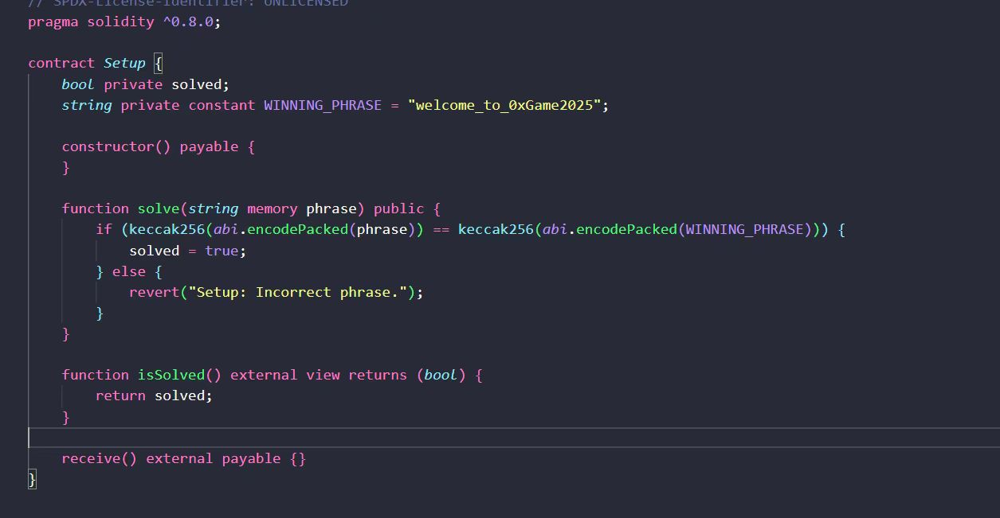

# 0xGame



直接cast send调用solve()函数

```solidity
cast send <实例地址> "solve(string memory)" ""welcome to 0xGame2025" --rpc-url <url> --private-key <key>
```

这样子就满足if条件,solved变成true即可


> 更新: 2025-11-07 21:06:38  
> 原文: <https://www.yuque.com/xiaoyuhushenfu/yzin4n/xflzrxyv3y5mqqqe>