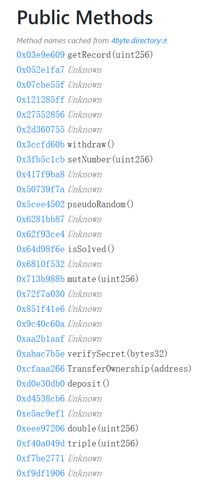
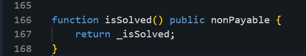

# OblivionMaze

# 题目

```solidity
0x6080604052600436106101c65760003560e01c80636810f532116100f7578063cfaaa26611610095578063eee9720611610064578063eee97206146104fd578063f40a049d1461051d578063f7be27711461053d578063f9df19061461055d576101cd565b8063cfaaa26614610475578063d0e30db014610495578063d4538cb61461049d578063e5ac9ef1146104d0576101cd565b8063851f41e6116100d1578063851f41e6146103fa5780639c40c60a1461041a578063aa2b1aaf14610435578063abac7b5e14610455576101cd565b80636810f532146103a7578063713b988b146103c757806372f7a030146103e7576101cd565b80633fb5c1cb116101645780635cee45021161013e5780635cee45021461033a5780636281bb871461034f57806362f93ce41461036f57806364d98f6e1461038f576101cd565b80633fb5c1cb146102da578063417f9ba8146102fa57806350739f7a1461031a576101cd565b8063121285ff116101a0578063121285ff1461026b57806327552856146102805780632d360755146102b05780633ccfd60b146102c5576101cd565b806303e9e609146101eb578063052e1fa71461022b57806307cbe55f1461024b576101cd565b366101cd57005b60003560e01c631234567814156101e957600160005260206000f35b005b3480156101f757600080fd5b50610218610206366004610f00565b60009081526008602052604090205490565b6040519081526020015b60405180910390f35b34801561023757600080fd5b50610218610246366004610f19565b61057e565b34801561025757600080fd5b506101e9610266366004610f45565b610695565b34801561027757600080fd5b506101e96106f4565b34801561028c57600080fd5b506102a061029b366004610f00565b610714565b6040519015158152602001610222565b3480156102bc57600080fd5b506101e9610767565b3480156102d157600080fd5b506101e9610782565b3480156102e657600080fd5b506101e96102f5366004610f00565b6107c3565b34801561030657600080fd5b50610218610315366004610f75565b6107de565b34801561032657600080fd5b50610218610335366004610f00565b61086a565b34801561034657600080fd5b5061021861087d565b34801561035b57600080fd5b5061021861036a366004610f00565b6108b9565b34801561037b57600080fd5b506102a061038a366004610f00565b6109ba565b34801561039b57600080fd5b5060065460ff166102a0565b3480156103b357600080fd5b506102186103c2366004610f00565b610a14565b3480156103d357600080fd5b506101e96103e2366004610f00565b610a40565b3480156103f357600080fd5b5043610218565b34801561040657600080fd5b50610218610415366004610f00565b610b10565b34801561042657600080fd5b50604051328152602001610222565b34801561044157600080fd5b50610218610450366004610f75565b610c4a565b34801561046157600080fd5b506102a0610470366004610f00565b610d07565b34801561048157600080fd5b506101e9610490366004610f45565b610d6f565b6101e9610d85565b3480156104a957600080fd5b507f1c8aff950685c2ed4bc3174f3472287b56d9517b9c948127319a09a7a36deac8610218565b3480156104dc57600080fd5b506101e96104eb366004610f75565b60009182526008602052604090912055565b34801561050957600080fd5b50610218610518366004610f00565b610dab565b34801561052957600080fd5b50610218610538366004610f00565b610db8565b34801561054957600080fd5b50610218610558366004610f00565b610dc5565b34801561056957600080fd5b506102a0610578366004610f45565b50600190565b60008061058b85856107de565b9050600061059882610b10565b905060006105a5856109ba565b905080156105fa5760058060008282546105bf9190610fad565b909155506105d09050606483610fdb565b33600090815260076020526040812080549091906105ef908490610fad565b909155506106439050565b60026005600082825461060d9190610fef565b9091555061061e9050603284610fdb565b336000908152600760205260408120805490919061063d908490610fad565b90915550505b604080516020810184905290810184905260608101869052610680906080016040516020818303038152906040528051906020012060001c610a40565b61068a8383610fad565b979650505050505050565b6040516000906001600160a01b038316908281818181865af19150503d80600081146106dd576040519150601f19603f3d011682016040523d82523d6000602084013e6106e2565b606091505b50509050806106f057600080fd5b5050565b60055415610712576005805490600061070c83611006565b91905055505b565b60008160405160200161072991815260200190565b60408051601f198184030181528282528051602091820120908301859052910160405160208183030381529060405280519060200120149050919050565b600a6005541015610712576005805490600061070c8361101d565b33600081815260076020526040808220805490839055905190929183156108fc02918491818181858888f193505050501580156106f0573d6000803e3d6000fd5b338114156107d9576006805460ff191660011790555b600355565b60008060005b600a811015610862576107f981868618610fad565b6108039083610fad565b600181901b60ff9190911c17915061081c600383610fdb565b6108295790841890610850565b610834600583610fdb565b6108415790831890610850565b61084b8486610fad565b821891505b8061085a8161101d565b9150506107e4565b509392505050565b6000610877826007610fad565b92915050565b6000434260405160200161089b929190918252602082015260400190565b6040516020818303038152906040528051906020012060001c905090565b6005546000908290825b6005811015610983576108d7600284610fdb565b6108f857816108e7600285611038565b6108f19190610fad565b9250610911565b61090383600361104c565b61090e906001610fad565b92505b61091c600784610fdb565b61093a57600580549060006109308361101d565b9190505550610971565b610945600b84610fdb565b610959576005805490600061093083611006565b806005600082825461096b9190610fad565b90915550505b8061097b8161101d565b9150506108c3565b506103e88211156109b35733600090815260076020526040812080548492906109ad908490610fad565b90915550505b5092915050565b6000806020808401206002548114156109d257600191505b508015610a0b576000805490806109e88361101d565b9091555050600180549060006109fd8361101d565b909155506001949350505050565b50600092915050565b60008060005b838110156109b357610a2c8183610fad565b915080610a388161101d565b915050610a1a565b8060005b6008811015610b0b57604080516020810184905290810182905242606082015260800160408051601f1981840301815291815281516020928301206000848152600890935291208190559150610a9b600283610fdb565b610ac9573360009081526007602052604081208054849290610abe908490610fad565b90915550610af99050565b610ad4600a83610fdb565b3360009081526007602052604081208054909190610af3908490610fef565b90915550505b80610b038161101d565b915050610a44565b505050565b600081815b6006811015610c2257610b29600283610fdb565b610b3f57610b38600283611038565b9150610b58565b610b4a82600561104c565b610b55906001610fad565b91505b610b63600383610fdb565b610b815760058054906000610b778361101d565b9190505550610ba6565b610b8c600783610fdb565b610ba65760058054906000610ba083611006565b91905055505b60005b6003811015610c0f57600354604080516020808201879052818301859052606093841b6bffffffffffffffffffffffff19169382019390935281516054818303018152607490910190915280519101209092189180610c078161101d565b915050610ba9565b5080610c1a8161101d565b915050610b15565b50610c2e600d82610fdb565b61087757600380546001600160a01b0319163317905592915050565b600080610c56846108b9565b90506000610c6384610dc5565b9050610c6e81610a40565b610c79600283610fdb565b610c9b57600360056000828254610c909190610fad565b90915550610cb49050565b600760056000828254610cae9190610fad565b90915550505b6040805160208101869052908101839052610ce790606001604051602081830303815290604052805190602001206109ba565b50610cf46103e882610fdb565b610cfe9083610fad565b95945050505050565b60007fb197784fad09d6594020c3ddafada1a935c6864084b5efde74c87d17385e770e82811415610d3b5750600092915050565b600454604080516020810186905201604051602081830303815290604052805190602001201415610a0b5750600192915050565b6001600160a01b038116610d8257600080fd5b50565b3360009081526007602052604081208054349290610da4908490610fad565b9091555050565b600061087782600261104c565b600061087782600361104c565b6000808243604051602001610de4929190918252602082015260400190565b60408051601f19818403018152908290528051602091820120600354909350600092610e379285926001600160a01b0316910191825260601b6bffffffffffffffffffffffff1916602082015260340190565b60408051808303601f1901815282825280516020918201206004548285018290528484015282518085038401815260609094019092528251920191909120909150610e83600282610fdb565b610ee357807fb197784fad09d6594020c3ddafada1a935c6864084b5efde74c87d17385e770e604051602001610ec3929190918252602082015260400190565b604051602081830303815290604052805190602001209350505050919050565b600554604051610ec3918391602001918252602082015260400190565b600060208284031215610f1257600080fd5b5035919050565b600080600060608486031215610f2e57600080fd5b505081359360208301359350604090920135919050565b600060208284031215610f5757600080fd5b81356001600160a01b0381168114610f6e57600080fd5b9392505050565b60008060408385031215610f8857600080fd5b50508035926020909101359150565b634e487b7160e01b600052601160045260246000fd5b60008219821115610fc057610fc0610f97565b500190565b634e487b7160e01b600052601260045260246000fd5b600082610fea57610fea610fc5565b500690565b60008282101561100157611001610f97565b500390565b60008161101557611015610f97565b506000190190565b600060001982141561103157611031610f97565b5060010190565b60008261104757611047610fc5565b500490565b600081600019048311821515161561106657611066610f97565b50029056fea2646970667358221220816ffc465ec568a07ff67677555a73ba258e4d139d87e9a893a359bdd7affe2364736f6c63430008090033
```

# 思路

反编译：



```solidity
// Decompiled by library.dedaub.com
// 2026.03.02 15:38 UTC
// Compiled using the solidity compiler version 0.8.9


// Data structures and variables inferred from the use of storage instructions
uint256 stor_0; // STORAGE[0x0]
uint256 stor_1; // STORAGE[0x1]
bytes32 stor_2; // STORAGE[0x2]
uint256 stor_3; // STORAGE[0x3]
bytes32 stor_4; // STORAGE[0x4]
uint256 stor_5; // STORAGE[0x5]
mapping (address => uint256) _deposit; // STORAGE[0x7]
mapping (uint256 => uint256) _getRecord; // STORAGE[0x8]
bool _isSolved; // STORAGE[0x6] bytes 0 to 0


function 0x1006(uint256 varg0) private { 
    require(varg0, Panic(17)); // arithmetic overflow or underflow
    return uint256.max + varg0;
}

function 0x101d(uint256 varg0) private { 
    require(varg0 != uint256.max, Panic(17)); // arithmetic overflow or underflow
    return 1 + varg0;
}

function _SafeDiv(uint256 varg0, uint256 varg1) private { 
    require(varg1, Panic(18)); // division by zero
    return varg0 / varg1;
}

function _SafeMul(uint256 varg0, uint256 varg1) private { 
    require(!(bool(varg0) & (varg1 > uint256.max / varg0)), Panic(17)); // arithmetic overflow or underflow
    return varg0 * varg1;
}

function getRecord(uint256 _tokenId) public nonPayable { 
    require(msg.data.length - 4 >= 32);
    return _getRecord[_tokenId];
}

function 0x052e1fa7(uint256 varg0, uint256 varg1, uint256 varg2) public nonPayable { 
    require(msg.data.length - 4 >= 96);
    v0 = 0x7de(varg1, varg0);
    v1 = 0xb10(v0);
    v2 = v3 = 0;
    if (keccak256(MEM[varg2 + 32:varg2 + 32 + 32]) == stor_2) {
        v2 = v4 = 1;
    }
    if (!v2) {
        v5 = 0;
    } else {
        v6 = 0x101d(stor_0);
        stor_0 = v6;
        v7 = 0x101d(stor_1);
        stor_1 = v7;
        v5 = v8 = 1;
    }
    if (!v5) {
        v9 = _SafeSub(stor_5, 2);
        stor_5 = v9;
        v10 = _SafeMod(v0, 50);
        v11 = _SafeAdd(_deposit[msg.sender], v10);
        _deposit[msg.sender] = v11;
    } else {
        v12 = _SafeAdd(stor_5, 5);
        stor_5 = v12;
        v13 = _SafeMod(v1, 100);
        v14 = _SafeAdd(_deposit[msg.sender], v13);
        _deposit[msg.sender] = v14;
    }
    0xa40(keccak256(v1, v0, varg2));
    v15 = _SafeAdd(v1, v0);
    return v15;
}

function 0x07cbe55f(address varg0) public nonPayable { 
    require(msg.data.length - 4 >= 32);
    v0, /* uint256 */ v1 = varg0.call().gas(msg.gas);
    if (RETURNDATASIZE() != 0) {
        v2 = new bytes[](RETURNDATASIZE());
        RETURNDATACOPY(v2.data, 0, RETURNDATASIZE());
    }
    require(v0);
}

function 0x121285ff() public nonPayable { 
    if (stor_5) {
        v0 = 0x1006(stor_5);
        stor_5 = v0;
    }
}

function 0x27552856(uint256 varg0) public nonPayable { 
    require(msg.data.length - 4 >= 32);
    MEM[64 + MEM[64] + 32] = varg0;
    v0 = new uint256[](64 + MEM[64] + 64 - v0 - 32);
    v1 = v0.length;
    v2 = v0.data;
    return keccak256(v0) == keccak256(varg0);
}

function 0x2d360755() public nonPayable { 
    if (stor_5 < 10) {
        v0 = 0x101d(stor_5);
        stor_5 = v0;
    }
}

function withdraw() public nonPayable { 
    _deposit[msg.sender] = 0;
    v0 = msg.sender.call().value(_deposit[msg.sender]).gas(2300 * !_deposit[msg.sender]);
    require(bool(v0), 0, RETURNDATASIZE()); // checks call status, propagates error data on error
}

function setNumber(uint256 newNumber) public nonPayable { 
    require(msg.data.length - 4 >= 32);
    if (newNumber == msg.sender) {
        _isSolved = 1;
    }
    stor_3 = newNumber;
}

function 0x417f9ba8(uint256 varg0, uint256 varg1) public nonPayable { 
    require(msg.data.length - 4 >= 64);
    v0 = 0x7de(varg1, varg0);
    return v0;
}

function 0x50739f7a(uint256 varg0) public nonPayable { 
    require(msg.data.length - 4 >= 32);
    v0 = _SafeAdd(7, varg0);
    return v0;
}

function pseudoRandom() public nonPayable { 
    return keccak256(block.number, block.timestamp);
}

function 0x6281bb87(uint256 varg0) public nonPayable { 
    require(msg.data.length - 4 >= 32);
    v0 = 0x8b9(varg0);
    return v0;
}

function 0x62f93ce4(uint256 varg0) public nonPayable { 
    require(msg.data.length - 4 >= 32);
    v0 = v1 = 0;
    if (keccak256(MEM[varg0 + 32:varg0 + 32 + 32]) == stor_2) {
        v0 = v2 = 1;
    }
    if (!v0) {
        v3 = v4 = 0;
    } else {
        v5 = 0x101d(stor_0);
        stor_0 = v5;
        v6 = 0x101d(stor_1);
        stor_1 = v6;
        v3 = v7 = 1;
    }
    return bool(v3);
}

function isSolved() public nonPayable { 
    return _isSolved;
}

function 0x6810f532(uint256 varg0) public nonPayable { 
    require(msg.data.length - 4 >= 32);
    v0 = v1 = 0;
    v2 = v3 = 0;
    while (v2 < varg0) {
        v0 = _SafeAdd(v0, v2);
        v2 = 0x101d(v2);
    }
    return v0;
}

function mutate(uint256 serumId) public nonPayable { 
    require(msg.data.length - 4 >= 32);
    0xa40(serumId);
}

function guarded() public nonPayable { 
    return block.number;
}

function 0x851f41e6(uint256 varg0) public nonPayable { 
    require(msg.data.length - 4 >= 32);
    v0 = 0xb10(varg0);
    return v0;
}

function 0x9c40c60a() public nonPayable { 
    return tx.origin;
}

function 0xaa2b1aaf(uint256 varg0, uint256 varg1) public nonPayable { 
    require(msg.data.length - 4 >= 64);
    v0 = 0x8b9(varg0);
    v1 = 0xdc5(varg1);
    0xa40(v1);
    v2 = _SafeMod(v0, 2);
    if (v2) {
        v3 = _SafeAdd(stor_5, 7);
        stor_5 = v3;
    } else {
        v4 = _SafeAdd(stor_5, 3);
        stor_5 = v4;
    }
    MEM[64] += 96;
    v5 = v6 = 0;
    if (keccak256(MEM[keccak256(varg1, vc55_0x0V0x450) + 32:keccak256(varg1, vc55_0x0V0x450) + 32 + 32]) == stor_2) {
        v5 = v7 = 1;
    }
    if (v5) {
        v8 = 0x101d(stor_0);
        stor_0 = v8;
        v9 = 0x101d(stor_1);
        stor_1 = v9;
    }
    v10 = _SafeMod(v1, 1000);
    v11 = _SafeAdd(v0, v10);
    return v11;
}

function 0xabac7b5e(uint256 varg0) public nonPayable { 
    require(msg.data.length - 4 >= 32);
    if (0xb197784fad09d6594020c3ddafada1a935c6864084b5efde74c87d17385e770e != varg0) {
        if (keccak256(varg0) != stor_4) {
            v0 = v1 = 0;
        } else {
            v0 = v2 = 1;
        }
    } else {
        v0 = v3 = 0;
    }
    return bool(v0);
}

function TransferOwnership(address newOwner) public nonPayable { 
    require(msg.data.length - 4 >= 32);
    require(newOwner);
}

function deposit() public payable { 
    v0 = _SafeAdd(_deposit[msg.sender], msg.value);
    _deposit[msg.sender] = v0;
}

function 0xd4538cb6() public nonPayable { 
    return 0x1c8aff950685c2ed4bc3174f3472287b56d9517b9c948127319a09a7a36deac8;
}

function 0xe5ac9ef1(uint256 varg0, uint256 varg1) public nonPayable { 
    require(msg.data.length - 4 >= 64);
    _getRecord[varg0] = varg1;
}

function double(uint256 amount) public nonPayable { 
    require(msg.data.length - 4 >= 32);
    v0 = _SafeMul(2, amount);
    return v0;
}

function 0xf40a049d(uint256 varg0) public nonPayable { 
    require(msg.data.length - 4 >= 32);
    v0 = _SafeMul(3, varg0);
    return v0;
}

function 0xf7be2771(uint256 varg0) public nonPayable { 
    require(msg.data.length - 4 >= 32);
    v0 = 0xdc5(varg0);
    return v0;
}

function 0xf9df1906(address varg0) public nonPayable { 
    require(msg.data.length - 4 >= 32);
    return True;
}

function 0x7de(uint256 varg0, uint256 varg1) private { 
    v0 = v1 = 0;
    v2 = v3 = 0;
    while (v2 < 10) {
        v4 = _SafeAdd(varg0 ^ varg1, v2);
        v5 = _SafeAdd(v0, v4);
        v6 = _SafeMod(v5 >> uint8.max | v5 << 1, 3);
        if (v6) {
            v7 = _SafeMod(v5 >> uint8.max | v5 << 1, 5);
            if (v7) {
                v8 = _SafeAdd(varg1, varg0);
                v0 = (v5 >> uint8.max | v5 << 1) ^ v8;
            } else {
                v0 = varg0 ^ (v5 >> uint8.max | v5 << 1);
            }
        } else {
            v0 = varg1 ^ (v5 >> uint8.max | v5 << 1);
        }
        v2 = 0x101d(v2);
    }
    return v0;
}

function 0x8b9(uint256 varg0) private { 
    v0 = stor_5;
    v1 = v2 = 0;
    while (v1 < 5) {
        v3 = _SafeMod(varg0, 2);
        if (v3) {
            v4 = _SafeMul(3, varg0);
            varg0 = _SafeAdd(1, v4);
        } else {
            v5 = _SafeDiv(varg0, 2);
            varg0 = _SafeAdd(v5, v0);
        }
        v6 = _SafeMod(varg0, 7);
        if (v6) {
            v7 = _SafeMod(varg0, 11);
            if (v7) {
                v8 = stor_5;
                v9 = _SafeAdd(v8, v1);
                stor_5 = v9;
            } else {
                v10 = stor_5;
                v11 = 0x1006(v10);
                stor_5 = v11;
            }
        } else {
            v12 = stor_5;
            v13 = 0x101d(v12);
            stor_5 = v13;
        }
        v1 = 0x101d(v1);
    }
    if (varg0 <= 1000) {
        return varg0;
    } else {
        v14 = _SafeAdd(_deposit[msg.sender], varg0);
        _deposit[msg.sender] = v14;
        return varg0;
    }
}

function 0xa40(uint256 varg0) private { 
    v0 = v1 = 0;
    while (v0 < 8) {
        varg0 = v2 = keccak256(varg0, v0, block.timestamp);
        _getRecord[v0] = v2;
        v3 = _SafeMod(v2, 2);
        if (v3) {
            v4 = _SafeMod(v2, 10);
            v5 = _SafeSub(_deposit[msg.sender], v4);
            _deposit[msg.sender] = v5;
        } else {
            v6 = _SafeAdd(_deposit[msg.sender], v2);
            _deposit[msg.sender] = v6;
        }
        v0 = 0x101d(v0);
    }
    return ;
}

function 0xb10(uint256 varg0) private { 
    v0 = v1 = 0;
    while (v0 < 6) {
        v2 = _SafeMod(varg0, 2);
        if (v2) {
            v3 = _SafeMul(5, varg0);
            varg0 = _SafeAdd(1, v3);
        } else {
            varg0 = _SafeDiv(varg0, 2);
        }
        v4 = _SafeMod(varg0, 3);
        if (v4) {
            v5 = _SafeMod(varg0, 7);
            if (!v5) {
                v6 = stor_5;
                v7 = 0x1006(v6);
                stor_5 = v7;
            }
        } else {
            v8 = stor_5;
            v9 = 0x101d(v8);
            stor_5 = v9;
        }
        v10 = v11 = 0;
        while (v10 < 3) {
            MEM[64] = MEM[64] + 116;
            varg0 = varg0 ^ keccak256(varg0, v10, bytes20(stor_3 << 96));
            v10 = 0x101d(v10);
        }
        v0 = 0x101d(v0);
    }
    v12 = _SafeMod(varg0, 13);
    if (v12) {
        return varg0;
    } else {
        stor_3 = msg.sender | bytes12(stor_3);
        return varg0;
    }
}

function 0xdc5(uint256 varg0) private { 
    MEM[96 + MEM[64] + 32] = keccak256(varg0, block.number);
    MEM[96 + MEM[64] + 32 + 32] = bytes20(address(stor_3) << 96);
    v0 = new uint256[](52 + (96 + MEM[64] + 32) - v0 - 32);
    v1 = v0.length;
    v2 = v0.data;
    MEM[52 + (96 + MEM[64] + 32) + 32] = keccak256(v0);
    MEM[116 + (96 + MEM[64] + 32)] = stor_4;
    v3 = new uint256[](64 + (52 + (96 + MEM[64] + 32) - v3));
    v4 = v3.length;
    v5 = v3.data;
    v6 = _SafeMod(keccak256(v3), 2);
    if (v6) {
        v7 = new uint256[](v8 - v9 - 32);
        MEM[v7.data] = keccak256(v3);
        MEM[v7.data + 32] = stor_5;
        v8 = v10 = 64 + v7.data;
    } else {
        v11 = new uint256[](v8 - v9 - 32);
        MEM[v9.data] = keccak256(v3);
        MEM[v9.data + 32] = 0xb197784fad09d6594020c3ddafada1a935c6864084b5efde74c87d17385e770e;
        v8 = v12 = 64 + v9.data;
    }
    v9 = new uint256[](v8 - v9 - 32);
    v13 = v7.length;
    v14 = v7.data;
    return keccak256(v11, v9, v7);
}

function receive() public payable { 
}

function _SafeAdd(uint256 varg0, uint256 varg1) private { 
    require(varg0 <= ~varg1, Panic(17)); // arithmetic overflow or underflow
    return varg0 + varg1;
}

function _SafeMod(uint256 varg0, uint256 varg1) private { 
    require(varg1, Panic(18)); // division by zero
    return varg0 % varg1;
}

function _SafeSub(uint256 varg0, uint256 varg1) private { 
    require(varg0 >= varg1, Panic(17)); // arithmetic overflow or underflow
    return varg0 - varg1;
}

// Note: The function selector is not present in the original solidity code.
// However, we display it for the sake of completeness.

function __function_selector__( function_selector) public payable { 
    MEM[64] = 128;
    if (msg.data.length < 4) {
        if (!msg.data.length) {
            receive();
        }
    } else {
        v0 = function_selector >> 224;
        if (0x6810f532 > v0) {
            if (0x3fb5c1cb > v0) {
                if (0x121285ff > v0) {
                    if (0x3e9e609 == v0) {
                        getRecord(uint256);
                    } else if (0x52e1fa7 == v0) {
                        0x052e1fa7();
                    } else if (0x7cbe55f == v0) {
                        0x07cbe55f();
                    }
                } else if (0x121285ff == v0) {
                    0x121285ff();
                } else if (0x27552856 == v0) {
                    0x27552856();
                } else if (0x2d360755 == v0) {
                    0x2d360755();
                } else if (0x3ccfd60b == v0) {
                    withdraw();
                }
            } else if (0x5cee4502 > v0) {
                if (0x3fb5c1cb == v0) {
                    setNumber(uint256);
                } else if (0x417f9ba8 == v0) {
                    0x417f9ba8();
                } else if (0x50739f7a == v0) {
                    0x50739f7a();
                }
            } else if (0x5cee4502 == v0) {
                pseudoRandom();
            } else if (0x6281bb87 == v0) {
                0x6281bb87();
            } else if (0x62f93ce4 == v0) {
                0x62f93ce4();
            } else if (0x64d98f6e == v0) {
                isSolved();
            }
        } else if (0xcfaaa266 > v0) {
            if (0x851f41e6 > v0) {
                if (0x6810f532 == v0) {
                    0x6810f532();
                } else if (0x713b988b == v0) {
                    mutate(uint256);
                } else if (0x72f7a030 == v0) {
                    guarded();
                }
            } else if (0x851f41e6 == v0) {
                0x851f41e6();
            } else if (0x9c40c60a == v0) {
                0x9c40c60a();
            } else if (0xaa2b1aaf == v0) {
                0xaa2b1aaf();
            } else if (0xabac7b5e == v0) {
                0xabac7b5e();
            }
        } else if (0xeee97206 > v0) {
            if (0xcfaaa266 == v0) {
                TransferOwnership(address);
            } else if (0xd0e30db0 == v0) {
                deposit();
            } else if (0xd4538cb6 == v0) {
                0xd4538cb6();
            } else if (0xe5ac9ef1 == v0) {
                0xe5ac9ef1();
            }
        } else if (0xeee97206 == v0) {
            double(uint256);
        } else if (0xf40a049d == v0) {
            0xf40a049d();
        } else if (0xf7be2771 == v0) {
            0xf7be2771();
        } else if (0xf9df1906 == v0) {
            0xf9df1906();
        }
    }
    if (0x12345678 != function_selector >> 224) {
        exit;
    } else {
        return 1;
    }
}

```

反编译里




**只要调用 **<code>**setNumber(uint256)**</code>**，并且参数 “等于 msg.sender”，它就会把 solved 置 1**

EVM 里 `msg.sender` 是 20 字节地址。这里比较时会当成整数比较，所以要传：

* `uint256(uint160(msg.sender))`

用 cast 最简单的打法：**把地址当成 0x… 的整数直接传**（cast 会把它当成 uint256 编码）

# 打通指令

```solidity
cast send $实例地址 "setNumber(uint256)" $我的地址 --rpc-url $RPC --private-key $PK
```


> 更新: 2026-03-09 00:02:08  
> 原文: <https://www.yuque.com/xiaoyuhushenfu/yzin4n/pihggum9uzu37i5g>