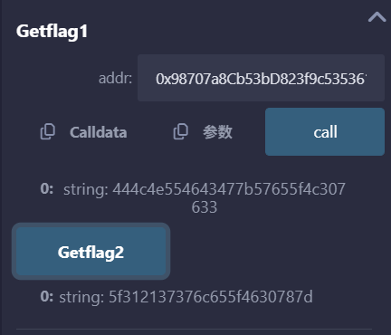

# 小狐狸我们喜欢你

1. 在edge下一个小狐狸插件
2. 在remix（[https://remix.learnblockchain.cn/#lang=zh&optimize=false&runs=200&evmVersion=null&version=soljson-v0.8.26+commit.8a97fa7a.js](https://remix.learnblockchain.cn/#lang=zh&optimize=false&runs=200&evmVersion=null&version=soljson-v0.8.26+commit.8a97fa7a.js)）上贴上给的源码，用remix自带的测试账户去编译部署，把自己创的小狐狸钱包地址作为参数，传进第一个函数得到flag1，调用第二个函数得到flag2，两个flag拼一起并且转换utf-8，得到flag：DLNUFCG{We_L0v3_1!77le_F0x}



```solidity
// SPDX-License-Identifier: MIT
pragma solidity ^0.8.0;

contract Matemask {
    string private constant f1ag1 = "444c4e554643477b57655f3c307633";
    string private constant flag1 = "444c4e554643477b57655f4c307633";//正确
    string private constant f1agl = "444c4e554643477b57655f5c307633";
    string private constant fIagl = "444c4e554643477b57655f6c307633";
    string private constant f1agZ = "5f312137376a655f4630787d";
    string private constant f1ag2 = "5f312137376b655f4630787d";
    string private constant flag2 = "5f312137376c655f4630787d";//正确


    function Getflag1(address addr) public view returns (string memory) {
        //please put your matemask's address here
        require(addr != address(0), "invalid address: zero address");
      //实际上是个钱包地址就可以，因为他们领不了水，没办法做交互，只能这样了
        require(addr.code.length == 0, "address appears to be a contract");
        return flag1;
    }

    function Getflag2() public pure returns (string memory) {
        return flag2;
    }
}
```


> 更新: 2025-09-27 20:08:48  
> 原文: <https://www.yuque.com/xiaoyuhushenfu/yzin4n/efpolbcrvaagc9i7>