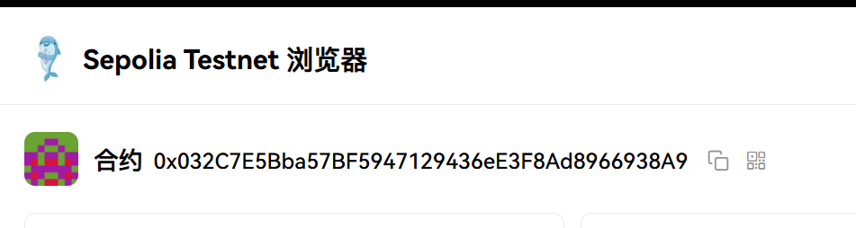
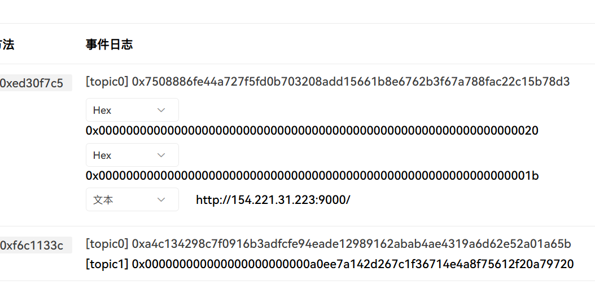
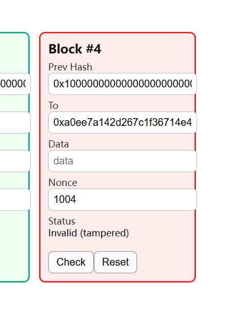
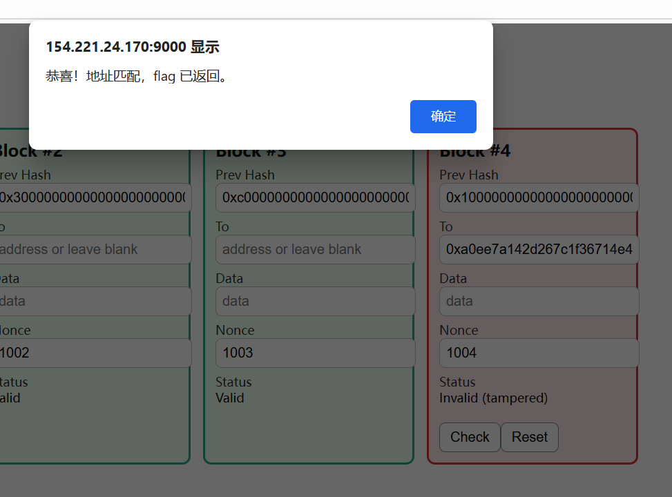
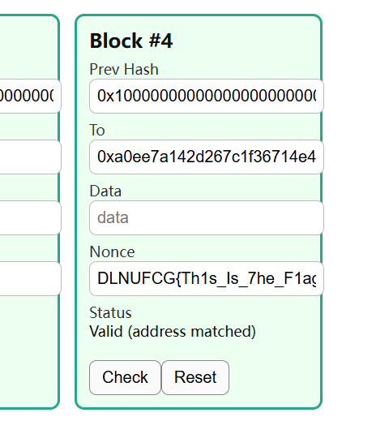

# 红温的demo

1. 去区块链浏览器（<https://www.oklink.com/zh-hans/sepolia>）里查合约<code><font style="color:rgb(0, 0, 0);">0x032C7E5Bba57BF5947129436eE3F8Ad8966938A9</font></code>事件



2. 去事件栏，查看输出的网址h，这个要选文本格式，可以读到<http://154.221.31.223:9000/>
3. 查看输出的地址key，得到一串地址，把多余的0都去掉，即`0xa0Ee7A142d267C1f36714E4a8F75612F20a79720`



4. 进入h，把去掉多余0的key贴到demo栏4的to里，点check，demo修复成功变成绿色，nonce栏里弹出flag：DLNUFCG{Th1s\_Is\_7he\_F1ag}



```solidity
==================================================================
Congratulations! Installed successfully!
=============注意：首次打开面板浏览器将提示不安全=================

 请选择以下其中一种方式解决不安全提醒
 1、下载证书，地址：https://dg2.bt.cn/ssl/baota_root.pfx，双击安装,密码【www.bt.cn】
 2、点击【高级】-【继续访问】或【接受风险并继续】访问
 教程：https://www.bt.cn/bbs/thread-117246-1-1.html
 mac用户请下载使用此证书：https://dg2.bt.cn/ssl/mac.crt

========================面板账户登录信息==========================

 【云服务器】请在安全组放行 37757 端口
 外网ipv4面板地址: https://154.221.24.170:37757/35169840
 内网面板地址:     https://154.221.24.170:37757/35169840
 username: co4yfiwo
 password: a0e805d7

 浏览器访问以下链接，添加宝塔客服
 https://www.bt.cn/new/wechat_customer
==================================================================
Time consumed: 6 Minute!
root@yisu-689167f03c23a:~#
```

[https://154.221.31.223:37757/](https://154.221.31.223:37757/files)35169840


> 更新: 2025-10-16 20:42:39  
> 原文: <https://www.yuque.com/xiaoyuhushenfu/yzin4n/dg3zgz59p0og483a>