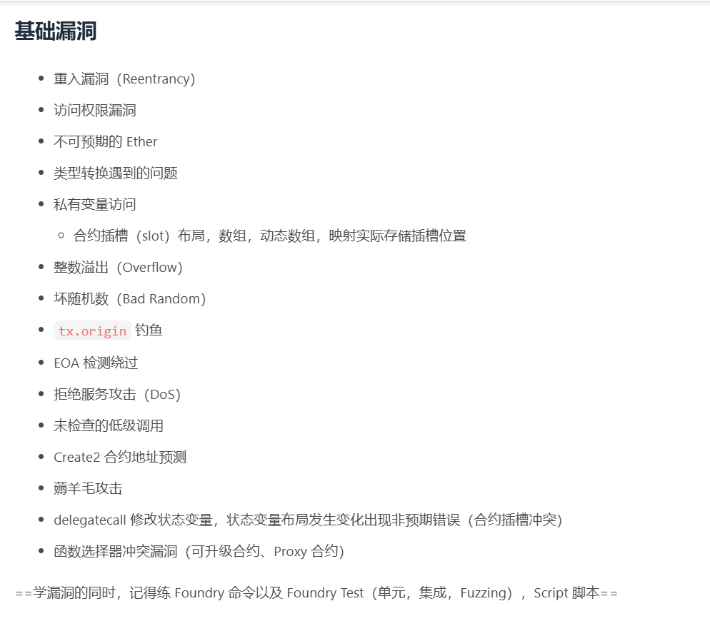

# 2025暑假

## 栾哥开会说的
abi

跨函数重入

只读重入

~~非defi非重入部分：uups和transparent~~

接下来是defi部分

通货膨胀token burn 影响defi

反射token

溢出 检测安全性和功能性

权限访问 访问控制 uptocall 未经检查 

通过合约b为跳板实现合约 a

## 7.27分享会 ✅  
create+create2 nonce，清空

create3通过create

eoa写了合约a 通过create2创建合约b create2合约c bc自毁 合约地址没变 b nonce清空 b在createc时 可以改变code 可以实现c的地址完全变成了新的

## 7.14-7.18  ✅  
proxy(代理合约)和upgradeable(可升级的)

uups和transparent,两种模式

这两个合约有什么安全问题

openzeppelin的实现,自己部署一个

透明代理,怎么调用目标函数

如何更改管理员，admin

合约如何升级，合约升级逻辑

代理合约，实现合约 搞懂

## 详细计划:
基础漏洞:

**重入，访问权限漏洞，自毁。**

类型转换

三元运算符

访问私有变量(这也是个重点)(我也会在考核题目里面出)

溢出漏洞(我不会出溢出，但是我平常也会出题目直接让你做)

tx.origin钓鱼，坏随机数

dos攻击

未检查的低级调用

**create2地址预测** 

薅羊毛攻击

**函数选择器漏洞delegatecall漏洞**

前期至少每天一道靶场题目，如果靶场题目太难，可以放松至两天，但是需要给我当天没做出来的成果，如果看了视频也不会，直接问(前期刚学洞别自己琢磨纯浪费时间，不要想着自己琢磨一下自己做出来有成就感)，中间按照你的进度会掺杂我给你出的题目。

## 基础漏洞:
+ ~~重入漏洞(Reentrancy)~~
+ ~~访问权限漏洞~~
+ ~~不可预期的 Ether 自毁~~
+ 类型转换遇到的问题
    - ~~私有变量访问~~
    - ~~合约插槽(slot)布局，数组，动态数组~~，映射实际存储插位置
+ ~~整数溢出(Overflow)~~
+ ~~坏随机数(Bad Random)~~
+ ~~tx.origin 钓鱼~~
+ ~~EOA 检测绕过~~
+ ~~拒绝服务攻击(DoS)~~
+ ~~未检查的低级调用~~
+ ~~Create2 合约地址预测~~
+ 薅羊毛攻击
+ ~~delegatecall 修改状态变量，状态变量布局发生变化出现非预期错误(合约插槽冲突)~~
+ ~~函数选择器冲突漏洞(可升级合约、Proxy 合约)~~

学漏洞的同时，记得练 Foundry命令以及 FoundryTest(单元，集成，Fuzzing)，Script 脚本

这个暑假学的开心吗，小璇，开心的话，记得给你王师傅日报点赞

> 更新: 2025-09-10 20:58:50  
> 原文: <https://www.yuque.com/xiaoyuhushenfu/yzin4n/et5edd1wlsz23m3p>