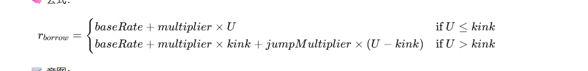

# 2. 三种利率模型

# 思考:在compound里是怎么运用这些利率模型的???

# 第一个模型WhitePaperInterestRateModel

源码：

```solidity
// SPDX-License-Identifier: BSD-3-Clause
pragma solidity ^0.8.10;

import "./InterestRateModel.sol";

/**
 * @title Compound's WhitePaperInterestRateModel Contract
 * @author Compound
 * @notice The parameterized model described in section 2.4 of the original Compound Protocol whitepaper
 */
contract WhitePaperInterestRateModel is InterestRateModel {
    event NewInterestParams(uint256 baseRatePerBlock, uint256 multiplierPerBlock);

    uint256 private constant BASE = 1e18;

    /**
     * @notice The approximate number of blocks per year that is assumed by the interest rate model
     */
    uint256 public constant blocksPerYear = 2102400;

    /**
     * @notice The multiplier of utilization rate that gives the slope of the interest rate
     */
    //  multiplierPerYear：年化的“斜率”，
    //  表示当资金利用率（utilization, U）从 0 上升到 1 时，借款年化利率增加的幅度。
    uint256 public multiplierPerBlock;

    /**
     * @notice The base interest rate which is the y-intercept when utilization rate is 0
     */
    uint256 public baseRatePerBlock;

    /**
     * @notice Construct an interest rate model
     * @param baseRatePerYear The approximate target base APR, as a mantissa (scaled by BASE)
     * @param multiplierPerYear The rate of increase in interest rate wrt utilization (scaled by BASE)
     */
    constructor(uint256 baseRatePerYear, uint256 multiplierPerYear) public {
        baseRatePerBlock = baseRatePerYear / blocksPerYear;
        multiplierPerBlock = multiplierPerYear / blocksPerYear;

        emit NewInterestParams(baseRatePerBlock, multiplierPerBlock);
    }

    // cash 当前市场中没有被借出的现金数量(留在合约的流动性)
    // Borrow 当前已经被借出去的总额
    // reserves 协议提留的储备金  协议留存的利息收益，应对坏账或者协议创作者的资金
    /**
     * @notice Calculates the utilization rate of the market: `borrows / (cash + borrows - reserves)`
     * @param cash The amount of cash in the market
     * @param borrows The amount of borrows in the market
     * @param reserves The amount of reserves in the market (currently unused)
     * @return The utilization rate as a mantissa between [0, BASE]
     */
    function utilizationRate(uint256 cash, uint256 borrows, uint256 reserves) public pure returns (uint256) {
        // Utilization rate is 0 when there are no borrows
        if (borrows == 0) {
            return 0;
        }

        return borrows * BASE / (cash + borrows - reserves);
    }

    /**
     * @notice Calculates the current borrow rate per block, with the error code expected by the market
     * @param cash The amount of cash in the market
     * @param borrows The amount of borrows in the market
     * @param reserves The amount of reserves in the market
     * @return The borrow rate percentage per block as a mantissa (scaled by BASE)
     */
    function getBorrowRate(uint256 cash, uint256 borrows, uint256 reserves) public view override returns (uint256) {
        uint256 ur = utilizationRate(cash, borrows, reserves);
        return (ur * multiplierPerBlock / BASE) + baseRatePerBlock;
    }

    /**
     * @notice Calculates the current supply rate per block
     * @param cash The amount of cash in the market
     * @param borrows The amount of borrows in the market
     * @param reserves The amount of reserves in the market
     * @param reserveFactorMantissa The current reserve factor for the market 协议保留比例
     * @return The supply rate percentage per block as a mantissa (scaled by BASE)
     */
    function getSupplyRate(uint256 cash, uint256 borrows, uint256 reserves, uint256 reserveFactorMantissa)
        public
        view
        override
        returns (uint256)
    {
        uint256 oneMinusReserveFactor = BASE - reserveFactorMantissa; // 借款人支付利息中会分配给池子的那部分比例
        uint256 borrowRate = getBorrowRate(cash, borrows, reserves); // 计算当前借款利率
        uint256 rateToPool = borrowRate * oneMinusReserveFactor / BASE; //借款人真正会流向流动性提供者的利率
        return utilizationRate(cash, borrows, reserves) * rateToPool / BASE;
    }
}

```

## 模型中基础参数的意义

| 名称 | 类型 | 数值范围 / 单位 | 含义 | 说明 / 公式关系 |
| --- | --- | --- | --- | --- |
| `BASE` | `uint256` | 固定为 `1e18` | 精度基数 | 所有比例（利率、利用率等）都按此放大 1e18 表示。例如 10% = 1e17 |
| `blocksPerYear` | `uint256` | 约 `2_102_400` | 年区块数 | 假设每个区块约 15 秒，对应一年约 2.1M 个区块 |
| `baseRatePerYear` | （构造参数） | 乘以 `1e18` 的年化利率 | 年化基础利率 | 当利用率为 0 时的借款利率（y 轴截距） |
| `multiplierPerYear` | （构造参数） | 乘以 `1e18` 的年化利率斜率 | 利率增长斜率 | 利率随利用率增加的变化率（直线斜率） |
| `baseRatePerBlock` | `uint256` | 乘以 `1e18` 的区块利率 | 每个区块的基础利率 | `baseRatePerBlock = baseRatePerYear / blocksPerYear` |
| `multiplierPerBlock` | `uint256` | 乘以 `1e18` 的区块利率变化率 | 每个区块的利率增长斜率 | `multiplierPerBlock = multiplierPerYear / blocksPerYear` |
| `cash` | `uint256` | token 数量 | 市场中剩余未借出的资产 | 由 cToken 合约传入，表示当前可供借款的资金 |
| `borrows` | `uint256` | token 数量 | 已被借出的资产 | 市场当前借款总量 |
| `reserves` | `uint256` | token 数量 | 协议储备金 | 从利息收入中提取的一部分进入 reserves |
| `reserveFactorMantissa` | `uint256` | 按 1e18 缩放的比例 | 协议储备系数 | 表示利息中多少比例进入协议储备（例如 10% = 1e17） |
| `utilizationRate` | 函数返回值 (`uint`) | \[0, 1e18] | 市场利用率 | `U = borrows / (cash + borrows - reserves)` |
| `borrowRate` | 函数返回值 (`uint`) | 每区块利率（按 1e18 缩放） | 借款利率 | `R_b = baseRatePerBlock + utilizationRate * multiplierPerBlock / 1e18` |
| `rateToPool` | `uint256` | 每区块利率 | 存款池分得的借款利息比例 | `R_pool = borrowRate × (1 - reserveFactor)` |
| `supplyRate` | 函数返回值 (`uint`) | 每区块利率 | 存款人获得的利率 | `R_s = utilizationRate × rateToPool / 1e18` |

## baseRatePerBlock，multiplierPerBlock的通俗理解

baseRatePerBlock，multiplierPerBlock一个是基础利率，一个是年化利率。

比如在我们正常银行贷款，会有一个年率5%，意思是一年之后多换我们本金的5%，同时我们每天积攒的利息就是5%/356。

在合约中baseRatePerBlock就是，将出块时间整合成一年，然后按照一年的5%，然后每个区块的基础利率就是baseRatePerBlock。

multiplierPerBlock跟上面的解释一样，只不过这个利率不是一个固定的，会随着协议内资金变化而改变。

## 利用率的计算

u = 我们借款的数量(Borrow）/ 当前协议现金的数量（cash）+ 我们借款的数量（Borrow） - 协议储备金（reserve）

## 利率的计算

BorrowRate=  利用率（u） \* 年化率（multiplierPerBlock） / base   + 基础利率

## 有效利率借款公式

RatetoPool = 利率（Borrow） \* (Base - reserveFactorMantissa(借款人支付利息中会分配给池子的那部分比例))

## 存款利率

SupplyRate = 利用率（u） \* 有效借款利率 / Base

# 第二个模型JumpRateModel

```solidity
// SPDX-License-Identifier: BSD-3-Clause
pragma solidity ^0.8.10;

import "./InterestRateModel.sol";

/**
 * @title Compound's JumpRateModel Contract
 * @author Compound
 */
contract JumpRateModel is InterestRateModel {
    event NewInterestParams(
        uint256 baseRatePerBlock, uint256 multiplierPerBlock, uint256 jumpMultiplierPerBlock, uint256 kink
    );

    uint256 private constant BASE = 1e18;

    /**
     * @notice The approximate number of blocks per year that is assumed by the interest rate model
     */
    uint256 public constant blocksPerYear = 2102400;

    /**
     * @notice The multiplier of utilization rate that gives the slope of the interest rate
     */
    uint256 public multiplierPerBlock;

    /**
     * @notice The base interest rate which is the y-intercept when utilization rate is 0
     */
    uint256 public baseRatePerBlock;

    /**
     * @notice The multiplierPerBlock after hitting a specified utilization point
     */
    uint256 public jumpMultiplierPerBlock;

    /**
     * @notice The utilization point at which the jump multiplier is applied
     */
    uint256 public kink;

    /**
     * @notice Construct an interest rate model
     * @param baseRatePerYear The approximate target base APR, as a mantissa (scaled by BASE)
     * @param multiplierPerYear The rate of increase in interest rate wrt utilization (scaled by BASE)
     * @param jumpMultiplierPerYear The multiplierPerBlock after hitting a specified utilization point
     * @param kink_ The utilization point at which the jump multiplier is applied
     */
    constructor(uint256 baseRatePerYear, uint256 multiplierPerYear, uint256 jumpMultiplierPerYear, uint256 kink_)
        public
    {
        baseRatePerBlock = baseRatePerYear / blocksPerYear;
        multiplierPerBlock = multiplierPerYear / blocksPerYear;
        jumpMultiplierPerBlock = jumpMultiplierPerYear / blocksPerYear;
        kink = kink_;

        emit NewInterestParams(baseRatePerBlock, multiplierPerBlock, jumpMultiplierPerBlock, kink);
    }

    /**
     * @notice Calculates the utilization rate of the market: `borrows / (cash + borrows - reserves)`
     * @param cash The amount of cash in the market
     * @param borrows The amount of borrows in the market
     * @param reserves The amount of reserves in the market (currently unused)
     * @return The utilization rate as a mantissa between [0, BASE]
     */
    function utilizationRate(uint256 cash, uint256 borrows, uint256 reserves) public pure returns (uint256) {
        // Utilization rate is 0 when there are no borrows
        if (borrows == 0) {
            return 0;
        }

        return borrows * BASE / (cash + borrows - reserves);
    }

    /**
     * @notice Calculates the current borrow rate per block, with the error code expected by the market
     * @param cash The amount of cash in the market
     * @param borrows The amount of borrows in the market
     * @param reserves The amount of reserves in the market
     * @return The borrow rate percentage per block as a mantissa (scaled by BASE)
     */
    function getBorrowRate(uint256 cash, uint256 borrows, uint256 reserves) public view override returns (uint256) {
        uint256 util = utilizationRate(cash, borrows, reserves);
        // 说白了就是当前借出的贷款太多了，就会提高借款率，当借出的贷款太少了，就会减少借款率
        if (util <= kink) {
            return (util * multiplierPerBlock / BASE) + baseRatePerBlock;
        } else {
            uint256 normalRate = (kink * multiplierPerBlock / BASE) + baseRatePerBlock;
            uint256 excessUtil = util - kink;
            return (excessUtil * jumpMultiplierPerBlock / BASE) + normalRate;
        }
    }

    /**
     * @notice Calculates the current supply rate per block
     * @param cash The amount of cash in the market
     * @param borrows The amount of borrows in the market
     * @param reserves The amount of reserves in the market
     * @param reserveFactorMantissa The current reserve factor for the market
     * @return The supply rate percentage per block as a mantissa (scaled by BASE)
     */
    function getSupplyRate(uint256 cash, uint256 borrows, uint256 reserves, uint256 reserveFactorMantissa)
        public
        view
        override
        returns (uint256)
    {
        //利用率越高，供应者的利率越高
        // 借款利率越高，供应者收益越高
        // 储备因子越高，供应者收益越低（平台拿走更多储备）

        uint256 oneMinusReserveFactor = BASE - reserveFactorMantissa;
        uint256 borrowRate = getBorrowRate(cash, borrows, reserves);
        uint256 rateToPool = borrowRate * oneMinusReserveFactor / BASE;
        return utilizationRate(cash, borrows, reserves) * rateToPool / BASE;
    }
}


// SPDX-License-Identifier: BSD-3-Clause
pragma solidity ^0.8.10;

import "./BaseJumpRateModelV2.sol";
import "./InterestRateModel.sol";


/**
  * @title Compound's JumpRateModel Contract V2 for V2 cTokens
  * @author Arr00
  * @notice Supports only for V2 cTokens
  */
contract JumpRateModelV2 is InterestRateModel, BaseJumpRateModelV2  {

	/**
     * @notice Calculates the current borrow rate per block
     * @param cash The amount of cash in the market
     * @param borrows The amount of borrows in the market
     * @param reserves The amount of reserves in the market
     * @return The borrow rate percentage per block as a mantissa (scaled by 1e18)
     */
    function getBorrowRate(uint cash, uint borrows, uint reserves) override external view returns (uint) {
        return getBorrowRateInternal(cash, borrows, reserves);
    }

    constructor(uint baseRatePerYear, uint multiplierPerYear, uint jumpMultiplierPerYear, uint kink_, address owner_)

    BaseJumpRateModelV2(baseRatePerYear,multiplierPerYear,jumpMultiplierPerYear,kink_,owner_) public {}
}

```

## 基本参数信息

| 参数名 | 含义 | 举例 | 单位 |
| --- | --- | --- | --- |
| `baseRatePerBlock` | 基础利率（利用率=0时的利率） | 2%/年 ÷ 区块数 | 每区块利率 |
| `multiplierPerBlock` | 利率随利用率上升的斜率（低于 kink） | 10%/年 ÷ 区块数 | 每区块利率 |
| `jumpMultiplierPerBlock` | kink 之后利率的陡增斜率 | 40%/年 ÷ 区块数 | 每区块利率 |
| `kink` | “拐点”利用率 | 80% | \[0, 1e18] |
| `blocksPerYear` | 每年的区块数估算 | 2,102,400 | - |

## 利用率

BorrowRate=  利用率（u） \* 年化率（multiplierPerBlock） / base   + 基础利率

## 利率

在这模型中，利率的将会分为两种情况计算，一种是K线之前（在k线之前代表协议内的cash充足，让利率减少，让更多的人来借），一种是在k之后（在k之后表示当前协议的资金不多，增加利率，要求人们减少借款）。

BorrowRate(k线之前） = BaseRate(基础利率) + mul(年化利率） \* u;

BorrowRate(k线之后） = NormalRate + (u - kink) \* `jumpMultiplierPerBlock`

NormalRate = BaseRate \* Kink \* mul;

## 存款利率的计算

SupplyRate = U \* BorrowRate(Base - reserveFactorMantissa) / base;

# 第三个利率模型BaseJumpRateModelV2

```solidity
// SPDX-License-Identifier: BSD-3-Clause
pragma solidity ^0.8.10;

import "./InterestRateModel.sol";

/**
  * @title Logic for Compound's JumpRateModel Contract V2.
  * @author Compound (modified by Dharma Labs, refactored by Arr00)
  * @notice Version 2 modifies Version 1 by enabling updateable parameters.
  */
abstract contract BaseJumpRateModelV2 is InterestRateModel {
    event NewInterestParams(uint baseRatePerBlock, uint multiplierPerBlock, uint jumpMultiplierPerBlock, uint kink);

    uint256 private constant BASE = 1e18;

    /**
     * @notice The address of the owner, i.e. the Timelock contract, which can update parameters directly
     */
    address public owner;

    /**
     * @notice The approximate number of blocks per year that is assumed by the interest rate model
     */
    uint public constant blocksPerYear = 2102400;

    /**
     * @notice The multiplier of utilization rate that gives the slope of the interest rate
     */
    uint public multiplierPerBlock;

    /**
     * @notice The base interest rate which is the y-intercept when utilization rate is 0
     */
    uint public baseRatePerBlock;

    /**
     * @notice The multiplierPerBlock after hitting a specified utilization point
     */
    uint public jumpMultiplierPerBlock;

    /**
     * @notice The utilization point at which the jump multiplier is applied
     */
    uint public kink;

    /**
     * @notice Construct an interest rate model
     * @param baseRatePerYear The approximate target base APR, as a mantissa (scaled by BASE)
     * @param multiplierPerYear The rate of increase in interest rate wrt utilization (scaled by BASE)
     * @param jumpMultiplierPerYear The multiplierPerBlock after hitting a specified utilization point
     * @param kink_ The utilization point at which the jump multiplier is applied
     * @param owner_ The address of the owner, i.e. the Timelock contract (which has the ability to update parameters directly)
     */
    constructor(uint baseRatePerYear, uint multiplierPerYear, uint jumpMultiplierPerYear, uint kink_, address owner_) internal {
        owner = owner_;

        updateJumpRateModelInternal(baseRatePerYear,  multiplierPerYear, jumpMultiplierPerYear, kink_);
    }

    /**
     * @notice Update the parameters of the interest rate model (only callable by owner, i.e. Timelock)
     * @param baseRatePerYear The approximate target base APR, as a mantissa (scaled by BASE)
     * @param multiplierPerYear The rate of increase in interest rate wrt utilization (scaled by BASE)
     * @param jumpMultiplierPerYear The multiplierPerBlock after hitting a specified utilization point
     * @param kink_ The utilization point at which the jump multiplier is applied
     */
    function updateJumpRateModel(uint baseRatePerYear, uint multiplierPerYear, uint jumpMultiplierPerYear, uint kink_) virtual external {
        require(msg.sender == owner, "only the owner may call this function.");

        updateJumpRateModelInternal(baseRatePerYear, multiplierPerYear, jumpMultiplierPerYear, kink_);
    }

    /**
     * @notice Calculates the utilization rate of the market: `borrows / (cash + borrows - reserves)`
     * @param cash The amount of cash in the market
     * @param borrows The amount of borrows in the market
     * @param reserves The amount of reserves in the market (currently unused)
     * @return The utilization rate as a mantissa between [0, BASE]
     */
    function utilizationRate(uint cash, uint borrows, uint reserves) public pure returns (uint) {
        // Utilization rate is 0 when there are no borrows
        if (borrows == 0) {
            return 0;
        }

        return borrows * BASE / (cash + borrows - reserves);
    }

    /**
     * @notice Calculates the current borrow rate per block, with the error code expected by the market
     * @param cash The amount of cash in the market
     * @param borrows The amount of borrows in the market
     * @param reserves The amount of reserves in the market
     * @return The borrow rate percentage per block as a mantissa (scaled by BASE)
     */
    function getBorrowRateInternal(uint cash, uint borrows, uint reserves) internal view returns (uint) {
        uint util = utilizationRate(cash, borrows, reserves);

        if (util <= kink) {
            return ((util * multiplierPerBlock) / BASE) + baseRatePerBlock;
        } else {
            uint normalRate = ((kink * multiplierPerBlock) / BASE) + baseRatePerBlock;
            uint excessUtil = util - kink;
            return ((excessUtil * jumpMultiplierPerBlock) / BASE) + normalRate;
        }
    }

    /**
     * @notice Calculates the current supply rate per block
     * @param cash The amount of cash in the market
     * @param borrows The amount of borrows in the market
     * @param reserves The amount of reserves in the market
     * @param reserveFactorMantissa The current reserve factor for the market
     * @return The supply rate percentage per block as a mantissa (scaled by BASE)
     */
    function getSupplyRate(uint cash, uint borrows, uint reserves, uint reserveFactorMantissa) virtual override public view returns (uint) {
        uint oneMinusReserveFactor = BASE - reserveFactorMantissa;
        uint borrowRate = getBorrowRateInternal(cash, borrows, reserves);
        uint rateToPool = borrowRate * oneMinusReserveFactor / BASE;
        return utilizationRate(cash, borrows, reserves) * rateToPool / BASE;
    }

    /**
     * @notice Internal function to update the parameters of the interest rate model
     * @param baseRatePerYear The approximate target base APR, as a mantissa (scaled by BASE)
     * @param multiplierPerYear The rate of increase in interest rate wrt utilization (scaled by BASE)
     * @param jumpMultiplierPerYear The multiplierPerBlock after hitting a specified utilization point
     * @param kink_ The utilization point at which the jump multiplier is applied
     */
    function updateJumpRateModelInternal(uint baseRatePerYear, uint multiplierPerYear, uint jumpMultiplierPerYear, uint kink_) internal {
        baseRatePerBlock = baseRatePerYear / blocksPerYear;
        multiplierPerBlock = (multiplierPerYear * BASE) / (blocksPerYear * kink_);
        jumpMultiplierPerBlock = jumpMultiplierPerYear / blocksPerYear;
        kink = kink_;

        emit NewInterestParams(baseRatePerBlock, multiplierPerBlock, jumpMultiplierPerBlock, kink);
    }
}

```

## 利用率


## 利率



## 存款利率


其中相对于JumpRateMode来说，BaseJumpRateModelV2主要能更新mul

```solidity
multiplierPerBlock = (multiplierPerYear * BASE) / (blocksPerYear * kink_);

```

V2 把 kink 代入计算，使得 **kink 前的斜率是按 kink 比例“归一化”后的**，\
保证低区间的利率曲线总是平滑过渡到 kink。


> 更新: 2025-11-08 14:56:54  
> 原文: <https://www.yuque.com/xiaoyuhushenfu/yzin4n/dyx7dcawtg3w221n>