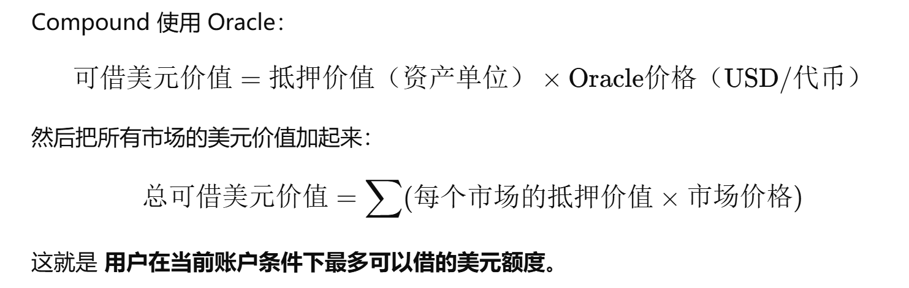

# 3. 借款和清算

我们如果想要借款，\*\*前提是我们必须要先抵押，\*\*然后才能贷款，其中compound会计算我们抵押所有代币的价值，然后给我们可以借多少款

```solidity
 function getHypotheticalAccountLiquidityInternal(
        address account,
        CToken cTokenModify,
        uint256 redeemTokens,
        uint256 borrowAmount
    ) internal view returns (Error, uint256, uint256) {
        AccountLiquidityLocalVars memory vars; // Holds all our calculation results
        uint256 oErr;

        // For each asset the account is in
        // 检查每个市场的cToken并且转化成美元的价格
        CToken[] memory assets = accountAssets[account];
        for (uint256 i = 0; i < assets.length; i++) {
            CToken asset = assets[i];

            // Read the balances and exchange rate from the cToken
            (oErr, vars.cTokenBalance, vars.borrowBalance, vars.exchangeRateMantissa) =
                asset.getAccountSnapshot(account);
            if (oErr != 0) {
                // semi-opaque error code, we assume NO_ERROR == 0 is invariant between upgrades
                return (Error.SNAPSHOT_ERROR, 0, 0);
            }
            vars.collateralFactor = Exp({mantissa: markets[address(asset)].collateralFactorMantissa});
            vars.exchangeRate = Exp({mantissa: vars.exchangeRateMantissa});

            // Get the normalized price of the asset
            vars.oraclePriceMantissa = oracle.getUnderlyingPrice(asset);
            if (vars.oraclePriceMantissa == 0) {
                return (Error.PRICE_ERROR, 0, 0);
            }
            vars.oraclePrice = Exp({mantissa: vars.oraclePriceMantissa}); // 根据预言机获得价格

            // Pre-compute a conversion factor from tokens -> ether (normalized price value)
            vars.tokensToDenom = mul_(mul_(vars.collateralFactor, vars.exchangeRate), vars.oraclePrice); // 缩放因子

            // sumCollateral += tokensToDenom * cTokenBalance
            // 每个市场抵押价值 即我们还有多少钱可以借
            vars.sumCollateral = mul_ScalarTruncateAddUInt(vars.tokensToDenom, vars.cTokenBalance, vars.sumCollateral);

            // sumBorrowPlusEffects += oraclePrice * borrowBalance
            // 我们已经借了多少钱
            vars.sumBorrowPlusEffects =
                mul_ScalarTruncateAddUInt(vars.oraclePrice, vars.borrowBalance, vars.sumBorrowPlusEffects);

            // Calculate effects of interacting with cTokenModify
            if (asset == cTokenModify) {
                // redeem effect
                // sumBorrowPlusEffects += tokensToDenom * redeemTokens
                vars.sumBorrowPlusEffects =
                    mul_ScalarTruncateAddUInt(vars.tokensToDenom, redeemTokens, vars.sumBorrowPlusEffects);

                // borrow effect
                // sumBorrowPlusEffects += oraclePrice * borrowAmount
                vars.sumBorrowPlusEffects =
                    mul_ScalarTruncateAddUInt(vars.oraclePrice, borrowAmount, vars.sumBorrowPlusEffects);
            }
        }

        // These are safe, as the underflow condition is checked first
        if (vars.sumCollateral > vars.sumBorrowPlusEffects) {
            return (Error.NO_ERROR, vars.sumCollateral - vars.sumBorrowPlusEffects, 0);
        } else {
            return (Error.NO_ERROR, 0, vars.sumBorrowPlusEffects - vars.sumCollateral);
        }
    }


    function getAccountLiquidityInternal(address account) internal view returns (Error, uint256, uint256) {
        return getHypotheticalAccountLiquidityInternal(account, CToken(address(0)), 0, 0);
    }


    function getAccountLiquidity(address account) public view returns (uint256, uint256, uint256) {
        (Error err, uint256 liquidity, uint256 shortfall) =
            getHypotheticalAccountLiquidityInternal(account, CToken(address(0)), 0, 0);

        return (uint256(err), liquidity, shortfall);
    }
```

## 抵押率

我们抵押商品的话不能是100%的获得同等价值的代币，比如现在1ETH 是3000u,然后抵押因子（抵押率）是80%，那么我们能够借款的价值就是 3000 \* 80% = 2400 u;

其中不同代币的抵押率也是不同的，抵押率通常都是协议方规定

## 兑换率

```solidity
exchangeRate(兑换率） = （cash（当前合约剩余资金） + borrow（借款） - reserves） * 1e18 / totalsupply
```

分子是token，分母是ctoken，一般前边比后边大，因为收利息啥的收的是token，token会变多，然后这样的话ctoken就变得更值钱了

* totalsupply： cToken 合约里 **所有 cToken 持有者总共持有的 cToken 数量**

```solidity
underlying = cToken * exchangeRate /M
```

## 可以借出的借款数量

函数在一开始会先遍历市场，检查我们所有的抵押额，然后不同市场的代币乘以不同抵押因子，然后compound会根据当前市场的价格来将所有的资产用一个美元（u）和告诉我们，这个就是我们可以借出的贷款数量

抵押价值（资产单位）=cToken数量×`exchangeRate`×`collateralFactor`

可以借出的美元价值 = （每种代币的抵押价值 \* 每种代币的美元价值）的总和



## 比较借款和抵押值判断是否可以被清算

当我们所有的抵押价值\*\*<font style="background-color:#FBDFEF;">sumCollateral （所有的抵押价值）</font>**和**<font style="background-color:#FBDFEF;">sumBorrow （所有借款价值累加）</font>\*\*相比

* if

sumCollateral > sumBorrow

liquidity = sumCollateral - sumBorrow

**=> shortfall = 0（代表是正常的）**

* else

  liquidity = 0

\=> shortfall = sumBorrow - sumCollateral

通俗来讲就是，如果我们的抵押价值低于我们的借款价值，我们就可以被清算了。

因为如果 shortfall > 0 我们就会被归为可以被清算的

# 清算

## 计算清算者被清算的价格

```solidity
 function liquidateCalculateSeizeTokens(address cTokenBorrowed, address cTokenCollateral, uint256 actualRepayAmount)
        external
        view
        override
        returns (uint256, uint256)
    {
        /* Read oracle prices for borrowed and collateral markets */
        uint256 priceBorrowedMantissa = oracle.getUnderlyingPrice(CToken(cTokenBorrowed));
        uint256 priceCollateralMantissa = oracle.getUnderlyingPrice(CToken(cTokenCollateral));
        if (priceBorrowedMantissa == 0 || priceCollateralMantissa == 0) {
            return (uint256(Error.PRICE_ERROR), 0);
        }

        /*
         * Get the exchange rate and calculate the number of collateral tokens to seize:
         *  seizeAmount = actualRepayAmount * liquidationIncentive * priceBorrowed / priceCollateral
         *  seizeTokens = seizeAmount / exchangeRate
         *   = actualRepayAmount * (liquidationIncentive * priceBorrowed) / (priceCollateral * exchangeRate)
         */
        uint256 exchangeRateMantissa = CToken(cTokenCollateral).exchangeRateStored(); // Note: reverts on error
        uint256 seizeTokens;
        Exp memory numerator;
        Exp memory denominator;
        Exp memory ratio;

        numerator = mul_(Exp({mantissa: liquidationIncentiveMantissa}), Exp({mantissa: priceBorrowedMantissa}));
        denominator = mul_(Exp({mantissa: priceCollateralMantissa}), Exp({mantissa: exchangeRateMantissa}));
        ratio = div_(numerator, denominator);

        seizeTokens = mul_ScalarTruncate(ratio, actualRepayAmount);

        return (uint256(Error.NO_ERROR), seizeTokens);
    }

```

参数解释：

| 参数 | 类型 | 含义 | 作用 |
| --- | --- | --- | --- |
| `cTokenBorrowed` | `address` | **借款资产**对应的 cToken 合约地址 | 获取借款资产价格 `priceBorrowed` |
| `cTokenCollateral` | `address` | **抵押资产**对应的 cToken 合约地址 | 获取抵押资产价格 `priceCollateral` 和汇率 `exchangeRate` |
| `actualRepayAmount` | `uint256` | **清算人实际偿还**的借款数量（underlying 数量） | 用于计算可拿抵押品数量 |

| 变量 | 类型 | 含义 | 用途 |
| --- | --- | --- | --- |
| `priceBorrowedMantissa` | `uint256` | 借款资产价格（oracle） | 用于计算抵押品价值 |
| `priceCollateralMantissa` | `uint256` | 抵押资产价格（oracle） | 用于计算抵押品数量 |
| `exchangeRateMantissa` | `uint256` | 抵押 cToken 的汇率 | 将 underlying 转换为 cToken |
| `numerator` | `Exp` | `liquidationIncentive * priceBorrowed` | 分子，用于计算比例 |
| `denominator` | `Exp` | `priceCollateral * exchangeRate` | 分母，用于计算比例 |
| `ratio` | `Exp` | `numerator / denominator` | underlying → cToken 转换比例 |
| `seizeTokens` | `uint256` | 可拿的 cToken 数量 | 最终清算奖励数量 |

计算我们如果清算可以获得奖励

直接说明，**清算者获得的清算奖励只是cToken不是原生代币**；

## 计算可拿抵押品价值

seizeAmount   =  actualRepayAmount （**清算者实际支付给协议的金额**） \*  liquidationIncentive  （协议奖励因子，协议定的） \*  priceBorrowed  /priceCollateral

其实就是计算被清算者的抵押品的美元价值

## 转换为cToken

seizeTokens   =  seizeAmount   / exchangeRate(转化率）

这个转化率，是cdai/dai，所以不是乘是除

其实就是需要转给清算者奖励的cToken数量（具体那种token就是被清算者的抵押品 ）

## 清算者清算逻辑

```solidity
    function liquidateBorrowInternal(address borrower, uint256 repayAmount, CTokenInterface cTokenCollateral)
        internal
        nonReentrant
    {
        accrueInterest();

        uint256 error = cTokenCollateral.accrueInterest();
        if (error != NO_ERROR) {
            // accrueInterest emits logs on errors, but we still want to log the fact that an attempted liquidation failed
            revert LiquidateAccrueCollateralInterestFailed(error);
        }

        // liquidateBorrowFresh emits borrow-specific logs on errors, so we don't need to
        liquidateBorrowFresh(msg.sender, borrower, repayAmount, cTokenCollateral);
    }


  function liquidateBorrowFresh(
        address liquidator,
        address borrower,
        uint256 repayAmount,
        CTokenInterface cTokenCollateral
    ) internal {
        /* Fail if liquidate not allowed */
        uint256 allowed = comptroller.liquidateBorrowAllowed(
            address(this), address(cTokenCollateral), liquidator, borrower, repayAmount
        );
        if (allowed != 0) {
            revert LiquidateComptrollerRejection(allowed);
        }

        /* Verify market's block number equals current block number */
        if (accrualBlockNumber != getBlockNumber()) {
            revert LiquidateFreshnessCheck();
        }

        /* Verify cTokenCollateral market's block number equals current block number */
        if (cTokenCollateral.accrualBlockNumber() != getBlockNumber()) {
            revert LiquidateCollateralFreshnessCheck();
        }

        /* Fail if borrower = liquidator */
        if (borrower == liquidator) {
            revert LiquidateLiquidatorIsBorrower();
        }

        /* Fail if repayAmount = 0 */
        if (repayAmount == 0) {
            revert LiquidateCloseAmountIsZero();
        }

        /* Fail if repayAmount = -1 */
        if (repayAmount == type(uint256).max) {
            revert LiquidateCloseAmountIsUintMax();
        }

        /* Fail if repayBorrow fails */
        uint256 actualRepayAmount = repayBorrowFresh(liquidator, borrower, repayAmount);

        /////////////////////////
        // EFFECTS & INTERACTIONS
        // (No safe failures beyond this point)

        /* We calculate the number of collateral tokens that will be seized */
        (uint256 amountSeizeError, uint256 seizeTokens) =
            comptroller.liquidateCalculateSeizeTokens(address(this), address(cTokenCollateral), actualRepayAmount);
        require(amountSeizeError == NO_ERROR, "LIQUIDATE_COMPTROLLER_CALCULATE_AMOUNT_SEIZE_FAILED");

        /* Revert if borrower collateral token balance < seizeTokens */
        require(cTokenCollateral.balanceOf(borrower) >= seizeTokens, "LIQUIDATE_SEIZE_TOO_MUCH");

        // If this is also the collateral, run seizeInternal to avoid re-entrancy, otherwise make an external call
        if (address(cTokenCollateral) == address(this)) {
            seizeInternal(address(this), liquidator, borrower, seizeTokens);
        } else {
            require(cTokenCollateral.seize(liquidator, borrower, seizeTokens) == NO_ERROR, "token seizure failed");
        }

        /* We emit a LiquidateBorrow event */
        emit LiquidateBorrow(liquidator, borrower, actualRepayAmount, address(cTokenCollateral), seizeTokens);
    }


```

先进行一系列检查别误清算

然后需要清算者需要帮被清算者还上所所有的款，然后协议会调用seizeInternal函数来给清算者奖励

```solidity
    function seizeInternal(address seizerToken, address liquidator, address borrower, uint256 seizeTokens) internal {
        /* Fail if seize not allowed */
        uint256 allowed = comptroller.seizeAllowed(address(this), seizerToken, liquidator, borrower, seizeTokens);
        if (allowed != 0) {
            revert LiquidateSeizeComptrollerRejection(allowed);
        }

        /* Fail if borrower = liquidator */
        if (borrower == liquidator) {
            revert LiquidateSeizeLiquidatorIsBorrower();
        }

        /*
         * We calculate the new borrower and liquidator token balances, failing on underflow/overflow:
         *  borrowerTokensNew = accountTokens[borrower] - seizeTokens
         *  liquidatorTokensNew = accountTokens[liquidator] + seizeTokens
         */
        uint256 protocolSeizeTokens = mul_(seizeTokens, Exp({mantissa: protocolSeizeShareMantissa}));
        uint256 liquidatorSeizeTokens = seizeTokens - protocolSeizeTokens;
        Exp memory exchangeRate = Exp({mantissa: exchangeRateStoredInternal()});
        uint256 protocolSeizeAmount = mul_ScalarTruncate(exchangeRate, protocolSeizeTokens);
        uint256 totalReservesNew = totalReserves + protocolSeizeAmount;

        /////////////////////////
        // EFFECTS & INTERACTIONS
        // (No safe failures beyond this point)

        /* We write the calculated values into storage */
        totalReserves = totalReservesNew;
        totalSupply = totalSupply - protocolSeizeTokens;
        accountTokens[borrower] = accountTokens[borrower] - seizeTokens;
        accountTokens[liquidator] = accountTokens[liquidator] + liquidatorSeizeTokens;

        /* Emit a Transfer event */
        emit Transfer(borrower, liquidator, liquidatorSeizeTokens);
        emit Transfer(borrower, address(this), protocolSeizeTokens);
        emit ReservesAdded(address(this), protocolSeizeAmount, totalReservesNew);
    }

```

更新状态以及转给清算者奖励


> 更新: 2025-11-15 18:46:18  
> 原文: <https://www.yuque.com/xiaoyuhushenfu/yzin4n/qumiwqqbbgknkzor>