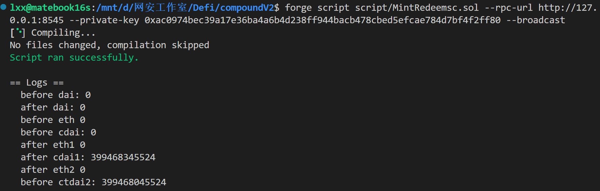
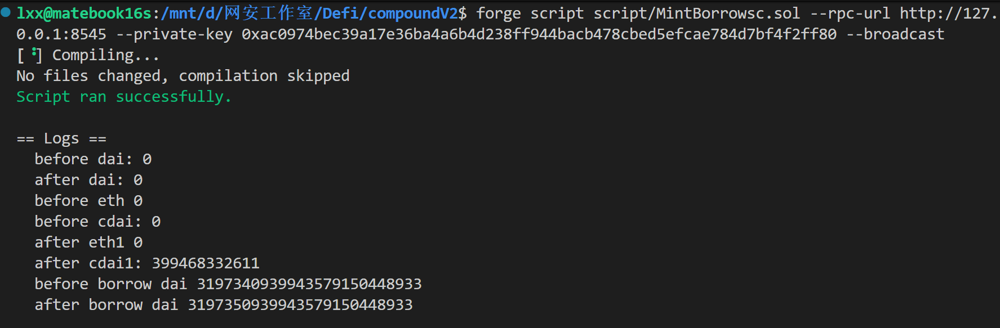
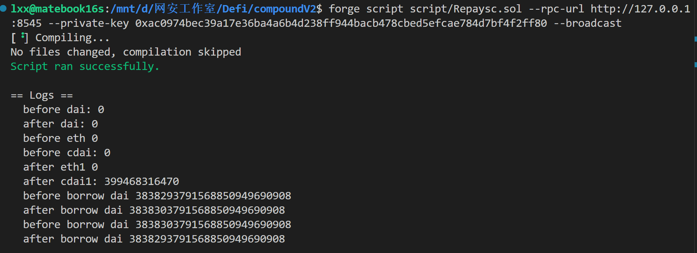

# 实现

# src
```solidity
// SPDX-License-Identifier: SEE LICENSE IN LICENSE
pragma solidity ^0.8.10;

import {IComptroller} from "./interfaces/IComptroller.sol";
import {CErc20} from "../lib/compound-protocol/contracts/CErc20.sol";

interface IERC20 {
    function approve(address, uint256) external returns (bool);
    function balanceOf(address) external view returns (uint256);
}

contract Compound {
    IERC20 public immutable dai;
    CErc20 public immutable cdai;
    address constant user = 0xa0Ee7A142d267C1f36714E4a8F75612F20a79720; //anvil 0
    IComptroller constant comptroller = IComptroller(0x3d9819210A31b4961b30EF54bE2aeD79B9c9Cd3B);

    constructor() {
        dai = IERC20(0x6B175474E89094C44Da98b954EedeAC495271d0F);
        cdai = CErc20(0x5d3a536E4D6DbD6114cc1Ead35777bAB948E3643);
    }

    function mintdai(uint256 amount) external payable {
        dai.approve(address(cdai), type(uint256).max);
        cdai.mint(amount);
    }

    function redeemdai(uint256 amount) external payable {
        dai.approve(address(cdai), amount);
        cdai.redeem(amount);
    }

    function borrowdai(uint256 amount) external payable {
        dai.approve(address(cdai), amount);
        cdai.borrow(amount);
    }

    function repaydai(uint256 amount) external payable {
        dai.approve(address(cdai), amount);
        cdai.repayBorrow(amount);
    }

    function liquidatedai(uint256 amount) external {}
}

```

```solidity
anvil --fork-url https://eth-mainnet.g.alchemy.com/v2/ItlSfQQLVNsDqjGck4BJbLQGy0n7GlXv
```

# mint + redeem
```solidity
// SPDX-License-Identifier: SEE LICENSE IN LICENSE
pragma solidity ^0.8.10;

import {Script} from "../lib/forge-std/src/Script.sol";
import {console} from "../lib/forge-std/src/console.sol";
import {Compound} from "../src/1.sol";
import {ERC20} from "../lib/openzeppelin-contracts/contracts/token/ERC20/ERC20.sol";
import {IERC20} from "../lib/openzeppelin-contracts/contracts/token/ERC20/IERC20.sol";
import {CErc20} from "../lib/compound-protocol/contracts/CErc20.sol";
import {IUniswapV2Router02} from "../interfaces2/IUniswapV2Router02.sol";
import {IUniswapV2Pair} from "../interfaces/IUniswapV2Pair.sol";

interface IWETH is IERC20 {
    function deposit() external payable;
    function withdraw(uint256) external;
}

contract MintRedeemsc is Script {
    // Compound public compound = Compound(0x2bc0484B5b0FAfFf0a14B858D85E8830621fE0CA);
    Compound public compound;
    IERC20 public immutable dai = IERC20(0x6B175474E89094C44Da98b954EedeAC495271d0F);
    CErc20 public immutable cdai = CErc20(0x5d3a536E4D6DbD6114cc1Ead35777bAB948E3643);

    IUniswapV2Pair public ipairDAItoWETH;
    IUniswapV2Pair public ipairUSDTtoWETH;
    IUniswapV2Pair public ipairWBTCtoWETH;

    address constant pairDAItoWETH = 0xA478c2975Ab1Ea89e8196811F51A7B7Ade33eB11;
    address constant pairUSDTtoWETH = 0x0d4a11d5EEaaC28EC3F61d100daF4d40471f1852;
    address constant pairWBTCtoWETH = 0x004375Dff511095CC5A197A54140a24eFEF3A416;

    IUniswapV2Router02 public IRounter;

    address user = 0xf39Fd6e51aad88F6F4ce6aB8827279cffFb92266;

    address constant Rounter = 0x7a250d5630B4cF539739dF2C5dAcb4c659F2488D;

    IERC20 public iDAI;
    IERC20 public iUSDT;
    IERC20 public iWBTC;
    IWETH public iWETH;

    address constant DAI = 0x6B175474E89094C44Da98b954EedeAC495271d0F;
    address constant USDT = 0xdAC17F958D2ee523a2206206994597C13D831ec7;
    address constant WBTC = 0x2260FAC5E5542a773Aa44fBCfeDf7C193bc2C599;
    address constant WETH = 0xC02aaA39b223FE8D0A0e5C4F27eAD9083C756Cc2;

    constructor() payable {
        ipairDAItoWETH = IUniswapV2Pair(pairDAItoWETH);
        ipairUSDTtoWETH = IUniswapV2Pair(pairUSDTtoWETH);
        ipairWBTCtoWETH = IUniswapV2Pair(pairWBTCtoWETH);
        IRounter = IUniswapV2Router02(Rounter);
        iDAI = IERC20(DAI);
        iUSDT = IERC20(USDT);
        iWBTC = IERC20(WBTC);
        iWETH = IWETH(WETH);
        compound = new Compound();
    }

    function run() external {
        //ether 换 dai
        vm.startBroadcast();
        uint256 dai2 = iDAI.balanceOf(user);
        console.log("before dai:", dai2);

        address[] memory path3 = new address[](2);
        path3[0] = WETH;
        path3[1] = DAI;

        IRounter.swapExactETHForTokens{value: 1000 ether}(
            0, //amountOutMin
            path3,
            address(compound),
            block.timestamp + 300
        );

        uint256 afterdai2 = iDAI.balanceOf(user);
        console.log("after dai:", afterdai2);

        vm.stopBroadcast();

        //mintdai
        vm.startBroadcast();

        console.log("before eth", address(compound).balance);
        console.log("before cdai:", cdai.balanceOf(address(compound)));

        compound.mintdai(100 ether);

        console.log("after eth1", address(compound).balance);
        console.log("after cdai1:", cdai.balanceOf(address(compound)));

        vm.stopBroadcast();

        //redeemdai
        vm.startBroadcast();

        compound.redeemdai(300000);

        console.log("after eth2", address(compound).balance);
        console.log("before ctdai2:", cdai.balanceOf(address(compound)));

        vm.stopBroadcast();

        // vm.startBroadcast();
        // console.log("before borrow dai", iDAI.balanceOf(address(compound)));
        // compound.borrowdai(10 ether);
        // console.log("after borrow dai", iDAI.balanceOf(address(compound)));
        // vm.stopBroadcast();
    }
}


```

```solidity
forge script script/MintRedeemsc.sol --rpc-url http://127.0.0.1:8545 --private-key 0xac0974bec39a17e36ba4a6b4d238ff944bacb478cbed5efcae784d7bf4f2ff80 --broadcast
```




# mint + borrow 
```solidity
// SPDX-License-Identifier: SEE LICENSE IN LICENSE
pragma solidity ^0.8.10;

import {Script} from "../lib/forge-std/src/Script.sol";
import {console} from "../lib/forge-std/src/console.sol";
import {Compound} from "../src/1.sol";
import {ERC20} from "../lib/openzeppelin-contracts/contracts/token/ERC20/ERC20.sol";
import {IERC20} from "../lib/openzeppelin-contracts/contracts/token/ERC20/IERC20.sol";
import {CErc20} from "../lib/compound-protocol/contracts/CErc20.sol";
import {IUniswapV2Router02} from "../interfaces2/IUniswapV2Router02.sol";
import {IUniswapV2Pair} from "../interfaces/IUniswapV2Pair.sol";

interface IWETH is IERC20 {
    function deposit() external payable;
    function withdraw(uint256) external;
}

contract MintRedeemsc is Script {
    Compound public compound;
    IERC20 public immutable dai = IERC20(0x6B175474E89094C44Da98b954EedeAC495271d0F);
    CErc20 public immutable cdai = CErc20(0x5d3a536E4D6DbD6114cc1Ead35777bAB948E3643);

    IUniswapV2Pair public ipairDAItoWETH;
    IUniswapV2Pair public ipairUSDTtoWETH;
    IUniswapV2Pair public ipairWBTCtoWETH;

    address constant pairDAItoWETH = 0xA478c2975Ab1Ea89e8196811F51A7B7Ade33eB11;
    address constant pairUSDTtoWETH = 0x0d4a11d5EEaaC28EC3F61d100daF4d40471f1852;
    address constant pairWBTCtoWETH = 0x004375Dff511095CC5A197A54140a24eFEF3A416;

    IUniswapV2Router02 public IRounter;

    address user = 0xf39Fd6e51aad88F6F4ce6aB8827279cffFb92266;

    address constant Rounter = 0x7a250d5630B4cF539739dF2C5dAcb4c659F2488D;

    IERC20 public iDAI;
    IERC20 public iUSDT;
    IERC20 public iWBTC;
    IWETH public iWETH;

    address constant DAI = 0x6B175474E89094C44Da98b954EedeAC495271d0F;
    address constant USDT = 0xdAC17F958D2ee523a2206206994597C13D831ec7;
    address constant WBTC = 0x2260FAC5E5542a773Aa44fBCfeDf7C193bc2C599;
    address constant WETH = 0xC02aaA39b223FE8D0A0e5C4F27eAD9083C756Cc2;

    constructor() payable {
        ipairDAItoWETH = IUniswapV2Pair(pairDAItoWETH);
        ipairUSDTtoWETH = IUniswapV2Pair(pairUSDTtoWETH);
        ipairWBTCtoWETH = IUniswapV2Pair(pairWBTCtoWETH);
        IRounter = IUniswapV2Router02(Rounter);
        iDAI = IERC20(DAI);
        iUSDT = IERC20(USDT);
        iWBTC = IERC20(WBTC);
        iWETH = IWETH(WETH);
        compound = new Compound();
    }

    function run() external {
        //ether 换 dai
        vm.startBroadcast();
        uint256 dai2 = iDAI.balanceOf(user);
        console.log("before dai:", dai2);

        address[] memory path3 = new address[](2);
        path3[0] = WETH;
        path3[1] = DAI;

        IRounter.swapExactETHForTokens{value: 1000 ether}(
            0, //amountOutMin
            path3,
            address(compound),
            block.timestamp + 300
        );

        uint256 afterdai2 = iDAI.balanceOf(user);
        console.log("after dai:", afterdai2);

        vm.stopBroadcast();

        //mintdai
        vm.startBroadcast();

        console.log("before eth", address(compound).balance);
        console.log("before cdai:", cdai.balanceOf(address(compound)));

        compound.mintdai(100 ether);

        console.log("after eth1", address(compound).balance);
        console.log("after cdai1:", cdai.balanceOf(address(compound)));

        vm.stopBroadcast();

        //borrowdai
        vm.startBroadcast();

        console.log("before borrow dai", iDAI.balanceOf(address(compound)));

        compound.borrowdai(10 ether);

        console.log("after borrow dai", iDAI.balanceOf(address(compound)));

        vm.stopBroadcast();
    }
}


```

```solidity
forge script script/Borrowsc.sol --rpc-url http://127.0.0.1:8545 --private-key 0xac0974bec39a17e36ba4a6b4d238ff944bacb478cbed5efcae784d7bf4f2ff80
```



# mint + borrow +repay
```solidity
// SPDX-License-Identifier: SEE LICENSE IN LICENSE
pragma solidity ^0.8.10;

import {Script} from "../lib/forge-std/src/Script.sol";
import {console} from "../lib/forge-std/src/console.sol";
import {Compound} from "../src/1.sol";
import {ERC20} from "../lib/openzeppelin-contracts/contracts/token/ERC20/ERC20.sol";
import {IERC20} from "../lib/openzeppelin-contracts/contracts/token/ERC20/IERC20.sol";
import {CErc20} from "../lib/compound-protocol/contracts/CErc20.sol";
import {IUniswapV2Router02} from "../interfaces2/IUniswapV2Router02.sol";
import {IUniswapV2Pair} from "../interfaces/IUniswapV2Pair.sol";

interface IWETH is IERC20 {
    function deposit() external payable;
    function withdraw(uint256) external;
}

contract MintRedeemsc is Script {
    Compound public compound;
    IERC20 public immutable dai = IERC20(0x6B175474E89094C44Da98b954EedeAC495271d0F);
    CErc20 public immutable cdai = CErc20(0x5d3a536E4D6DbD6114cc1Ead35777bAB948E3643);

    IUniswapV2Pair public ipairDAItoWETH;
    IUniswapV2Pair public ipairUSDTtoWETH;
    IUniswapV2Pair public ipairWBTCtoWETH;

    address constant pairDAItoWETH = 0xA478c2975Ab1Ea89e8196811F51A7B7Ade33eB11;
    address constant pairUSDTtoWETH = 0x0d4a11d5EEaaC28EC3F61d100daF4d40471f1852;
    address constant pairWBTCtoWETH = 0x004375Dff511095CC5A197A54140a24eFEF3A416;

    IUniswapV2Router02 public IRounter;

    address user = 0xf39Fd6e51aad88F6F4ce6aB8827279cffFb92266;

    address constant Rounter = 0x7a250d5630B4cF539739dF2C5dAcb4c659F2488D;

    IERC20 public iDAI;
    IERC20 public iUSDT;
    IERC20 public iWBTC;
    IWETH public iWETH;

    address constant DAI = 0x6B175474E89094C44Da98b954EedeAC495271d0F;
    address constant USDT = 0xdAC17F958D2ee523a2206206994597C13D831ec7;
    address constant WBTC = 0x2260FAC5E5542a773Aa44fBCfeDf7C193bc2C599;
    address constant WETH = 0xC02aaA39b223FE8D0A0e5C4F27eAD9083C756Cc2;

    constructor() payable {
        ipairDAItoWETH = IUniswapV2Pair(pairDAItoWETH);
        ipairUSDTtoWETH = IUniswapV2Pair(pairUSDTtoWETH);
        ipairWBTCtoWETH = IUniswapV2Pair(pairWBTCtoWETH);
        IRounter = IUniswapV2Router02(Rounter);
        iDAI = IERC20(DAI);
        iUSDT = IERC20(USDT);
        iWBTC = IERC20(WBTC);
        iWETH = IWETH(WETH);
        compound = new Compound();
    }

    function run() external {
        //ether 换 dai
        vm.startBroadcast();
        uint256 dai2 = iDAI.balanceOf(user);
        console.log("before dai:", dai2);

        address[] memory path3 = new address[](2);
        path3[0] = WETH;
        path3[1] = DAI;

        IRounter.swapExactETHForTokens{value: 1000 ether}(
            0, //amountOutMin
            path3,
            address(compound),
            block.timestamp + 300
        );

        uint256 afterdai2 = iDAI.balanceOf(user);
        console.log("after dai:", afterdai2);

        vm.stopBroadcast();

        //mintdai
        vm.startBroadcast();

        console.log("before eth", address(compound).balance);
        console.log("before cdai:", cdai.balanceOf(address(compound)));

        compound.mintdai(100 ether);

        console.log("after eth1", address(compound).balance);
        console.log("after cdai1:", cdai.balanceOf(address(compound)));

        vm.stopBroadcast();

        //borrowdai
        vm.startBroadcast();

        console.log("before borrow dai", iDAI.balanceOf(address(compound)));

        compound.borrowdai(10 ether);

        console.log("after borrow dai", iDAI.balanceOf(address(compound)));

        vm.stopBroadcast();

        //repaydai
        vm.startBroadcast();

        console.log("before borrow dai", iDAI.balanceOf(address(compound)));

        compound.repaydai(10 ether);

        console.log("after borrow dai", iDAI.balanceOf(address(compound)));

        vm.stopBroadcast();
    }
}


```

```solidity
forge script script/Repaysc.sol --rpc-url http://127.0.0.1:8545 --private-key 0xac0974bec39a17e36ba4a6b4d238ff944bacb478cbed5efcae784d7bf4f2ff80 --broadcast
```




> 更新: 2026-04-01 19:12:15  
> 原文: <https://www.yuque.com/xiaoyuhushenfu/yzin4n/xvfxmgn7069m2tqd>