# 王梦蓓

## AMM

`UniswapV2` 是一种去中心化交易协议，而它的底层原理就是 **AMM（自动化市商）**

AMM，是一种智能合约，允许用户直接和流动性池交易

流动性池由用户存入两种（或多种）代币组成

定价机制由算法决定

Swap Contract Call

**恒定乘积公式:**`x*y>=k`

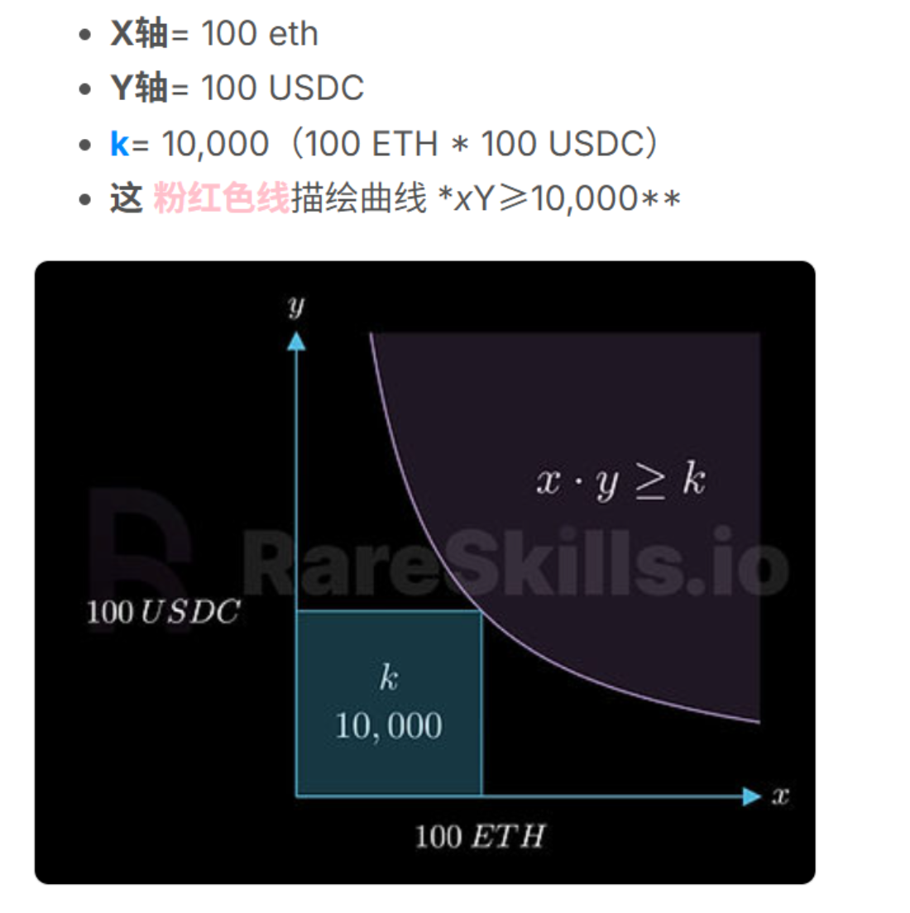

## 恒定乘积自动做市商公式

一、

$ \Large x\cdot y = k $

`x`：toke0的数量

`y`:  token1的数量

`k`: 流动性（在x与y交换时k不变）

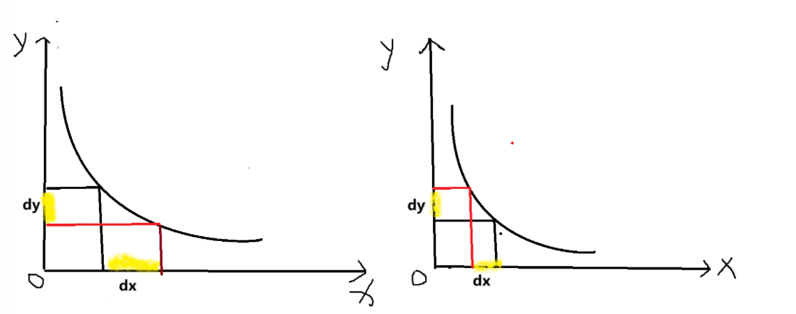

（不考虑手续费的情况下）

$ \Large (x + d\_x)(y - d\_y) = x\cdot y $

$ \Large (x - d\_x)(y + d\_y) = x\cdot y $

二、案例

假定一个交易对 `ETH/USDT`

**10 ETH**  **20000 USDT**

$ \Large k = 10\cdot 20000 = 200000 $

1. 用户卖出5个ETH$ \Large (10+5)\cdot(20000 - d\_y) = 20000 $得$ \Large d\_y = 20000 - \frac{200000}{15} = 6666.67USDT $
2. 用户持有10000USDT想买入ETH$ \Large (10 - d\_x)\cdot (2000 + 10000) = 200000 $$ \Large d\_x = 10 - \frac{200000}{330000} = 33.33ETH $
3. 用户卖出100000个ETH$ (10 + 100000)\cdot(20000 - d\_y) = 200000 $$ \Large d\_y = 20000 - \frac{200000}{100000 +10} = 19998 USDT $

用户卖出token0

$ \Large (x + d\_x)\cdot(y - d\_y) = k $

用户买入token1

$ \Large (x - d\_x)\cdot(y + d\_y) = k $

可以支持任何代币进行买卖，但是永远不会被掏空

token价格是由市场来决定的（市场供需），否则会有套利机器人来套利

三、定价机制与滑点问题

`定价机制`

**sport price**(现货价格)

$ \Large P\_x = \frac {y}{x} $

$ \Large P\_y = \frac {x}{y} $

**execution price**(执行价格)

指一次实际交易中，用户平均买入或卖出的真实成交价格

$ \Large P\_\ exec = \frac {amountIn} {aomuntOut} $

**案例**

用10个tokenA兑换tokenB (不考虑手续费)

| 池子 | A | B | K | 汇率 |
| --- | --- | --- | --- | --- |
| 1 | 100 | 10 | 1000 | 10：1 |
| 2 | 1000 | 100 | 100000 | 10：1 |
| 3 | 10000 | 1000 | 10000000 | 10：1 |

**池子1**

$ 100\cdot 10 = 110\cdot x $

兑换后

A 110

B 9.0910

A : B = 12.0999

**1B = 12.0999A**

**池子2**

$ 1000\cdot 100 = 1010\cdot  y $

兑换后

A 1010

B 99.0099

A ：B = 10.2010

**1B = 10.2010A**

**池子三**

$ 10000\cdot 1000 = 10010\cdot z $

兑换后

A 10010

B 999.0010

A : B = 10.0200

**1B = 10.0200A**

在该案例中，现货价格都是**1B = 10A**

但实际交易中，执行价格>现货价格，A变便宜了，B变贵了

`滑点问题`

**滑点**（slippage) 指的是交易价格与期望价格之间的偏差，即执行价格和现货价格之间的偏差

*计算公式*

$ \Large Slippage = \frac{execution \ price - sport \ price} {execution \ price} $

三个池子中的滑点大小依次为 20.999% 、2.010%、0.200%

<font style="background-color:#f3bb2f;">滑点大小与池子深度成反比</font>

四、流动性

$  k = L \cdot L $

`LP(Liquidity Privide)`流动性提供者

`LPT(Liquidity Provider Token)`流动性提供者凭证

1. 添加流动性，**添加的比例要池子里原来的比例一致（不能影响市场价）**$ \Large\frac{x + dx}{y+dy} = \frac{x}{y} $,用户添加的是dx和dy$ \Large k = \frac{x + d\_x}{y+d\_y} $如果token是我们发的，添加初始流动性决定了这个token的发行价格
2. 移除流动性，**同样要按照比例移除**$ \Large\frac{x - d\_x}{y - d\_y} = \frac{x}{y} $$ \Large k = \frac{x - d\_x}{y - d\_y} $如果市场价发生了变化，要按新的市场价移除

<font style="background-color:#f3bb2f;">k值在token交换的时候是恒定的，但是在添加流动性和移除流动性的时候是变化的</font>

k值（L的平方）决定池子的深浅（流动性的深度），交易占池子的比例越大会产生越大的滑点（k值小，池子对交易者来说太浅）；但是交易占池子的比例很小，交易的滑点越小。

如果要交易一笔数量较多的token，最好找一个深度足够的交易池，能最大可能保证以市场价格成交（减少损失）。

## swap操作

**UniswapV2中代币兑换的流程（以DAI/USDT为例）**

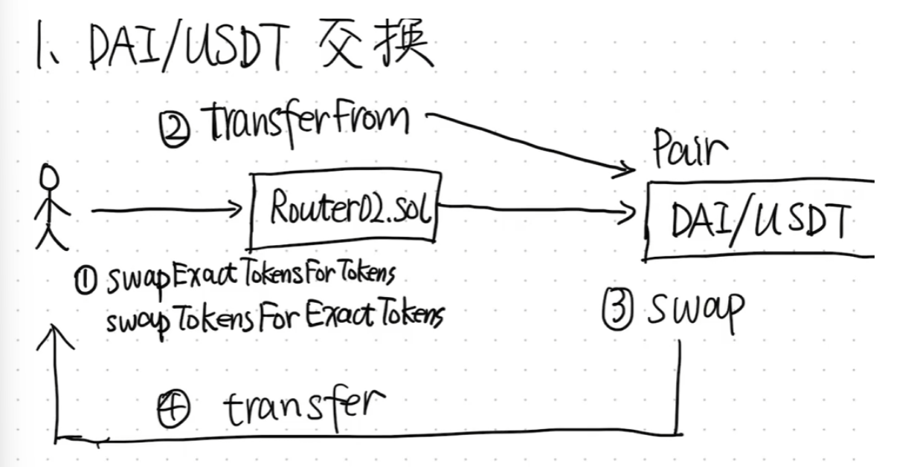

* 用户调用`SwapExactTokensForTokens()`（用固定数量的token A 换尽量多的token B）或`SwapTokensForExactTokens()`（想要换固定数量的token B，允许Router花费尽量少的token A）
* Router调用`transferFrom()`把用户的输入代币转给Pair合约（前提是用户需要给路由合约授权使用自己的余额）
* Router再调用Pair的`swap()`,Pair根据恒定乘积公式计算出应该给用户多少目标代币(USDT)
* Pair调用`transfer()`把目标代币发给用户

**UniswapV2多跳兑换流程**(DAI --->  USDT ---> MKR,没有直接的DAI/MKR交易对)

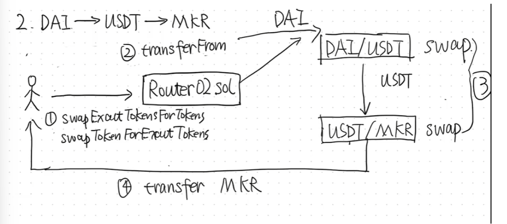

* 用户调用`SwapExactTokenForTokens()`或`swapTokenForExactTokens()`告诉Router要按照路径`[DAI, USDT, MKR]`，将DAI换成MKR
* Router调用`transferFrom()`将DAI转入第一个池子（DAI/USDT Pair)
* Router调用第一个Pair的`swap()`，直接把计算后的USDT转到下一个池子（USDT/MKR Pair），这一步是中间代币直接中转，Router不接触资金
* 第二个Pair执行`swap()`池子根据恒定乘积公式算出应付多少MKR，把MKR转给用户

**手续费**：千三 0.3%

$ \Large\frac{x+d\_x}{y-d\_y} = x\_0\cdot y\_0 $

$ \Large d\_y = d\_x\cdot y\_0\cdot(x+d\_x) $

***已知dx的情况下求dy***

**getamountIn()**，输入amountIn数量的tokenA可以换得多少tokenB

$ \Large\text{amountOut} = \frac{amountIn \times 997 \times reserveOut}{reserveIn \times 1000 + amountIn \times 997} $

***SwapExactTokensForTokens()***

池子中tokenA 的储备量  ---reserveOut

池子中tokenB的储备量

用户想要交换的 $ \Large d\_x $  ---amountIn

实际用于交换的$ \Large d\_{x\_1} =  (1-f) d\_x = 0.997d\_x $

$ \Large d\_y =  y\_0\cdot\frac{(1-f)d\_x }{x0+(1-f)\cdot d\_x} $

```
	$ \Large =  \frac{0.997\cdot d_x \cdot y_0}{x_0 + 0.997\cdot d_x} \cdot {\frac{1000}{1000}} $

	$ \Large = \frac{997\cdot d_x \cdot y_0}{1000\cdot x_0 + 997\cdot d_x} $
```

`X <==> In` `Y <==> Out`

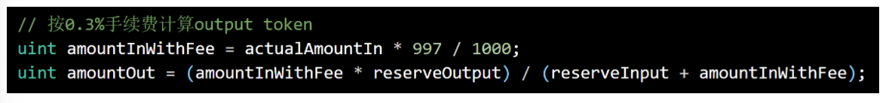

$ \Large amountOut = \frac {997\cdot actualAmountIn\cdot reserveOutput}{1000\cdot reserveInput +997\cdot actualAmountIn} $

***已知dy的情况下求dx***

**getAmountOut()**:想获得amountOut数量的tokenB需要支付多少tokenA

$ \Large\text{amountIn} = \frac{reserveIn \times amountOut \times 1000}{(reserveOut - amountOut) \times 997} + 1 $

**SwapTokensForExactTokens**

$ \Large\begin{cases}
x\_1 = x\_0 + (1 - f)d\_x \\\[6pt]
y\_1 = y\_0 - d\_y
\end{cases} $

$ \Large x\_1 \cdot y\_1 = x\_0 \cdot y\_0 $

```
(d<sub>x</sub>)                                (d<sub>y</sub>)
```

$ \Large x\_0\cdot d\_y + (1-f)\cdot d\_x\cdot d\_y = (1-f)\cdot y\_0\cdot d\_x $

$ \Large x\_0\cdot d\_y = \[(1-f)\cdot y\_0 - (1-f)\cdot d\_y]\cdot d\_x $

```
		   	$ \Large = [(1-f)\cdot (y_0 - d_y)]\cdot d_x $
```

$ \Large d\_x = \frac{x\cdot d\_y}{y\_0 -d\_y} \cdot \frac{1}{1-f} $

$ \Large x = \frac{x\_0\cdot d\_y}{y\_0 - d\_y}\cdot \frac{1}{1-f} $

```
 $ \Large = \frac{ReserveIn\cdot Amount}{ReserveOut - AmountOut}\cdot \frac{1000}{0.997} $
```

每笔交易收0.3%的手续费

手续费会留在池子里，`k`值会变大，手续费不会直接分给`LP`

<font style="background-color:#f3bb2f;">只要交易量大，池子里的代币是会缓慢增加的</font>

假设DAI和USDT市场价都是一美元一个

每次用一个DAI换USDT

出现价格不平衡的话会有套利空间，但不会存在时间太长，最终会变成类似情况

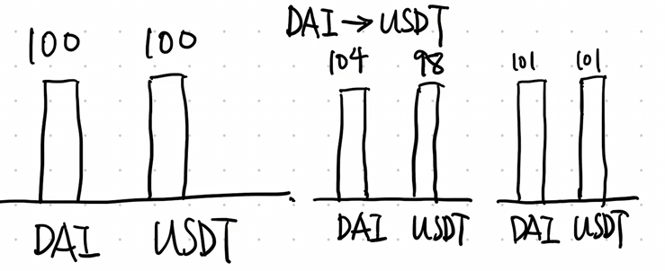

只要池子里有交换，流动性一定会变大

***如何让LP受益于手续费***

整个池子流动性增大，但是份额没变，所以每个份额值钱了

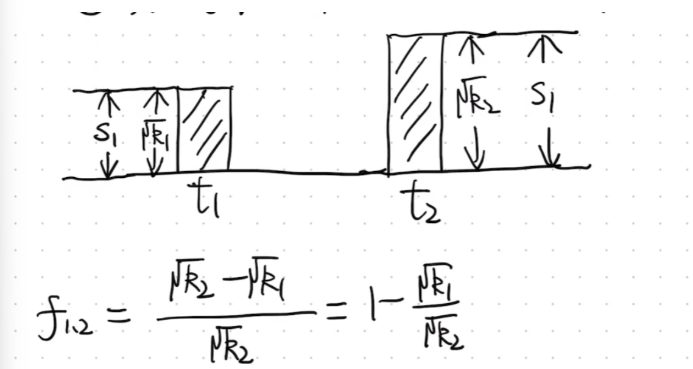

$ LP价值 = 份额比例\cdot 池子总价值 $

当新的 LP 加入、池子更大时：

* 市场交易更多，**手续费收入累积到池子里**；
* 因此$ R\_2 >R\_1 $，总资产变多；
* 虽然老 LP 的份额比例 $ \frac{\sqrt{R\_1}}{\sqrt{R\_2}} $ 没变；
* 但池子的 **绝对价值变大**，每一份份额代表更多的底层资产

只有LP会受益，作为交换者注入手续费实际上是为LP注入收入

<font style="background-color:#f3bb2f;">LP将资产存在池子中(LPT)，交换者与池子里LP的资产集合做交易，LP只有在撤池子的时候才能获得手续费收益；但不是稳赚（无常损失）</font>

当外部市场价格变化时：

1. **池子里的价格和市场价产生差异**。
2. 套利者会进来买入或卖出，直到池子价格 = 外部市场价。
3. 这个过程会改变池子里两种资产的比例。
4. LP 最终拿到的资产组合和最初存入时不同。
5. 把这个新组合按市场价折算，总价值 < 直接持有时的价值 → 产生**无常损失**。

初始LP：$ \Large \frac{100DAI}{ETH} $   ($ 100DAI + 1ETH = 200DAI $)

**<font style="background-color:#f3bb2f;">ETH涨价</font>**

$ \Large x\cdot y = k $   $ 100\cdot 1 ==> 120\cdot 0.83 $

$ \Large P\_E = \frac{120}{0.83} = 144.58 DAI/ETH $

对于LP来说：$ 120DAI + 0.83\cdot 144.58 = 240 DAI $

不做LP：$ 100DAI + 1ETH = 100 + 144.58 = 244.58DAI $

少赚$ 244.58 - 240 = 4.58DAI $

<font style="background-color:#f3bb2f;">市场价格发生变化时，池子的流动性不变</font>

$ 100 \cdot 1 = 120 \cdot 0.83 $

**<font style="background-color:#f3bb2f;">ETH降价</font>**

$ \Large 100DAI : 1ETH $

$ x\cdot y = k $   $ = 80DAI : 1.25ETH $

$ 100\cdot 1 = 80\cdot 1.25 = 100 $

$ \Large P\_E = \frac{80}{1.25} = 64 DAI/ETH $

不做LP：$ 100DAI + 1\cdot64DAI = 164 DAI $

做LP：$ 80DAI + 1.25\cdot 64DAI = 160DAI $

多损失的部分：$ 164DAI - 160DAI = 4DAI $

<font style="background-color:#f3bb2f;">涨价少赚的部分是无常损失，降价多亏的部分是无常损失</font>

***protocol fee***

在`UniswapV1`时，所有手续费都归LP，但是`Uniswap`作为项目方并没有受益。在`UniswapV2`，提出了`protocol fee`

用户还是支付交易的千三手续费，但是项目方要在千三里抽取六分之一（即万五）作为`protocol fee`，剩下部分为LP的收益

<font style="background-color:#f3bb2f;">协议方不对任何初始流动性收取费用，只对增量部分收取费用</font>

**项目方不直接拿token，而是免费给自己增发了一些shares(minted shares，和普通LP的份额完全一样，就是来源不同)**

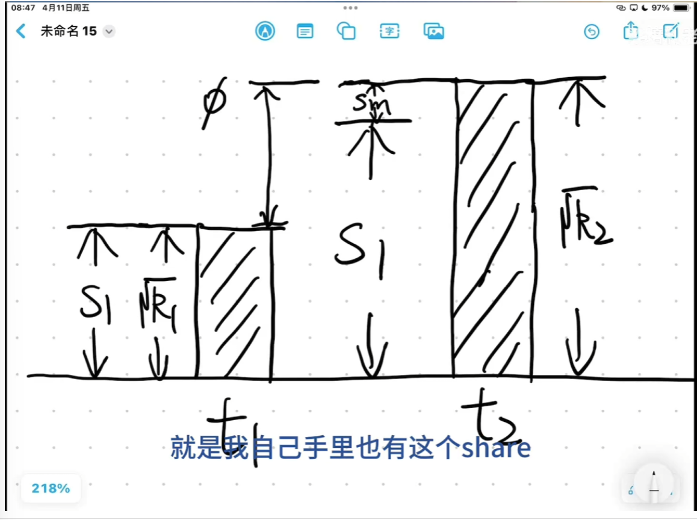

$ \Large\frac{S\_m}{S\_m+S\_1} = \frac{{\phi}(\sqrt{K\_{now}-K\_{last}})}{\sqrt{K\_{now}}} $

$ \Large S\_m = \frac{\sqrt{K\_{now}} - \sqrt{K\_{last}}}{\left(\frac{1}{\phi} - 1\right)\sqrt{K\_{now}} + \sqrt{K\_{last}}} \cdot S\_1 $

$ \Large S\_m = \frac{\sqrt{K\_{now}} - \sqrt{K\_{last}}}{5\sqrt{K\_{now}} + \sqrt{K\_{last}}} \cdot S\_1 $

$ \Large S\_m $---协议费份额

$ \Large S\_1 $----当前LP的总份额

根据 V2 的代码（`_mintFee` 函数），公式大致是：

$ \Large minted shares = \frac{\sqrt{K\_{now}}-\sqrt{K\_{last}}}{5}\cdot LP total supply $

$ \Large\text{fee fraction} = \frac{1}{n + 1} = \frac{1}{6} = 16.67% $

* 其中：
  * $ k = x \cdot y $是池子两种代币的乘积。
  * $ \sqrt{k} $ 的变化表示池子因手续费累积而增长的真实价值。
  * “/5” 的原因就是项目方拿走 **手续费收入的 1/6**，剩下的 5/6 留给 LP。

换句话说：

* 如果池子在 LP 提供流动性期间产生了手续费，那么在有人 mint/burn 时，系统会先算出 **增长部分对应多少手续费**，再 mint 相应比例的 LP token 给 feeTo。
* 项目方的 minted shares **只来自手续费增长，不会稀释 LP 的本金**。

`protocol fee`不会在每一笔交换后立即发生，只有下一次LP添加/移除流动性时，才会触发`_mintFree`,此时协议才会把累积的手续费增值计算出来，并mint对应的 LP token给项目方。

***

***FlashSwaps***

闪电贷原生于区块链

借贷后必须在同一笔交易之内将贷款于手续费还上

<font style="background-color:#f3bb2f;">Flash Swap</font>

$ \Large amountOut $ : $ \Large d\_{x\_0} $(用户借用的)

$ \Large amountIn $: $ \Large d\_{x\_1} = d\_{x\_0} + fee $（用户还来的）

```
			$ \Large fee = 0.003\cdot d_{x_1} $
```

$ \Large amountIn - fee = 0.997d\_{x\_1} $

```
			$ \Large fee = \frac{3}{997}d_{x_0} $
```

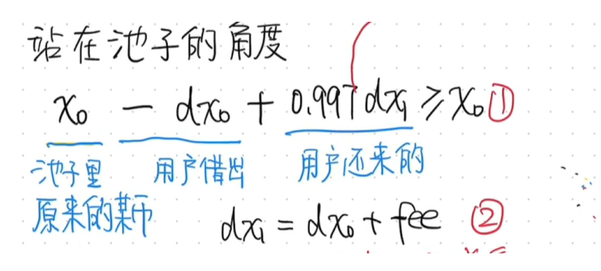

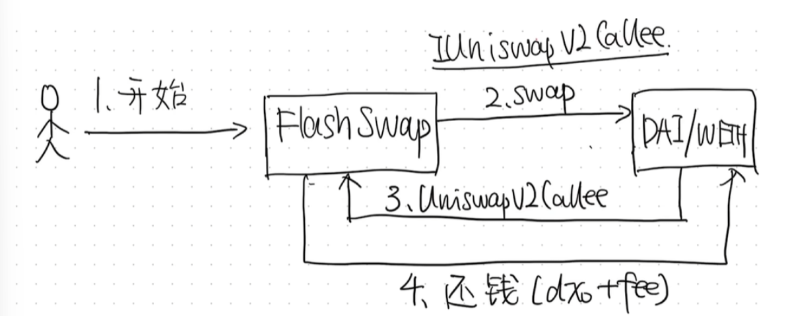


* 用户发起一次FlashSwap调用
* FlashSwap调用DAI/ETH池子
* UniswapV2Callee回调执行
* 归还本金+手续费

**TWAP（时间加权价格）**

$ \Large x\cdot y = k $

x y为两种token的储备量，池子里可以算出瞬时价格

$ \Large P = \frac{y}{x} $

瞬时价格容易被操控，比如攻击者在一个区块里用大量资金买入，把价格拉高，然后立刻读取这个价格作为预言机数据，最后再卖回去，把价格打回原位。这样合约里的其他逻辑（比如借贷清算）就会被误导。

所以仅仅依赖瞬时价格是不安全的

在每个区块，UniswapV2都会累计价格道一个状态变量里，通过记录累计值，用户可以在两个时间之间求出一个平均价格，这样价格就是跨时间段的平均值。

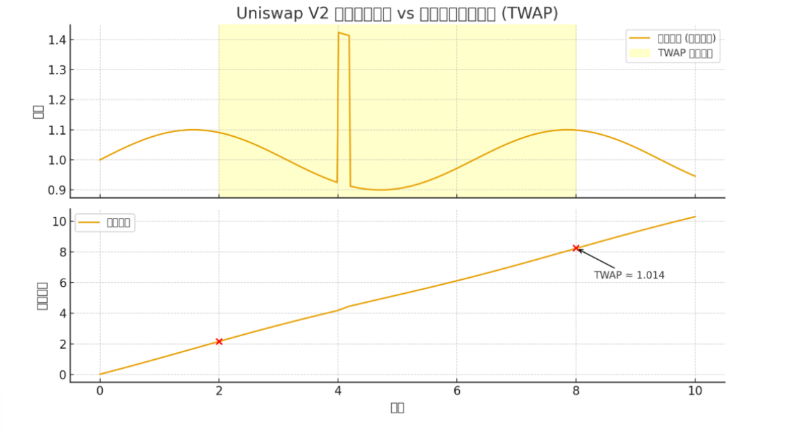

***

`UniswapV2 实现`

**ERC20.sol**

```solidity
// SPDX-License-Identifier: MIT
pragma solidity ^0.8.20;

contract MockERC20 {
    string public name;
    string public symbol;
    uint8 public decimals = 18;
    uint public totalSupply;
    mapping(address => uint) public balanceOf;
    mapping(address => mapping(address => uint)) public allowance;

    event Transfer(address indexed from, address indexed to, uint value);
    event Approval(address indexed owner, address indexed spender, uint value);

    constructor(string memory _name, string memory _symbol, uint _supply) {
        name = _name;
        symbol = _symbol;
        balanceOf[msg.sender] = _supply;
        totalSupply = _supply;
        emit Transfer(address(0), msg.sender, _supply);
    }

    function approve(address spender, uint value) external returns (bool) {
        allowance[msg.sender][spender] = value;
        emit Approval(msg.sender, spender, value);
        return true;
    }

    function transfer(address to, uint value) external returns (bool) {
        require(balanceOf[msg.sender] >= value, "balance too low");
        balanceOf[msg.sender] -= value;
        balanceOf[to] += value;
        emit Transfer(msg.sender, to, value);
        return true;
    }

    function transferFrom(address from, address to, uint value) external returns (bool) {
        require(balanceOf[from] >= value, "balance too low");
        require(allowance[from][msg.sender] >= value, "allowance too low");
        
        allowance[from][msg.sender] -= value;
        balanceOf[from] -= value;
        balanceOf[to] += value;
        
        emit Transfer(from, to, value);
        return true;
    }
}
```

**UniswapV2Factory.sol**

```solidity
// SPDX-License-Identifier: MIT
pragma solidity ^0.8.20;

import "./UniswapV2Pair.sol";

contract UniswapV2Factory {
    mapping(address => mapping(address => address)) public getPair;
    address[] public allPairs;

    event PairCreated(address indexed token0, address indexed token1, address pair);

    function createPair(address tokenA, address tokenB) external returns (address pair) {
        require(tokenA != tokenB, "IDENTICAL_ADDRESSES");
        require(getPair[tokenA][tokenB] == address(0), "PAIR_EXISTS");

        UniswapV2Pair newPair = new UniswapV2Pair(tokenA, tokenB);
        pair = address(newPair);

        getPair[tokenA][tokenB] = pair;
        getPair[tokenB][tokenA] = pair;

        allPairs.push(pair);
        emit PairCreated(tokenA, tokenB, pair);
    }
}
```

**UniswapV2Pair.sol**

```solidity
// SPDX-License-Identifier: MIT
pragma solidity ^0.8.20;

interface IERC20 {
    function transfer(address to, uint value) external returns (bool);
    function transferFrom(address from, address to, uint value) external returns (bool);
    function balanceOf(address) external view returns (uint);
}

error InsufficientOutputAmount();
error InsufficientInputAmount();

contract UniswapV2Pair {
    address public token0;
    address public token1;

    uint112 private reserve0;
    uint112 private reserve1;

    uint public constant FEE_RATE = 3; // 0.3%

    constructor(address _token0, address _token1) {
        token0 = _token0;
        token1 = _token1;
    }

    function getReserves() public view returns (uint, uint) {
        return (reserve0, reserve1);
    }

    function _update(uint balance0, uint balance1) private {
        reserve0 = uint112(balance0);
        reserve1 = uint112(balance1);
    }

    function addLiquidity(uint amount0, uint amount1) external {
        IERC20(token0).transferFrom(msg.sender, address(this), amount0);
        IERC20(token1).transferFrom(msg.sender, address(this), amount1);
        _update(IERC20(token0).balanceOf(address(this)), IERC20(token1).balanceOf(address(this)));
    }

    function swap(address inputToken, uint amountIn, address to) external {
        require(amountIn > 0, "INSUFFICIENT_INPUT_AMOUNT");

        // 判断输入token是否为token0或token1
        bool isToken0 = inputToken == token0;
        (uint reserveInput, uint reserveOutput) = isToken0 ? (reserve0, reserve1) : (reserve1, reserve0);

        // 计算实际转入的input token数量
        uint balanceInput = IERC20(inputToken).balanceOf(address(this));
        uint actualAmountIn = balanceInput - reserveInput;

        // 按0.3%手续费计算output token
        uint amountInWithFee = actualAmountIn * 997 / 1000;
        uint amountOut = (amountInWithFee * reserveOutput) / (reserveInput + amountInWithFee);

        // 转账output token
        address outputToken = isToken0 ? token1 : token0;
        IERC20(outputToken).transfer(to, amountOut);

        // 更新储备
        uint balance0New = IERC20(token0).balanceOf(address(this));
        uint balance1New = IERC20(token1).balanceOf(address(this));
        _update(balance0New, balance1New);
    }

}
```

**UniswapV2Router.sol**

```solidity
// SPDX-License-Identifier: MIT
pragma solidity ^0.8.20;

import "./UniswapV2Pair.sol";

interface IUniswapV2Factory {
    function getPair(address tokenA, address tokenB) external view returns (address);
}

contract UniswapV2Router {
    address public immutable factory;

    constructor(address _factory) {
        factory = _factory;
    }

    function swapExactTokensForTokens(
        uint amountIn,
        uint amountOutMin,
        address[] calldata path,
        address to
    ) external returns (uint[] memory amounts) {
        amounts = getAmountsOut(amountIn, path);
        require(amounts[amounts.length - 1] >= amountOutMin, "INSUFFICIENT_OUTPUT_AMOUNT");

        //将input转入第一个代币对
        address firstPair = getPair(path[0], path[1]);
        IERC20(path[0]).transferFrom(msg.sender, firstPair, amounts[0]);

        // 沿path执行交换
        _swap(amounts, path, to);
    }
    
    function getAmountsOut(uint amountIn, address[] memory path) public view returns (uint[] memory amounts) {
        amounts = new uint[](path.length);
        amounts[0] = amountIn;
        for (uint i = 0; i < path.length-1; i++) {
            address pair = getPair(path[i], path[i+1]);
            (uint reserveIn, uint reserveOut) = getReserves(pair, path[i], path[i+1]);
            amounts[i+1] = getAmountOut(amounts[i], reserveIn, reserveOut);
        }
    }

    function getAmountOut(uint amountIn, uint reserveIn, uint reserveOut) public pure returns (uint amountOut) {
        uint amountInWithFee = amountIn * 997;
        amountOut = (amountInWithFee * reserveOut) / (reserveIn * 1000 + amountInWithFee);
    }

    function swapTokensForExactTokens(
        uint amountOut,
        uint amountInMax,
        address[] calldata path,
        address to
    ) external returns (uint[] memory amounts) {
        amounts = getAmountsIn(amountOut, path);
        require(amounts[0] <= amountInMax, "EXCESSIVE_INPUT_AMOUNT");

        address firstPair = getPair(path[0], path[1]);
        IERC20(path[0]).transferFrom(msg.sender, firstPair, amounts[0]);
        _swap(amounts, path, to);
    }

    function getAmountsIn(uint amountOut, address[] memory path) public view returns (uint[] memory amounts) {
        amounts = new uint[](path.length);
        amounts[amounts.length - 1] = amountOut;
        for (uint i = path.length - 1; i > 0; i--) {
            address pair = getPair(path[i - 1], path[i]);
            (uint reserveIn, uint reserveOut) = getReserves(pair, path[i - 1], path[i]);
            amounts[i - 1] = getAmountIn(amounts[i], reserveIn, reserveOut);
        }
    }


    function getAmountIn(uint amountOut, uint reserveIn, uint reserveOut) public pure returns (uint amountIn) {
        require(amountOut < reserveOut, "INSUFFICIENT_LIQUIDITY");
        uint numerator = reserveIn * amountOut * 1000;
        uint denominator = (reserveOut - amountOut) * 997;
        amountIn = (numerator / denominator) + 1;
    }


    function _swap(uint[] memory amounts, address[] memory path, address to) internal {
        for (uint i = 0; i < path.length - 1; i++) {
            address input = path[i];
            address output = path[i + 1];
            address pairAddr = getPair(input, output);

            address toAddress = i < path.length - 2 ? getPair(output, path[i+2]) : to;

            UniswapV2Pair(pairAddr).swap(input, amounts[i], toAddress);
        }
    }

    function getPair(address tokenA, address tokenB) public view returns (address) {
        address pair = IUniswapV2Factory(factory).getPair(tokenA, tokenB);
        require(pair != address(0), "PAIR_NOT_EXISTS");
        return pair;
    }

    function getReserves(address pair, address tokenA, address tokenB) public view returns (uint reserveA, uint reserveB) {
        (uint reserve0, uint reserve1) = UniswapV2Pair(pair).getReserves();
        (reserveA, reserveB) = tokenA < tokenB ? (reserve0, reserve1) : (reserve1, reserve0);
    }

    function sortTokens(address tokenA, address tokenB) public pure returns (address token0, address token1) {
        (token0, token1) = tokenA < tokenB ? (tokenA, tokenB) : (tokenB, tokenA);
    }
}
```

**TestSwap.t.sol**

```solidity
// SPDX-License-Identifier: MIT
pragma solidity ^0.8.20;

import "forge-std/Test.sol";
import "../src/ERC20.sol";
import "../src/UniswapV2Factory.sol";
import "../src/UniswapV2Router.sol";
import "../src/UniswapV2Pair.sol";

contract SwapV2Test is Test {
    MockERC20 tokenA;
    MockERC20 tokenB;
    UniswapV2Factory factory;
    UniswapV2Router router;
    UniswapV2Pair pair;
    address user = address(0xABCD);

    function setUp() public {
        tokenA = new MockERC20("TokenA", "A", 1_000_000 ether);
        tokenB = new MockERC20("TokenB", "B", 1_000_000 ether);

        factory = new UniswapV2Factory();
        router = new UniswapV2Router(address(factory));

        factory.createPair(address(tokenA), address(tokenB));
        address pairAddr = factory.getPair(address(tokenA), address(tokenB));
        pair = UniswapV2Pair(pairAddr);

        tokenA.approve(address(pair), type(uint).max);
        tokenB.approve(address(pair), type(uint).max);
        pair.addLiquidity(1000 ether, 1000 ether);

        tokenA.transfer(user, 100 ether);
    }
    function testSwapExactTokensForTokens() public {
    // 记录初始余额
    uint initialTokenABalance = tokenA.balanceOf(user);
    uint initialTokenBBalance = tokenB.balanceOf(user);
    
    emit log("=== Before Swap ===");
    emit log_named_uint("User initial TokenA", initialTokenABalance);
    emit log_named_uint("User initial TokenB", initialTokenBBalance);


    vm.startPrank(user);
    tokenA.approve(address(router), 100 ether);

    address[] memory path = new address[](2);
    path[0] = address(tokenA);
    path[1] = address(tokenB);
    //使用tokenA兑换tokenB

    // 执行交换
    router.swapExactTokensForTokens(
        1 ether,  // 使用 1 ether 
        0,
        path,
        user
    );

    vm.stopPrank();

    // 记录最终余额
    uint finalTokenABalance = tokenA.balanceOf(user);
    uint finalTokenBBalance = tokenB.balanceOf(user);

    emit log("=== After Swap ===");
    emit log_named_uint("User final TokenA", finalTokenABalance);
    emit log_named_uint("User final TokenB", finalTokenBBalance);
    
    uint tokenASpent = initialTokenABalance - finalTokenABalance;
    emit log_named_uint("TokenA spent", tokenASpent);
    emit log_named_uint("TokenB received", finalTokenBBalance);

    // 验证 TokenA 减少
    assertTrue(finalTokenABalance < initialTokenABalance, "TokenA should decrease");
    }
}
```


> 更新: 2025-10-17 19:32:05  
> 原文: <https://www.yuque.com/xiaoyuhushenfu/yzin4n/qnbbzzmz48l2z7ye>