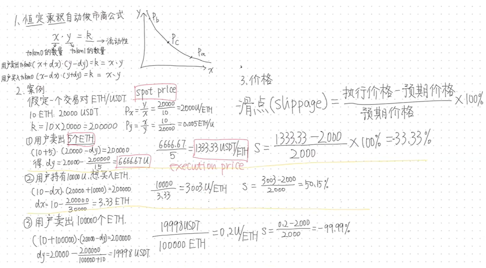
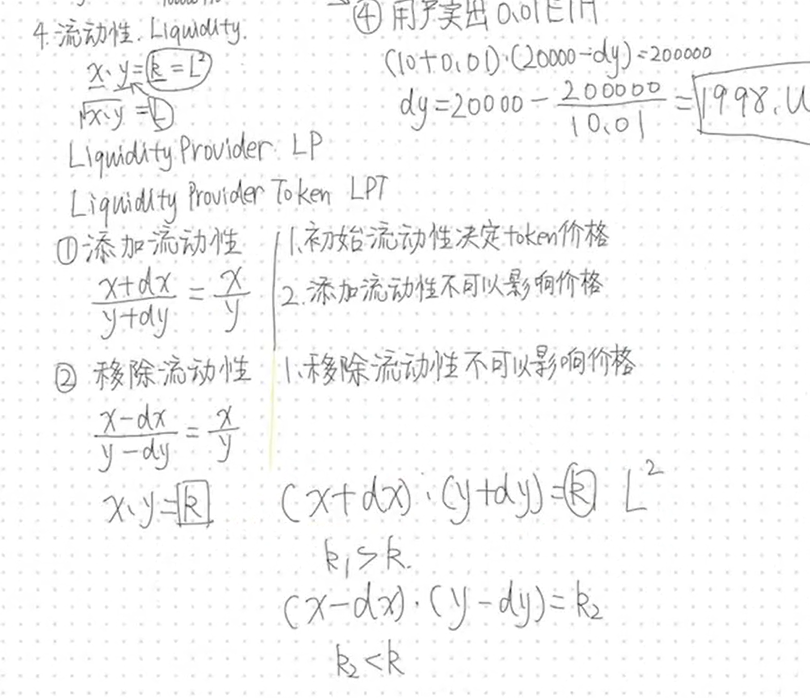

# AMM 恒定乘积自动做市商公式

+ 滑点：你的交易占池子比例越大，滑点越大

# 流动性 liquid
+ LP
+ LPT

## 添加流动性
1. **初始流动性**决定token价格
2. 添加流动性不可以影响价格，一定要按照比例添加

## 移除流动性
1. 移除流动性不可以影响价格
2. 撤底池

## k值
并不是说k值永远恒定，只是在swap的时候恒定

> 更新: 2025-09-27 19:57:50  
> 原文: <https://www.yuque.com/xiaoyuhushenfu/yzin4n/bof2nq1i83tgxlhv>