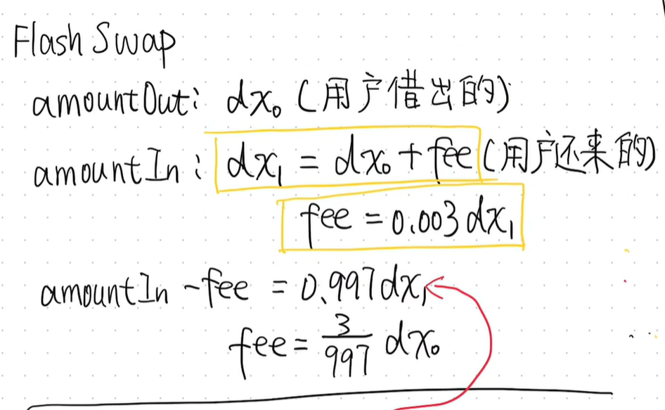
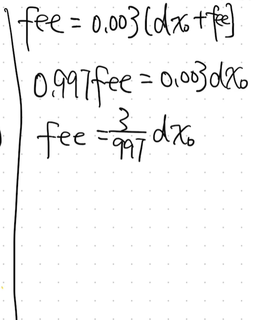
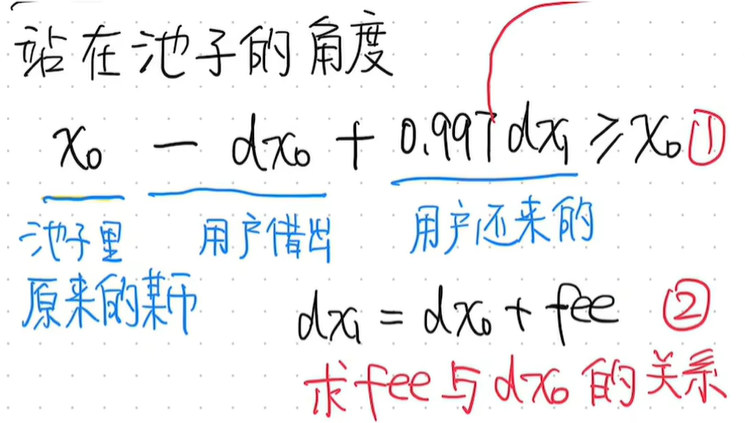
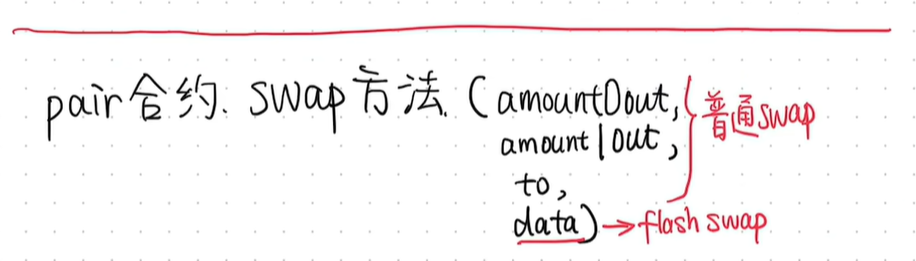
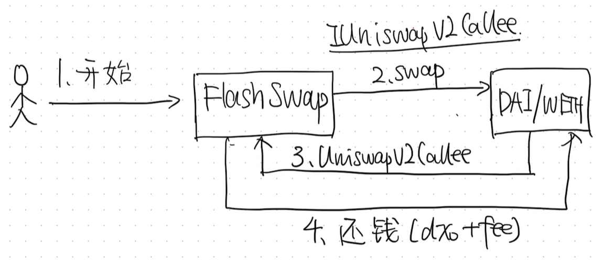
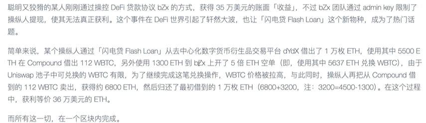
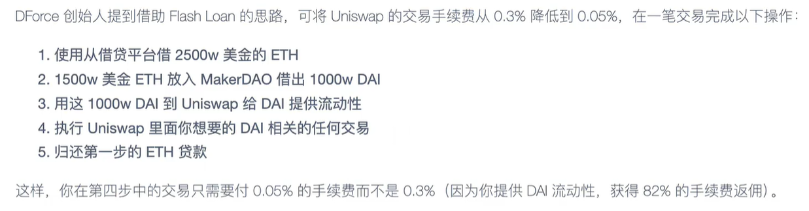

# Flash Swaps 闪电贷







 <= 闪电贷基本流程

```solidity
function swap(uint amount0Out, uint amount1Out, address to, bytes calldata data) external lock {
        require(amount0Out > 0 || amount1Out > 0, 'UniswapV2: INSUFFICIENT_OUTPUT_AMOUNT');
        (uint112 _reserve0, uint112 _reserve1,) = getReserves(); // gas savings
        require(amount0Out < _reserve0 && amount1Out < _reserve1, 'UniswapV2: INSUFFICIENT_LIQUIDITY');

        uint balance0;
        uint balance1;
        { // scope for _token{0,1}, avoids stack too deep errors
        address _token0 = token0;
        address _token1 = token1;
        require(to != _token0 && to != _token1, 'UniswapV2: INVALID_TO');
        if (amount0Out > 0) _safeTransfer(_token0, to, amount0Out); // optimistically transfer tokens
        if (amount1Out > 0) _safeTransfer(_token1, to, amount1Out); // optimistically transfer tokens
        if (data.length > 0) IUniswapV2Callee(to).uniswapV2Call(msg.sender, amount0Out, amount1Out, data);//uniswapV2Call是我们要写的逻辑
        balance0 = IERC20(_token0).balanceOf(address(this));
        balance1 = IERC20(_token1).balanceOf(address(this));
        }
        uint amount0In = balance0 > _reserve0 - amount0Out ? balance0 - (_reserve0 - amount0Out) : 0;
        uint amount1In = balance1 > _reserve1 - amount1Out ? balance1 - (_reserve1 - amount1Out) : 0;
        require(amount0In > 0 || amount1In > 0, 'UniswapV2: INSUFFICIENT_INPUT_AMOUNT');
        { // scope for reserve{0,1}Adjusted, avoids stack too deep errors
        uint balance0Adjusted = balance0.mul(1000).sub(amount0In.mul(3));
        uint balance1Adjusted = balance1.mul(1000).sub(amount1In.mul(3));
        require(balance0Adjusted.mul(balance1Adjusted) >= uint(_reserve0).mul(_reserve1).mul(1000**2), 'UniswapV2: K');
        }

        _update(balance0, balance1, _reserve0, _reserve1);
        emit Swap(msg.sender, amount0In, amount1In, amount0Out, amount1Out, to);
    }
```

# 官方example
```solidity
function uniswapV2Call(address sender, uint amount0, uint amount1, bytes calldata data) external override {
        address[] memory path = new address[](2);
        uint amountToken;
        uint amountETH;
        { // scope for token{0,1}, avoids stack too deep errors
        address token0 = IUniswapV2Pair(msg.sender).token0();
        address token1 = IUniswapV2Pair(msg.sender).token1();
        assert(msg.sender == UniswapV2Library.pairFor(factory, token0, token1)); // ensure that msg.sender is actually a V2 pair
        assert(amount0 == 0 || amount1 == 0); // this strategy is unidirectional
        path[0] = amount0 == 0 ? token0 : token1;
        path[1] = amount0 == 0 ? token1 : token0;
        amountToken = token0 == address(WETH) ? amount1 : amount0;
        amountETH = token0 == address(WETH) ? amount0 : amount1;
        }

        assert(path[0] == address(WETH) || path[1] == address(WETH)); // this strategy only works with a V2 WETH pair
        IERC20 token = IERC20(path[0] == address(WETH) ? path[1] : path[0]);
        IUniswapV1Exchange exchangeV1 = IUniswapV1Exchange(factoryV1.getExchange(address(token))); // get V1 exchange

        if (amountToken > 0) {
            (uint minETH) = abi.decode(data, (uint)); // slippage parameter for V1, passed in by caller
            token.approve(address(exchangeV1), amountToken);
            uint amountReceived = exchangeV1.tokenToEthSwapInput(amountToken, minETH, uint(-1));
            uint amountRequired = UniswapV2Library.getAmountsIn(factory, amountToken, path)[0];
            assert(amountReceived > amountRequired); // fail if we didn't get enough ETH back to repay our flash loan
            WETH.deposit{value: amountRequired}();
            assert(WETH.transfer(msg.sender, amountRequired)); // return WETH to V2 pair
            (bool success,) = sender.call{value: amountReceived - amountRequired}(new bytes(0)); // keep the rest! (ETH)
            assert(success);
        } else {
            (uint minTokens) = abi.decode(data, (uint)); // slippage parameter for V1, passed in by caller
            WETH.withdraw(amountETH);
            uint amountReceived = exchangeV1.ethToTokenSwapInput{value: amountETH}(minTokens, uint(-1));
            uint amountRequired = UniswapV2Library.getAmountsIn(factory, amountETH, path)[0];
            assert(amountReceived > amountRequired); // fail if we didn't get enough tokens back to repay our flash loan
            assert(token.transfer(msg.sender, amountRequired)); // return tokens to V2 pair
            assert(token.transfer(sender, amountReceived - amountRequired)); // keep the rest! (tokens)
        }
    }
}
```

# 一些例子
1. 拿借来的钱去操纵池子价格，再趁机以此价格做swap套利



2.  拿借来的钱做lp，赚做lp的手续费来抵扣借贷手续费




> 更新: 2025-10-09 19:05:37  
> 原文: <https://www.yuque.com/xiaoyuhushenfu/yzin4n/utb8ch6xmgv6qk2e>