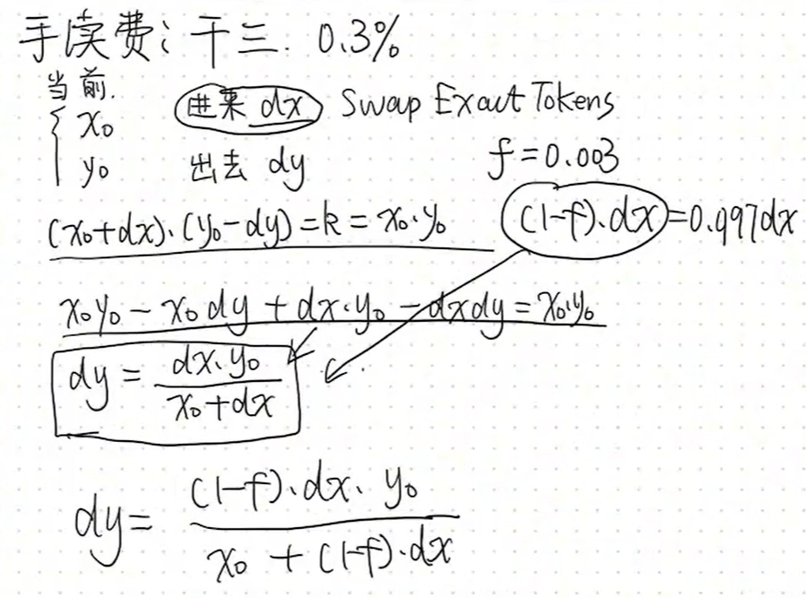
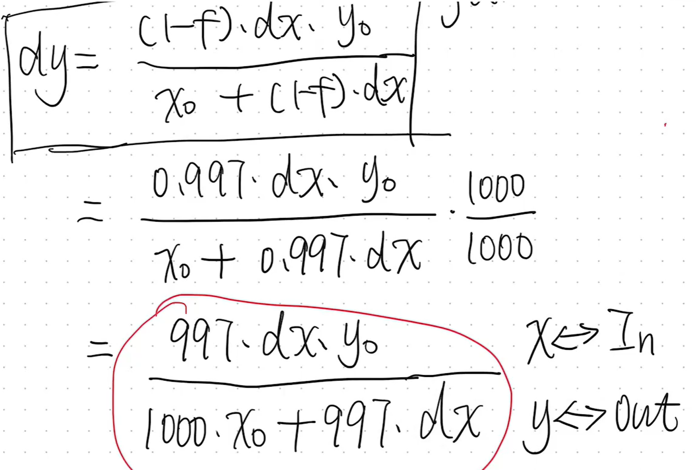
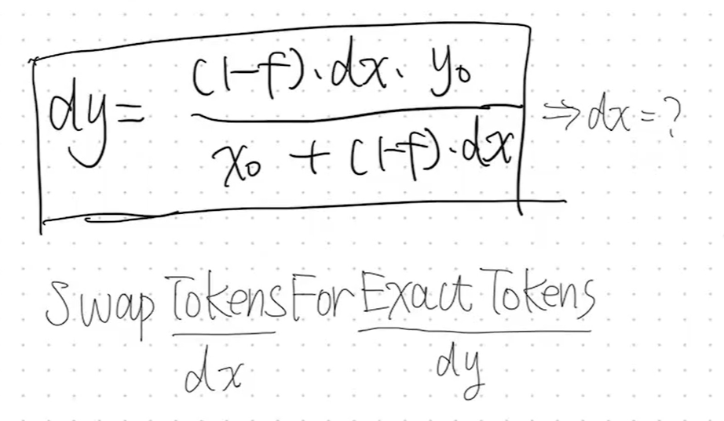
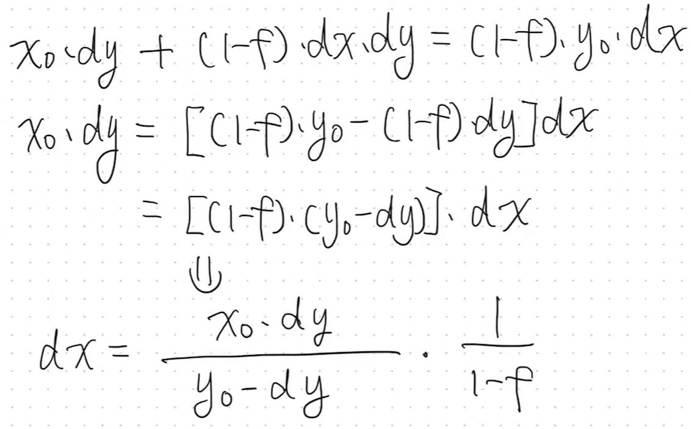
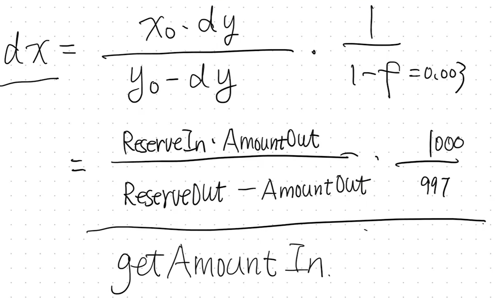

# swap

# 代码

## getAmountOut

* reserveIn：池子里本来有的x代币
* reserveOut：池子里本来有的y代币
* mul：乘法
* add：加法

```solidity
function getAmountOut(uint amountIn, uint reserveIn, uint reserveOut) internal pure returns (uint amountOut) {
        require(amountIn > 0, 'UniswapV2Library: INSUFFICIENT_INPUT_AMOUNT');
        require(reserveIn > 0 && reserveOut > 0, 'UniswapV2Library: INSUFFICIENT_LIQUIDITY');
        uint amountInWithFee = amountIn.mul(997);
        uint numerator = amountInWithFee.mul(reserveOut);//分子
        uint denominator = reserveIn.mul(1000).add(amountInWithFee);//分母
        amountOut = numerator / denominator;
    }
```

这里1000和997之类的，是因为每笔交易要收\*\*<font style="background-color:#FBDFEF;">千三的手续费：</font>\*\*



然后函数的逻辑是这样算：



## getAmountIn

```solidity
function getAmountIn(uint amountOut, uint reserveIn, uint reserveOut) internal pure returns (uint amountIn) {
        require(amountOut > 0, 'UniswapV2Library: INSUFFICIENT_OUTPUT_AMOUNT');
        require(reserveIn > 0 && reserveOut > 0, 'UniswapV2Library: INSUFFICIENT_LIQUIDITY');
        uint numerator = reserveIn.mul(amountOut).mul(1000);
        uint denominator = reserveOut.sub(amountOut).mul(997);
        amountIn = (numerator / denominator).add(1);//+1，向上取整
    }
```



推导一下得到dx



然后函数的逻辑就是这样



## swapTokensForExactTokens

注意俩函数exact的位置

用户想要换到准确数目的token2，需要付出多少token1就在过程中计算得来

```solidity
function swapTokensForExactTokens(
        uint amountOut,
        uint amountInMax,
        address[] calldata path,
        address to,
        uint deadline
    ) external virtual override ensure(deadline) returns (uint[] memory amounts) {
        amounts = UniswapV2Library.getAmountsIn(factory, amountOut, path);
        require(amounts[0] <= amountInMax, 'UniswapV2Router: EXCESSIVE_INPUT_AMOUNT');
        TransferHelper.safeTransferFrom(
            path[0], msg.sender, UniswapV2Library.pairFor(factory, path[0], path[1]), amounts[0]
        );
        _swap(amounts, path, to);
    }
```

## swapExactTokensForTokens

用户想要换到准确数目的token2，需要付出多少token1就在过程中计算得来

```solidity
function swapExactTokensForTokens(
        uint amountIn,
        uint amountOutMin,
        address[] calldata path,
        address to,
        uint deadline
    ) external virtual override ensure(deadline) returns (uint[] memory amounts) {
        amounts = UniswapV2Library.getAmountsOut(factory, amountIn, path);
        require(amounts[amounts.length - 1] >= amountOutMin, 'UniswapV2Router: INSUFFICIENT_OUTPUT_AMOUNT');
        TransferHelper.safeTransferFrom(
            path[0], msg.sender, UniswapV2Library.pairFor(factory, path[0], path[1]), amounts[0]
        );
        _swap(amounts, path, to);
    }
```

# swap

1. 用户发起`Rounter02.sol`的交互
2. `Rounter02.sol`TransferFrom
3. swap逻辑计算
4. transfer回给用户

##


> 更新: 2025-09-25 21:18:27  
> 原文: <https://www.yuque.com/xiaoyuhushenfu/yzin4n/sq8rd7ca2fh0aspg>