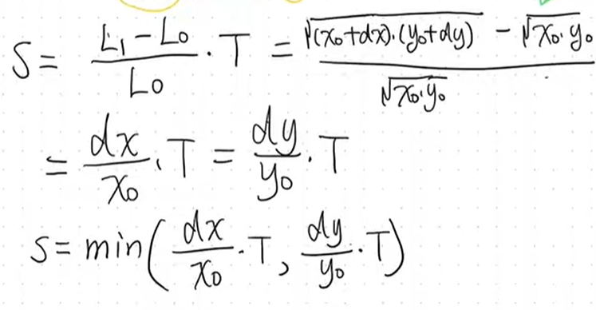
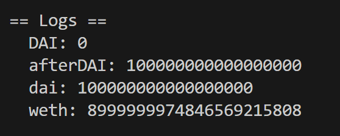

# 添加流动性

## Liquidity Provider、LP Token

* LP：向某个交易对的流动性池存入等值的两种 ERC-20 代币的参与者。流动性提供者承担价格风险，并通过手续费获得补偿
* LPT：记录LP的贡献，所有LPT就是totalsupply
* 精度损失：min（ ，），取较小值



# Add Liquidity

LP添加流动性时必须按照池子里原有比例添加，不可以破坏池子的价格

## 实现

以WETH和DAI两种token为例，实现两种方式的添加流动性

```solidity
anvil --fork-url https://eth-mainnet.g.alchemy.com/v2/ItlSfQQLVNsDqjGck4BJbLQGy0n7GlXv
```

### 脚本

#### ETH => WETH、DAI

```solidity
// SPDX-License-Identifier: SEE LICENSE IN LICENSE
pragma solidity ^0.8.0;

import {IERC20} from "../interfaces/IERC20.sol";
import {IUniswapV2Router02} from "../interfaces2/IUniswapV2Router02.sol";
import {IUniswapV2Pair} from "../interfaces/IUniswapV2Pair.sol";
import {Script} from "../lib/forge-std/src/Script.sol";
import {console} from "../lib/forge-std/src/console.sol";

interface IWETH is IERC20 {
    function deposit() external payable;

    function transfer(address to, uint value) external returns (bool);

    function withdraw(uint) external;
}

//目前手里只有ether，需要先使用rounter01的swap一系列函数，用ether购买两种token
contract gettoken is Script {
    address constant user = 0xa0Ee7A142d267C1f36714E4a8F75612F20a79720; //接收token的地址
    address constant WETH = 0xC02aaA39b223FE8D0A0e5C4F27eAD9083C756Cc2;
    address constant DAI = 0x6B175474E89094C44Da98b954EedeAC495271d0F;
    address constant pair = 0xA478c2975Ab1Ea89e8196811F51A7B7Ade33eB11;
    address constant rounter = 0x7a250d5630B4cF539739dF2C5dAcb4c659F2488D;
    IWETH public iWETH;
    IERC20 public iDAI;
    IUniswapV2Pair public ipair;
    IUniswapV2Router02 public irounter;

    constructor() {
        iWETH = IWETH(WETH);
        iDAI = IERC20(DAI);
        ipair = IUniswapV2Pair(pair);
        irounter = IUniswapV2Router02(rounter);
    }

    function run() external {
        vm.startBroadcast();
        console.log("DAI:", iDAI.balanceOf(user));
        iDAI.approve(rounter, type(uint256).max);
        iWETH.deposit{value: 9000 ether}();
        iWETH.approve(rounter, type(uint256).max);
        IWETH(WETH).transfer(user, 8000 ether);
        address[] memory path = new address[](2);
        path[0] = WETH;
        path[1] = DAI; //想换的token，写到第二个
        irounter.swapTokensForExactTokens(
            100000000000000000, //想换的DAI数量
            8000 ether,
            path,
            user,
            block.timestamp + 300
        );
        console.log("afterDAI:", iDAI.balanceOf(user));

        uint256 dai = iDAI.balanceOf(user);
        uint256 weth = iWETH.balanceOf(user);
        console.log("dai:", dai);
        console.log("weth:", weth);

        vm.stopBroadcast();
    }
}
```

，成功换到代币

注意gas问题

#### AddLiquidity（经过rounter02）

1. 用户与`Rounter02.sol`交互
2. 调用factory合约的`getpair`,查询交易对是否被创建
3. 如果pair为0,调用factory的`createpair`(create2方式)
4. `transferfrom`
5. <code><font style="background-color:#FBDFEF;">mint()</font></code>,增发新的LPT
6. `transfer`LPT给用户

```solidity
//通过rounter02,添加流动性
contract addliquidity1 is Script {
    address constant user = 0xa0Ee7A142d267C1f36714E4a8F75612F20a79720;
    address constant WETH = 0xC02aaA39b223FE8D0A0e5C4F27eAD9083C756Cc2;
    address constant DAI = 0x6B175474E89094C44Da98b954EedeAC495271d0F;
    address constant pair = 0xA478c2975Ab1Ea89e8196811F51A7B7Ade33eB11;
    address constant rounter = 0x7a250d5630B4cF539739dF2C5dAcb4c659F2488D;
    IWETH public iWETH;
    IERC20 public iDAI;
    IUniswapV2Pair public ipair;
    IUniswapV2Router02 public irounter;

    constructor() payable {
        iWETH = IWETH(WETH);
        iDAI = IERC20(DAI);
        ipair = IUniswapV2Pair(ipair);
        irounter = IUniswapV2Router02(rounter);
    }

    function run() external {
        uint256 daiBalance = 38618699573791961897120;
        uint256 wethBalance = 20000000000000000000;

        (uint256 reserveDAI, uint256 reserveWETH, ) = ipair.getReserves();

        uint256 amountWETHOptimal = (daiBalance * reserveWETH) / reserveDAI;

        uint256 amountDAI;
        uint256 amountWETH;

        if (amountWETHOptimal <= wethBalance) {
            amountDAI = (daiBalance * 99) / 100;
            amountWETH = (amountWETHOptimal * 99) / 100;
        } else {
            uint256 amountDAIOptimal = (wethBalance * reserveDAI) / reserveWETH;
            amountDAI = (amountDAIOptimal * 99) / 100;
            amountWETH = (wethBalance * 99) / 100;
        }

        vm.startBroadcast();

        IERC20(DAI).approve(address(irounter), type(uint256).max);
        IERC20(WETH).approve(address(irounter), type(uint256).max);

        irounter.addLiquidity(
            DAI,
            WETH,
            amountDAI,
            amountWETH,
            0,
            0,
            user,
            block.timestamp + 300
        );

        vm.stopBroadcast();
    }
}

```

#### AddLiquidity（不经过rounter02合约）

##### LPT 计算公式


```solidity
LPT = min(amoutn0 * totalsupply/ reserve0, amount1 * totalsupply/ reserve1);
```

* totalsupply：LPT
* amoutn0：user持有的DAI数量
* reserve0：池子里原有的DAI数量
* amoutn1：user持有的WETH数量
* reserve1：池子里原有的WETH数量

```solidity
//不通过rounter02，增加流动性
contract addliquidity2 is Script {
    address constant user = 0xa0Ee7A142d267C1f36714E4a8F75612F20a79720;
    address constant WETH = 0xC02aaA39b223FE8D0A0e5C4F27eAD9083C756Cc2;
    address constant DAI = 0x6B175474E89094C44Da98b954EedeAC495271d0F;
    address constant pair = 0xA478c2975Ab1Ea89e8196811F51A7B7Ade33eB11;
    address constant rounter = 0x7a250d5630B4cF539739dF2C5dAcb4c659F2488D;
    IWETH public iWETH;
    IERC20 public iDAI;
    IUniswapV2Pair public ipair;
    IUniswapV2Router02 public irounter;

    constructor() payable {
        iWETH = IWETH(WETH);
        iDAI = IERC20(DAI);
        ipair = IUniswapV2Pair(ipair);
        irounter = IUniswapV2Router02(rounter);
    }

    function run() external {
        // 确定token0 提供token1的数量

        vm.startBroadcast();

        uint256 amount0 = iDAI.balanceOf(user) / 2;
        iDAI.approve(pair, type(uint256).max);
        iWETH.approve(pair, type(uint256).max);
        (uint256 reserves0, uint256 reserves1, ) = ipair.getReserves();
        uint256 amount1 = (amount0 * reserves1) / reserves0;
        iDAI.transfer(pair, amount0);
        iWETH.transfer(pair, amount1);
        ipair.mint(user);
        uint256 lpt = ipair.balanceOf(user);

        console.log("lpt:", lpt);
        vm.stopBroadcast();
    }
}

```

#### Remove

### 代码

#### addLiquidity

```solidity
function addLiquidity(
        address tokenA,
        address tokenB,
        uint amountADesired,
        uint amountBDesired,
        uint amountAMin,
        uint amountBMin,
        address to,
        uint deadline
    ) external virtual override ensure(deadline) returns (uint amountA, uint amountB, uint liquidity) {
        (amountA, amountB) = _addLiquidity(tokenA, tokenB, amountADesired, amountBDesired, amountAMin, amountBMin);
        address pair = UniswapV2Library.pairFor(factory, tokenA, tokenB);
        TransferHelper.safeTransferFrom(tokenA, msg.sender, pair, amountA);
        TransferHelper.safeTransferFrom(tokenB, msg.sender, pair, amountB);
        liquidity = IUniswapV2Pair(pair).mint(to);
    }

function _addLiquidity(
        address tokenA,
        address tokenB,
        uint amountADesired,
        uint amountBDesired,
        uint amountAMin,
        uint amountBMin
    ) internal virtual returns (uint amountA, uint amountB) {
        // create the pair if it doesn't exist yet
        if (IUniswapV2Factory(factory).getPair(tokenA, tokenB) == address(0)) {
            IUniswapV2Factory(factory).createPair(tokenA, tokenB);
        }
        (uint reserveA, uint reserveB) = UniswapV2Library.getReserves(factory, tokenA, tokenB);
        if (reserveA == 0 && reserveB == 0) {
            (amountA, amountB) = (amountADesired, amountBDesired);
        } else {
            uint amountBOptimal = UniswapV2Library.quote(amountADesired, reserveA, reserveB);
            if (amountBOptimal <= amountBDesired) {
                require(amountBOptimal >= amountBMin, 'UniswapV2Router: INSUFFICIENT_B_AMOUNT');
                (amountA, amountB) = (amountADesired, amountBOptimal);
            } else {
                uint amountAOptimal = UniswapV2Library.quote(amountBDesired, reserveB, reserveA);
                assert(amountAOptimal <= amountADesired);
                require(amountAOptimal >= amountAMin, 'UniswapV2Router: INSUFFICIENT_A_AMOUNT');
                (amountA, amountB) = (amountAOptimal, amountBDesired);
            }
        }
    }
```

#### createpair

```solidity
function createPair(address tokenA, address tokenB) external returns (address pair) {
        require(tokenA != tokenB, 'UniswapV2: IDENTICAL_ADDRESSES');
        (address token0, address token1) = tokenA < tokenB ? (tokenA, tokenB) : (tokenB, tokenA);
        require(token0 != address(0), 'UniswapV2: ZERO_ADDRESS'); //排序防止乱
        require(getPair[token0][token1] == address(0), 'UniswapV2: PAIR_EXISTS'); // single check is sufficient
        bytes memory bytecode = type(UniswapV2Pair).creationCode;
        bytes32 salt = keccak256(abi.encodePacked(token0, token1));
        assembly {
            pair := create2(0, add(bytecode, 32), mload(bytecode), salt)//create2提前预测pair地址
        }
        IUniswapV2Pair(pair).initialize(token0, token1);
        getPair[token0][token1] = pair;
        getPair[token1][token0] = pair; // populate mapping in the reverse direction
        allPairs.push(pair);
        emit PairCreated(token0, token1, pair, allPairs.length);
    }
```

#### mint

```solidity
function mint(address to) external lock returns (uint liquidity) {
        (uint112 _reserve0, uint112 _reserve1,) = getReserves(); // gas savings
        uint balance0 = IERC20(token0).balanceOf(address(this));
        uint balance1 = IERC20(token1).balanceOf(address(this));
        uint amount0 = balance0.sub(_reserve0);
        uint amount1 = balance1.sub(_reserve1);

        bool feeOn = _mintFee(_reserve0, _reserve1);
        uint _totalSupply = totalSupply; // gas savings, must be defined here since totalSupply can update in _mintFee
        if (_totalSupply == 0) {
            liquidity = Math.sqrt(amount0.mul(amount1)).sub(MINIMUM_LIQUIDITY);
           _mint(address(0), MINIMUM_LIQUIDITY); // permanently lock the first MINIMUM_LIQUIDITY tokens
        } else {
            liquidity = Math.min(amount0.mul(_totalSupply) / _reserve0, amount1.mul(_totalSupply) / _reserve1);
        }
        require(liquidity > 0, 'UniswapV2: INSUFFICIENT_LIQUIDITY_MINTED');
        _mint(to, liquidity);

        _update(balance0, balance1, _reserve0, _reserve1);
        if (feeOn) kLast = uint(reserve0).mul(reserve1); // reserve0 and reserve1 are up-to-date
        emit Mint(msg.sender, amount0, amount1);
    }
```

#### burn

```solidity
function burn(address to) external lock returns (uint amount0, uint amount1) {
        (uint112 _reserve0, uint112 _reserve1,) = getReserves(); // gas savings
        address _token0 = token0;                                // gas savings
        address _token1 = token1;                                // gas savings
        uint balance0 = IERC20(_token0).balanceOf(address(this));
        uint balance1 = IERC20(_token1).balanceOf(address(this));
        uint liquidity = balanceOf[address(this)];

        bool feeOn = _mintFee(_reserve0, _reserve1);
        uint _totalSupply = totalSupply; // gas savings, must be defined here since totalSupply can update in _mintFee
        amount0 = liquidity.mul(balance0) / _totalSupply; // using balances ensures pro-rata distribution
        amount1 = liquidity.mul(balance1) / _totalSupply; // using balances ensures pro-rata distribution
        require(amount0 > 0 && amount1 > 0, 'UniswapV2: INSUFFICIENT_LIQUIDITY_BURNED');
        _burn(address(this), liquidity);
        _safeTransfer(_token0, to, amount0);
        _safeTransfer(_token1, to, amount1);
        balance0 = IERC20(_token0).balanceOf(address(this));
        balance1 = IERC20(_token1).balanceOf(address(this));

        _update(balance0, balance1, _reserve0, _reserve1);
        if (feeOn) kLast = uint(reserve0).mul(reserve1); // reserve0 and reserve1 are up-to-date
        emit Burn(msg.sender, amount0, amount1, to);
    }

```

#### swapTokensForExactTokens

```solidity
function swapTokensForExactTokens(
        uint amountOut,
        uint amountInMax,
        address[] calldata path,
        address to,
        uint deadline
    ) external override ensure(deadline) returns (uint[] memory amounts) {
        amounts = UniswapV2Library.getAmountsIn(factory, amountOut, path);
        require(amounts[0] <= amountInMax, 'UniswapV2Router: EXCESSIVE_INPUT_AMOUNT');
        TransferHelper.safeTransferFrom(path[0], msg.sender, UniswapV2Library.pairFor(factory, path[0], path[1]), amounts[0]);
        _swap(amounts, path, to);
    }
```


> 更新: 2025-09-27 21:34:46  
> 原文: <https://www.yuque.com/xiaoyuhushenfu/yzin4n/ukmoc1hnfk65xsdp>