# Tick 和价格计算

## tick
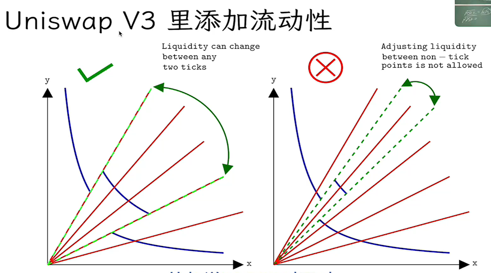

## V3里的价格表示
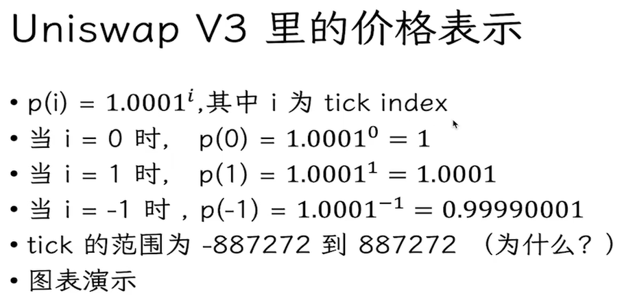

## 向下取整
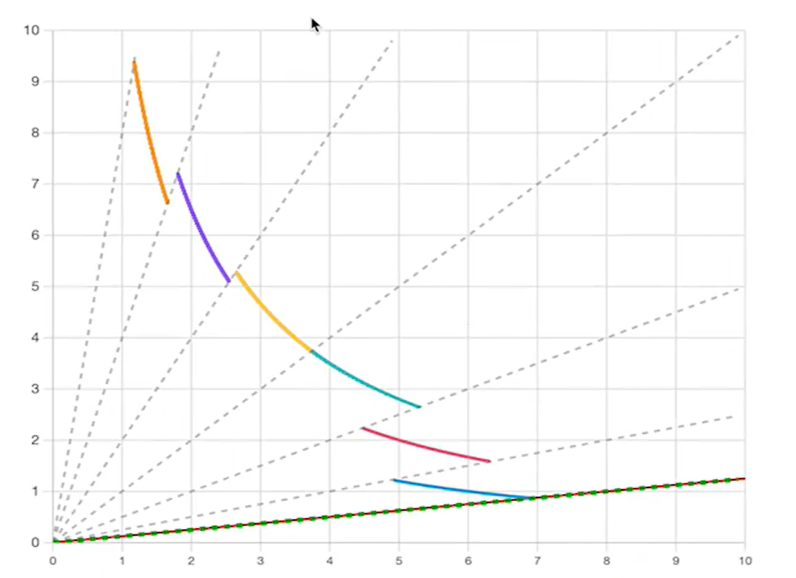

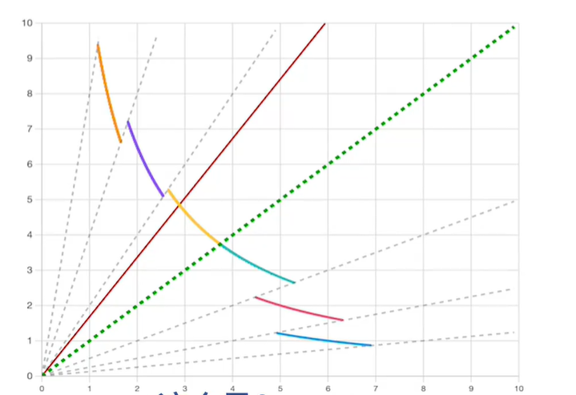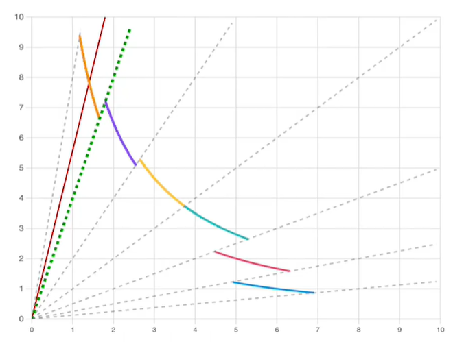

都读取直线下边的tick，所谓向下取整

## 一些计算
tick是存在slot0

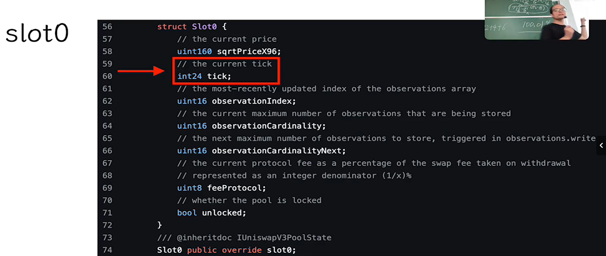

## ETH和DAI
精度一样都是18

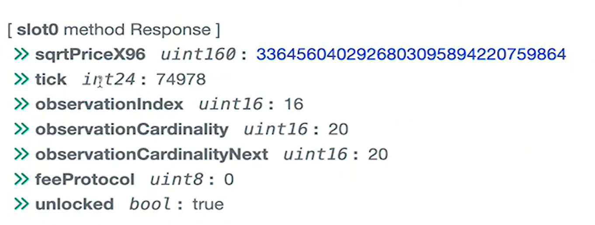

利用python计算得出价格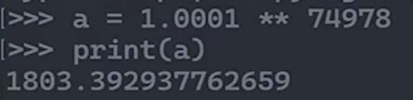

## ETH和USDC
精度不同，一个18一个6

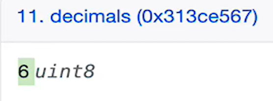

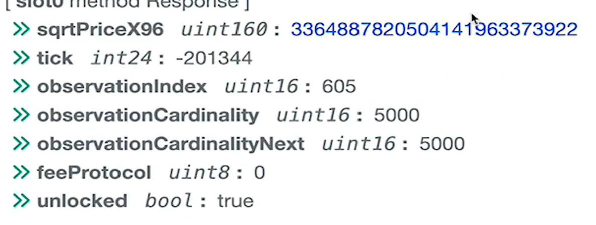

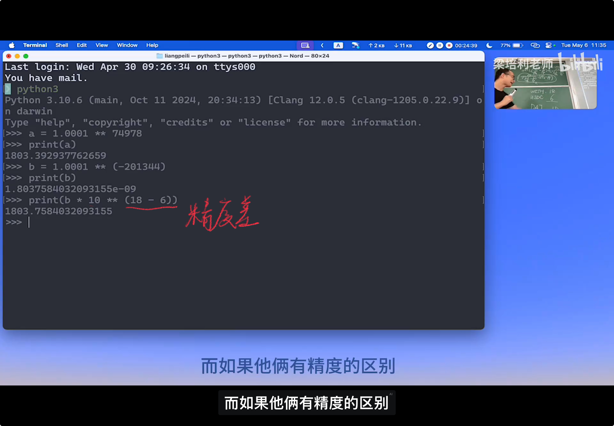

# Square root price
总而言之省gas

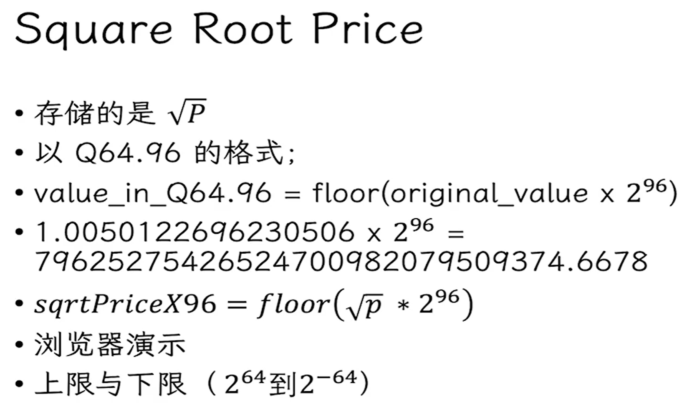

## ETH DAI
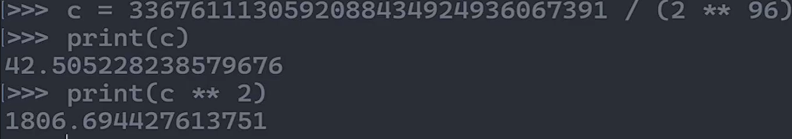

## ETH USDC
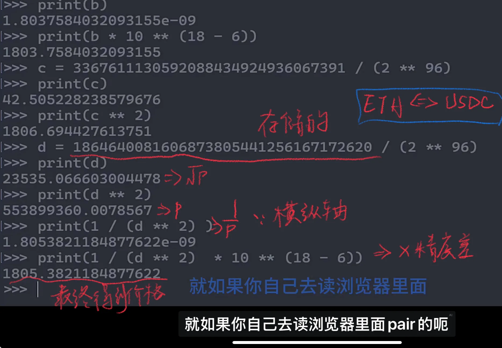

# Tick范围问题
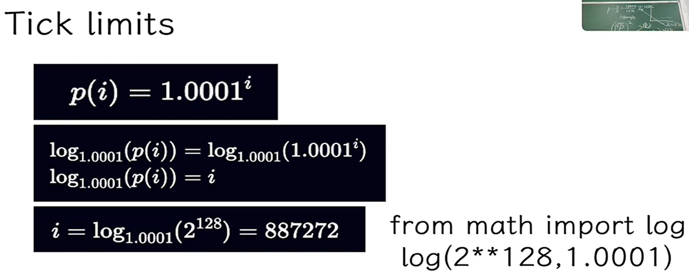

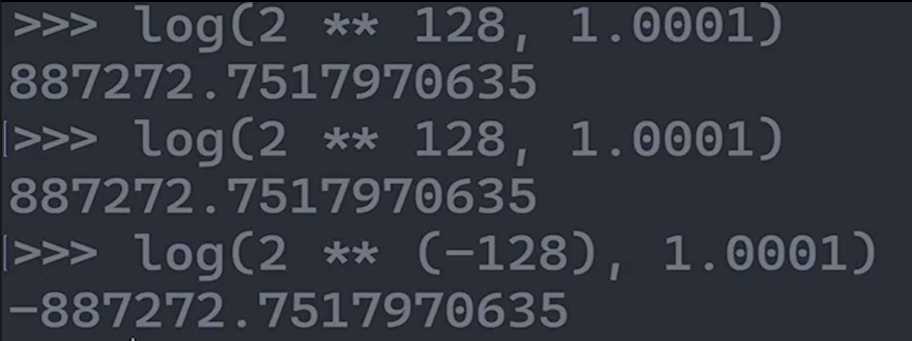

这个数就直接写死在合约里了 要知道是怎么来的

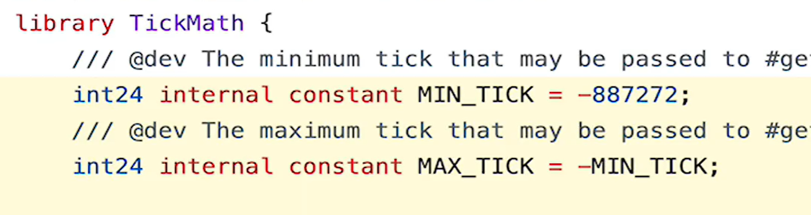

> 更新: 2025-10-13 15:45:16  
> 原文: <https://www.yuque.com/xiaoyuhushenfu/yzin4n/rf548a1r9h8a1h5r>