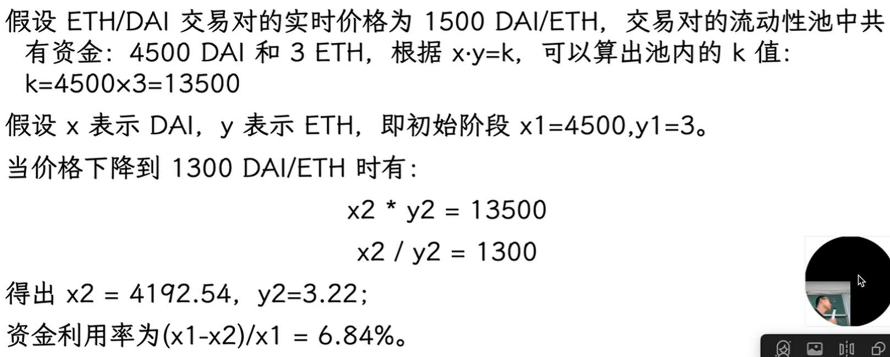
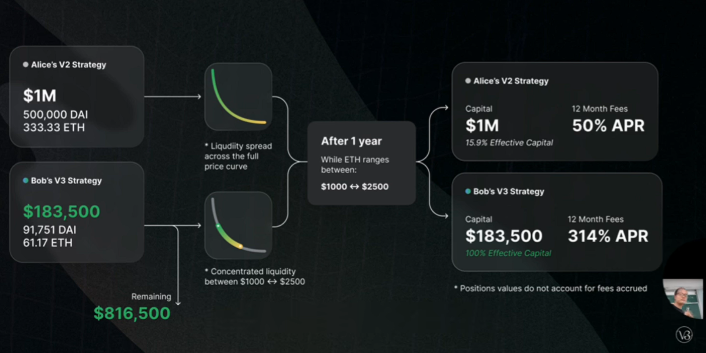
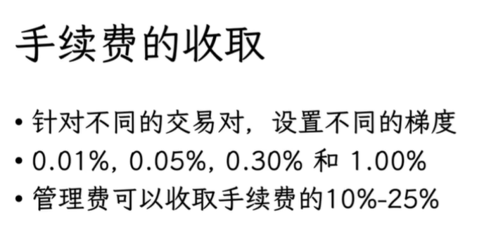

# UniswapV3 简介

# UniswapV2的资金利用率

# 集中流动性
lp只需要提供某一价格区间内的流动性，lp自己去定在哪个区间

LP需要主动管理，LPT变成了ERC721,因为独一无二

## 资金利用率的提升
在V3里，价格区间越窄，资金利用率越高，需要的资金量越小

k值相同，在V2里投一百万，和在V3里投十八万，一年以后累计赚到的fee一样（不过比较极端，因为这个区间太准了有点）

+ 市场极端情况：ETH归零

V3能亏的更少，因为还有remaining的部分

+ 虚拟流动性

 <= 减少无常损失

> 更新: 2025-10-11 18:44:47  
> 原文: <https://www.yuque.com/xiaoyuhushenfu/yzin4n/wommu01cppn22flf>