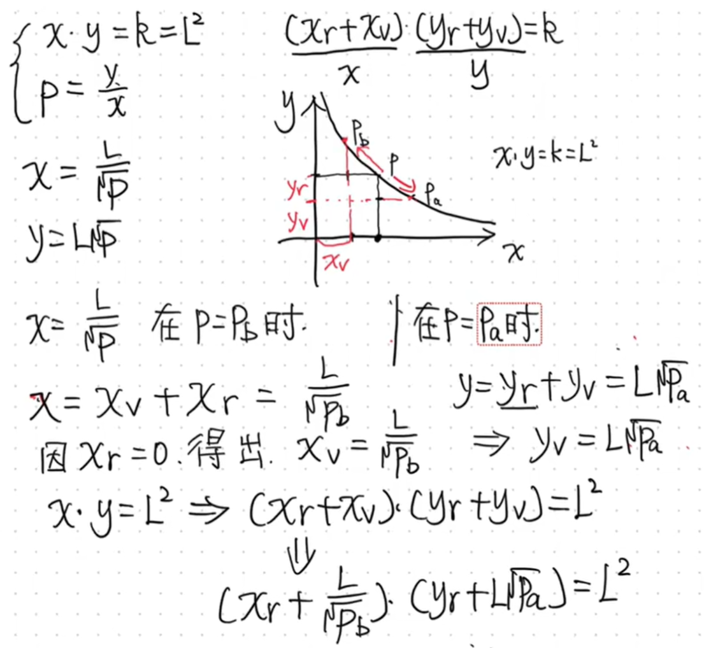
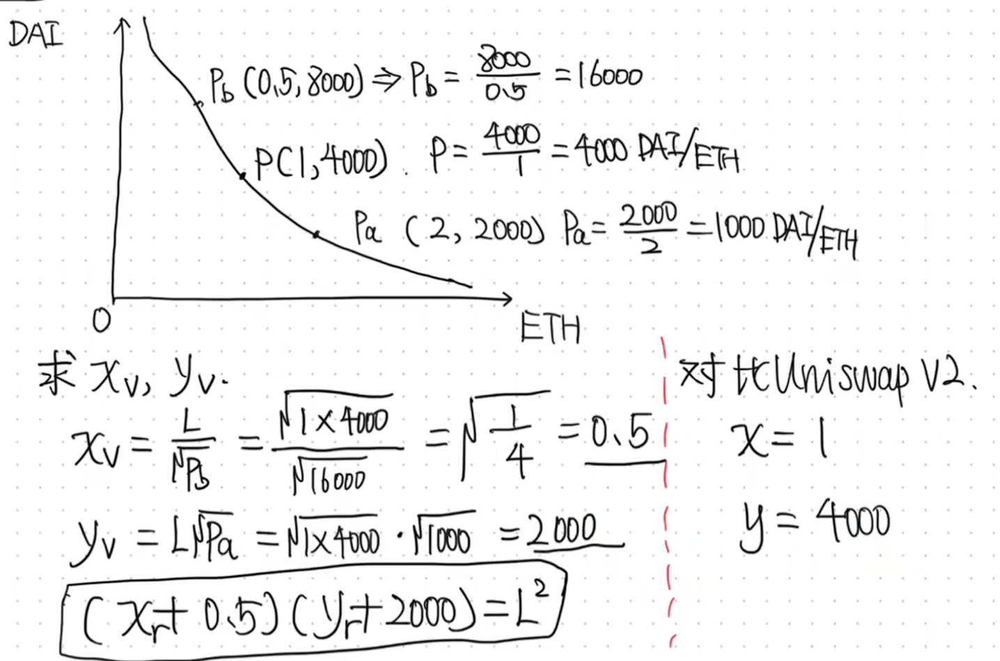
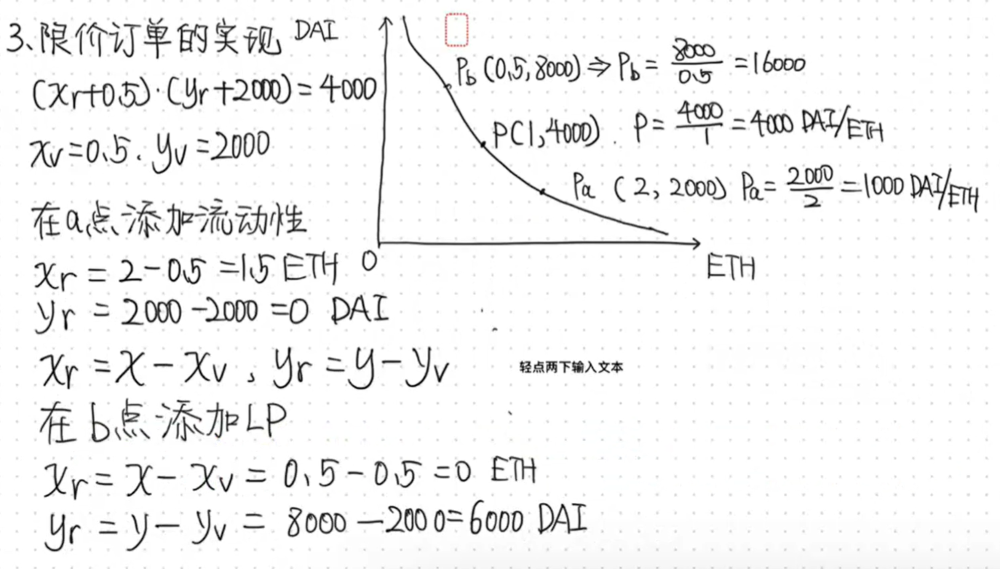
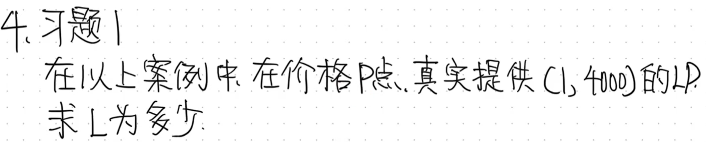
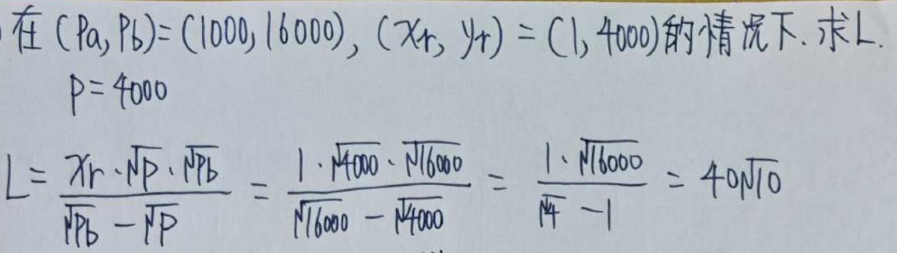
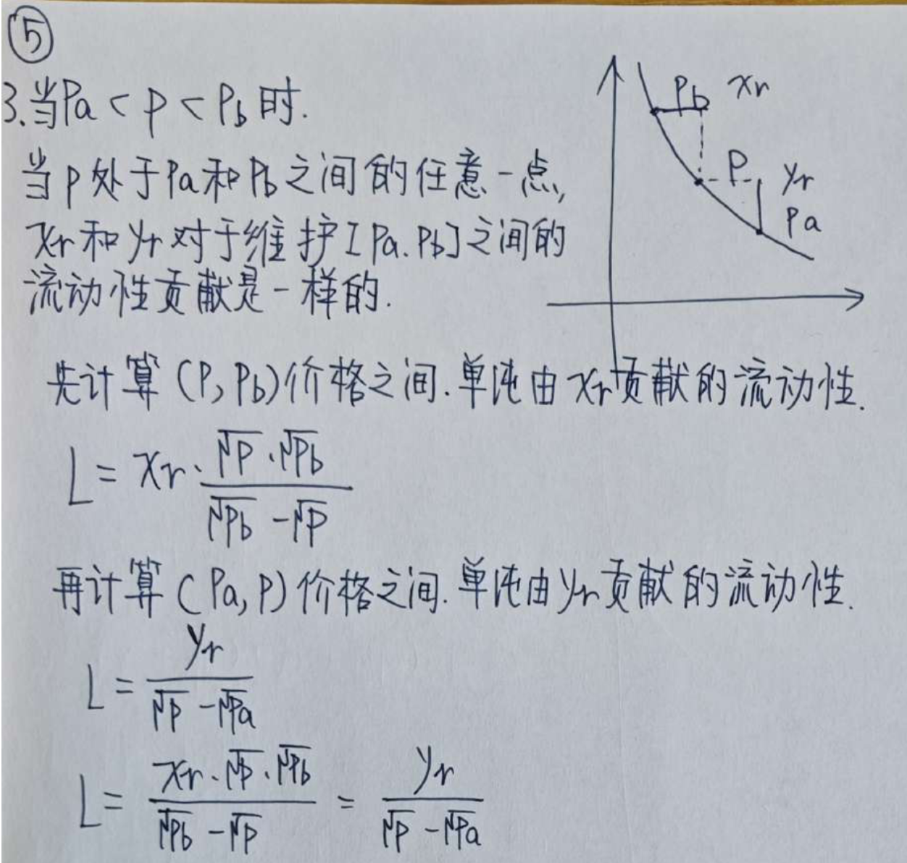

# 手续费计算

## 确定x、y与L、P的关系

## 白皮书例子

在V3这里，x=1-0.5=0.5

y=4000-2000=2000，对比V2节省了一半

+ 这里只是个例子，实际上不会1000-16000这么大的变动幅度 

如果价格区间越小，也就是pa越大，pb越小，那么xv和yv就会越大，L就会越大，流动性更大，k更大

## limited order 限价订单的实现

## 习题

> 更新: 2025-10-16 18:32:12  
> 原文: <https://www.yuque.com/xiaoyuhushenfu/yzin4n/bdko3gtyycnhx8ur>