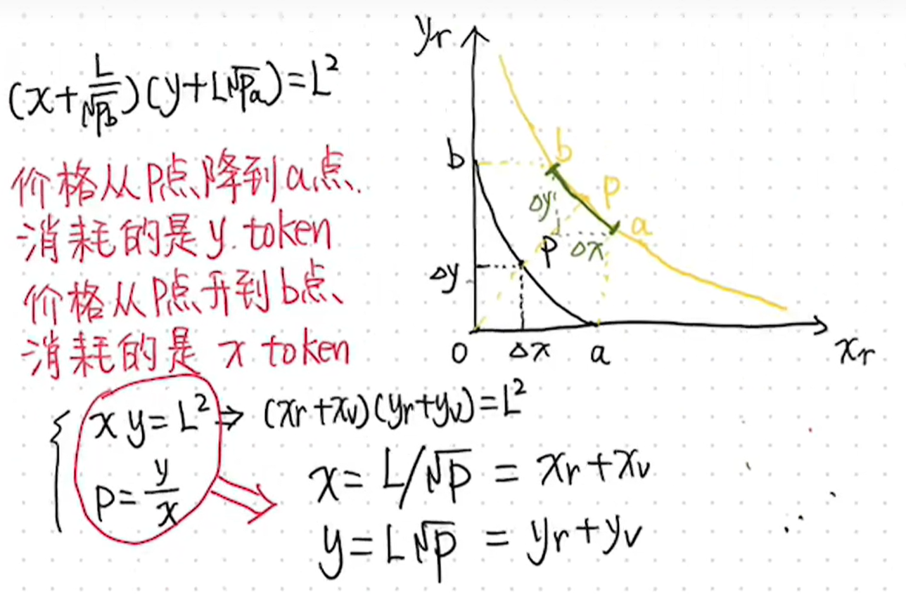
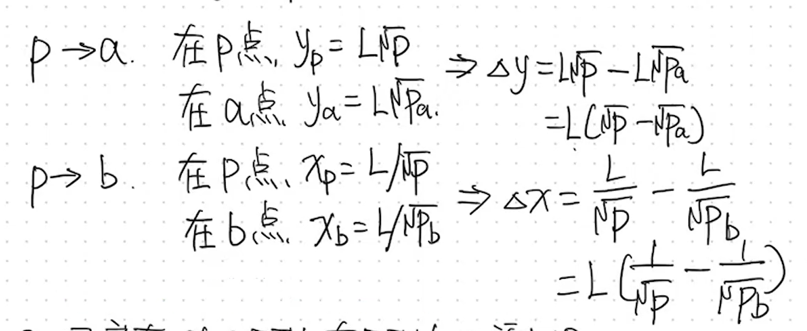
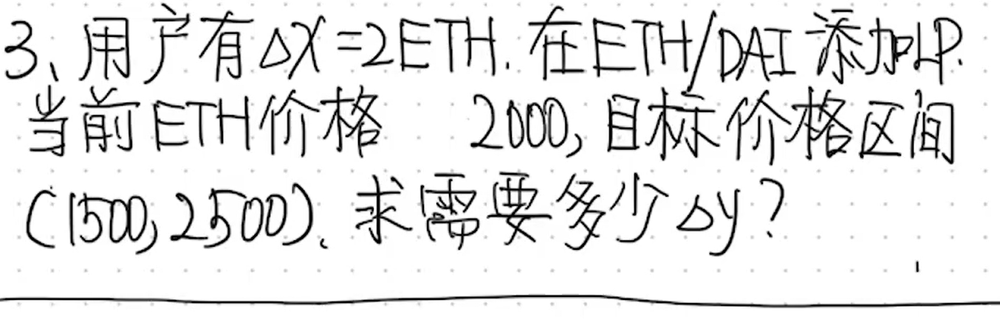
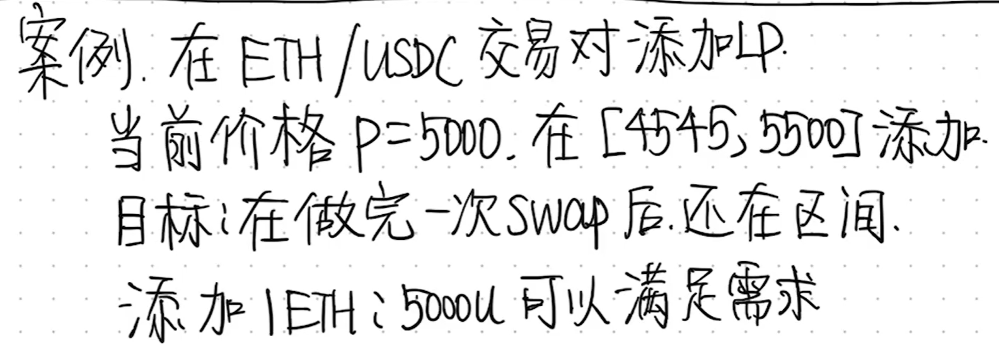
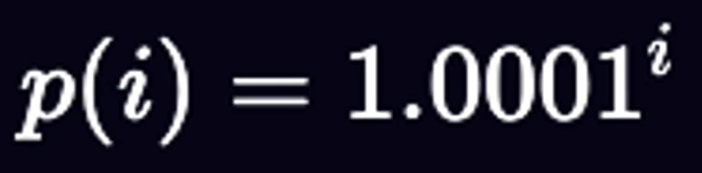
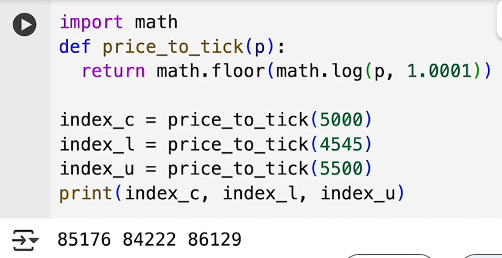
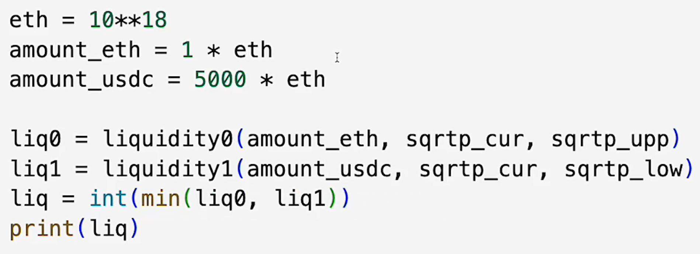
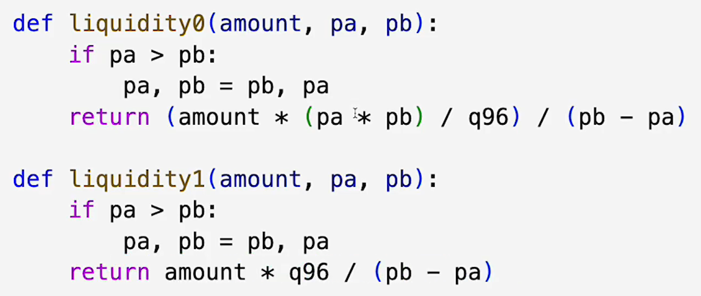
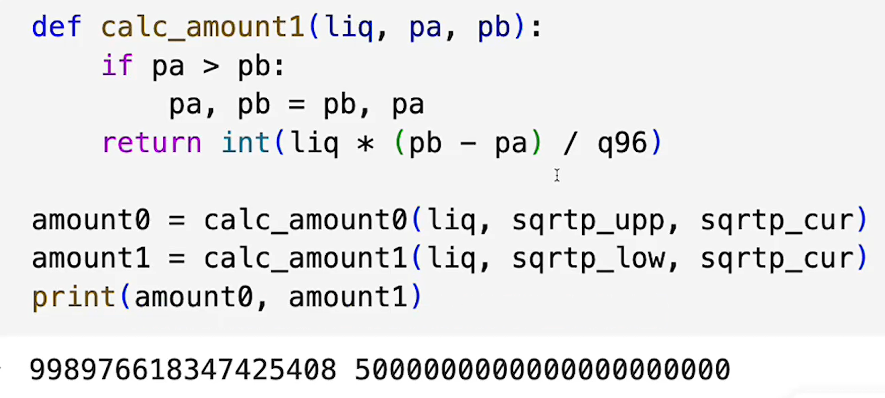

# 添加流动性

## 对应到tick

这里就是已知p，求i，也就是tick

看看三个价格对应的tick都是多少，再看看有没有在他俩区间内就可以

先得到tick，然后根号下tick

我要投入1eth 实际上需要99897。。。那么多

> 更新: 2025-10-16 18:38:15  
> 原文: <https://www.yuque.com/xiaoyuhushenfu/yzin4n/gizla9hyhohgt09y>