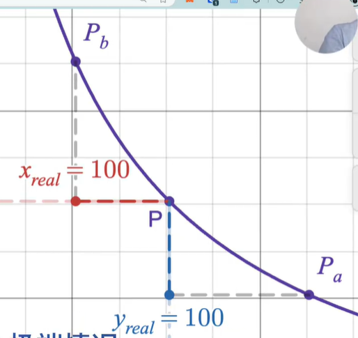
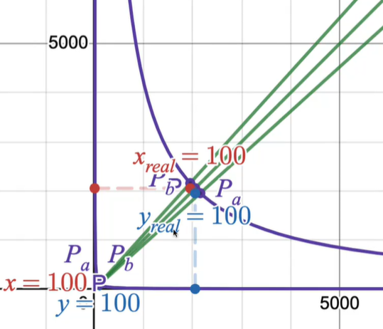
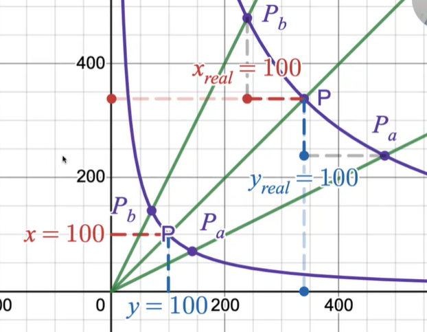

# 集中流动性

+ 价格：P = y/x

## 区间流动性
比起V2从0到正无穷添加流动性，V3是在某个区间内添加流动性，这样提高资金利用率

+ 优势：同样的价格，在V3里能够提供更高的流动性，k值更大

## 虚拟流动性
V3里用来计算k值

在区间内虚拟流动性是不会变化的

从p到pa：消耗y，y从池子里出去，是y在做流动性

从p到pb：消耗x，x从池子里出去，是x在做流动性

## 价格的波动
价格范围越大，虚拟流动性越小，越和V2曲线重合

价格范围越小，效果越好

> 更新: 2025-10-11 19:25:06  
> 原文: <https://www.yuque.com/xiaoyuhushenfu/yzin4n/vvpre141zbmdlhcu>