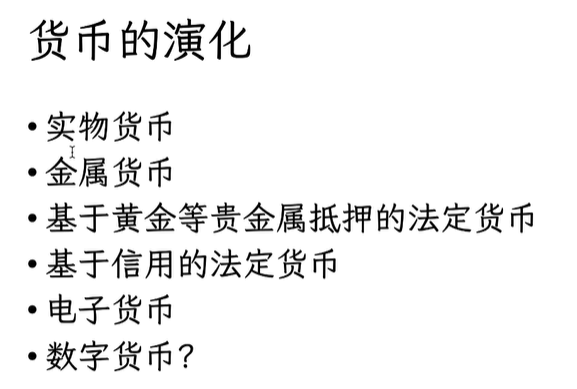
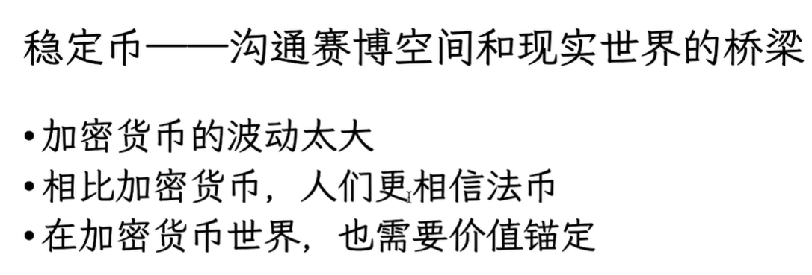
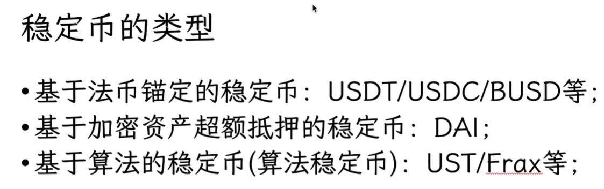
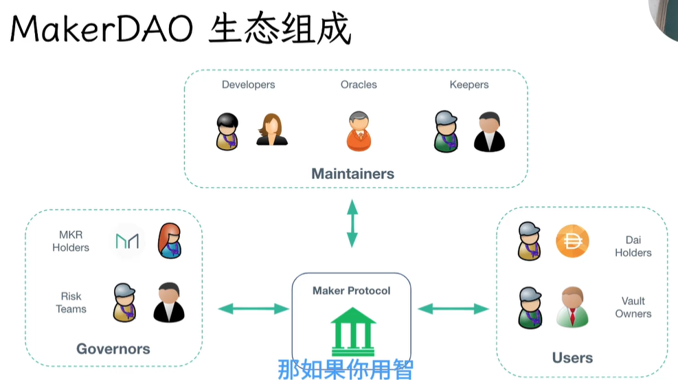
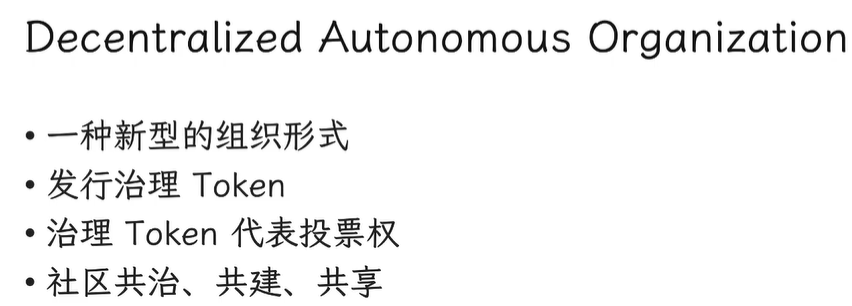
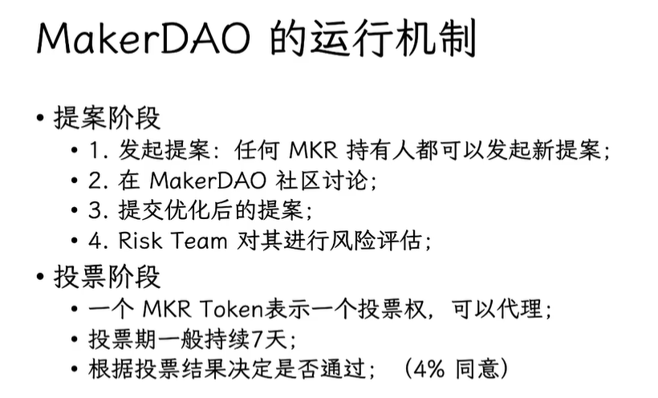
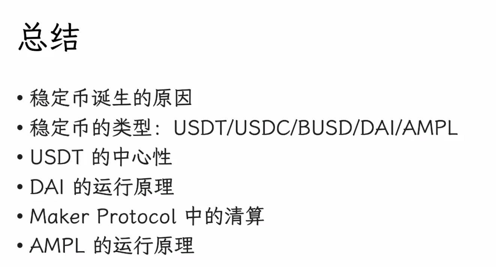

# 二、稳定币

赵长鹏 busd

# DAI

## 机制
+ ETH <=> USDT  => DAI
+ ETH会变价
+ 抵押ETH换DAI，假设都1:1:1
+ 能换的DAI的价格是基于USDT来的（个人理解）
+ 比如抵押5ETH，能换5个DAI，作为缓冲换了3个DAI

## ETH升值
+ ETH : USDT变成了1:2
+ 这个时候就能换10个DAI了，作为缓冲还是换7个这样

## ETH贬值
+ ETH : USDT变成了2:1
+ 这个时候只能换2.5个DAI

## 防护网
1. 清算，拍卖：会扣除DAI + Penalty Fee，其余ETH返还给用户
2. maker buffer：由Penalty Fee、Stablility Fee等慢慢积攒，弥补拍卖的缺口
3. debt auction：增发MKR（拍卖物）进行拍卖，用户使用DAI参与拍卖，拍卖来的MKR弥补缺口，一种对社区治理惩罚的方式

# DAO

## 基于算法的稳定币 AMPL
rebase机制

> 更新: 2025-09-19 08:38:24  
> 原文: <https://www.yuque.com/xiaoyuhushenfu/yzin4n/szgdw3b1p5q9ig3b>