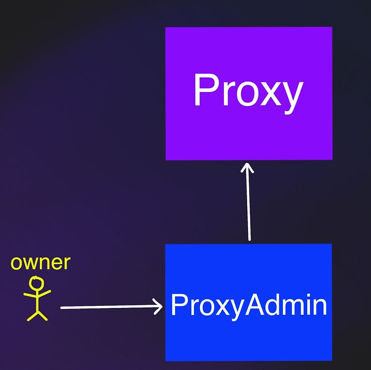
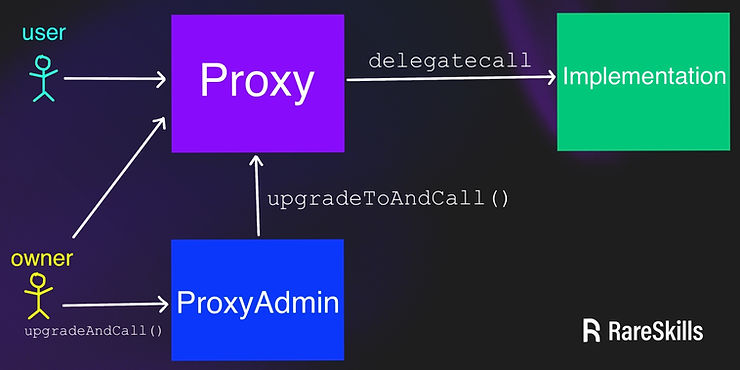
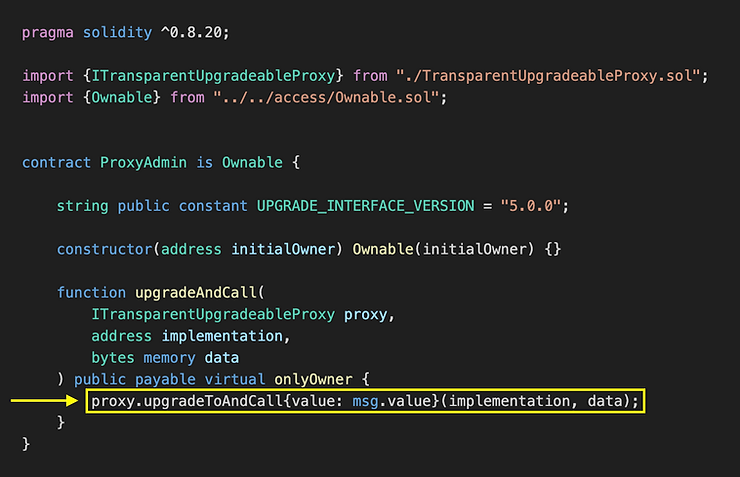

# Transparent初稿

* `proxy(代理合约)`:一般不包含业务逻辑,只负责调用转发`delegatecall`给真正的代理合约
* `Implementation Contract(实现合约)`:包含真正业务逻辑的合约

## 函数选择器冲突

在代理合约中声明用于更新实现合约地址的**公共函数(public)**，可能会引发**函数选择器冲突**

```solidity
contract ProxyUnsafe {

    function changeImplementation(
            address newImplementation
    ) public {
        // some code...
    }

    fallback(bytes calldata data) external payable (bytes memory) {
        (bool ok, bytes memory data) = getImplementation().delegatecall(data);
        require(ok, "delegatecall failed");
        return data;
    }
}

contract Implementation {
    // an identical function is declared here -- they will clash
    function changeImplementation(
            address newImplementation
    ) public {

    }
    //...
}
```

**请记住，fallback 函数总是最后检查的. delegatecall是写在fallback()里的.**

在调用 fallback 之前，代理合约会先检查这个调用的 4 字节函数选择器是否匹配 `changeImplementation`（或其他在代理合约中声明的 public 函数）\*\*  \*\*

\*\* 因此，如果在代理合约中声明了一个 public 函数，就可能发生两种类型的函数选择器冲突:\*\*

1. 同名函数

如果**实现合约**实现了一个**具有相同函数签名**的函数，那么这个函数将无法被调用，因为会优先调用**代理合约中**那个相同签名的 public 函数，而不是进入 fallback 函数.而且**如果 fallback 没有被触发**，那就**不会有 delegatecall 发起到实现合约**

```solidity
                外部调用
                   │
          ┌────────┴────────┐
          ▼                 ▼
  匹配 Proxy 合约的函数？   否 ──► fallback 被触发
          │                 │         │
         是                否         ▼
          │                 │   delegatecall
          ▼                 │         │
  调用 Proxy 的函数       否匹配？   转发到实现合约执行

```

* 正常流程:用户 → 代理合约（没匹配任何函数）→ fallback → delegatecall → 实现合约中的 `changeImplementation()`
* **函数选择器冲突发生的流程**: 用户 → 代理合约（匹配到自身的 public 函数）→ 执行的是代理合约自己的函数→ fallback 没有被触发 → 实现合约中那个 `changeImplementation()` 没有被调用

2. 非同名函数

如果实现合约中有一个函数，它的**函数选择器(4字节)**刚好与**代理合约中的 public 函数相同（即使函数签名不同）**，这个函数也会因为同样的原因\*\*无法被调用。\*\*这种情况是函数选择器冲突的一种，它可能会因为随机碰巧的四字节匹配而发生。两个不同函数恰好具有相同选择器的概率是大约 1/42.9 亿；\*\*因为一个函数选择器是 4 字节，所以一共约有 42.9 亿种可能性。这个概率虽小，但不能忽视。 \*\*例如，函数 `clash550254402()` 的选择器和 `proxyAdmin()` 是完全一样的

## 透明可升级代理合约模式完全防止函数选择器冲突

透明可升级代理合约模式可以完全防止函数选择器的冲突，规定代理合约除了`fallback()`以外**不应该有其他public函数.**

只有一个`fallback()`函数,怎么通过它升级代理合约呢?---**检测**<code>**msg.sender**</code>**是否是**<code>**admin**</code>

```solidity
contract Proxy is ERC1967 {
    address immutable admin;

    constructor(address admin_) {
        admin = admin_
    }

    fallback() external payable {
        if (msg.sender == admin) {
            // upgrade logic
        } else {
            // delegatecall to implementation
        }
    }
}
```

**意味着**<code>**admin**</code>**无法直接使用代理合约,因为**<code>**msg.sender == admin**</code>**, 只执行升级逻辑(upgrade logic),不会走 delegatecall 的路径**

* 管理员（admin）可以升级合约
* 普通用户（非 admin）才能调用被代理合约的业务逻辑函数

## immutable admin

上面这段代码中,`admin`是一个`immutable(不可变)`变量,这就意味着从技术上讲，这份合约**并不完全符合 ERC-1967 标准.**

* ERC-1967 规定：\*\*admin 地址必须被存储在一个固定的 storage 槽位中, **即：<code><font style="background-color:rgb(237, 233, 254);">0xb53127684a568b3173ae13b9f8a6016e243e63b6e8ee1178d6a717850b5d6103</font></code>（这是哈希值 `keccak256("eip1967.proxy.admin") - 1`）**  \*\*

**为了兼容 ERC-1967，透明可升级代理合约会把 admin 地址写入那个特定的 storage 槽位，但并不会真的用这个变量来判断权限**.在这个槽位中存在一个地址，会告诉区块浏览器：“这是一个代理合约”——这正是ERC-1967设计的目的之一.但是，如果每次调用代理时都要从 storage 中读取 admin，就会多消耗约 2100 gas, 但是，如果每次调用代理时都要从 storage 中读取 admin，就会多消耗约 2100 gas.因此，**为了节省 gas，**很多**实现合约**会用\*\* immutable 变量来保存 admin\*\*，而不是每次都从 storage读.

## 更换admin

由于代理合约使用了immutable变量,改变admin地址几乎是不可能的

* <font style="color:rgb(82, 82, 82);">透明可升级代理实现</font>**<font style="color:rgb(82, 82, 82);">代理合约管理员变更</font>**<font style="color:rgb(82, 82, 82);">的方法:</font>

1. 首先,它指定另一个合约`ProxyAdmin`作为代理合约的`admin`.(智能合约的地址永远不会变,这与把admin以immutable形式存储在透明可升级代理模式兼容)
2. 其次,合约`ProxyAdmin`的owner是"真正的"`admin`.(合约`ProxyAdmin`只是简单地把`owner`的调用转发给`Proxy`)."真正的"`admin`（即owner）调用`Proxyadmin`,`Proxyadmin`再去调用`Transparent Proxy`。这样只要修改`Proxyadmin`的owner,就相当于在修改`admin`,使它拥有升级Transparent Proxy合约的权利



## <font style="color:rgb(23, 23, 23);">代理管理员proxyadmin</font>

```solidity
pragma solidity ^0.8.20;

import {ITransparentUpgradeableProxy} from "./TransparentUpgradeableProxy.sol";
import {Ownable} from "../../access/Ownable.sol";

contract ProxyAdmin is Ownable {
    string public constant UPGRADE_INTERFACE_VERSION = "5.0.0";

    constructor(address initialOwner) Ownable(initialOwner) {}

    function upgradeAndCall(
        ITransparentUpgradeableProxy proxy,
        address implementation,
        bytes memory data
    ) public payable virtual onlyOwner {
        proxy.upgradeToAndCall{value: msg.value}(implementation, data);
    }
}
```

proxyadmin合约里只有一个`upgradeAndCall()`函数

* <code>**upgradeAndCall()**</code>**函数:**

在ProxyAdmin合约中,相当于打包, 可以升级的同时调用新的逻辑合约中的初始化函数, 非常适合首次部署后初始化状态变量

* <code>**upgradeToAndCall()**</code>\*\* 函数:\*\*

是ProxyAdmin合约用来**升级代理合约**并初始化新实现合约的一种方式

合约`AdminProxy`的owner是可以随意使用`Proxy`合约的,因为owner不是`Proxy`合约的admin,可以调用它的业务逻辑

```solidity
ProxyAdmin (合约) 
   │
   └── upgradeAndCall(proxy, impl, data) 
             │
             └── proxy.call(upgradeToAndCall)
                          │
                          └── Transparent Proxy fallback()
                                 └── _dispatchUpgradeToAndCall()

```



## 使代理合约无法升级(<font style="color:rgb(23, 23, 23);">non-upgradeable)</font>

如果将代理管理员(ProxyAdmin)的 owner 设置为`address(0)`(零地址),或者设置为另一个**无法正确调用**<code>**upgradeToAndCall()**</code>（或无法更改 owner）的合约，那么这个 Transparent 升级代理合约将变成**不可升级的状态**。

例如：如果你把一个 `ProxyAdmin` 的 owner 设置成另一个 `ProxyAdmin`，那么除非你保留了访问链，否则可能再也无法控制它，从而导致合约**永久无法升级.**

* 一旦 owner 无法再发起升级，就等于永久锁死升级权限，这在实际部署中有时候反而是**一种安全特性**（比如项目上线后锁定逻辑）

## 实现细节

OpenZeppelin 提供的 Transparent可升级代理合约的实现细节基于以下三个合约构建:

1. <code>**Proxy.sol**</code> —— 最底层的代理合约，负责 delegatecall 转发\*\*；\*\*
2. <code>**ERC1967Proxy.sol**</code>(继承自 Proxy.sol)——\*\* \*\*添加了 ERC-1967 标准支持（实现地址存储槽）；
3. <code>**TransparentUpgradeableProxy.sol**</code>(继承自 ERC1967Proxy.sol) —— **最终**用户使用的透明代理合约，加入 admin 权限判断逻辑

#### <font style="color:rgb(23, 23, 23);">父合约：Proxy.sol</font>

`Proxy.sol` 是代理合约的最基础实现.它提供 delegatecall 的低级转发逻辑，但并不直接实现 `_implementation()` 函数 —— 这个函数会被子合约 `ERC1967Proxy.sol` 重写，用于返回存储在特定槽位的实现合约地址

```solidity
abstract contract Proxy {
    function _delegate(address implementation) internal virtual {
        assembly {
            calldatacopy(0, 0, calldatasize())
            let result := delegatecall(gas(), implementation, 0, calldatasize(), 0, 0)
            returndatacopy(0, 0, returndatasize())
            
            switch result
            case 0 {
                revert(0, returndatasize())
            }
            default {
                return(0, returndatasize())
            }
        }
    }

    function _implementation() internal view virtual returns (address);

    function _fallback() internal virtual {
        _delegate(_implementation());
    }

    fallback() external payable virtual {
        _fallback();
    }
}
```

`_implementation()`函数并没有定义,就是只管把调用转发到哪个地址,不管地址从哪来的

#### <font style="color:rgb(23, 23, 23);">Proxy.sol 的子类：ERC1967Proxy.sol</font>

```solidity
pragma solidity ^0.8.20;

import {Proxy} from "../Proxy.sol";
import {ERC1967Utils} from "./ERC1967Utils.sol";

contract ERC1967Proxy is Proxy {

    constructor(address implementation, bytes memory _data) payable {
        ERC1967Utils.upgradeToAndCall(implementation, _data);//设置槽位
    }

    // reads from bytes32(uint256(keccak256('eip1967.proxy.implementation')) - 1)
    function _implementation() internal view virtual override returns (address) {
        return ERC1967Utils.getImplementation();//这个函数是ERC1967里的
    }
}
```

这个子合约添加并覆盖了内部`_implementation()`函数,返回的是符合 ERC-1967 标准的实现合约地址(从特定的 storage 槽读取) ,构造函数会设置这个槽位,但是注意,就像上边说的,透明可升级代理合约并不会使用这个`_implementation()`函数,而是使用它自身的immutable变量来保存admin地址(为了省gas嘛).

说白了就是为了让工具识别,按标准格式写入的实现地址(让代理合约符合 Etherscan 工具可识别的 ERC-1967 存储规范)

#### <font style="color:rgb(23, 23, 23);">ERC1967Proxy.sol 的子类：TransparentUpgradeableProxy.sol</font>

构造函数中部署了一个新的`ProxyAdmin`合约,并将immutable变量`_admin`设置成`ProxyAdmin`的地址

```solidity
contract TransparentUpgradeableProxy is ERC1967Proxy {
    address private immutable _admin;

    error ProxyDeniedAdminAccess();

    constructor(address _logic, address initialOwner, bytes memory _data) payable ERC1967Proxy(_logic, _data) {
        _admin = address(new ProxyAdmin(initialOwner));
        // Set the storage value and emit an event for ERC-1967 compatibility
        ERC1967Utils.changeAdmin(_proxyAdmin());
    }

    function _proxyAdmin() internal view virtual returns (address) {
        return _admin;
    }

    function _fallback() internal virtual override {
        if (msg.sender == _proxyAdmin()) {
            if (msg.sig != ITransparentUpgradeableProxy.upgradeToAndCall.selector) {
                revert ProxyDeniedAdminAccess();
            } else {
                _dispatchUpgradeToAndCall();
            }
        } else {
            super._fallback();
        }
    }

    function _dispatchUpgradeToAndCall() private {
        (address newImplementation, bytes memory data) = abi.decode(msg.data[4:], (address, bytes));
        ERC1967Utils.upgradeToAndCall(newImplementation, data);//新实现合约地址,调用参数
    }
}
```

当<code><font style="color:rgb(139, 92, 246);background-color:rgb(237, 233, 254);">msg.sender</font></code><font style="color:rgb(82, 82, 82);"> == </font><code><font style="color:rgb(139, 92, 246);background-color:rgb(237, 233, 254);">_proxyAdmin()</font></code>时:

`fallback()`函数会首先检查传入的函数选择器是不是<font style="color:rgb(139, 92, 246);background-color:rgb(237, 233, 254);">upgradeToAndCall()</font><font style="color:rgb(23, 23, 23);">函数的选择器(也就是只允许调用 </font><code><font style="color:rgb(23, 23, 23);">upgradeToAndCall()</font></code><font style="color:rgb(23, 23, 23);">函数),如果是就走</font><code><font style="color:rgb(23, 23, 23);">_dispatchUpgradeToAndCall()</font></code><font style="color:rgb(23, 23, 23);">函数来升级合约,否则就revert</font>

* <code><font style="color:rgb(23, 23, 23);">_dispatchUpgradeToAndCall()</font></code><font style="color:rgb(23, 23, 23);">函数: 专门处理解码和升级逻辑  </font>

在proxy合约中,功能是**升级**代理合约的**实现合约地址**,并且如果有`data`,则**继续执行该数据中包含的函数调用**。执行 `ERC1967Utils.upgradeToAndCall(newImplementation, data)` 就是完成升级和后续调用的操作

<font style="color:rgb(23, 23, 23);">这里的选择器并不是真正意义上的选择器,因为透明可升级代理合约并没有public函数,但是为了让proxyadmin能以solidity接口的方式(高级调用)调用</font><code><font style="color:rgb(23, 23, 23);">upgradeToAndCall()</font></code><font style="color:rgb(23, 23, 23);">,必接受来自proxyadmin的</font><code><font style="color:rgb(23, 23, 23);">upgradeToAndCall()</font></code><font style="color:rgb(23, 23, 23);">的abi编码</font>

<font style="color:rgb(23, 23, 23);">尽管透明可升级代理合约没有public函数，proxyadmin实际上是通过接口调用方式来调用透明可升级代理合约中的</font><code><font style="color:rgb(23, 23, 23);">upgradeToandCall()</font></code>

#### 

## <font style="color:rgb(23, 23, 23);">为什么是</font><code><font style="color:rgb(23, 23, 23);">upgradeToAndCall()</font></code><font style="color:rgb(23, 23, 23);">而不是仅仅</font><code><font style="color:rgb(23, 23, 23);">upgradeTo()</font></code><font style="color:rgb(23, 23, 23);">？</font>

当升级实现合约时,有可能对它发起一个调用,proxyadmin是msg.sender,并通过delegatecall把该调用转发到新的实现合约,就像正常的代理交互那样完成调用

当然这不会发生在fallback()中,详见上文透明可升级代理部分

下面的代码来自 `ERC1967Utils.sol`，`TransparentUpgradeableProxy`合约通过它来更新实现地址的存储槽。该库提供了一个内部辅助函数，用于更新持有实现合约地址的存储槽

```solidity
** 
* @dev Performs implementation upgrade with additional setup call if data is nonempty. 
* This function is payable only if the setup call is performed, otherwise `msg.value` is rejected 
* to avoid stuck value in the contract. 
* 
* Emits an {IERC1967-Upgraded} event. 
*/

function upgradeToAndCall(address newImplementation, bytes memory data) internal {
    _setImplementation(newImplementation);
    emit IERC1967.Upgraded(newImplementation);
    if (data.length > 0) {
        Address.functionDelegateCall(newImplementation, data);
    } else {
        _checkNonPayable();
    }
}
```

只有当`data.length > 0`时,该函数才会对实现合约发起`delegatecall`

`upgradeToAndCall()`也会在升级和调用操作发生于**同一个交易中**时，从proxy向实现合约发起一次 `delegatecall`。\
其行为相当于：`ProxyAdmin`向proxy发起一个带有`data`的调用，然后proxy把这个调用`delegatecall`给新的实现合约. 通过这种方式，`ProxyAdmin`可以向proxy发起任意调用.

**注意，**<code>**upgradeToAndCall**</code>\*\* 并不要求升级后的实现合约必须与原来的不同 —— 它也可以“升级”到同一个实现合约\*\*

这意味着：`ProxyAdmin`合约可以通过proxy对实现合约发起任意的`delegatecall`,但从Transparent proxy的角度来看，这些调用的`msg.sender`是`ProxyAdmin`

`ProxyAdmin`能使用该合约并不构成“问题” —— 它本就有权限完全更改实现合约，且owner实际上拥有对proxy的完整管理员控制权

`ProxyAdmin`在升级操作上唯一的限制是：**不能升级到一个空合约**（即没有字节码的地址）。\
`_setImplementation()`函数会检查新的实现合约地址的字节码长度是否大于0:

```solidity
/**
 * @dev Stores a new address in the ERC-1967 implementation slot.
 */
function _setImplementation(address newImplementation) private {
    if (newImplementation.code.length == 0) {
        revert ERC1967InvalidImplementation(newImplementation);
    }
    StorageSlot.getAddressSlot(IMPLEMENTATION_SLOT).value = newImplementation;
}
```

## 透明可升级代理代理模式summary:

1. Transparent Upgradeable Proxy 是一种设计模式，**用于避免代理合约与实现合约之间的函数选择器冲突**
2. <code>**fallback()**</code>\*\* 函数是该代理合约中唯一的public函数\*\*
3. \*\* \*\*只有管理员才能通过 `fallback()` 函数调用升级功能；

* 非管理员的所有调用都会被作为普通调用，`delegatecall` 到实现合约；

4. 为了节省 gas，管理员地址保存在一个 `immutable` 变量中；

* 为了符合 ERC-1967 规范，合约还是会将管理员地址写入标准的 admin 槽位中，尽管运行时从不读取这个槽；

5. 由于 `immutable` 管理员地址不可变，因此**实际使用一个叫 **<code>**AdminProxy**</code>** 的智能合约作为管理员**；

* `AdminProxy` 提供一个公开函数<code>**upgradeAndCall()**</code>**，仅限其 owner 调用**；
* <code>A**dminProxy**</code>\*\* 的 owner 是可变的\*\*，谁拥有它就可以升级实现合约。


> 更新: 2025-07-17 15:40:43  
> 原文: <https://www.yuque.com/xiaoyuhushenfu/yzin4n/pfpvg2m5ovokxcyn>