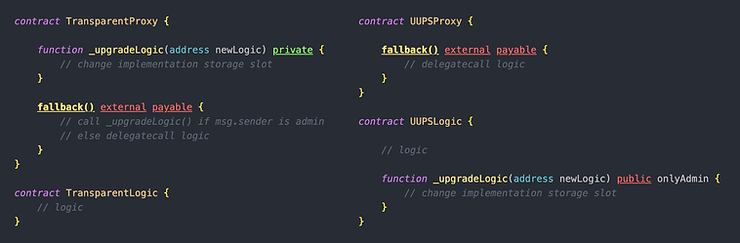
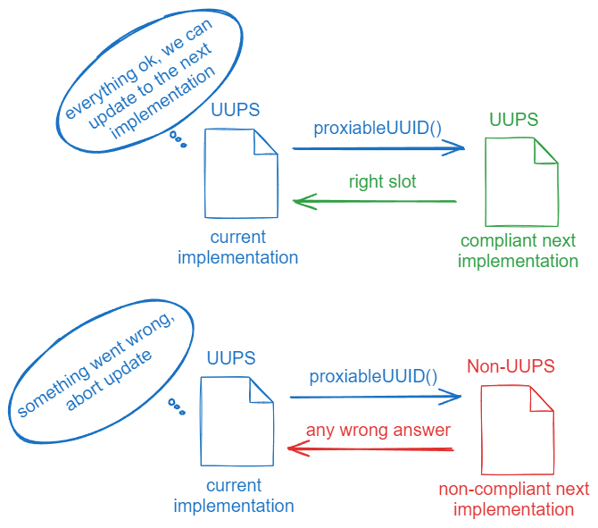

# uups

UUPS 模式是一种代理模式，其中升级函数位于**实现合约**中，但通过来自**代理合约的 delegatecal**来更改存储在代理中的\*\*实现合约地址 \*\*

与透明可升级代理（Transparent Upgradeable Proxy）类似，\*\*UUPS 模式通过完全移除代理中的 public 函数，解决了函数选择器冲突的问题  \*\*

# ERC-1967 代理存储槽标准

* 一个能正常工作的以太坊**代理合约**必须具备至少两个功能：
  1. 一个存储槽，用于存储**实现合约**的地址
  2. 一个机制，允许管理员更改该实现地址

ERC-1967标准定义了**实现合约地址所应使用的存储槽位置**,但\*\*不定义更改该地址的具体方法,\*\*即:将升级机制的实现方式留给开发者自行决定



在升级过程中,`_upgradeLogic()`函数被proxy合约以**delegatecall**的方式调用.

与透明代理不同,UUPS **不需要AdminProxy**——如果需要的话,普通EOA账户也可以担任admin. UUPS代理模式**只在显式调用**<code>**_upgradeLogic()**</code>**时才需要比较msg.sender是否为管理员**,因此**不需要保持一个不可变admin地址**

## 优势

1. \*\*实现逻辑本身可以升级,\*\*就是升级机制可以变成更高级更安全的逻辑,比如带有投票机制/延迟执行(timelock)
2. uups**更灵活、更轻量、部署和调用都更省 gas：**

* 不再需要额外部署一个proxyadmin合约
* 不需要每一笔交易都检查msg.sender与admin的关系(透明可升级模式无论升级还是调用都要检查msg.sender和admin的关系)

## 丧失升级能力风险

如果某次升级将实现地址更换为一个**没有实现升级机制的合约**，则“升级链”将**终止**，因为已经无法再执行下一次升级。换句话说，虽然升级机制本身是可升级的，但如果引入了错误实现，将会导致整个升级能力丧失

为了避免这个风险，uups提案要求在升级前必须先验证**新实现合约是否包含一个有效的升级机制**

### 小弊端

1. 每个新的实现合约必须实现自己的升级函数,这使得新实现合约的部署成本略高
2. 如果使用uups的**实现合约**因添加升级逻辑而接近24KB的代码大小限制,建议考虑改用透明代理模式

# uups运作方式

uups最初由ERC-1822定义,在升级时必须**防止**代理合约接受一个不符合uups标准的新实现合约

## `proxiableUUID()`函数

这个标准要求,每个实现合约必须实现一个签名为`proxiableUUID()`的函数.

### 作用

用作兼容性检查机制，确保新实现合约符合 UUPS 标准

应该返回实现合约地址的存储槽,虽然理论上也可以返回一个固定字符串什么的,但**返回slot更省gas**

### 流程

1. 代理合约操作升级之前,先调用新合约的`proxiableUUID()`的函数
2. 如果**该函数存在**且**返回正确slot**(符合ERC1976标准),说明新实现合约兼容uups
3. 否则,升级操作回滚



## 存储槽

在openzeppelin实现中,使用了ERC-1967的标准槽定义:

```solidity
keccak256("eip1967.proxy.implementation") - 1
```

## 整体流程

1. owner通过proxy合约调用
2. delegatecall到实现合约,执行 `upgradeToAndCall()`

```solidity
function upgradeToAndCall(address newImplementation, bytes memory data) public payable virtual onlyProxy {
    _authorizeUpgrade(newImplementation); //检查权限
    _upgradeToAndCallUUPS(newImplementation, data);//检验兼容性,存新地址,data非空执行初始化逻辑
}
```

# OpenZeppelin的uups实现

## UUPSUpgradeable.sol合约

在OpenZeppelin库中,**实现uups标准**的合约是`UUPSUpgradeable.sol`

1. 应该被实现合约继承，而不是代理合约
2. 代理合约通常使用`ERC1967Proxy`,这是一个最小实现的ERC-1967标准代理

### 功能

1. 提供`proxiableUUID()`函数,验证是否兼容uups
2. 提供`upgradeToAndCall()`函数,用于迁移到下一个实现合约

## 函数

### `proxiableUUID()`

```solidity
function proxiableUUID() external view virtual notDelegated returns (bytes32) {
    return ERC1967Utils.IMPLEMENTATION_SLOT;
}
```

返回ERC1967的实现地址槽

### `upgradeToAndCall()`

升级函数叫什么都行,uups模式由于**升级函数在实现合约**中,所以就不存在函数选择器冲突问题

在`UUPSUpgradeable.sol`中,它是：

```solidity
function upgradeToAndCall(address newImplementation, bytes memory data) public payable virtual onlyProxy {
    _authorizeUpgrade(newImplementation); 
    _upgradeToAndCallUUPS(newImplementation, data); 
}
```

* `onlyProxy`：确保只能通过代理调用；
* `_authorizeUpgrade`：开发者必须实现这个函数,用来限制升级权限；
* `_upgradeToAndCallUUPS` 内部调用`proxiableUUID()`来检查兼容性。

### `_authorizeUpgrade`函数(必须实现)

开发者需实现该函数以**定义谁有权限升级**。最简单的实现就是加入 `onlyOwner` 修饰符，例如：

```plain
function _authorizeUpgrade(address newImplementation)
    internal onlyOwner override {}
```

每个新版本的实现可以定义不同的权限方案，如改用多签（multisig）等。

⚠️ `UUPSUpgradeable.sol`是一个抽象合约,不实现`_authorizeUpgrade`将无法编译

# uups在openzeppelin库的实现

## 代理合约Proxy

使用`ERC1967Proxy.sol`库, 它实现了一个符合 ERC-1967 标准的最小代理方案

初始实现合约的地址在构造函数中传入

```solidity
// SPDX-License-Identifier: MIT
pragma solidity ^0.8.0;

import "@openzeppelin/contracts/proxy/ERC1967/ERC1967Proxy.sol";

contract UUPSProxy is ERC1967Proxy {
    constructor(address _implementation, bytes memory _data) ERC1967Proxy(_implementation, _data) payable {}
}
```

## 实现合约

实现合约**必须继承**<code>**UUPSUpgradeable**</code>**合约**,它遵循uups模式,并包含迁移到下一个实现的机制

**必须重写**<code>**_authorizeUpgrade**</code>**函数**,因为权限控制机制并不是预定义的,开发者需要自行实现

```solidity
// SPDX-License-Identifier: MIT
pragma solidity ^0.8.0;

import "@openzeppelin/contracts/proxy/ERC1967/ERC1967Proxy.sol";

contract UUPSProxy is ERC1967Proxy {
    constructor(address _implementation, bytes memory _data) ERC1967Proxy(_implementation, _data) payable {}
}

// UUPS 实现合约

import "@openzeppelin/contracts-upgradeable/proxy/utils/UUPSUpgradeable.sol";

contract ImplementationOne is UUPSUpgradeable {
    function myNumber() public pure returns (uint256) {
        return 1; // 一个用于测试实现的函数
    }

    // 实际使用中，此函数应包含 onlyOwner 修饰符
    function _authorizeUpgrade(address _newImplementation) internal override {}
}
```

由于实现合约不能使用构造函数来初始化 owner 等状态变量，因此必须定义一个初始化函数。（可以去看`Initializable.sol` 的文章）以下是示例代码：

```solidity
import "@openzeppelin/contracts-upgradeable/proxy/utils/UUPSUpgradeable.sol";

contract ImplementationOne is UUPSUpgradeable {

    function myNumber() public pure returns (uint256) {
        return 1; // 一个用于测试实现的函数
    }

    // 实际使用中，此函数应包含 onlyOwner 修饰符
    function _authorizeUpgrade(address _newImplementation) internal override {}
}

```

测试步骤:

1. 部署`ImplementationTwo`合约
2. 部署名为`MyProx`的代理合约.构造函数需要两个参数：
   * 第一个参数是实现合约`ImplementationOne`的地址；
   * 第二个参数是类型为`bytes`的初始化参数.这里我们不会用到它,所以传入`0x`。
3. 若要测试合约,请使用实现合约`ImplementationOne`的ABI打开代理合约的实例.具体方法：
   * 在部署面板中，选择 `ImplementationOne` 合约；
   * 在 **At Address** 输入框中填入代理合约地址,部署

然后就能该通过代理来调用`ImplementationTwo`合约中的`myNumber()`函数了

## 升级到下一个实现合约

需要首先创建一个新的且同样遵循uups模式的合约

```solidity
// SPDX-License-Identifier: MIT
pragma solidity ^0.8.0;

import "@openzeppelin/contracts/proxy/ERC1967/ERC1967Proxy.sol";

contract UUPSProxy is ERC1967Proxy {
    constructor(address _implementation, bytes memory _data) ERC1967Proxy(_implementation, _data) payable {}
}

// UUPS 实现合约

import "@openzeppelin/contracts-upgradeable/proxy/utils/UUPSUpgradeable.sol";

contract ImplementationOne is UUPSUpgradeable {
    function myNumber() public pure returns (uint256) {
        return 1;
    }

    function _authorizeUpgrade(address _newImplementation) internal override {}
}

// 新的 UUPS 实现合约

import "@openzeppelin/contracts-upgradeable/proxy/utils/UUPSUpgradeable.sol";

contract ImplementationTwo is UUPSUpgradeable {
    function myNumber() public pure returns (uint256) {
        return 2;
    }

    function _authorizeUpgrade(address _newImplementation) internal override {}
}

```

升级步骤如下:

1. 部署`ImplementationTwo`合约
2. 通过代理调用当前实现合约中的`upgradeToAndCall()`函数:
   * 第一个参数为`ImplementationTwo`的地址
   * 第二个参数为`0x`（如果没有初始化逻辑）

```solidity
function upgradeToAndCall(address newImplementation, bytes memory data) public payable virtual onlyProxy {
        _authorizeUpgrade(newImplementation);
        _upgradeToAndCallUUPS(newImplementation, data);
    }
```

`upgradeToAndCall()`函数内部会调用`proxiableUUID()`来验证新实现是否兼容 UUPS

不兼容就会失败,因为`proxiableUUID()`的检查机制会阻止它

# uups漏洞分析

## 一、未初始化的实现合约

在UUPS模式中,我们通常需要使用**构造函数**来初始化实现合约(例如为ERC20合约设置token名称和\_symbol符号),

然而,在实现合约中使用构造函数并没有什么用,因为它会更改实现合约的存储,而真正的存储位于**代理合约**中

为了初始化实现合约,我们必须依赖只能执行一次的常规函数,可以通过openzeppelin库提供的修饰符来实现

```solidity
function initialize(address initialOwner) public initializer {
    __Ownable_init(initialOwner);//设置owner
    __UUPSUpgradeable_init();
}
```

### 实现合约的owner问题

这个初始化函数是**public**的,理论上应该只通过代理调用,但实际上也可以\*\*直接在实现合约上调用.\*\*这样会导致任何在实现合约调用此函数的人都会成为实现合约的owner

所以,此时实现合约将会有两个owner:

* 通过代理合约设置的owner
* 直接调用实现合约的"owner"

任何标着onlyOwner的函数都会允许这两个owner中的任何一个调用(很完蛋了)

### 解决方案

始终通过**在实现合约中**直接设置所需的状态变量来初始化实现合约

例如设置实现合约的owner或阻止任何人直接在实现合约上调用初始化函数

openzeppelin提供了在构造函数必须执行的函数`_disableInitializers()`来实现这一点:

```solidity
constructor() {
    _disableInitializers();
}
```

## 二、通过delegatecall引发的漏洞

在实现合约中,应避免对任意合约使用delegatecall.最大的风险就是在无意中delegatecall包含<code>**selfdestruct**</code>\*\*(自毁函数)\*\*的合约

自从Cancun分叉之后,`selfdestruct`不再删除合约代码.然而,**避免在实现合约中使用delegatecall**的建议依然保留,可能是因为某些链上`selfdestruct`仍然是有效的

openzeppelin在uups实现中, 从Contracts v4.1.0到v4.3.1的版本中出现了一项严重漏洞,正是由上述两个漏洞的结合导致的：

用于升级到下一个实现的代码,除了改变实现合约地址外,还包含了一次对新合约进行初始化delegatecall.这个<font style="color:rgb(139, 92, 246);background-color:rgb(237, 233, 254);">upgradeToAndCall</font>函数只能由owner调用,这就是说,如果像前面说的没有正确初始化,所有人都能成owner,并使用`upgradeToAndCall()`函数对一个包含自毁函数的合约delegatecall

# 使用uups的checklist:

以下是在使用 OpenZeppelin 库中的 UUPS 标准时**必须**遵循的一些指导原则:

1. 如果重写了<font style="color:rgb(139, 92, 246);background-color:rgb(237, 233, 254);">upgradeToAndCall</font>函数,要特别小心,别破坏它的升级功能
2. 确保`_authorizeUpgrade`函数包含`onlyOwner`修饰符,或者比如只允许授权账户访问的这种机制
3. 在升级时要注意新的实现合约中变更授权机制的问题. 例如,如果切换到了一个新的授权方式,而此前管理员已经放弃了权限且这一点未被注意到,就可能产生风险
4. 在实现合约的构造函数中使用`_disableInitializers()`函数,以防止初始化
5. 不要使用`delegatecall`或者`selfdestruct`


> 更新: 2025-07-20 14:44:08  
> 原文: <https://www.yuque.com/xiaoyuhushenfu/yzin4n/dpzpicfexvzi4wr9>