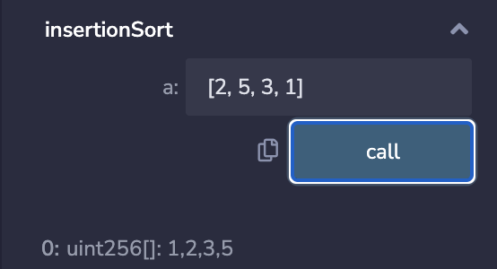
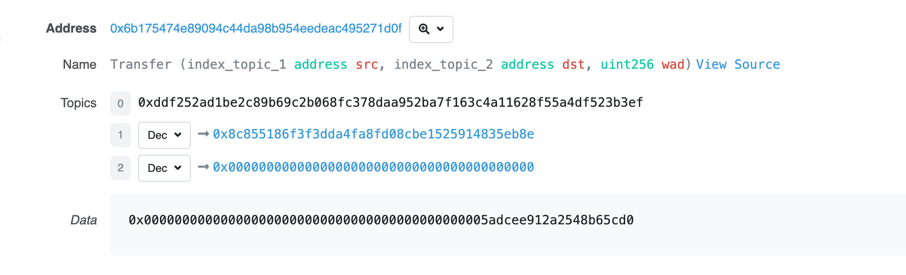
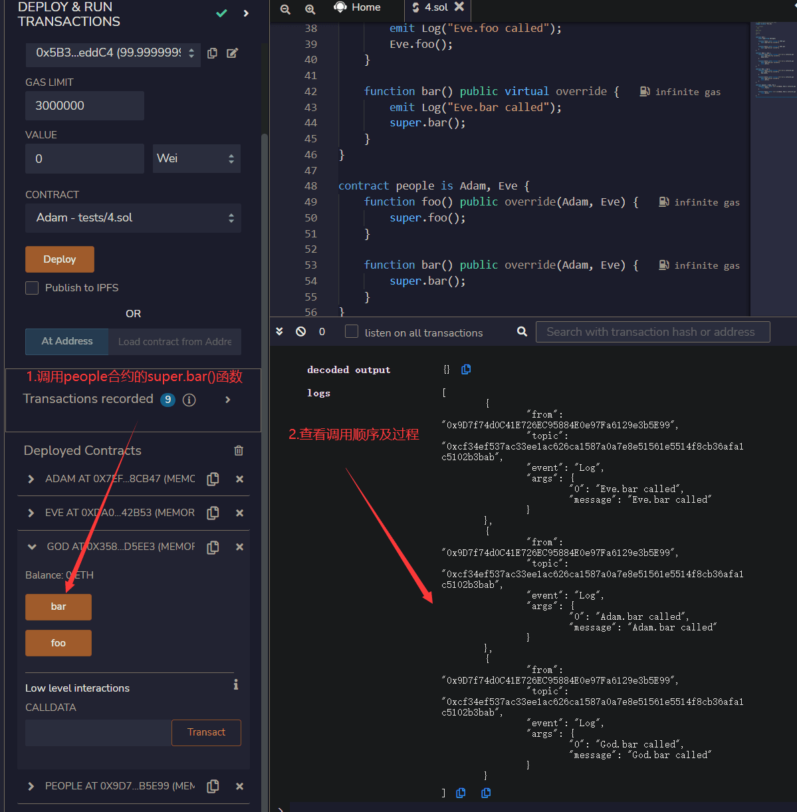

# WTF 101

[TOC]

# WTF Solidity 101
## 一、**Remix**
1. **左边三个按钮：文件 编译 部署**


2. **第一个solidity程序**


**第1行** 注释 说明代码所使用的软件许可（lisence）,这里用的是MIT许可

**第2行** 声明源文件所使用的solitidy版本，各版本差异在于语法，这里表示源文件将不允许小于 0.8.21 版本或大于等于 0.9.0 的编译器编译（第二个条件由 `^` 提供）。Solidity 语句以分号（;）结尾。

**第3-4行** 合约部分

`contract`创建合约，并声明合约名为`HelloWeb3`

合约内容 声明了一个字符串string变量`_string`，并赋值为 "Hello Web3!"

3. **编译并部署代码**

在 Remix 编辑代码的页面，按**`Ctrl + S`**编译

**部署**：按左边按钮进入部署页面


按这个黄色按钮**deploy**部署写的合约

部署成功后，在下方会看到名为 `HelloWeb3` 的合约。点击蓝色按钮**_string**，即可看到 "Hello Web3!"


## 二、**Solidity中的变量类型**
1. **值类型(Value Type)**：包括布尔型，整数型等等，这类变量赋值时候<font style="background-color:#f3bb2f;">直接传递数值</font>。
2. **引用类型(Reference Type)**：包括数组和结构体，这类变量占空间大，赋值时候<font style="background-color:#f3bb2f;">直接传递地址（类似指针）</font>。
3. **映射类型(Mapping Type)**: Solidity中存储键值对的数据结构，可以理解为<font style="background-color:#f3bb2f;">哈希表</font>

## 三、**值类型**
#### 1. 布尔型
布尔型是二值变量，取值为 `true` 或 `false`

布尔值的运算符包括：

+ `!` （逻辑非）
+ `&&` （逻辑与，"and"） **遵循短路原则**[^1](当逻辑与（&&）的第一个条件为false时，就不会再去判断第二个条件)
+ `||` （逻辑或，"or"）**遵循短路原则**[^2](当逻辑或（||）的第一个条件为true时，就不会再去判断第二个条件)
+ `==` （等于）
+ `!=` （不等于）

```solidity
bool public _bool = ture;//布尔值 初始为ture
// 布尔运算
bool public _bool1 = !_bool; // 取非
bool public _bool2 = _bool && _bool1; // 与
bool public _bool3 = _bool || _bool1; // 或
bool public _bool4 = _bool == _bool1; // 相等
bool public _bool5 = _bool != _bool1; // 不相等
```

在上述代码中：

变量 `_bool` 的取值是 `true`；

`_bool1` 是 `_bool` 的非，为 `false`；

`_bool && _bool1` 为 `false`；（没用短路原则）

`_bool || _bool1` 为 `true`；（短路原则）

`_bool == _bool1` 为 `false`；

`_bool != _bool1` 为 `true`


#### 2. 整型
整型是 Solidity 中的整数，最常用的包括：

```solidity
// 整型
int public _int = -1; // 整数，包括负数
uint public _uint = 1; // 正整数
uint256 public _number = 20220330; // 256位正整数
```

常用的整型运算符包括：

+ 比较运算符（返回**布尔值**）： `<=`， `<`，`==`， `!=`， `>=`， `>`
+ 算数运算符： `+`， `-`， `*`， `/`， `%`（取余），`**`（幂）

```solidity
// 整数运算
uint256 public _number1 = _number + 1; // +，-，*，/
uint256 public _number2 = 2**2; // 指数
uint256 public _number3 = 7 % 2; // 取余数
bool public _numberbool = _number2 > _number3; // 比大小
```


#### 3. 地址类型
地址类型(address)有两类：

+ 普通地址（address）: 存储一个 **<font style="background-color:#f3bb2f;">20 字节</font>**的值（以太坊地址的大小）。
+ payable address: 比普通地址多了 `transfer` 和 `send` 两个成员方法，**用于接收转账**。

```solidity
// 地址
address public _address = 0x7A58c0Be72BE218B41C608b7Fe7C5bB630736C71;
address payable public _address1 = payable(_address); // payable address，可以转账、查余额
// 地址类型的成员
uint256 public balance = _address1.balance; // balance of address
```

#### 4. 定长字节数组
1. 字节数组

分为定长和不定长两种：

+ 定长字节数组: 属于**值类型**，数组长度**在声明之后不能改变**。根据字节数组的**长度**分为 `bytes1`, `bytes8`, `bytes32` 等类型。<font style="background-color:#f3bb2f;">定长字节数组最多存储 32 bytes 数据</font>，即`bytes32`。
+ 不定长字节数组: 属于[引用类型](#七、引用类型)，数组长度**在声明之后可以改变**，包括 `bytes` 等。

```solidity
// 固定长度的字节数组
bytes32 public _byte32 = "MiniSolidity"; 
bytes1 public _byte = _byte32[0]; 
```

在上述代码中，`MiniSolidity` 变量以字节的方式存储进变量 `_byte32`。如果把它转换成 `16 进制`，就是：`0x4d696e69536f6c69646974790000000000000000000000000000000000000000`

`_byte`变量的值为 `_byte32` 的第一个字节，即 `0x4d`


2. 十六进制

Solidity 中的字符串是按字节编码的。字符串 `"MiniSolidity"` 的每个字符会按照其 **ASCII 编码** 转化为对应的字节值：

| 字符 | ASCII (十进制) | ASCII (十六进制) |
| --- | --- | --- |
| `M` | 77 | `0x4d` |
| `i` | 105 | `0x69` |
| `n` | 110 | `0x6e` |
| `i` | 105 | `0x69` |
| `S` | 83 | `0x53` |
| `o` | 111 | `0x6f` |
| `l` | 108 | `0x6c` |
| `i` | 105 | `0x69` |
| `d` | 100 | `0x64` |
| `i` | 105 | `0x69` |
| `t` | 116 | `0x74` |
| `y` | 121 | `0x79` |


定长字节数组 `bytes32` 长度固定为 32 字节。**当存入的字符串不足 32 字节时，其后面会被填充为 0（即 **`0x00`**）直到 32 字节长度。**

字符串 `"MiniSolidity"` 长度为 11 字节，其对应的 16 进制形式为：

```solidity
复制代码
0x4d696e69536f6c696469747900000000000000000000000000000000000000
```

填充的规则是：

+ 前 11 字节由 `"MiniSolidity"` 的字节值填充。
+ 剩余的 21 字节全部为 `0x00`。

#### 5. 枚举enum（比较冷门）
枚举（`enum`）是 Solidity 中用户定义的数据类型。它主要用于**为 **`uint`** 分配名称**，使程序易于阅读和维护。它与 `C 语言` 中的 `enum` 类似，使用名称来代替从 `0` 开始的 `uint`：

```solidity
// 用enum将uint 0， 1， 2表示为Buy, Hold, Sell
enum ActionSet { Buy, Hold, Sell }
// 创建enum变量 action
ActionSet action = ActionSet.Buy;
```

枚举可以显式地和 `uint` 相互转换，并会检查转换的正整数是否在枚举的长度内，否则会报错：

```solidity
// enum可以和uint显式的转换
function enumToUint() external view returns(uint){
    return uint(action);
}
```


## 四、**函数**
#### 1. 四种可见性修饰符
+ **public**

公开，人人都能访问

比external费gas

```solidity
function getData() public view returns (uint) {
    return data;
}
```

+ **external**

外部函数,只能**合约外部**调用

内部调用除非用this

比public省gas

```solidity
function sayHi() external pure returns (string memory) {
    return "Hi!";
}

// 合约内部调用时需要：this.sayHi();
```

+ **internal**

内部函数,只能间接调用

比如可以设一个external函数,通过这个函数来调用internal函数


+ **private**

私有,只能在当前合约本身内部使用


#### 2. 解释
```solidity
function <function name>(<parameter types>) {internal|external|public|private} [pure|view|payable] [returns (<return types>)]
```

	(方括号中的是可写可不写的关键字)：		

1. `function`：声明函数时的**固定用法**。要编写函数，就需要以 `function` 关键字开头。
2. `<function name>`：**函数名**。
3. `(<parameter types>)`：圆括号内写入函数的**参数**，即输入到函数的[变量类型和名称](##二、Solidity中的变量类型) 
4. `{internal|external|public|private}`：**函数可见性说明符**，共有4种。

**注意 1**：合约中定义的函数**需要明确指定可见性**，它们**没有默认值**。

**注意 2**：`public|private|internal` 也可用于修饰状态变量。`public`<font style="background-color:#f3bb2f;">变量会自动生成同名的</font>`getter`<font style="background-color:#f3bb2f;">函数，用于查询数值</font>。未标明可见性类型的状态变量，默认为`internal`。

    - `public`：**内部**和**外部**均可见。
    - `private`：只能从本合约**内部**访问，继承的合约也**不能使用**。
    - `external`：只能从合约**外部**访问（但内部可以通过 `this.f()` 来调用，`f`是函数名）。
    - `internal`: 只能从合约**内部**访问，继承的合约**可以用**。
5. `[pure|view|payable]`：决定函数**权限/功能**的关键字。`payable`（可支付的）很好理解，带着它的函数，运行的时候可以给合约转入 ETH
6. `[returns ()]`：函数**返回**的变量类型和名称。

#### 3. pure和view
1. 引入原因

以太坊交易需要支付气费（<font style="background-color:#f3bb2f;">gas fee</font>).合约的状态变量存储在链上，gas fee 很贵，**如果计算不改变链上状态，就可以不用付 **`gas`。包含 `pure` 和 `view` 关键字的函数是**不改写链上状态**的，因此用户直接调用它们是不需要付 gas 的（注意，合约中非 `pure`/`view` 函数调用 `pure`/`view` 函数时需要付gas）。

2. 在以太坊，语句怎样才被视为**修改链上状态**？
+ 写入状态变量。
+ 释放事件。
+ 创建其他合约。
+ 使用 `selfdestruct`.
+ 通过调用发送以太币。
+ 调用任何未标记 `view` 或 `pure` 的函数。
+ 使用低级调用（low-level calls）。
+ 使用包含某些操作码的内联汇编。
3. 理解
    - `pure`：`pure` 函数**既不能读取也不能写入**链上的状态变量。
    - `view`：`view`函数**能读取**但也**不能写入**状态变量。
    - 非 `pure` 或 `view` 的函数既可以读取也可以写入状态变量。

#### 4.代码
1. pure和view


2. internal和external

`interal`只能内部调用，必须再定义一个 `external` 的 `minusCall()` 函数，通过它<font style="background-color:#f3bb2f;">间接调用</font>内部的 `minus()` 函数


3. payable


## 五、**函数输出**
#### 1. 返回值：return 和 returns
`returns`：**跟在函数名后面**，用于**声明**返回的变量类型及变量名。

`return`：用于函数**主体**中，返回**指定的变量**。

```solidity
// 返回多个变量
function returnMultiple() public pure returns(uint256, bool, uint256[3] memory){
    return(1, true, [uint256(1),2,5]);
}
```

因为`[1,2,3]`会默认为`uint8(3)`，因此`[uint256(1),2,5]`中首个元素必须强转`uint256`来声明该数组内的元素皆为此类型.[原因点我转跳](#(1)数组(array))

+ `memory`表示该数组在 **内存** 中存储，而不是在链上存储（即不占用合约的永久存储）。
+ 内存中的数据是**临时**的，仅在函数调用期间存在。一旦函数执行完成，内存中的数据就会被释

#### 2. 命名式返回
可以在 `returns` 中标明返回变量的名称。Solidity 会初始化这些变量，并且自动返回这些函数的值，无需使用 `return`

```solidity
// 命名式返回
function returnNamed() public pure returns(uint256 _number, bool _bool, uint256[3] memory _array){
    _number = 2;
    _bool = false;
    _array = [uint256(3),2,1];
}
```

在上述代码中，用 `returns(uint256 _number, bool _bool, uint256[3] memory _array)` 声明了**返回变量类型以及变量名**。这样，在主体中只需为变量 `_number`、`_bool`和`_array` 赋值，即可自动返回

也可以在命名式返回中用 `return` 来返回变量：

```solidity
// 命名式返回，依然支持return
function returnNamed2() public pure returns(uint256 _number, bool _bool, uint256[3] memory _array){
    return(1, true, [uint256(1),2,5]);
}
```

#### 3. 解构式赋值
Solidity 支持使用解构式赋值规则来读取函数的全部或部分返回值

+ 读取<font style="background-color:#f3bb2f;">所有</font>返回值：声明变量，然后将要赋值的变量用`,`隔开，按顺序排列。

```solidity
uint256 _number;
bool _bool;
uint256[3] memory _array;
(_number, _bool, _array) = returnNamed();
```

+ 读取<font style="background-color:#f3bb2f;">部分</font>返回值：声明要读取的返回值对应的变量，**不读取的留空**。在下面的代码中，我们只读取`_bool`，而不读取返回的`_number`和`_array`：

```solidity
(, _bool2, ) = returnNamed();
```

## 六、**变量数据存储和作用域**
#### (1) Solidity中的引用类型(Reference Type)
包括**数组（**`**array**`**）和结构体（**`**struct**`），由于这类变量比较复杂，占用存储空间大，我们在使用时必须要声明数据存储的位置。

#### (2) 数据位置
1. `storage`：合约里的**状态变量**默认都是`storage`，存储在**链上**。_**消耗gas多**_
2. `memory`：函数里的**参数**和**临时变量**一般用`memory`，存储在**内存中，不上链**。<font style="background-color:#f3bb2f;">尤其是如果返回数据类型是变长的情况下，必须加memory修饰</font>，例如：**string, bytes, array**和**自定义结构**。_**消耗gas少**_
3. `calldata`：和`memory`类似，存储**在内存中，不上链**。与`memory`的不同点在于`calldata`变量**不能修改**（`immutable`），一般用于函数的参数。_**消耗gas少**_


##### 数据位置和赋值规则
在不同存储类型相互**赋值**时候，有时会产生**独立的副本**（修改新变量<font style="background-color:#f3bb2f;">不会影响原变量</font>），有时会产生**引用**（修改新变量<font style="background-color:#f3bb2f;">会影响原变量</font>）。规则如下：

+ 赋值：本质上是创建**引用**指向本体。
    - **修改本体**或者是**引用**，变化可以被同步
    - `storage`（合约的状态变量）赋值给本地`storage`（函数里的）时候，会创建引用，改变新变量会影响原变量 e.g.:
    - `memory`赋值给`memory`，会**创建引用**，**改变新变量会影响原变量**。
+ 其他情况下，赋值创建的是**本体的副本**，即**对****<font style="background-color:#f3bb2f;">二者之一</font>****的修改，并不会同步到另一方**

#### (3) 变量的作用域
##### 1. 状态变量
状态变量是**数据存储在链上**的变量，**所有**合约内函数都可以访问，`gas`**消耗高**。状态变量在合约内、函数外声明：

```solidity
contract Variables {
    uint public x = 1;
    uint public y;
    string public z;
}
```

可以在函数里更改状态变量的值：

```solidity
function foo() external{
    // 可以在函数里更改状态变量的值
    x = 5;
    y = 2;
    z = "0xAA";
}
```

##### 2.局部变量
局部变量是**仅在函数执行过程中有效**的变量，函数退出后，变量无效。局部变量的数据**存储在内存里，不上链**，`gas`**低**。局部变量在函数内声明：

```solidity
function bar() external pure returns(uint){
    uint xx = 1;
    uint yy = 3;
    uint zz = xx + yy;
    return(zz);
}
```

##### 3.全局变量
全局变量是全局范围工作的变量，都是`solidity`预留关键字。他们可以在函数内不声明直接使用：

```solidity
function global() external view returns(address, uint, bytes memory){
    address sender = msg.sender;//请求发起地址
    uint blockNum = block.number;//当前区块高度
    bytes memory data = msg.data;//请求数据
    return(sender, blockNum, data);
}
```

+ 一些常用的全局变量 [详细](https://learnblockchain.cn/docs/solidity/units-and-global-variables.html#special-variables-and-functions)
+ `blockhash(uint blockNumber)`: (`bytes32`) 给定区块的哈希值 – 只适用于256最近区块, 不包含当前区块。
+ `block.coinbase`: (`address payable`) 当前区块矿工的地址
+ `block.gaslimit`: (`uint`) 当前区块的gaslimit
+ `block.number`: (`uint`) 当前区块的number
+ `block.timestamp`: (`uint`) 当前区块的时间戳，为unix纪元以来的秒
+ `gasleft()`: (`uint256`) 剩余 gas
+ `msg.data`: (`bytes calldata`) 完整call data
+ `msg.sender`: (`address payable`) 消息发送者 (当前 caller)
+ `msg.sig`: (`bytes4`) calldata的前四个字节 (function identifier)
+ `msg.value`: (`uint`) 当前交易发送的 `wei` 值
+ `block.blobbasefee`: (`uint`) 当前区块的blob基础费用。这是Cancun升级新增的全局变量。
+ `blobhash(uint index)`: (`bytes32`) 返回跟当前交易关联的第 `index` 个blob的版本化哈希（第一个字节为版本号，当前为`0x01`，后面接KZG承诺的SHA256哈希的最后31个字节）。若当前交易不包含blob，则返回空字节。这是Cancun升级新增的全局变量。

##### 4. 全局变量-以太单位与时间单位
**以太单位**

`Solidity`中不存在小数点，<font style="background-color:#f3bb2f;">以</font>`0`<font style="background-color:#f3bb2f;">代替为小数点</font>，来确保交易的精确度，并且防止精度的损失，利用以太单位可以避免误算的问题，方便程序员在合约中处理货币交易。

+ `wei`: 1
+ `gwei`: **1e9 = 1000000000**
+ `ether`: **1e18 = 1000000000000000000**

```solidity
function weiUnit() external pure returns(uint) {
    assert(1 wei == 1e0);
    assert(1 wei == 1);
    return 1 wei;
}

function gweiUnit() external pure returns(uint) {
    assert(1 gwei == 1e9);
    assert(1 gwei == 1000000000);
    return 1 gwei;
}

function etherUnit() external pure returns(uint) {
    assert(1 ether == 1e18);
    assert(1 ether == 1000000000000000000);
    return 1 ether;
}
```

**时间单位**

可以在合约中规定一个操作必须在一周内完成，或者某个事件在一个月后发生。这样就能让合约的执行可以**更加精确**，不会因为技术上的误差而影响合约的结果。因此，时间单位在`Solidity`中是一个重要的概念，有助于提高合约的**可读性和可维护性**。

+ `seconds`: 1
+ `minutes`: 60 seconds = 60
+ `hours`: 60 minutes = 3600
+ `days`: 24 hours = 86400
+ `weeks`: 7 days = 604800

```solidity
function secondsUnit() external pure returns(uint) {
    assert(1 seconds == 1);
    return 1 seconds;
}

function minutesUnit() external pure returns(uint) {
    assert(1 minutes == 60);
    assert(1 minutes == 60 seconds);
    return 1 minutes;
}

function hoursUnit() external pure returns(uint) {
    assert(1 hours == 3600);
    assert(1 hours == 60 minutes);
    return 1 hours;
}

function daysUnit() external pure returns(uint) {
    assert(1 days == 86400);
    assert(1 days == 24 hours);
    return 1 days;
}

function weeksUnit() external pure returns(uint) {
    assert(1 weeks == 604800);
    assert(1 weeks == 7 days);
    return 1 weeks;
}
```

## **七、引用类型**
#### (1)数组(array)
##### 1. 数组（Array）
是`Solidity`常用的一种变量类型，用来存储**一组数据**（整数，字节，地址等等）

数组分为固定长度数组和可变长度数组两种：

+ <font style="background-color:#f3bb2f;">固定长度数组</font>:在声明时**指定数组的长度**.用`T[k]`的格式声明，其中`T`是元素的类型，`k`是长度

```solidity
// 固定长度 Array
uint[8] array1;
bytes1[5] array2;
address[100] array3;
```

+ <font style="background-color:#f3bb2f;">可变长度数组（动态数组）</font>:在声明时**不指定数组的长度**.用`T[]`的格式声明，其中`T`是元素的类型

```solidity
// 可变长度 Array
uint[] array4;
bytes1[] array5;
address[] array6;
bytes array7;
```

+ <font style="background-color:#f3bb2f;">bytes</font>:是数组,但不用加`[]`.而且**不能**用`byte[]`声明单字节数组**.正确的**可以用`bytes`或`bytes1[]`.`bytes` 比 `bytes1[]` 省gas.

##### 2. 创建数组的规则
+ 对于`memory`**修饰的动态数组**，可以用`new`操作符来创建，但是**必须声明长度**，并且**声明后长度不能改变**。例子：

```solidity
// memory动态数组
uint[] memory array8 = new uint[](5);
bytes memory array9 = new bytes(9);
```

+ 数组用方括号包着来初始化array，并且**里面每一个元素的type都是以第一个元素为准**。这也是[上文](#1.-返回值：return-和-returns)为什么要把1写成unit256的原因
+ 如果创建的是**动态数组**，则需要**一个一个元素的赋值**

```solidity
uint[] memory x = new uint[](3);
x[0] = 1;
x[1] = 3;
x[2] = 4;
```

##### 3. 数组成员
+ `length`: 数组有一个包含元素数量的`length`成员，`memory`数组的长度在创建后是**固定**的。
+ `push()`: 动态数组拥有`push()`成员，可以**在数组最后添加一个**`0`**元素，并返回该元素的引用**。
+ `push(x)`: 动态数组拥有`push(x)`成员，可以在数组最后添加一个`x`元素。
+ `pop()`: 动态数组拥有`pop()`成员，可以**移除数组最后一个元素**。


#### (2)结构体(struct)
Solidity支持通过构造结构体的形式**定义新的类型**.结构体中的元素可以是原始类型，也可以是引用类型；结构体可以作为数组或映射的元素。

##### 1. 创建结构体的方法
```solidity
// 结构体
struct Student{
    uint256 id;
    uint256 score; 
}

Student student; // 初始一个student结构体
```

##### 2. 给结构体赋值的四种方法
+ **方法1**:在函数中创建一个storage的struct引用

```solidity
function initStudent1() external{
    Student storage _student = student; // assign a copy of student
    _student.id = 11;
    _student.score = 100;
}
```

+ **方法2**:直接引用状态变量的struct

```solidity
function initStudent2() external{
    student.id = 1;
    student.score = 80;
}
```

+ **方法3**:构造函数式

```solidity
function initStudent3() external {
    student = Student(3, 90);
}
```

+ **方法4**:key value

```solidity
function initStudent4() external {
    student = Student({id: 4, score: 60});
}
```

## **八、映射类型mapping**
Solidity中存储键值对的数据结构，可以理解为**哈希表**

在映射中，人们可以通过键（`Key`）来查询对应的值（`Value`），比如：通过一个人的`id`来查询他的钱包地址。

声明映射的格式为`mapping(_KeyType => _ValueType)`，其中`_KeyType`和`_ValueType`分别是`Key`和`Value`的变量类型。例子：

```solidity
mapping(uint => address) public idToAddress; // id映射到地址
mapping(address => address) public swapPair; // 币对的映射，地址到地址
```

#### 1. 规则
+ **规则1**：映射的`_KeyType`只能选择Solidity内置的值类型,比如`uint`，`address`等,不能用自定义的结构体;**但**`_ValueType`可以使用自定义的类型
+ **规则2**：映射的存储位置必须是`storage`，因此可以用于合约的状态变量，函数中的`storage`变量和library函数的参数（见[例子](https://github.com/ethereum/solidity/issues/4635)）。不能用于`public`函数的参数或返回结果中，因为`mapping`记录的是一种关系 (key - value pair)。
+ **规则3**：如果映射声明为`public`，那么Solidity会自动给你创建一个`getter`函数，可以通过`Key`来查询对应的`Value`。
+ **规则4**：给映射新增的键值对的语法为`_Var[_Key] = _Value`，其中`_Var`是映射变量名，`_Key`和`_Value`对应新增的键值对。例子：

```solidity
function writeMap (uint _Key, address _Value) public{
    idToAddress[_Key] = _Value;
}
```

#### 2. 原理
+ **原理1**: 映射不储存任何键（`Key`）的资讯，也没有length的资讯。
+ **原理2**: 映射使用`keccak256(abi.encodePacked(key, slot))`当成offset存取value，其中`slot`是映射变量定义所在的插槽位置。
+ **原理3**: 因为Ethereum会定义所有未使用的空间为0，所以未赋值（`Value`）的键（`Key`）初始值都是各个type的默认值，如uint的默认值是0。

## **九、变量初始值**
在`Solidity`中，声明但没赋值的变量都有它的初始值或默认值

#### 1. 值类型初始值
+ `boolean`: `false`
+ `string`: `""`
+ `int`: `0`
+ `uint`: `0`
+ `enum`: 枚举中的第一个元素
+ `address`: `0x0000000000000000000000000000000000000000` (或 `address(0)`)
+ `function`
    - `internal`: 空白函数
    - `external`: 空白函数

可以用`public`变量的`getter`函数验证上面写的初始值是否正确：

```solidity
bool public _bool; // false
string public _string; // ""
int public _int; // 0
uint public _uint; // 0
address public _address; // 0x0000000000000000000000000000000000000000

enum ActionSet { Buy, Hold, Sell}
ActionSet public _enum; // 第1个内容Buy的索引0

function fi() internal{} // internal空白函数
function fe() external{} // external空白函数 
```


#### 2. 引用类型初始值
+ 映射`mapping`: 所有元素都为其默认值的`mapping`
+ 结构体`struct`: 所有成员设为其默认值的结构体
+ 数组

```plain
array
```

    - 动态数组: `[]`
    - 静态数组（定长）: 所有成员设为其默认值的静态数组

#### 3. delete操作符
`delete a`会让变量`a`的值变为初始值。

```solidity
// delete操作符
bool public _bool2 = true; 
function d() external {
    delete _bool2; // delete 会让_bool2变为默认值，false
}
```

## **十、常数**
#### 1. constant
`constant`变量必须在声明的时候初始化，之后**再也不能改变**。尝试改变的话，编译不通过。

```solidity
// constant变量必须在声明的时候初始化，之后不能改变
uint256 constant CONSTANT_NUM = 10;
string constant CONSTANT_STRING = "0xAA";
bytes constant CONSTANT_BYTES = "WTF";
address constant CONSTANT_ADDRESS = 0x0000000000000000000000000000000000000000;
```

#### 2. immutable
`immutable`变量可以在声明时或构造函数中初始化，因此更加灵活。在`Solidity v8.0.21`以后，`immutable`变量不需要显式初始化。反之，则需要显式初始化。 若`immutable`变量既在声明时初始化，又在constructor中初始化，会使用constructor初始化的值。

```solidity
// immutable变量可以在constructor里初始化，之后不能改变
uint256 public immutable IMMUTABLE_NUM = 9999999999;
address public immutable IMMUTABLE_ADDRESS;
uint256 public immutable IMMUTABLE_BLOCK;
uint256 public immutable IMMUTABLE_TEST;
```

可以使用全局变量例如`address(this)`，`block.number` 或者自定义的函数给`immutable`变量初始化。在下面这个例子，我们利用了`test()`函数给`IMMUTABLE_TEST`初始化为`9`：

```solidity
// 利用constructor初始化immutable变量，因此可以利用
constructor(){
    IMMUTABLE_ADDRESS = address(this);
    IMMUTABLE_NUM = 1118;
    IMMUTABLE_TEST = test();
}

function test() public pure returns(uint256){
    uint256 what = 9;
    return(what);
}
```

#### (3) remix实操
##### 1.
部署好合约之后，通过remix上的`getter`函数，能获取到`constant`和`immutable`变量初始化好的值。


##### 2.contant
 `constant`变量初始化之后，尝试改变它的值，会编译不通过并抛出`TypeError: Cannot assign to a constant variable.`的错误。


##### 3.immutable
 `immutable`变量初始化之后，尝试改变它的值，会编译不通过并抛出`TypeError: Immutable state variable already initialized.`的错误。


![](data:image/png;base64,iVBORw0KGgoAAAANSUhEUgAAAcEAAAB4CAIAAAAFa962AAAACXBIWXMAAA7EAAAOxAGVKw4bAAAAEXRFWHRTb2Z0d2FyZQBTbmlwYXN0ZV0Xzt0AACAASURBVHic7Z15VJTX+ce/SfprZRtkUBYRIggMm0GQRUWjwqggR0RqYionUUwV1NSqaUFNqsZGjTZRY6uAxqjNQWticTsKElxSg5XFLWEbwBkFAUEYnGFrWpP8/nhneWdlGAcY8fmcnJOZ+9733jsDfnme5973eV7wC5iC5x6HYS/U1nUN9CoIfSxdkpB+5B9qjcsWvrH/QPaArIcgGF4c6AUQBIDE9AtblyrfRnz41YEPo3T2jvrTkYtnT1zMWu/WD0sjCL38YqAXoIQ7bnKMtwUAoLvqwtVisazdc9qMcCdlt46q66dvSPt/eUSfkZh+IdaxcO9+ZUvB+/mxealbl15cv1+z+7T1K8NQuHPe+stYtvCN/lsmQWjDbDSU6zPZ5VHOsUoxI6YzQ9qOldTIL5JuGs7CiLVrXhbuPPrlkWdkiqXpsaOF52ZsKFBpzVx/YuzReV+l1ry245LaDR521lLBxcummJsgnhqz8eXFlafPVDKmp/iGqAncUZ7GDOPsNDxorJ/+PoGBvkOHcowZnTA5UanRHp1FJ7I0r+xfdu4uZ+xryRp3jHDoj4URhGGYjR1qInx9PYODA+zsbC9d/rfWDjOmTw4K8isu/k5Xh75l+OvfJgTayN7UnszM3ASAsewCZM3tpQcnFQgBwDf5TlDbzlt2a151A4D2OyzTz+PAgrfD5AMJ//Xe3Ar2IIFrkgPXAEB7UfZHSx4x89rlZwoCk6d7sKf2Tb7zKhTL2BS7ZS6+Djx3RTaub/KdV+Uhx/Y7O49+CT1T6PoUmHoyeXxL9peYzixY2R9A5BQva+GV9y9q/bKybglj541NBLQoLEGYCeaoodxx7o4QF9YoW6y9xyd6AwA6a3Pk5qpWrly5bmk5JDg4AICmSjICeutW+QAK6KN/vTepQqV5YcTaNQFtJzM/2gQAU08mv/0t5AJkE7gm6M7OzMwjmHoyefqSiJIjBUIAm2LfDpN8HXj0CnucIwUfHSnQ42i7zU12E/7rvcAKbIrdMjd26qZzV9S7sPFNvvOqXVH2ewq9AwDdU+j7FLAJS3i7vfRgYIFwYcTaNdNfXyi7NyLS16qj4p6uJey/fW8e3yUSYLvzXsOtOiqvalddguh3zMaXV8D1mext0VFVpZDQmst5WceY/65XwS0mzoer++6ffv75/PkrlZU1wcEBkdMmsC9N50965RWfmzfL8r6+2nfL18OmsECbB1/PrVBr9pj0sk176debZG+vnCptt3k5ZKHsbe1JmdxcufMANkNZG9EjeZvQOxhzFYDocTtsHRbq6+txIMitvfRLFQHV21/vp1CapUfEbbCxc5c1j7LnoKm+QH0wNpyhiqAOsx0fdGfenD8PzE+QIDQxMw3l+syZ6Wb9sFzHDpK0uFwMK2s9Ggq5jJaWCtgyOp0/KTDQ986diq/zvzX5qg3Dw8UW7Y9rNdrdhtngkVioeK+qMtrZdO69kw/c5iZvuZO85c6C1/WqoYL2lhb5FAUfBfawI6S+qp7o4VMoL1VkBspDB73l4p8XRs2edyvwxOk/TTZqAIIwPWaloSP5M92sH5ZnXX6gqwfX1sKQgX76+ee8vKsKGY2cNiHwFZ8BFVAAwnqJqiEpo7alHcO5Hor3C7l2aG8T9TTcpnPvBWa+F5h5sAiBa2KnmnSpWlbV2/6GfYp7rVI4ukTo6yJ9XKPaUP2o09pnsu7DowTRr5iPhnJC4/wcO2tzdAuoppuvB4WMhoa8Mm5cwM1bZQMqoACwSViLkdNP+qo1C7+9324TMH0T827460sCbIS3DD82JKyXqLw/Im6Djcek4Ybd3dLWDjuX4QCwMGLt3JFqq3r9gLZxtE1h3KcouFTRae0bEanj8tKxo9BSr362iSDMCXPZU+KOC/S2AuAW8xu5pSbbPuKExo33tmKauqsu5BXr2VFS5aeff8698K+mphYAt26Xm3zNvaYiMxDJd17dcudV5r1sc/xIwUfuQ7fMTd4yFwAraqkblU15tN/ZefQKe5aTHlvmJmy5A6htgmvh0Zf5D+SdH3y9s3T8mqGyK0cKPgLWrpGNo3oqQNsUvf8UAHDpm+p3wr0io3BJyyZRYpAH7mbTpjxh1rxAz8uDnpcfUJamH5037PZHGmfpl6YfnYdzM5bJNFT5vPzbf7kY2bY1cetFel6eMAPMx5cnnlOYs/TvbFaNiiZvnedx78QybUaosK2Dw4ua1j+rI4geIA0lBpysZTPPNYXHquQc4Q8v2qHtYXkAl7fuKUL4Gso5QpgF5hIPJZ5vspbNZL8teP81fYdGL/55IRM+pZwjxIBDGko8M5BiEmYI7SkBgMOwF5pbfu7TKWbwg/Lyb/XpFARB9D8UDyUIgjAe0lCCIAjjUYmHcl560eIFfb27f4b0x5/6dkUEQRDPDkoNfdVmyBYXzn/1RgUtX3xhX3PHF62dfb4ugiCIZwGlhvoP+cXR1q70Rx16ek+3HTKTM+SL1j5ZyjvL3xw71g/Akyc/nvhnTv5F5emWESMcfv+7JHv7oQBqaxs2f/jXPlnBs8+MVZ/MepndUH9+9c48BL/5QeI4VOzd+Fk1AMz+/a6p7tKKvRs/c1/1yayXmT4A041Tf371zjz+mt2xkLfLbsG5dz/Fmt2xLuqz3r+yavdZ5qVX4ocrQiykJVkbsm7KrvJVb1Hr7H1PviolzCAan6KHTy069+6n+fIZJ0v3bvysWtenqPvt5hRfKBbJX7M71kVlzSbDZcHeuCCbrluZR46qHtbyXL0wOciy/daZzbvqVS4smPuXaCfcL/rjn26YejFEn6DvbJOvxf9ZvfDCjS79tqlp4EdFODkN37BpV0ND8zvL34yL4zc0NpeXVzOX5v06prRUkLZue98v5Nkmb/e7ebq0iTNqPA/VAoDnaK9yk4svH3n5AFy4PVZIyd+5Kh/QKX/B471xo6R+nHewF26yLilEcPbvd03dnFjfs1pJKzS1VW//bvuA2cg/a/gdHPkivRz1J1M0lgj+hmSXmlsPEaT2tbos2BvnWVN9H15qE0f9eVk0qm+1OwX1yYKIPkHfntLbw6wS7a36Zx35Fwve37CzoaEZwKUr1wEE+HsxlyZOCC4tFfxt3xf9s5LBiAuX0y26D6+QYABeIaNaSyqkHI47gh3tILpf7x4wGwD4XvYlFSJwHXnGzsML9sK961nVIs6o8doHOVtx39jB9dN2r9ou/E0DV+7K4UjrRWAWGTzeW3yjpJszXMO+fipcFiywKXjryNEm9Queq/ncgvTNu9rULyyYGyE+88c/GZCphTAn9Gno/f/++CN+7gcjVA9+fl5Dh3IqBYYnAya0Iq7IuYfhLoxkVJQo2rvFOdUiO0cvYEYAt7pE4198b/AKGcVpa6pGvVhqwei1OrzfTnq5u7rE5C4zgKbrVdA+qVbaqs9XgesK8IK92qqvm3499UdXnNRasKRm15G/HdV24ehJdb9ehdd3nzp45u+/p+Pc5oY+X/7JTwOjn5FTxwMoLasGMMLZAYC7+8jP9m+DtlApYSiCm9ULps7gOXq1VX8Bx0nKC2cr2j4cz5vNtbt3XoBZxk8QPN7bQnT1LIDrVQmq7rzLrF2fMCNLS7K+EBgwGMd3xa5PZK8N8+urswpbP1CLIejtX3LPPma2l+Oo1tLP4Biuv/OU9/76bqilSpP0u0/e+vQbw+YiBjE9POv5pN9VlB8VERDAKy0VMMFQAJaWFs5ODr9dug6AWqiUMAhZAPTm9aqENxdwW69+BvwWABMAFQN5peLNC8JRlV2Np/BnecFenPpv8wGguuSeNEQefgVU46GJmwHTx0MB4GxF2yez+Pi0p36yAKjgZvWChDftxN9mAYk93PLNlt8NtFx+uSr+ywFeAqENfb58+08/3//hSb8tBfLto4aGJnb0s6ur+0R2LvNaLVRK9IrqknvgiCuYzWt23DO/upUDuYttwXU1ZnCvkFEcqVRW/EPQ1Kp9nLOfnqvneAf30c8vr1Qe2zWIm9erwGmrlu3a2znqWdWU9/565tRBlf/IrSYA6LdDzz7uHqL3yL1p8fPziovjNzQ0sY8uNTQ2Axjh7KAwPJ/874lYLNE+BKEfwWcbVjMvmloxinXh7KermR3terEUOnapu8V1eoYOHu9toeKAA9C2Ue7lyAW0Fhw0BflXbkyeOkNfj25xHeAoe1Od9f4q5kWTGN76bjMDO5QwU3TaoS8BG11sd7jZWb7YHzo6YoTDwjcTurv+89nnx9nt5eXVjx9LJ06Q7RVETh3/v/89Ka8gR76Pya8WwWVSouxrn7Fqqrv03nU9cUxesBen+0bGu6tWy/87V4+XvTTkbPasEAtplaEhy95z83oV1zdA/q63n8KseX33qYNnTm1cPNDrINTQaYf+CBx41PEi0N0vO0sJ8TOZI/SbNzGWElpbH3/610MNDc2ffX78979LYvaUFI39sKRnEdYZe8YkrD+/emeeK0f7uU9XR3tAR3mqs59mOG5OSdwdkggYEJ105XDU5Cm/WhQ71ZePPIC9pyQ69+6GfFY3FdOVdZZeV3tPVGcVYtdUSKV6PsWM4QZVh31Kov68LFr+vENQ8rKgZNzPTf/bUfkpetmFuL/8HbIT9RH8DclesipZNmF/+XsY2qszV+TLKzDWiqXw4Li9kgQc6oflE4aizH23bLj1L1584a9N7Xp6z7Id8qrNkLUPHvfL2voPyn1HmD/M2QDh6bdXkYaaE0o79ErHD7tdh6YMt9bTu+nJT6vvG1xXkyAIkzF+Cs8S0u9OkoCaGUoNrej+38wqPVV0CWIg0UgFIIf1AP6gJWnjmTludCLVPKE89gD58gRBGAvlYCYIgjAeqkkn4z/d3YNgCoIg+hmyQwmCIIyHNJQgCMJ4SEMJgiCMhzSUIIh+JjH9wtal/TpjxIdfHfgwqk+GNqM9Je64yTHezEN43VUXrhYzZ/k9QxJD1ZJgsK4SqsxK2xfnzm6oO5Oy7TxCF29PCkPZrrS9AgBISM3ge0jKdqXtHZ22L86d6QMw3WzrzqRsOx+9LiMe8nbZLTi1fAfWZcRrpGMS5adsz2Ze8pI+Xh1uKSk8lHaoWHY1WvUWtc4+IvmqlDCDaHyKnmAmYo2vNrVyVX4rtq/0t9W9fsUV4anlO3KV34AHazbWZ2S+N8121R8He2H9yny3dTHIWVR7W619gsOyZPuazIqv/92/60lMvxDrWLh3f0/9fvJ896GzyOlqtnZDzzpBPHkMqv/OrREZMGnB+/mxealbl15c3+O8vcVsNJTrM9nlUc6xSjEjpjND2o6V1ACoKcmqYXXzDEkMRRsJqA7Ob19+Xpc22bpH+EFQDvg5q9ZTcg2IxvlcAK7DbNEDudtScgGd8hca4YOiwrownzAeilmXFCKYkJrB355Up1RYXUjKNLVVP7MCXYWFZfbhvFkAS3DZUydlOLjKhayraM8fPi8Ho4AZ252V0ymmjl6XEf/x4lqmG6AiqQoSUjP4HqL8lDQ1fZT/3Urp3acY9CxNjx0tPDdjg0oa9R7k0iRkrj8x9ui8r1JrXttxyaQDm40vL648faaS0UbxDVETuKM8NTtxQv24HVVVNZpXCH24DrPtEorACw8FwAt3by0sk9hyRiPUiQuhqM4jMAEAonn2hWVC2Dv5GTuPXxgPooJDAqGte4T2QbJLDTEajCEhwL2u9FCRQOIaEK196h17yiTu/FT1q8Wfp+ULbf0XJ4Wq35ErEMJymJveaf2c7dFVdFbTwHQdZgvhZRJQVaJSoz06i05kmWCojmxuzgeGGaEy9i87d5cz9rVkE0zOxmzsUEPw9Pa26q4S9Vn2ycFMa+lZ6ZTZrgAifFpLj2CKrPhFV8tZARY684DRgfaCs4Jh4e56x9EHL9zdVnxNgLoWiSUvPBTlGsam34op7l2Csz0ZoUYQzfOQSE+jGOKksMAE5GrzmsuLBBJ/nnMoatUuZJeK+HEOroDKwnhJEz1Qd0bd8NTEMmx2wuflWmb0mLaCl9u3MmrzxmGe/CfWzHbYx34QEqN8NlaZ6Mx5je+iVxSVJjtZ44xszRTizTEhlgA6S5Q+PmuK+4JtG5VJidhTPP7u+/SdP2iZQuWWyCle1sIr77PqTP3k+e5DLyZHx5iHMWMAAB12Vz+xkNdof+L5bgvT4eGlEbeuAgAmd8REMiowRN2Xd++e/FabPOcH5+YH1ioVwrJuCWPnjU0EVEQ8cvOBteFWd7MXLMuEEZijhnLHuTtCXKhhbXq6cvGwnCKhRlJeJFjIn+XnzBMLPocz6wnf7FLxxxF+CcO4otPlmGP8BKERPpbCy9kACirnq7rzrnEZ++IAAJLCQwrXWB+2/qsz9sleG+DXzwp0lVQeEgCCO3Vx8WruvOrADjrS9HOdeepTq8dhPeL3ZcTLXsv8+vK9aafWZcTzMzL4qhHP7B17nLev9F+dsc/AuATzL1mlSXr7I/2O59gP7CoXlfwDAH41fd+YmA/abm9sB6Nuw2sPL2puhCweyuC8xnfRK505iypuQxYPZQ1mFZI85vF332/b+YPzGt9FbzqU/ru5ETZvHObZfff9tp0/MFOs+0Cmic5rfJVTsJnvppxCjYhIX6uOinvsphdrPhlRo9uXtx7TYnNpRM5VWCeIJ0d2OF61bgJw1TrnqjXcuye/pfbUyn+D3mrruDTi6lVdX9j+2/fm8V0iARO68+anoVyfyd4WHVV31CWU6+Pv1F114cGALOrZRhYALS6onL94oX3r5b3ACgCMv9kCnL/Tun3hRFQeF8CoMiCyWcJ4tnXf5AKAoFAkCZeHXwG1oOR2wNTx0IQAhXmbKxDG8+URXqNgpo5ep5BLBdriofIYcbRMSZV9yvempcj2r1Zn7FPZZ9PGpQ1Lev0P+/ZGhUn9Q2lNZ4inhTPaG2Hj83JnSaaGuuFXAZ5Wohxt6gaAZUs21nfilSGOQON8O/eu2sMyA/OHr79pDomxG4t22QiW9gETmhu1bEk5+MyvvX1co3mUPQdN9b0pKNnxvRNje3bcsugY023jjqaenHcn7//i6i/1dOAM9VTVUGO+eRZmpqFcnzkz3awflmfdUHfYPQPdrMkIfToEhSKEc0pzAT+AHffMFbTGT2wpLAZc0WMEUAe8cHdbiegu86a8sRX+w9wAdZMze8cpXsY0tR2npyaa54HWUrlet0jAcw5Vc8wBMH8zJJV1gLNqe6gTFxA3CgBlgfrc/KJpSb3Q4txtKbngJX28On7drFyW9cooafS6jPj5iwuL9djgxtihmO+2LsZB+barFQAmWNgBrVp6/9LeUkurgrZ6mTOO47XbjgOAs4sVLB0WHWb/RsjCAo07Kw6v8V2UHBKSDJUwwvHabcC6mJB1MVCNCfQDv7z1wbCgjS0xGwGg4/u+3aSSY1YaOpLPCOhlDWOT6+PvhKZiMkKfDubfMxiNY8c9s3ekME5oXYsEw7Tf3NWiHkZkExrhY6nigAPQFpfkOdubvJ7SrEBXAIpwAQCoHwwAwEhtV1FhMRCm0u4XxrMFE4VgUfz5ZX5GLwOajAHu5KfxxyNXIIzna/ujoqT31tAEh2UxDqKckn8werfGd5GWfdinorG+E56th5drmrQA0LizYhsAJnSw7z9Nim7Ha7cdr5UtKdnt0b/l8nqvVQo/lwigD2ub//LWByMAJjD6MOiRPITKQvrYtJvSZrMvD05onJ9jZ22OpoACXPfh1p21N2k/vt/IFQjhOkW+VT0rje8hERXoiWP6hfFsu4r2LE9Jkf93qg7uPI1q9Qlzwi0llUUm3WZJCHCH8BRr6j1lEs2DAX4rtse7SgqPa1iCCakr/W1F+dqcdIHQ1n+O9l1+7cya7W+r7YtitqdKjQ4vaMdtyFB0tjJ/2SY4xCu2cf4tqemy8pzwK0DNUG2vvA93Pxum/7Jkt6E9TnG8TWTpFr/mV/p7NUk6tbY31qu2F1yq6LT2jYjU6Phi+2NYu/+gL/97bxG91KGldenYUWipV/tbFbn5QN6Fo9mbI4ybyVzsUO64QG8rAG4xv5H7DZ21OcxpJ67PZG+LpuJK8uN7hHWomzEJ686kbDvvxtF+7tPN2R5o0T4SsyWSlBGeBBgQnXTjqGuHIi4JsPeUhKeWp7GlRMV0Ze3h6GrXxM/ZHrI4rAxm/z08FI3qU7OE0jJs5T7GHJUUHkrRHqnMPl04ke2bs/eUZPFNtScIFF+U2jF+Ax8T6B3Ha3P8QmIU3nROc4xsp/CHr7+o9Uwes+4wgOaczNoJyUOYC7c3CnwO89YdBtBZkimwTx7Z0xzt/1gkeOMwMxQA5T672r5/jnxzSW3fvySTHX699E31O+FekVG4xNqaB4Cmg8MebmyZvLENUNuX14Lj2w3B8oV7vdXgpdiyV9mUR8f3TuqbS4lBHribrX6y6lL9o7WwsvaNiESBEYFRysEMAA7DXqit6+rTKeJmTzxz9lqfTkEQ5s/S9KPzhvUY5+2zqXFuxjLN06mJ6RdiR/ccfdaO+fjyBEEMfpiD7u8Y6zgbT/LWeR73TmgRUCDZfzRwN99IWTcXX54g9KORCkDOgD2HThhH1rKZSL8QuxQFJn90XTcRH/KHF+1YojFjxIdfrQjjwOgD9iBfnoF8eYIgjIN8eYIgCOMhDSUIgjAe0lCCIAjjIQ0lCIIwHtJQgiAI4yENJQiCMB4zOh+qvZ4SAIzk/8bPUfaaiinp4zmtp9T7KVS/K0VdEAZ2fST51NHrMqZJ5eOofZ8mYuR8YQRGHD8+ROPKfyauamA+n7Ty5Zzcl4yeghPdFONqlXPAegDymMt/hUycNGDgMRsN1VVPCSP5v/FDcR5TVUn1EqHOc1xPqXdTzErbF8eVFTviJX28euXHYJVXYtVBSkhNSziveoZ/VlofCKhehlzb7QH86L/kvlFpCYk+xWx8eV31lLjWVuiWyA1PsaRbx/2EHp6Hekq9mcJvxRT3rqIjMhEUHDpexBQvAXhJ88Ns684o9TF7h9pDUNHr4tzZHYjnHbOxQ3Uhrix76BY+czIuXC0Wj+SHcjuqrpMR2nsGez2l3kzBpItmZZkqlhcvQYSPpaTwuO64QUJqvKvw1HJTZ2BiMXK+MIJJEd2o1a9XxbUj5tfNHOZ1p4OKk86+BG7B7qFqSSU50U0xPp09BAdCF29PGnb5UMs0WXBDkftK1REJXbw9iVd5KO0QFm9PGlZZZh/ub4u6M6cQF++q6lIoS0yz02ix4iqsuI3fiu0rOd+kCAJkt6iGdJK35iWM6ijcm7ChD7ORGoI5aqhaPaWay3k1niGJM2d4A03FeadJQY1jUNdT6vUU4kZtA/YQzYhI49sXHkozKKKXmH4hdrRqkwEPZTs3jKl8+fjxl+DaEfPrholhHteKdHd27Yj5dbPkmkdOEQCMnC+MWQKZjKpe0oQT3RTj86uC3Y4GpDX3iE/CqeXas/Rr7R/OOZOSH5DBj5tWtmtP2eKVyqowHvETi/Ys31GuMpR6XCVjHZRa6RqX4So8tTwlF7PS9sVpxFXMAfPTUI16Stxxk2O8UXUhr5gbkhg6I9FVW6J7Qg+Dv56SUVP0Flv/MFtImnvuCADIWjbTiArAjSNkVmGd9feNzWO4PwI6jUSOfyen06FArpIPrjlIf93p6mpdVoeRE5s5jSN0CajrfGGAsxbLVAeSwkM7WD9WLVn61fvnn4drACC8vFdQnsCumCA8Jdu7Exy6Jgyf6OQHlCcEuHcV7VHEVa4Jw1XKYSnM1bvNXfBx5gGy34rM9TOMzRJiWsxMQzXrKckSMOcViwFxSRZCEkPdQ7kPaGveCAZtPSUjpuCy/jUyiBsFqGuRwF7XLZKyXWmNczKSUhuLDdhcNs4OVYVj+z99GmrbCamt0nmv+4UEnbbOQN2PthxI6/5P+21WzQFWkFbaDLwdwvymOdvD0kOeD5tBqHyprEAjOPSHlH5cnOGYlYZqq6fEtbZGd4NCMcUdHbAYiLUNCgZpPaXeTqFhJodG+FhKKuuA4ofiJI1DBWyyd5ziZcR/vLj2Dz2FC4yzQ5Xo1UEAgFRiBdcnHMVndX1iC6vaRgAvSaS69bfTIefALwJW3Y/BUx2Tekr8nO3RJaiV/SoK9vT4fZovZrMvr6ueUs3DJliMcJfFxj0D3azR3UZGaF/zLNVT6v0U5UUCiWXYwhVMFU9mL/6bQ8UAzp8tk9j6r05LUIyWqnwNAMjdtqsQYSvXaXw00xLWHmBlVVumT+OkZVZSq+YAmQH3o390M6fRtqwOAB6IuHBumBim69Yh1/7pAJ/7MdE/slujUrMvHM27sHWpAesTNLbClsMY2rPSFMdpDYVVeCq7VKT8WfSC5K15F47mpSf29j6TYy52qO56Sg/yL1jPmTk+0ZtpFRfS4VDdPI/1lGT0aoriz9OA7UmydoniNChjqiekZvAzMviK/mozCQ4dL/JJilPZ+jAFUokVfBrmr2LecZUbPmGP50+Umw0+9+f7yLfs66xzrj2ZP1E4fyIA1X38oqHHAeUlzX152b3357s6GHfkPje/aFoS851LCg+dQVJPeYjrWiQIUxSkEuWnpMl8lPPblyNtXy9/3EDN4w7A2sN/KdCPuZy1QDmYAcrBTBDPHkwK+nsnZq4fWA01H1+eIAjCYKIi/DjoKDw3sAIK8/HlCUI/VE+JULA0/eg8D5jDAXuQL89AvjxBEMZBvjxBEITxkIYSBEEYD2koQRCE8ZCGEgRBGA9pKEEQhPGQhhLEYCZy84HszRHK98lbzeH5yMGEGZ0PNaie0kNKfKeP57KeErv8kQJZiST1L4T10KrKJdmqlBmCDZ7drIncfGBt+KMTM1mHKDPPFX21InvzPXM4WTk4MBsN1VtPyarqetYNKcAJjRs/Z5z09I0BKKn1TPBc1lMq/jyt+HP54Fqqnmk5hK9WNEmBPH+V34rtK/symZDpxtdTdA9Rqe+Eo2iH2qOQBe9nRGSnLRUOmwAABc1JREFUrkhPLuhdIj5CB2bjy+uqp+Tp5AhxmUw0pcXlYmtvb88BW+UzynNVT8kQXIfZQnh5kNdEWjpvrLXwyvsXNS5c3PG3ws7R/NTIAVjUIMRs7FA9dHYo3XpxRweG23EBSn/XO56bekoG4zFtBS+332XUb8X2lf6MuR8mTzysDH2wrqrEQ1TjFUxqd1bEQ5GYil3kOTHIo7Noh/Ycppe+qX4n3CsyCpdUFDYx/ULsaOntj17bcckkH/b5wBw1VKWekrijw8ot2LMyvwaQ5w8d0NU9swzyekq6cVckslP49UxmP//VGfuedvCo1OzUsdYqTZ1FO5Zosf4YmDTYWn15vxXbV/q3yhL3qVQ0mZWWFCZWJotjEBz6Q8oh3b58sv9oPLqlaxkXC8pTxtp7Aro6EAZjfhqqVk9JXHm62DoxdEZiKAA0VdV2OA0fyOU9izwX9ZR0ozUpiVLL/Fdn7FM1+nrDxR0JJpIhXri7rShfnvk0+3ThxNXsv0PuvFmA4VtbkS7DIa3Wn2nX0SUCYO8sPW3u/ecTM9NQzXpKAGpKshS/C54hiZTH3liej3pKvYFR0uh1GfHzFxcWG7PD01s7VDejHSxVTGYAEtn/mSzFMlvehH9dCFNgVhqqrZ6SKp6uXDwspzz2RvJ81FPqNbkCYTxfm+IbgOns0LvNXcA1XXn8mBMXTGB0dVpCj+n+LtU/Whs+1BPQE9lsqqfjTSbAbPblddVTYuE5bUa4k7iQzof2A89wPaVew0ua6IG6UoOqxpuI8sZWWDLHJBQICkUSd35qtP47ix+qOmGCxlZoPQWRWXYXo4KSdQwTFeHH6WxVN0YS0w2up0QoMBc7VHc9JU5o3HhvKwDAw/KsYySg+niO6ynphu0gMx+Etf1tgvGNgakPKvt6ZdHY8r1pe1ZsXymvOKTcmld9iEBStou9uZS77UzgvjjZFj97Xz7rljB23thEQEuIM3KKl7W0+pK6BX2vVYrRnFFByQAdHTUYysEMUA5mYlASlZqdOrZJs6h9VGp2qle5tqBt5OYDa8Ot7mreQujGfHx5giBMCnOWPkHNN4/4MGUsCg9r2/WKiPS1gvT2VySgvcFcfHmC0A/VUzKCSxuWYPOBdzZH7Fc8HZ8cG9Zybobmw/LJW/MSRoEO2Pce8uUB8uUJgjAW8uUJgiCMh3z5fsLJyWnpkgTN9v0HyA8liGcY0tD+I/3IP9Rali18Y0BWQhCEqSBfniAIwnhIQwmCIIyHfPl+5O2/XIx3BzoLdy5cf3mgF0MQhCkwHw1lFU0Cmorz8pUP87Ie95Q9APpscvCPUQcR9acj63+7PuryVsrcSBCDAPPR0Af5imfhPUMSQ0M8a5h6SvCcNt67vTzrzANGTGOmdTzTZekufitYGWbnRdlvCWJQYJbxUHFHByzsuAAAro+/U3fVHUY0pcXlYji5h3IHcnUEQRAKzFFDue7DrTsf3RWrvwY4oX5cwMKWNJQgCPPAfHx5eRJ7ABAXHmMFPds7xPKrncXXq/zGj7DlmF0eX8O5XP9wTXDQ28DBgV4JQRBPjTlpqLjy9LFKAOD6zPnNjFGsbSXuuMkx3t2Fx/JqwAn1Q6fkmRVQADiSPPtIyp4TF8+Kqk7cGOjFEATxVJijLw9xZdlDOLqOlL118ovhiLKOMVtMHFurAVyZSViYefZE0J15UbP/+N1AL4UgiKfELDUUANAhlQIQix51QLGnBHCtrSC+90wXVJrm4gTRLXLkCWJQYJYa6hkS7tTdIJICgLihodPCe5IPFwA4oZPcrB8+fKYllCCIwYTZxEM9QxKVR5bEhceuyoVSWnzmOuLGy+os6a36SRAE0c+YjYayi8irIy0+k1fcn4shCIIwDLP05Qc1UZN41tK26oFeBkEQJsFs7NDnAWXOEXpYniAGCaSh/cjBP0bRdjxBDC5IQ/sPylpPEIMPqusJ9EtdT4IgBiW0p0QQBGE8pKEEQRDG8/9Vm4UekzBIrQAAAABJRU5ErkJggg==)

## **十一、控制流**
#### (1) 控制流
##### 1. `if-else`
```solidity
function ifElseTest(uint256 _number) public pure returns(bool){
    if(_number == 0){
        return(true);
    }else{
        return(false);
    }
}
```

##### 2. `for循环`
```solidity
function forLoopTest() public pure returns(uint256){
    uint sum = 0;
    for(uint i = 0; i < 10; i++){
        sum += i;
    }
    return(sum);
}
```

##### 3. `while循环`
```solidity
function whileTest() public pure returns(uint256){
    uint sum = 0;
    uint i = 0;
    while(i < 10){
        sum += i;
        i++;
    }
    return(sum);
}
```

##### 4. `do-while循环`
```solidity
function doWhileTest() public pure returns(uint256){
    uint sum = 0;
    uint i = 0;
    do{
        sum += i;
        i++;
    }while(i < 10);
    return(sum);
}
```

##### 5. `三元运算符`
三元运算符是`Solidity`中唯一一个接受三个操作数的运算符，规则`条件? 条件为真的表达式:条件为假的表达式`。此运算符经常用作`if`语句的快捷方式。

```solidity
// 三元运算符 ternary/conditional operator
function ternaryTest(uint256 x, uint256 y) public pure returns(uint256){
    // return the max of x and y
    return x >= y ? x: y; 
}
```

##### 6. `continue`
立即进入下一个循环

##### 7.`break`
跳出当前循环

#### <font style="background-color:#f3bb2f;">(2)用solidity实现插入排序</font>
##### 1. 插入排序
排序算法解决的问题是将无序的一组数字，例如`[2, 5, 3, 1]`，**从小到大**依次排列好

**思路**：从前往后，依次将每一个数和排在他前面的数字比大小，如果比前面的数字小，就互换位置(应该和**冒泡排序**差不多)

##### 2. python代码
插入排序的python代码：

```solidity
# Python program for implementation of Insertion Sort
def insertionSort(arr):
    for i in range(1, len(arr)):
        key = arr[i]
        j = i-1
        while j >=0 and key < arr[j] :
            arr[j+1] = arr[j]
            j -= 1
        arr[j+1] = key
    return arr
```

##### 3. 改写成solidity后有bug
```solidity
    // 插入排序 错误版
function insertionSortWrong(uint[] memory a) public pure returns(uint[] memory) {    
    for (uint i = 1;i < a.length;i++){
        uint temp = a[i];
        uint j=i-1;
        while( (j >= 0) && (temp < a[j])){
            a[j+1] = a[j];
            j--;
        }
        a[j+1] = temp;
    }
    return(a);
}
```

输入`[2, 5, 3, 1]`，运行发现有bug，为什么T T请看下文


##### 4. 正确的solidity插入排序
`Solidity`中最常用的变量类型是**`uint`**，也就是**正整数**，取到负值的话，会报`underflow`错误。而在插入算法中，变量`j`有可能会取到`-1`，引起报错。所以**需要把**`j`**加1，让它无法取到负值**

```solidity
// 插入排序 正确版
function insertionSort(uint[] memory a) public pure returns(uint[] memory) {
    // note that uint can not take negative value
    for (uint i = 1;i < a.length;i++){
        uint temp = a[i];
        uint j=i;
        while( (j >= 1) && (temp < a[j-1])){
            a[j] = a[j-1];
            j--;
        }
        a[j] = temp;
    }
    return(a);
}
```



## **十二、构造函数和修饰器**
#### 1. 构造函数
构造函数（`constructor`）是一种特殊的函数，每个合约可以定义一个，并在部署合约的时候自动运行一次。它可以用来**初始化合约的一些参数**，例如初始化合约的`owner`地址：

```solidity
address owner; // 定义owner变量

// 构造函数
constructor(address initialOwner) {
    owner = initialOwner; // 在部署合约的时候，将owner设置为传入的initialOwner地址
}
```

+ **注意**：构造函数在不同的Solidity版本中的语法并不一致，在Solidity 0.4.22之前，构造函数不使用 `constructor`, 而是使用与合约名同名的函数作为构造函数而使用，由于这种旧写法容易使开发者在书写时发生疏漏（例如合约名叫 `Parents`，构造函数名写成 `parents`），使得构造函数变成普通函数，引发漏洞，所以0.4.22版本及之后，采用了全新的 `constructor` 写法。

构造函数的旧写法代码示例：

```solidity
pragma solidity =0.4.21;
contract Parents {
    // 与合约名Parents同名的函数就是构造函数
    function Parents () public {
    }
}
```

#### 2. 修饰器
solidity特有的语法，类似于面向对象编程中的装饰器（`decorator`），声明函数拥有的特性，并减少代码冗余。带上它的函数**会带有某些特定的行为**。`modifier`的主要使用场景是**运行函数前的检查**，例如地址，变量，余额等。定义一个叫做onlyOwner的modifier：

```solidity
// 定义modifier
modifier onlyOwner {
   require(msg.sender == owner); // 检查调用者是否为owner地址
   _; // 如果是的话，继续运行函数主体；否则报错并revert交易
}
```

带有`onlyOwner`修饰符的函数只能被`owner`地址调用，比如下面这个例子：

```solidity
function changeOwner(address _newOwner) external onlyOwner{
   owner = _newOwner; // 只有owner地址运行这个函数，并改变owner
}
```

定义一个`changeOwner`函数，运行它可以改变合约的`owner`，但是由于`onlyOwner`修饰符的存在，只有原先的`owner`可以调用，别人调用就会报错。这也是最常用的控制智能合约权限的方法。

### openZeppelin的Ownable标准实现
+ `OpenZeppelin`是一个维护`Solidity`标准化代码库的组织，他的`Ownable`标准实现如下

```solidity
// SPDX-License-Identifier: MIT
// OpenZeppelin Contracts (last updated v5.0.0) (access/Ownable.sol)

pragma solidity ^0.8.20;

import {Context} from "../utils/Context.sol";

/**
 * @dev Contract module which provides a basic access control mechanism, where
 * there is an account (an owner) that can be granted exclusive access to
 * specific functions.
 *
 * The initial owner is set to the address provided by the deployer. This can
 * later be changed with {transferOwnership}.
 *
 * This module is used through inheritance. It will make available the modifier
 * `onlyOwner`, which can be applied to your functions to restrict their use to
 * the owner.
 */
abstract contract Ownable is Context {
    address private _owner;

    /**
     * @dev The caller account is not authorized to perform an operation.
     */
    error OwnableUnauthorizedAccount(address account);

    /**
     * @dev The owner is not a valid owner account. (eg. `address(0)`)
     */
    error OwnableInvalidOwner(address owner);

    event OwnershipTransferred(address indexed previousOwner, address indexed newOwner);

    /**
     * @dev Initializes the contract setting the address provided by the deployer as the initial owner.
     */
    constructor(address initialOwner) {
        if (initialOwner == address(0)) {
            revert OwnableInvalidOwner(address(0));
        }
        _transferOwnership(initialOwner);
    }

    /**
     * @dev Throws if called by any account other than the owner.
     */
    modifier onlyOwner() {
        _checkOwner();
        _;
    }

    /**
     * @dev Returns the address of the current owner.
     */
    function owner() public view virtual returns (address) {
        return _owner;
    }

    /**
     * @dev Throws if the sender is not the owner.
     */
    function _checkOwner() internal view virtual {
        if (owner() != _msgSender()) {
            revert OwnableUnauthorizedAccount(_msgSender());
        }
    }

    /**
     * @dev Leaves the contract without owner. It will not be possible to call
     * `onlyOwner` functions. Can only be called by the current owner.
     *
     * NOTE: Renouncing ownership will leave the contract without an owner,
     * thereby disabling any functionality that is only available to the owner.
     */
    function renounceOwnership() public virtual onlyOwner {
        _transferOwnership(address(0));
    }

    /**
     * @dev Transfers ownership of the contract to a new account (`newOwner`).
     * Can only be called by the current owner.
     */
    function transferOwnership(address newOwner) public virtual onlyOwner {
        if (newOwner == address(0)) {
            revert OwnableInvalidOwner(address(0));
        }
        _transferOwnership(newOwner);
    }

    /**
     * @dev Transfers ownership of the contract to a new account (`newOwner`).
     * Internal function without access restriction.
     */
    function _transferOwnership(address newOwner) internal virtual {
        address oldOwner = _owner;
        _owner = newOwner;
        emit OwnershipTransferred(oldOwner, newOwner);
    }
}
```

## **十三、事件**
#### (1) 声明事件
事件的声明由**`event`关键字+事件名称**构成，括号里面写好事件需要记录的**变量类型和变量名**。

以`ERC20`代币合约的`Transfer`事件为例：

```solidity
event Transfer(address indexed from, address indexed to, uint256 value);
```

`Transfer`事件共记录了3个变量`from`，`to`和`value`，分别对应代币的转账地址，接收地址和转账数量，其中`from`和`to`前面带有`indexed`关键字，他们会保存在以太坊虚拟机日志的`topics`中，方便之后检索。

#### (2) 释放事件
可以在**函数**里释放事件

每次用`_transfer()`函数进行转账操作的时候，都会释放`Transfer`事件，并记录相应的变量。

```solidity
// 定义_transfer函数，执行转账逻辑
function _transfer(
    address from,
    address to,
    uint256 amount
) external {

    _balances[from] = 10000000; // 给转账地址一些初始代币

    _balances[from] -=  amount; // from地址减去转账数量
    _balances[to] += amount; // to地址加上转账数量

    // 释放事件
    emit Transfer(from, to, amount);
}
```

#### (3) EVM日志`log`
以太坊虚拟机（EVM）用日志`Log`来存储`Solidity`事件，每条日志记录都包含**主题`topics`和数据`data`**两部分。



##### 1. 主题
日志的第一部分是**主题数组**，用于描述事件，长度不能超过`4`。**它的第一个元素是事件的签名（哈希）**。对于上面的`Transfer`事件，它的事件哈希就是：

```solidity
keccak256("Transfer(address,address,uint256)")

//0xddf252ad1be2c89b69c2b068fc378daa952ba7f163c4a11628f55a4df523b3ef
```

除了事件哈希，主题还可以包含**至多**`3`**个**`indexed`参数，也就是`Transfer`事件中的`from`和`to`。

`indexed`标记的参数可以理解为检索事件的**索引“键”**，方便之后搜索。每个 `indexed` 参数的大小为固定的256比特，如果参数太大了（比如字符串），就会自动计算哈希存储在主题中。

+ 新问题：根据Solidity的[官方文档](https://docs.soliditylang.org/en/v0.8.27/abi-spec.html#encoding-of-indexed-event-parameters), 对于非值类型的参数（如arrays, bytes, strings）, Solidity不会直接存储，而是会将`Keccak-256`哈希存储在主题中，从而导致数据信息的丢失。这对于某些依赖于链上事件的DAPP（跨链，用户注册等等）来说，可能会导致事件检索困难，需要解析哈希值。

##### 2. 数据
事件中**不带 **`indexed`**的参数**会被存储在 `data` 部分中，可以理解为事件的“值”。`data` 部分的变量**不能被直接检索，但可以存储任意大小的数据**。因此一般 `data` 部分可以用来存储复杂的数据结构，例如数组和字符串等等，因为这些数据超过了256比特，即使存储在事件的 `topics` 部分中，也是以**哈希**的方式存储。另外，`data` 部分的变量在存储上消耗的gas相比于 `topics` **更少**。

## **十四、继承**
继承是面向对象编程很重要的组成部分，可以显著减少重复代码。如果把合约看作是对象的话，`Solidity`也是面向对象的编程，也支持继承。

#### 规则
+ `virtual`: 父合约中的函数，如果希望子合约重写，需要加上`virtual`关键字。
+ `override`：子合约重写了父合约中的函数，需要加上`override`关键字。

**注意**：用`override`修饰`public`变量，会重写与变量同名的`getter`函数，例如：

```solidity
mapping(address => uint256) public override balanceOf;
```

#### 1. 简单继承
##### 第一步 写一个爷爷合约`Yeye`
里面包含1个`Log`事件和3个`function`: `hip()`, `pop()`, `yeye()`，输出都是`”Yeye”`

```solidity
contract Yeye {
    event Log(string msg);

    // 定义3个function: hip(), pop(), yeye()，Log值为Yeye。
    function hip() public virtual{
        emit Log("Yeye");
    }

    function pop() public virtual{
        emit Log("Yeye");
    }

    function yeye() public virtual {
        emit Log("Yeye");
    }
}
```

##### 第二步 定义一个爸爸合约`Baba`
让他继承`Yeye`合约，语法就是**`contract Baba is Yeye`**，非常直观。在**`Baba`**合约里，我们重写一下**`hip()`**和**`pop()`**这两个函数，加上**`override`**关键字，并将他们的输出改为`”Baba”`；并且加一个新的函数`baba`，输出也是`”Baba”`。

```solidity
contract Baba is Yeye{
    // 继承两个function: hip()和pop()，输出改为Baba。
    function hip() public virtual override{
        emit Log("Baba");
    }

    function pop() public virtual override{
        emit Log("Baba");
    }

    function baba() public virtual{
        emit Log("Baba");
    }
}
```

部署合约后，可以看到`Baba`合约里有4个函数，其中`hip()`和`pop()`的输出被成功改写成`”Baba”`，而继承来的`yeye()`的输出仍然是`”Yeye”

#### 2. 多重继承
`Solidity`的合约可以**继承多个合约**。规则：

1. 继承时要**按辈分最高到最低**的顺序排。比如我们写一个`Erzi`合约，继承`Yeye`合约和`Baba`合约，那么就要写成`contract Erzi is Yeye, Baba`，而不能写成`contract Erzi is Baba, Yeye`，不然就会报错。
2. 如果某一个函数在多个继承的合约里都存在，比如例子中的`hip()`和`pop()`，**在子合约里必须重写**，不然会报错。
3. 重写在多个父合约中都重名的函数时，`override`关键字后面要加上**所有父合约名字**，例如`override(Yeye, Baba)`。

例子

```solidity
contract Erzi is Yeye, Baba{
    // 继承两个function: hip()和pop()，输出值为Erzi。
    function hip() public virtual override(Yeye, Baba){
        emit Log("Erzi");
    }

    function pop() public virtual override(Yeye, Baba) {
        emit Log("Erzi");
    }
}
```

我们可以看到，`Erzi`合约里面重写了`hip()`和`pop()`两个函数，将输出改为`”Erzi”`，并且还分别从`Yeye`和`Baba`合约继承了`yeye()`和`baba()`两个函数。

#### 3. 修饰器的继承
`Solidity`中的修饰器（`Modifier`）同样可以继承，用法与函数继承类似，在相应的地方加**`virtual`**和**`override`**关键字即可。

```solidity
contract Base1 {
    modifier exactDividedBy2And3(uint _a) virtual {
        require(_a % 2 == 0 && _a % 3 == 0);
        _;
    }
}

contract Identifier is Base1 {

    //计算一个数分别被2除和被3除的值，但是传入的参数必须是2和3的倍数
    function getExactDividedBy2And3(uint _dividend) public exactDividedBy2And3(_dividend) pure returns(uint, uint) {
        return getExactDividedBy2And3WithoutModifier(_dividend);
    }

    //计算一个数分别被2除和被3除的值
    function getExactDividedBy2And3WithoutModifier(uint _dividend) public pure returns(uint, uint){
        uint div2 = _dividend / 2;
        uint div3 = _dividend / 3;
        return (div2, div3);
    }
}
```

`Identifier`合约可以直接在代码中使用父合约中的`exactDividedBy2And3`修饰器，也可以利用`override`关键字重写修饰器：

```solidity
modifier exactDividedBy2And3(uint _a) override {
    _;
    require(_a % 2 == 0 && _a % 3 == 0);
}
```

#### 4. 构造函数的继承
子合约有两种方法继承父合约的构造函数。

例如，父合约`A`里面有一个状态变量`a`，并由构造函数的参数来确定：

```solidity
// 构造函数的继承
abstract contract A {
    uint public a;

    constructor(uint _a) {
        a = _a;
    }
}
```

1. 在继承时声明父构造函数的参数，例如：`contract B is A(1)`
2. 在子合约的构造函数中声明构造函数的参数，例如：

```solidity
contract C is A {
    constructor(uint _c) A(_c * _c) {}
}
```

#### 5. 调用父合约的函数
子合约有两种方式调用父合约的函数，直接调用和利用`super`关键字。

1. **直接调用**：子合约可以直接用`父合约名.函数名()`的方式来调用父合约函数，例如`Yeye.pop()`

```plain
function callParent() public{
    Yeye.pop();
}
```

2. `super`**关键字**：子合约可以利用`super.函数名()`来调用最近的父合约函数。`Solidity`继承关系按声明时从右到左的顺序是：`contract Erzi is Yeye, Baba`，那么`Baba`是最近的父合约，`super.pop()`将调用`Baba.pop()`而不是`Yeye.pop()`：

```plain
function callParentSuper() public{
    // 将调用最近的父合约函数，Baba.pop()
    super.pop();
}
```

#### 6. 钻石继承（菱形继承）
在面向对象编程中，钻石继承（菱形继承）指一个派生类**同时有两个或两个以上的基类**。

在多重+菱形继承链条上使用**`super`关键字**时，需要注意的是使用**`super`**会调用继承链条上的**每一个**合约的相关函数，而不是只调用最近的父合约。

例如，我们先写一个合约`God`，再写`Adam`和`Eve`两个合约继承`God`合约，最后让创建合约`people`继承自`Adam`和`Eve`，每个合约都有`foo`和`bar`两个函数。

```solidity
// SPDX-License-Identifier: MIT
pragma solidity ^0.8.13;

/* 继承树：
  God
 /  \
Adam Eve
 \  /
people
*/

contract God {
    event Log(string message);

    function foo() public virtual {
        emit Log("God.foo called");
    }

    function bar() public virtual {
        emit Log("God.bar called");
    }
}

contract Adam is God {
    function foo() public virtual override {
        emit Log("Adam.foo called");
        super.foo();
    }

    function bar() public virtual override {
        emit Log("Adam.bar called");
        super.bar();
    }
}

contract Eve is God {
    function foo() public virtual override {
        emit Log("Eve.foo called");
        super.foo();
    }

    function bar() public virtual override {
        emit Log("Eve.bar called");
        super.bar();
    }
}

contract people is Adam, Eve {
    function foo() public override(Adam, Eve) {
        super.foo();
    }

    function bar() public override(Adam, Eve) {
        super.bar();
    }
}
```

**在这个例子中，调用合约**`people`**中的**`super.bar()`**会依次调用**`Eve`**、**`Adam`**，最后是**`God`**合约。**

虽然`Eve`、`Adam`都是`God`的子合约，但整个过程中**`God`合约只会被调用一次**。原因是`Solidity`借鉴了Python的方式，强制一个由基类构成的DAG（有向无环图）使其保证一个特定的顺序。

更多细节可以查阅[Solidity的官方文档](https://solidity-cn.readthedocs.io/zh/develop/contracts.html?highlight=继承#index-16)。

#### 7. 在remix上验证
##### (1)简单继承


分别部署好`yeye`和`baba`

`baba`中只有yeye的为“yeye”，其余都为“baba”


##### (2)多重继承
部署好`Erzi`,继承`yeye`和`baba`,继承两个function: `hip()`和`pop()`，使输出值为Erzi


并分别从`Yeye`和`Baba`合约继承了`yeye()`和`baba()`两个函数


##### (3)修饰器的继承
部署identifiter合约,先后输入15并调用


调用成功,看到正确结果


[另外](# 3.-修饰器的继承)


##### (4)构造函数的继承
部署c,输入10调用，查看a的值


##### (5)调用父合约的继承
在原来的`erzi`合约加上两个函数,并重新部署erzi合约


调用两个新函数,观察输出的日志是否正常


##### (6)钻石继承(菱形继承)


## **十五、抽象合约和接口**
#### 1. 抽象合约
如果一个智能合约里**至少有一个未实现的函数**，即某个函数缺少主体`{}`中的内容，则必须将该合约标为**`abstract`**，不然编译会报错；另外，未实现的函数需要加**`virtual`，以便子合约重写**。拿之前的[插入排序合约](#####1.-插入排序)为例，如果还没想好具体怎么实现插入排序函数，那么可以把合约标为`abstract`，之后让别人补写上。

```solidity
abstract contract InsertionSort{
    function insertionSort(uint[] memory a) public pure virtual returns(uint[] memory);
}
```


#### 2. 接口
接口类似于抽象合约，但它不实现任何功能

##### (1)规则
1. **不能**包含状态变量
2. **不能**包含构造函数
3. **不能**继承除接口外的其他合约
4. 所有函数都必须是external且不能有函数体
5. 继承接口的非抽象合约必须实现接口定义的所有功能

##### (2)提供信息
**接口是智能合约的骨架**，定义了合约的功能以及如何触发它们：如果智能合约实现了某种接口（比如`ERC20`或`ERC721`），其他Dapps和智能合约就知道如何与它交互。因为接口提供了两个重要的信息：

1. 合约里每个函数的`bytes4`选择器，以及函数签名`函数名(每个参数类型）`。
2. 接口id（更多信息见[EIP165](https://eips.ethereum.org/EIPS/eip-165)）

另外，接口与合约`ABI`（Application Binary Interface）等价，可以相互转换：编译接口可以得到合约的`ABI`，利用[abi-to-sol工具](https://gnidan.github.io/abi-to-sol/)，也可以将`ABI json`文件转换为`接口sol`文件

##### (3)举个例子
以`ERC721`接口合约`IERC721`为例，它定义了3个`event`和9个`function`，所有`ERC721`标准的NFT都实现了这些函数。我们可以看到，接口和常规合约的区别在于**每个函数都以**`;`**代替函数体**`{ }`**结尾**。

```solidity
interface IERC721 is IERC165 {
    event Transfer(address indexed from, address indexed to, uint256 indexed tokenId);
    event Approval(address indexed owner, address indexed approved, uint256 indexed tokenId);
    event ApprovalForAll(address indexed owner, address indexed operator, bool approved);
    
    function balanceOf(address owner) external view returns (uint256 balance);

    function ownerOf(uint256 tokenId) external view returns (address owner);

    function safeTransferFrom(address from, address to, uint256 tokenId) external;

    function transferFrom(address from, address to, uint256 tokenId) external;

    function approve(address to, uint256 tokenId) external;

    function getApproved(uint256 tokenId) external view returns (address operator);

    function setApprovalForAll(address operator, bool _approved) external;

    function isApprovedForAll(address owner, address operator) external view returns (bool);

    function safeTransferFrom( address from, address to, uint256 tokenId, bytes calldata data) external;
}
```

#### 3. IERC721事件
`IERC721`包含3个事件，其中`Transfer`和`Approval`事件在`ERC20`中也有。

+ `Transfer`事件：在转账时被释放，记录代币的发出地址`from`，接收地址`to`和`tokenId`。
+ `Approval`事件：在授权时被释放，记录授权地址`owner`，被授权地址`approved`和`tokenId`。
+ `ApprovalForAll`事件：在批量授权时被释放，记录批量授权的发出地址`owner`，被授权地址`operator`和授权与否的`approved`。

#### 4. IERC721函数
+ `balanceOf`：返回某地址的NFT持有量`balance`。
+ `ownerOf`：返回某`tokenId`的主人`owner`。
+ `transferFrom`：普通转账，参数为转出地址`from`，接收地址`to`和`tokenId`。
+ `safeTransferFrom`：安全转账（如果接收方是合约地址，会要求实现`ERC721Receiver`接口）。参数为转出地址`from`，接收地址`to`和`tokenId`。
+ `approve`：授权另一个地址使用你的NFT。参数为被授权地址`approve`和`tokenId`。
+ `getApproved`：查询`tokenId`被批准给了哪个地址。
+ `setApprovalForAll`：将自己持有的该系列NFT批量授权给某个地址`operator`。
+ `isApprovedForAll`：查询某地址的NFT是否批量授权给了另一个`operator`地址。
+ `safeTransferFrom`：安全转账的重载函数，参数里面包含了`data`。

#### 5. 什么时候使用接口
如果我们知道一个合约实现了`IERC721`接口，我们不需要知道它具体代码实现，就可以与它交互。

无聊猿`BAYC`属于`ERC721`代币，实现了`IERC721`接口的功能。我们不需要知道它的源代码，只需知道它的合约地址，用`IERC721`接口就可以与它交互，比如用`balanceOf()`来查询某个地址的`BAYC`余额，用`safeTransferFrom()`来转账`BAYC`。

```solidity
contract interactBAYC {
    // 利用BAYC地址创建接口合约变量（ETH主网）
    IERC721 BAYC = IERC721(0xBC4CA0EdA7647A8aB7C2061c2E118A18a936f13D);

    // 通过接口调用BAYC的balanceOf()查询持仓量
    function balanceOfBAYC(address owner) external view returns (uint256 balance){
        return BAYC.balanceOf(owner);
    }

    // 通过接口调用BAYC的safeTransferFrom()安全转账
    function safeTransferFromBAYC(address from, address to, uint256 tokenId) external{
        BAYC.safeTransferFrom(from, to, tokenId);
    }
}
```

## **十六、异常**
写智能合约经常会出`bug`，`Solidity`中的异常命令帮助我们`debug`。

#### 1. Error
`error`是`solidity 0.8.4版本`新加的内容，方便且高效（省`gas`）地向用户解释操作失败的原因，同时还可以在抛出异常的同时携带参数，帮助开发者更好地调试。人们可以在`contract`之外定义异常。

下面，我们定义一个`TransferNotOwner`异常，当用户不是代币`owner`的时候尝试转账，会抛出错误：

```solidity
error TransferNotOwner(); // 自定义error
```

也可以定义一个**携带参数**的异常，来提示尝试转账的账户地址

```solidity
error TransferNotOwner(address sender); // 自定义的带参数的error
```

在执行当中，`error`必须搭配**`revert`**（回退）命令使用。

```solidity
function transferOwner1(uint256 tokenId, address newOwner) public {
    if(_owners[tokenId] != msg.sender){
        revert TransferNotOwner();
        // revert TransferNotOwner(msg.sender);
    }
    _owners[tokenId] = newOwner;
}
```

我们定义了一个`transferOwner1()`函数，它会检查代币的`owner`**是不是发起人**，如果不是，就会抛出`TransferNotOwner`异常；如果是的话，就会转账。

#### 2. require
`require`命令是**`solidity 0.8版本`之前**抛出异常的常用方法，目前很多主流合约仍然还在使用它。它很好用，唯一的缺点就是`gas`随着描述异常的字符串长度增加，比`error`命令要高。

+ **使用方法**：`require(检查条件，"异常的描述")`，当检查条件不成立的时候，就会抛出异常。

我们用`require`命令重写一下上面的`transferOwner1`函数：

```solidity
function transferOwner2(uint256 tokenId, address newOwner) public {
    require(_owners[tokenId] == msg.sender, "Transfer Not Owner");
    _owners[tokenId] = newOwner;
}
```

#### 3.assert
`assert`命令一般用于程序员写程序`debug`，因为它**不能解释抛出异常的原因**（比`require`少个字符串）。

+ **用法**: `assert(检查条件）`，当检查条件不成立的时候，就会抛出异常。

我们用`assert`命令重写一下上面的`transferOwner1`函数：

```solidity
function transferOwner3(uint256 tokenId, address newOwner) public {
    assert(_owners[tokenId] == msg.sender);
    _owners[tokenId] = newOwner;
}
```

#### 4. 三种方法的gas比较
我们比较一下三种抛出异常的`gas`消耗，通过remix控制台的Debug按钮，能查到每次函数调用的`gas`消耗分别如下： （使用0.8.17版本编译）

1. `error`**方法**`gas`**消耗**：24457 (**加入参数后**`gas`**消耗**：24660)
2. `require`**方法**`gas`**消耗**：24755
3. `assert`**方法**`gas`**消耗**：24473

我们可以看到，`error`**方法**`gas`**最少**，其次是`assert`，`require`方法消耗`gas`最多！因此，`error`**既可以告知用户抛出异常的原因，又能省**`gas`**，大家要多用！**（注意，由于部署测试时间的不同，每个函数的`gas`消耗会有所不同，但是比较结果会是一致的。）

**备注:** Solidity 0.8.0之前的版本，`assert`抛出的是一个 `panic exception`，会把剩余的 `gas` 全部消耗，不会返还。更多细节见[官方文档](https://docs.soliditylang.org/en/v0.8.17/control-structures.html)。


> 更新: 2025-07-09 16:00:56  
> 原文: <https://www.yuque.com/xiaoyuhushenfu/yzin4n/cfoaa0vnp7owglv7>