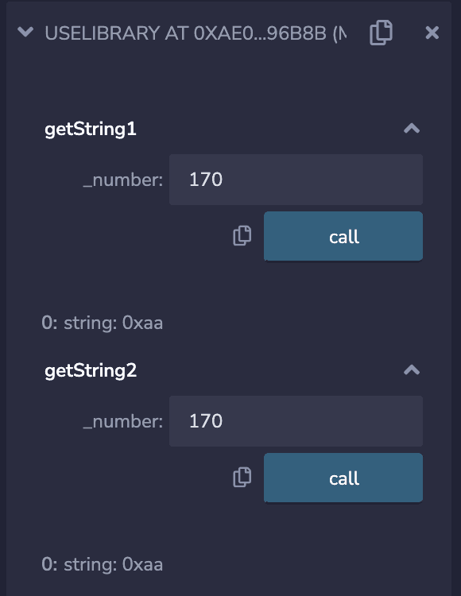
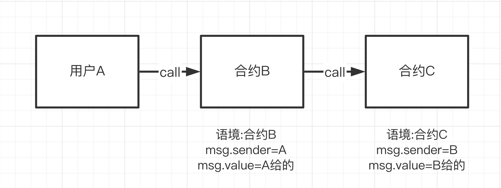
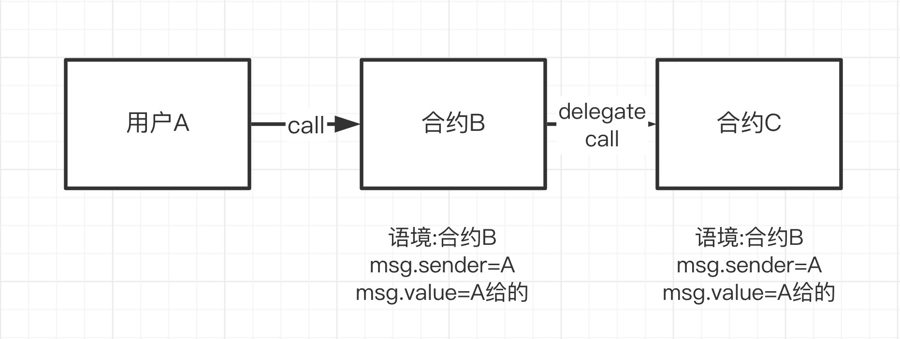

# WTF 102

\[TOC]

# WTF Solidity 102

## **一、函数重载**

`Solidity`中允许函数进行重载（`overloading`），即**名字相同但输入参数类型不同的函数可以同时存在**，他们被视为不同的函数。注意，`Solidity`不允许修饰器（`modifier`）重载。

### 1. 函数重载

例，定义两个都叫`saySomething()`的函数

一个没有任何参数，输出`"Nothing"`；

另一个接收一个`string`参数，输出这个`string`。

```solidity
function saySomething() public pure returns(string memory){
    return("Nothing");
}

function saySomething(string memory something) public pure returns(string memory){
    return(something);
}
```

最终重载函数在经过编译器编译后，由于不同的参数类型，都变成了不同的[函数选择器](待学)（selector）

以 `Overloading.sol` 合约为例，在 Remix 上编译部署后，分别调用重载函数 `saySomething()` 和 `saySomething(string memory something)`，可以看到他们返回了不同的结果，**被区分为不同的函数**。


### 2. 实时匹配

在调用重载函数时，会把输入的实际参数和函数参数的变量类型做匹配。 如果**出现多个匹配的重载函数**，则会报错。

下面这个例子有两个叫`f()`的函数，一个参数为`uint8`，另一个为`uint256`：

```solidity
function f(uint8 _in) public pure returns (uint8 out) {
    out = _in;
}

function f(uint256 _in) public pure returns (uint256 out) {
    out = _in;
}
```

调用`f(50)`，因为\*\*`50`既可以被转换为`uint8`，也可以被转换为`uint256`，因此会报错\*\*。

## **二、库合约**

库合约是一种特殊的合约，为了提升`Solidity`代码的复用性和减少`gas`而存在。库合约是一系列的函数合集，由大神或者项目方创作，咱们站在巨人的肩膀上，会用就行了。

* 和普通合约主要有以下几点不同：

1. 不能存在状态变量
2. 不能够继承或被继承
3. 不能接收以太币
4. 不可以被销毁

需要注意的是，库合约中的函数可见性如果被设置为`public`或者`external`，则在调用函数时会触发一次`delegatecall`。而如果被设置为`internal`，则不会引起。对于设置为`private`可见性的函数来说，其仅能在库合约中可见，在其他合约中不可用。

### 1.Strings库合约

`Strings库合约`是将`uint256`类型转换为相应的`string`类型的代码库，样例代码如下：

```solidity
library Strings {
    bytes16 private constant _HEX_SYMBOLS = "0123456789abcdef";

    /**
     * @dev Converts a `uint256` to its ASCII `string` decimal representation.
     */
    function toString(uint256 value) public pure returns (string memory) {
        // Inspired by OraclizeAPI's implementation - MIT licence
        // https://github.com/oraclize/ethereum-api/blob/b42146b063c7d6ee1358846c198246239e9360e8/oraclizeAPI_0.4.25.sol

        if (value == 0) {
            return "0";
        }
        uint256 temp = value;
        uint256 digits;
        while (temp != 0) {
            digits++;
            temp /= 10;
        }
        bytes memory buffer = new bytes(digits);
        while (value != 0) {
            digits -= 1;
            buffer[digits] = bytes1(uint8(48 + uint256(value % 10)));
            value /= 10;
        }
        return string(buffer);
    }

    /**
     * @dev Converts a `uint256` to its ASCII `string` hexadecimal representation.
     */
    function toHexString(uint256 value) public pure returns (string memory) {
        if (value == 0) {
            return "0x00";
        }
        uint256 temp = value;
        uint256 length = 0;
        while (temp != 0) {
            length++;
            temp >>= 8;
        }
        return toHexString(value, length);
    }

    /**
     * @dev Converts a `uint256` to its ASCII `string` hexadecimal representation with fixed length.
     */
    function toHexString(uint256 value, uint256 length) public pure returns (string memory) {
        bytes memory buffer = new bytes(2 * length + 2);
        buffer[0] = "0";
        buffer[1] = "x";
        for (uint256 i = 2 * length + 1; i > 1; --i) {
            buffer[i] = _HEX_SYMBOLS[value & 0xf];
            value >>= 4;
        }
        require(value == 0, "Strings: hex length insufficient");
        return string(buffer);
    }
}
```

它主要包含两个函数，`toString()`将`uint256`转换为10进制的`string`，`toHexString()`将`uint256`转换为16进制的`string`。

### 2. 使用

我们用`Strings`库合约的`toHexString()`来演示两种使用库合约中函数的办法。

1.

利用using for指令

指令`using A for B;`可用于附加库合约（从库 A）到任何类型（B）。添加完指令后，库`A`中的函数会自动添加为`B`类型变量的成员，可以直接调用。注意：在调用的时候，这个变量会被当作第一个参数传递给函数：

```solidity
// 利用using for指令
using Strings for uint256;
function getString1(uint256 _number) public pure returns(string memory){
    // 库合约中的函数会自动添加为uint256型变量的成员
    return _number.toHexString();
}
```

2.

通过库合约名称调用函数

```solidity
// 直接通过库合约名调用
function getString2(uint256 _number) public pure returns(string memory){
    return Strings.toHexString(_number);
}
```

我们部署合约并输入`170`测试一下，两种方法均能返回正确的`16进制string` “0xaa”。证明我们调用库合约成功



## **三、Import**

在Solidity中，`import`语句可以帮助我们在一个文件中引用另一个文件的内容，提高代码的可重用性和组织性。

### 1. 用法

* 通过源文件**相对位置**导入，例子：

```solidity
文件结构
├── Import.sol
└── Yeye.sol

// 通过文件相对位置import
import './Yeye.sol';
```

* 通过**源文件网址**导入网上的合约的全局符号，例子：

```solidity
// 通过网址引用
import 'https://github.com/OpenZeppelin/openzeppelin-contracts/blob/master/contracts/utils/Address.sol';
```

在remix实践的时候，给我报错了，问GPT是说，**Solidity 不能直接从 GitHub URL 导入合约**，Solidity 只能导入 **本地文件** 或 **通过 npm 安装的依赖**。

* 通过\*\*`npm`的目录\*\*导入，例子：

```solidity
import '@openzeppelin/contracts/access/Ownable.sol';
```

* 通过指定\*\*`全局符号`\*\*导入合约特定的全局符号，例子：

```solidity
import {Yeye} from './Yeye.sol';
```

* 引用(`import`)在代码中的位置为：在声明版本号之后，在其余代码之前。

### 2. 测试导入结果

可以用下面这段代码测试是否成功导入了外部源代码：

```solidity
// SPDX-License-Identifier: MIT
pragma solidity ^0.8.21;

// 通过文件相对位置import
import './Yeye.sol';
// 通过`全局符号`导入特定的合约
import {Yeye} from './Yeye.sol';
// 通过网址引用
import 'https://github.com/OpenZeppelin/openzeppelin-contracts/blob/master/contracts/utils/Address.sol';
// 引用OpenZeppelin合约
import '@openzeppelin/contracts/access/Ownable.sol';

contract Import {
    // 成功导入Address库
    using Address for address;
    // 声明yeye变量
    Yeye yeye = new Yeye();

    // 测试是否能调用yeye的函数
    function test() external{
        yeye.hip();
    }
}
```

## **四、接收ETH**

`Solidity`支持两种特殊的回调函数，`receive()`和`fallback()`，他们主要在两种情况下被使用：

1. 接收ETH
2. 处理合约中不存在的函数调用（代理合约proxy contract）

* \*\*注意⚠️：\*\*在Solidity 0.6.x版本之前，语法上只有 `fallback()` 函数，用来接收用户发送的ETH时调用以及在被调用函数签名没有匹配到时，来调用。 0.6版本之后，Solidity才将 `fallback()` 函数拆分成 `receive()` 和 `fallback()` 两个函数。

### 1. 接收ETH函数<font style="background-color:#f3bb2f;">receive()</font>

`receive()`函数是在**合约收到**`ETH`**转账**时被调用的函数。

**一个合约最多有一个**`receive()`**函数**，声明方式与一般函数不一样，**不需要**`function`关键字：`receive() external payable { ... }`。`receive()`函数**不能有任何的参数，不能返回任何值，必须包含**`external`**和**`payable`。

当合约接收ETH的时候，`receive()`会被触发。`receive()`最好不要执行太多的逻辑，因为如果别人用`send`和`transfer`方法发送`ETH`的话，`gas`会限制在`2300`，`receive()`太复杂可能会触发`Out of Gas`报错；如果用\*\*`call`\*\*就可以自定义`gas`执行更复杂的逻辑（这三种发送ETH的方法我们之后会讲到）。

我们可以在`receive()`里发送一个`event`，例如：

```solidity
// 定义事件
event Received(address Sender, uint Value);
// 接收ETH时释放Received事件
receive() external payable {
    emit Received(msg.sender, msg.value);
}
```

**注意**，有些恶意合约，会在`receive()` 函数（老版本的话，就是 `fallback()` 函数）嵌入恶意消耗`gas`的内容或者使得执行故意失败的代码，导致一些包含退款和转账逻辑的合约不能正常工作，因此写包含退款等逻辑的合约时候，一定要注意这种情况。

### 2. 回退函数<font style="background-color:#f3bb2f;">fallback()</font>

`fallback()`函数会在**调用合约不存在的函数时**被触发。

可用于接收ETH，也可以用于代理合约`proxy contract`。`fallback()`声明时不需要`function`关键字，**必须由**`external`**修饰**，一般也会用\*\*`payable`\*\*修饰，用于接收ETH:`fallback() external payable { ... }`。

我们定义一个`fallback()`函数，被触发时候会释放`fallbackCalled`事件，并输出`msg.sender`，`msg.value`和`msg.data`:

```solidity
event fallbackCalled(address Sender, uint Value, bytes Data);

// fallback
fallback() external payable{
    emit fallbackCalled(msg.sender, msg.value, msg.data);
}
```

### 3. receive和fallback的区别

`receive`和`fallback`都能够用于接收`ETH`，他们触发的规则如下：

```solidity
触发fallback() 还是 receive()?
           接收ETH
              |
         msg.data是空？
            /  \
          是    否
          /      \
receive()存在?   fallback()
        / \
       是  否
      /     \
receive()   fallback()
```

简单来说，合约接收`ETH`时，`msg.data`为空且存在`receive()`时，会触发`receive()`；`msg.data`不为空或不存在`receive()`时，会触发`fallback()`，此时`fallback()`必须为`payable`。

`receive()`和`payable fallback()`均不存在的时候，向合约**直接**发送`ETH`将会报错（你仍可以通过带有`payable`的函数向合约发送`ETH`）。

### 4. remix演示

首先部署合约，在value栏填100Wei，deploy然后transact


可以看到交易成功，并且触发了 "receivedCalled" 事件


value栏填要发送给合约的金额（单位Wei），"CALLDATA" 栏中填入随意编写的`msg.data`（填入符合十六进制规范的字节即可），然后Transact


可以看到交易成功，并且触发了“fallbackCalled”事件


## **五、发送ETH**

`Solidity`有三种方法向其他合约发送`ETH`，他们是：`transfer()`**，**`send()`**和**`call()`，其中`call()`是被鼓励的用法。

### (1) 接收ETH合约

首先部署一个合约`ReceiveETH`来接收ETH。`ReceiveETH`合约里包含一个事件，两个函数

1. 事件\*\*`Log`\*\*：记录收到的`ETH`数量和`gas`剩余。
2. 函数\*\*`receive()`\*\*：收到`ETH`被触发，并发送`Log`事件；
3. 函数\*\*`getBalance()`\*\*：查询合约`ETH`余额

部署后，运行`getBalance()`函数，可以看到当前合约的`ETH`余额为`0`

### (2) 发送ETH合约

首先，先在发送ETH合约`SendETH`中实现`payable`的`构造函数`和`receive()`，让我们能够在部署时和部署后向合约转账。

```solidity
contract SendETH {
    // 构造函数，payable使得部署的时候可以转eth进去
    constructor() payable{}
    // receive方法，接收eth时被触发
    receive() external payable{}
}
```

#### 1. transfer

* 用法：**<font style="background-color:#f3bb2f;">接收方地址.transfer(发送ETH数额)</font>**
* `transfer()`的**gas限制**是**2300**,足够用于转账,但对方合约的`fallback()`或`receive()`函数不能实现太复杂的逻辑
* `transfer()`**如果转账失败，会自动**`revert`（回滚交易）

例如

```solidity
// 用transfer()发送ETH
function transferETH(address payable _to, uint256 amount) external payable{
    _to.transfer(amount);
}
```

注意里面的`_to`填`ReceiveETH`合约的地址，`amount`是`ETH`转账金额

#### 2. send

* 用法：**<font style="background-color:#f3bb2f;">接收方地址.send(发送ETH数额)</font>**
* `send()`的`gas`限制是`2300`，足够用于转账，但对方合约的`fallback()`或`receive()`函数不能实现太复杂的逻辑。
* `send()`如果转账失败，**不会**`revert`。
* `send()`的**返回值是**`bool`，代表着转账成功或失败，需要额外代码处理一下。

代码样例：

```solidity
error SendFailed(); // 用send发送ETH失败error

// send()发送ETH
function sendETH(address payable _to, uint256 amount) external payable{
    // 处理下send的返回值，如果失败，revert交易并发送error
    bool success = _to.send(amount);
    if(!success){
        revert SendFailed();
    }
}
```

#### 3. call

* 用法：**<font style="background-color:#f3bb2f;">接收方地址.call{value: 发送ETH数额}("")</font>**
* `call()`**没有**`gas`**限制**，可以支持对方合约`fallback()`或`receive()`函数实现复杂逻辑。
* `call()`如果转账失败，不会`revert`。
* `call()`的返回值是`(bool, bytes)`，其中`bool`代表着转账成功或失败，需要额外代码处理一下。

代码样例：

```solidity
error CallFailed(); // 用call发送ETH失败error

// call()发送ETH
function callETH(address payable _to, uint256 amount) external payable{
    // 处理下call的返回值，如果失败，revert交易并发送error
    (bool success,) = _to.call{value: amount}("");
    if(!success){
        revert CallFailed();
    }
}
```

## **六、调用其他合约**

在solidity中，一个合约可以调用另一个合约的函数

如何在已知合约代码（或接口）和地址的情况下，调用已部署的合约

### 目标合约

```solidity
contract OtherContract {
    uint256 private _x = 0; // 状态变量_x
    // 收到eth的事件，记录amount和gas
    event Log(uint amount, uint gas);
    
    // 返回合约ETH余额
    function getBalance() view public returns(uint) {
        return address(this).balance;
    }

    // 可以调整状态变量_x的函数，并且可以往合约转ETH (payable)
    function setX(uint256 x) external payable{
        _x = x;
        // 如果转入ETH，则释放Log事件
        if(msg.value > 0){
            emit Log(msg.value, gasleft());
        }
    }

    // 读取_x
    function getX() external view returns(uint x){
        x = _x;
    }
}
```

这个合约包含一个状态变量`_x`，一个事件`Log`在收到`ETH`时触发，三个函数：

* `getBalance()`: 返回合约`ETH`余额。
* `setX()`: `external payable`函数，可以设置`_x`的值，并向合约发送`ETH`。
* `getX()`: 读取`_x`的值。

### 调用目标合约

#### 1. 传入合约地址

以调用`OtherContract`合约的`setX`函数为例，我们在新合约中写一个`callSetX`函数，传入已部署好的`OtherContract`合约地址`_Address`和`setX`的参数`x`：

```solidity
function callSetX(address _Address, uint256 x) external{
    OtherContract(_Address).setX(x);
}
```

\_Address代指合约地址

#### 2. 传入合约变量

直接在函数里传入合约的引用

```solidity
function callGetX(OtherContract _Address) external view returns(uint x){
    x = _Address.getX();
}
```

#### 3. 创建合约变量

创建合约变量，然后通过它来调用目标函数

```solidity
function callGetX2(address _Address) external view returns(uint x){
    OtherContract oc = OtherContract(_Address);
    x = oc.getX();
}
```

#### 4. 调用合约并发送

如果目标合约的函数是`payable`的，那么我们可以通过调用它来给合约转账：`_Name(_Address).f{value: _Value}()`

其中\_Name是合约名，\_Address是合约地址，f是目标函数名，\_Value是要转的ETH数额（以wei为单位）

```solidity
function setXTransferETH(address otherContract, uint256 x) payable external{
    OtherContract(otherContract).setX{value: msg.value}(x);
}
```

## **七、Call**

`call` 是`address`类型的低级成员函数，它用来与其他合约交互。它的返回值为`(bool, bytes memory)`，分别对应`call`是否成功以及目标函数的返回值

* `call`是`Solidity`官方推荐的**通过触发**`fallback`**或**`receive`**函数发送**`ETH`**的方法**。
* 不推荐用`call`来调用另一个合约，因为当你调用不安全合约的函数时，你就把主动权交给了它。推荐的方法仍是声明合约变量后调用函数，                                                                                  转跳
* 当我们不知道对方合约的源代码或`ABI`，就没法生成合约变量；这时，我们仍可以通过`call`调用对方合约的函数。

### 使用规则

<font style="background-color:#f3bb2f;">目标合约地址.call(字节码);</font>

其中`字节码`利用结构化编码函数`abi.encodeWithSignature`获得：

```solidity
abi.encodeWithSignature("函数签名", 逗号分隔的具体参数)
```

`函数签名`为`"函数名（逗号分隔的参数类型）"`。例如`abi.encodeWithSignature("f(uint256,address)", _x, _addr)`。

另外`call`在调用合约时可以指定交易发送的`ETH`数额和`gas`数额：

```solidity
目标合约地址.call{value:发送数额, gas:gas数额}(字节码);
```

#### 目标合约

```solidity
contract OtherContract {
    uint256 private _x = 0; // 状态变量x
    // 收到eth的事件，记录amount和gas
    event Log(uint amount, uint gas);
    
    fallback() external payable{}

    // 返回合约ETH余额
    function getBalance() view public returns(uint) {
        return address(this).balance;
    }

    // 可以调整状态变量_x的函数，并且可以往合约转ETH (payable)
    function setX(uint256 x) external payable{
        _x = x;
        // 如果转入ETH，则释放Log事件
        if(msg.value > 0){
            emit Log(msg.value, gasleft());
        }
    }

    // 读取x
    function getX() external view returns(uint x){
        x = _x;
    }
}
```

这个合约包含一个状态变量`x`，一个在收到`ETH`时触发的事件`Log`，三个函数：

* `getBalance()`: 返回合约`ETH`余额。
* `setX()`: `external payable`函数，可以设置`x`的值，并向合约发送`ETH`。
* `getX()`: 读取`x`的值。

#### 用call调用合约

##### 1.观察返回值

首先定义一个`Response`事件，输出`call`返回的`success`和`data`，方便我们观察返回值。

```solidity
// 定义Response事件，输出call返回的结果success和data
event Response(bool success, bytes data);
```

##### 2. 调用setX函数

```solidity
function callSetX(address payable _addr, uint256 5) public payable {
    // call setX()，同时可以发送ETH
    (bool success, bytes memory data) = _addr.call{value: msg.value}(
        abi.encodeWithSignature("setX(uint256)", 5)
    );

    emit Response(success, data); //释放事件,读返回值
}
```

##### 3.调用getx函数

可以利用`abi.decode`来解码`call`的返回值`data`，并读出数值。

```solidity
function callGetX(address _addr) external returns(uint256){
    // call getX()
    (bool success, bytes memory data) = _addr.call(
        abi.encodeWithSignature("getX()")
    );

    emit Response(success, data); //释放事件,读返回值
    return abi.decode(data, (uint256));
}
```

由Response的输出,可以看到data为`ture 0x0000000000000000000000000000`

经过`abi.decode`，最终返回值为`5`

##### 4. 调用不存在的函数

如果给call输入的函数目标合约中没有,那就会触发目标合约的fallback()函数

```solidity
function callNonExist(address _addr) external{
    // call 不存在的函数
    (bool success, bytes memory data) = _addr.call(
        abi.encodeWithSignature("foo(uint256)")
    );

    emit Response(success, data); //释放事件,读返回值
}
```

call可以执行成功,返回success,就是调用的目标合约的falllbback()函数

## 八、**Delegatecall**

`delegatecall`与`call`类似，是`Solidity`中地址类型的低级成员函数

### 理解

* **一个投资者（用户**`A`**）把他的资产（**`B`**合约的**`状态变量`**）都交给一个风险投资代理（**`C`**合约）来打理。执行的是风险投资代理的函数，但是改变的是资产的状态。**

当用户`A`通过合约`B`来`call`合约`C`的时候，执行的是合约`C`的函数，`上下文`(`Context`，可以理解为包含变量和状态的环境)也是合约`C`的：`msg.sender`是`B`的地址，并且如果函数改变一些状态变量，产生的效果会作用于合约`C`的变量上



而当用户`A`通过合约`B`来`delegatecall`合约`C`的时候，执行的是合约`C`的函数，但是`上下文`仍是合约`B`的：`msg.sender`是`A`的地址，并且如果函数改变一些状态变量，产生的效果会作用于合约`B`的变量上。



### 使用规则

<font style="background-color:#f3bb2f;">目标合约地址.delegatecall(二进制编码);</font>

二进制编码:

```solidity
abi.encodeWithSignature("函数签名", 逗号分隔的具体参数)
```

写上函数签名的例子:

```solidity
abi.encodeWithSignature("f(uint256,address)", _x, _addr)
```

和`call`不一样，`delegatecall`在调用合约时**可以指定交易发送的**`gas`**，但不能指定发送的**`ETH`**数额**

### 使用场景

1. **代理合约（**`Proxy Contract`**）**：将智能合约的存储合约和逻辑合约分开：代理合约（`Proxy Contract`）存储所有相关的变量，并且保存逻辑合约的地址；所有函数存在逻辑合约（`Logic Contract`）里，通过`delegatecall`执行。当升级时，只需要将代理合约指向新的逻辑合约即可。
2. **EIP-2535 Diamonds（钻石）**：钻石是一个支持构建可在生产中扩展的模块化智能合约系统的标准。钻石是具有多个实施合约的代理合约。 更多信息请查看：[钻石标准简介](https://eip2535diamonds.substack.com/p/introduction-to-the-diamond-standard)。

### 例子

调用结构：你（`A`）通过合约`B`调用目标合约`C`

#### 合约C

有两个`public`变量：`num`和`sender`，分别是`uint256`和`address`类型；

有一个函数`setVars()`，可以将`num`设定为传入的`_num`，并且将`sender`设为`msg.sender`

#### 合约B

首先，合约`B`必须和目标合约`C`的变量存储布局必须相同 —— \*\*即存在两个 **`public`** 变量且变量类型顺序为 **`uint256`** 和 \*\*`address`

但变量名称可以不同

```solidity
contract B {
    uint public num;
    address public sender;
}
```

#### 操作

分别用`call`和`delegatecall`来调用合约C的`setVars()`函数

##### call

`callSetVars`函数通过`call`来调用`setVars`。它有两个参数`_addr`和`_num`，分别对应合约`C`的地址和`setVars`的参数

```solidity
// 通过call来调用C的setVars()函数，将改变合约C里的状态变量
function callSetVars(address _addr, uint _num) external payable{
    // call setVars()
    (bool success, bytes memory data) = _addr.call(
        abi.encodeWithSignature("setVars(uint256)", _num)
    );
}
```

##### delegatecall

`delegatecallSetVars`函数通过`delegatecall`来调用`setVars`。与上面的`callSetVars`函数相同，有两个参数`_addr`和`_num`，分别对应合约`C`的地址和`setVars`的参数。

```solidity
// 通过delegatecall来调用C的setVars()函数，将改变合约B里的状态变量
function delegatecallSetVars(address _addr, uint _num) external payable{
    // delegatecall setVars()
    (bool success, bytes memory data) = _addr.delegatecall(
        abi.encodeWithSignature("setVars(uint256)", _num)
    );
}
```

## **九、在合约中创建新合约**

在以太坊链上，用户（外部账户，`EOA`）可以创建智能合约，智能合约同样也可以创建新的智能合约。去中心化交易所`uniswap`就是利用工厂合约（`PairFactory`）创建了无数个币对合约（`Pair`）

有两种方法，create和creat2

### Create

* 用法：<font style="background-color:#f3bb2f;">Contract x = new Contract{value: \_value}(params)</font>
* 就是`new`一个合约，并传入新合约构造函数所需的参数

其中`Contract`是要创建的合约名，`x`是合约对象（地址），如果构造函数是`payable`，可以创建时转入`_value`数量的`ETH`，`params`是新合约构造函数的参数

### 极简Uniswap

`Uniswap V2`[核心合约](https://github.com/Uniswap/v2-core/tree/master/contracts)中包含两个合约：

1. **UniswapV2Pair**: 币对合约，用于管理币对地址、流动性、买卖。
2. **UniswapV2Factory**: 工厂合约，用于创建新的币对，并管理币对地址。

下面用`create`方法实现一个极简版的`Uniswap`：`Pair`币对合约负责管理币对地址，`PairFactory`工厂合约用于创建新的币对，并管理币对地址

#### `Pair`合约1

```solidity
contract Pair{
    address public factory; // 工厂合约地址
    address public token0; // 代币1
    address public token1; // 代币2

    constructor() payable {
        factory = msg.sender;
    }

    // called once by the factory at time of deployment
    function initialize(address _token0, address _token1) external {
        require(msg.sender == factory, 'UniswapV2: FORBIDDEN'); // sufficient check
        token0 = _token0;
        token1 = _token1;
    }
}
```

包含3个状态变量：`factory`，`token0`和`token1`

构造函数部署时将`factory`赋值为工厂合约地址

函数`initialize()`部署后手动调用以初始化代币地址,将`token0`和`token1`更新为币对中两种代币的地址

* 为什么uniswap不在构造函数里将token0和token1更新好?
  * 因为`uniswap`使用的是[create2](#十、Creat2)创建合约，生成的合约地址可以实现预测

#### `PairFactory`工厂合约1

```solidity
contract PairFactory{
    mapping(address => mapping(address => address)) public getPair; // 通过两个代币地址查Pair地址
    address[] public allPairs; // 保存所有Pair地址

    function createPair(address tokenA, address tokenB) external returns (address pairAddr) {
        // 创建新合约
        Pair pair = new Pair(); 
        // 调用新合约的initialize方法
        pair.initialize(tokenA, tokenB);
        // 更新地址map
        pairAddr = address(pair);
        allPairs.push(pairAddr);
        getPair[tokenA][tokenB] = pairAddr;
        getPair[tokenB][tokenA] = pairAddr;
    }
}
```

包含2个状态变量：`getPair`和`allPairs`

* `getPair`:是两个代币地址到币对地址的`map`，方便根据代币找到币对地址
* `allPairs`:是币对地址的数组，存储了所有币对地址

函数`createPair`根据输入的两个代币地址`tokenA`和`tokenB`来创建新的`Pair`合约

这句就是创建合约的代码：

```solidity
Pair pair = new Pair(); 
```

创建了一个名叫Pair的合约,pair是合约对象(地址)

## **十、Create2**

`CREATE2` 操作码使我们在智能合约部署在以太坊网络之前就能预测合约的地址。`Uniswap`创建`Pair`合约用的就是`CREATE2`而不是`CREATE`

### create计算地址

<font style="color:rgb(33, 42, 54);">智能合约可以由其他合约和普通账户利用</font><code>**<font style="color:rgb(107, 114, 128);background-color:rgb(243, 244, 246);">CREATE</font>**</code><font style="color:rgb(33, 42, 54);">操作码创建。 在这两种情况下，新合约的地址都以相同的方式计算：</font>

<font style="color:rgb(33, 42, 54);">创建者的地址(通常为部署的钱包地址或者合约地址)和</font><code>**<font style="color:rgb(107, 114, 128);background-color:rgb(243, 244, 246);">nonce</font>**</code><font style="color:rgb(33, 42, 54);">(该地址发送交易的总数,对于合约账户是创建的合约总数,每创建一个合约nonce+1)的哈希。</font>

```solidity
新地址 = hash(创建者地址, nonce)
```

<font style="color:rgb(33, 42, 54);">创建者地址不会变，</font>**<font style="color:rgb(33, 42, 54);">但</font>**<code>**<font style="color:rgb(107, 114, 128);background-color:rgb(243, 244, 246);">nonce</font>**</code>**<font style="color:rgb(33, 42, 54);">可能会随时间而改变</font>**<font style="color:rgb(33, 42, 54);">，因此用</font><code>**<font style="color:rgb(107, 114, 128);background-color:rgb(243, 244, 246);">CREATE</font>**</code><font style="color:rgb(33, 42, 54);">创建的合约地址不好预测</font>

### create2计算地址

`CREATE2`的目的是为了让合约地址独立于未来的事件。不管未来区块链上发生了什么，都可以把合约部署在事先计算好的地址上。

```solidity
新地址 = hash("0xFF",创建者地址(CreatorAddress), salt, initcode)
```

用`CREATE2`创建的合约地址由4个部分决定：

* `0xFF`：一个常数，避免和`CREATE`冲突
* `CreatorAddress`: 调用 CREATE2 的当前合约（创建合约）地址。
* `salt`：一个创建者指定的`bytes32`类型的值，它的主要目的是用来影响新创建的合约的地址。
* `initcode`: 新合约的**初始字节码**（合约的Creation Code和构造函数的参数）。

`CREATE2`确保，如果创建者使用`CREATE2`和提供的`salt`部署给定的合约`initcode`，它将存储在**新地址**中。

### 如何使用create2

* 用法：

```solidity
Contract x = new Contract{salt: _salt, value: _value}(params)
```

和create类似都是new一个合约，<font style="color:rgb(33, 42, 54);">并传入新合约构造函数所需的参数,</font>只不过多传一个salt参数

<font style="color:rgb(33, 42, 54);">其中</font><code>**<font style="color:rgb(107, 114, 128);background-color:rgb(243, 244, 246);">Contract</font>**</code><font style="color:rgb(33, 42, 54);">是要创建的合约名,</font><code>**<font style="color:rgb(107, 114, 128);background-color:rgb(243, 244, 246);">x</font>**</code><font style="color:rgb(33, 42, 54);">是合约对象(地址),</font><code>**<font style="color:rgb(107, 114, 128);background-color:rgb(243, 244, 246);">_salt</font>**</code><font style="color:rgb(33, 42, 54);">是指定的盐；如果构造函数是</font><code>**<font style="color:rgb(107, 114, 128);background-color:rgb(243, 244, 246);">payable</font>**</code><font style="color:rgb(33, 42, 54);">，可以创建时转入</font><code>**<font style="color:rgb(107, 114, 128);background-color:rgb(243, 244, 246);">_value</font>**</code><font style="color:rgb(33, 42, 54);">数量的</font><code>**<font style="color:rgb(107, 114, 128);background-color:rgb(243, 244, 246);">ETH</font>**</code><font style="color:rgb(33, 42, 54);">，</font><code>**<font style="color:rgb(107, 114, 128);background-color:rgb(243, 244, 246);">params</font>**</code><font style="color:rgb(33, 42, 54);">是新合约构造函数的参数</font>

### 极简Uniswap2

#### `Pair`合约2

```solidity
contract Pair{
    address public factory; // 工厂合约地址
    address public token0; // 代币1
    address public token1; // 代币2

    constructor() payable {
        factory = msg.sender;
    }

    // called once by the factory at time of deployment
    function initialize(address _token0, address _token1) external {
        require(msg.sender == factory, 'UniswapV2: FORBIDDEN'); // sufficient check
        token0 = _token0;
        token1 = _token1;
    }
}
```

包含三个状态变量:`factory`，`token0`和`token1`

构造函数部署时将`factory`赋值为工厂合约地址

函数`initialize()`会在`Pair`合约创建时被工厂合约调用一次,将`token0`和`token1`更新为币对中两种代币的地址

#### `PairFactory`工厂合约2

```solidity
contract PairFactory2{
    mapping(address => mapping(address => address)) public getPair; // 通过两个代币地址查Pair地址
    address[] public allPairs; // 保存所有Pair地址

    function createPair2(address tokenA, address tokenB) external returns (address pairAddr) {
        require(tokenA != tokenB, 'IDENTICAL_ADDRESSES'); //避免tokenA和tokenB相同产生的冲突
        // 用tokenA和tokenB地址计算salt
        (address token0, address token1) = tokenA < tokenB ? (tokenA, tokenB) : (tokenB, tokenA); //将tokenA和tokenB按大小排序
        bytes32 salt = keccak256(abi.encodePacked(token0, token1));
        // 用create2部署新合约
        Pair pair = new Pair{salt: salt}(); 
        // 调用新合约的initialize方法
        pair.initialize(tokenA, tokenB);
        // 更新地址map
        pairAddr = address(pair);
        allPairs.push(pairAddr);
        getPair[tokenA][tokenB] = pairAddr;
        getPair[tokenB][tokenA] = pairAddr;
    }
}
```

包含2个状态变量：`getPair`和`allPairs`

* `getPair`:是两个代币地址到币对地址的`map`，方便根据代币找到币对地址
* `allPairs`:是币对地址的数组，存储了所有币对地址

只有一个函数`createPair2`,使用`create2`根据输入的两个代币地址`tokenA`和`tokenB`来创建新的`Pair`合约,其中这里就是利用`create2`创建合约的相关代码:

```solidity
Pair pair = new Pair{salt: salt}(); 
```

<code>**<font style="color:rgb(107, 114, 128);background-color:rgb(243, 244, 246);">salt</font>**</code><font style="color:rgb(33, 42, 54);">为</font><code>**<font style="color:rgb(107, 114, 128);background-color:rgb(243, 244, 246);">token1</font>**</code><font style="color:rgb(33, 42, 54);">和</font><code>**<font style="color:rgb(107, 114, 128);background-color:rgb(243, 244, 246);">token2</font>**</code><font style="color:rgb(33, 42, 54);">的</font><code>**<font style="color:rgb(107, 114, 128);background-color:rgb(243, 244, 246);">hash</font>**</code><font style="color:rgb(33, 42, 54);">：</font>

```plain
bytes32 salt = keccak256(abi.encodePacked(token0, token1));
```

##### 事先计算pair地址

```solidity
// 提前计算pair合约地址
function calculateAddr(address tokenA, address tokenB) public view returns(address predictedAddress){
    require(tokenA != tokenB, 'IDENTICAL_ADDRESSES'); //避免tokenA和tokenB相同产生的冲突
    // 计算用tokenA和tokenB地址计算salt
    (address token0, address token1) = tokenA < tokenB ? (tokenA, tokenB) : (tokenB, tokenA); //将tokenA和tokenB按大小排序
    bytes32 salt = keccak256(abi.encodePacked(token0, token1));
    // 计算合约地址方法 hash()
    predictedAddress = address(uint160(uint(keccak256(abi.encodePacked(
        bytes1(0xff),
        address(this),
        salt,
        keccak256(type(Pair).creationCode)
        )))));
}
```

我们写了一个`calculateAddr()`函数来事先计算<code>**<font style="color:rgb(107, 114, 128);background-color:rgb(243, 244, 246);">tokenA</font>**</code><font style="color:rgb(33, 42, 54);">和</font><code>**<font style="color:rgb(107, 114, 128);background-color:rgb(243, 244, 246);">tokenB</font>**</code><font style="color:rgb(33, 42, 54);">将会生成的</font><code>**<font style="color:rgb(107, 114, 128);background-color:rgb(243, 244, 246);">Pair</font>**</code><font style="color:rgb(33, 42, 54);">地址。通过它，我们可以验证我们事先计算的地址和实际地址是否相同</font>

### <font style="color:rgb(33, 42, 54);">实际应用场景</font>

1. <font style="color:rgb(33, 42, 54);"> 交易所为新用户预留创建钱包合约地址。</font>
2. <font style="color:rgb(33, 42, 54);"> 由 </font><code>**<font style="color:rgb(107, 114, 128);background-color:rgb(243, 244, 246);">CREATE2</font>**</code><font style="color:rgb(33, 42, 54);"> 驱动的 </font><code>**<font style="color:rgb(107, 114, 128);background-color:rgb(243, 244, 246);">factory</font>**</code><font style="color:rgb(33, 42, 54);"> 合约，在</font><code>**<font style="color:rgb(107, 114, 128);background-color:rgb(243, 244, 246);">Uniswap V2</font>**</code><font style="color:rgb(33, 42, 54);">中交易对的创建是在 </font><code>**<font style="color:rgb(107, 114, 128);background-color:rgb(243, 244, 246);">Factory</font>**</code><font style="color:rgb(33, 42, 54);">中调用</font><code>**<font style="color:rgb(107, 114, 128);background-color:rgb(243, 244, 246);">CREATE2</font>**</code><font style="color:rgb(33, 42, 54);">完成。这样做的好处是: 它可以得到一个确定的</font><code>**<font style="color:rgb(107, 114, 128);background-color:rgb(243, 244, 246);">pair</font>**</code><font style="color:rgb(33, 42, 54);">地址, 使得 </font><code>**<font style="color:rgb(107, 114, 128);background-color:rgb(243, 244, 246);">Router</font>**</code><font style="color:rgb(33, 42, 54);">中就可以通过 </font><code>**<font style="color:rgb(107, 114, 128);background-color:rgb(243, 244, 246);">(tokenA, tokenB)</font>**</code><font style="color:rgb(33, 42, 54);"> 计算出</font><code>**<font style="color:rgb(107, 114, 128);background-color:rgb(243, 244, 246);">pair</font>**</code><font style="color:rgb(33, 42, 54);">地址, 不再需要执行一次 </font><code>**<font style="color:rgb(107, 114, 128);background-color:rgb(243, 244, 246);">Factory.getPair(tokenA, tokenB)</font>**</code><font style="color:rgb(33, 42, 54);"> 的跨合约调用。</font>


> 更新: 2025-07-20 20:55:27  
> 原文: <https://www.yuque.com/xiaoyuhushenfu/yzin4n/xsd7c4fs5146kg3k>