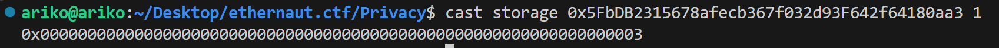
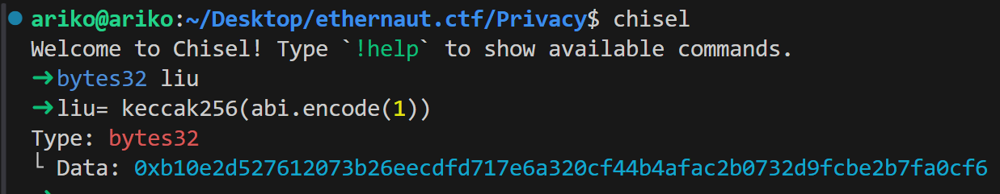
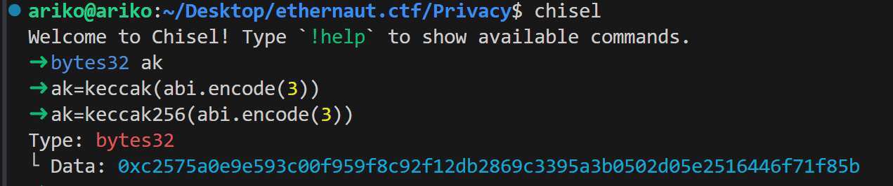
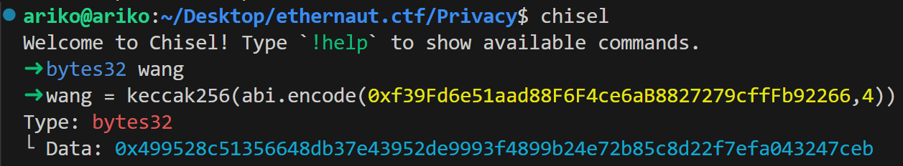

# 访问私有变量

```solidity
// SPDX-License-Identifier: SEE LICENSE IN LICENSE
pragma solidity ^0.8.0;

//0x5FbDB2315678afecb367f032d93F642f64180aa3
contract liu {
    uint256 celebration; //0
    uint256[] brithday; //1
    string jintaiyan = "wodenvshen"; //长度10,2
    string waiyuancaiyu =
        "quanyuzhouzuibeutifulzuilovelywozuiaidepiaoliangxiaobaobao"; //3
    mapping(address => uint256) illit; //4
    mapping(address => uint256) minju; //5

    constructor() {
        celebration = 20240325;
        brithday.push(2008);
        brithday.push(2);
        brithday.push(4);
        illit[0xf39Fd6e51aad88F6F4ce6aB8827279cffFb92266]=999;
        minju[0x70997970C51812dc3A010C7d01b50e0d17dc79C8]=888;
    }
}

```

```solidity
forge create liu --rpc-url http://127.0.0.1:8545 --private-key 0xac0974bec39a17e36ba4a6b4d238ff944bacb478cbed5efcae784d7bf4f2ff80 --broadcast
```

得到合约地址`0x5FbDB2315678afecb367f032d93F642f64180aa3`

## 动态数组

#### 比如1槽的birthday,是一个动态数组,直接用`cast storage`只能读取到数组的长度



#### 为了获取数组的具体内容,用到了chisel

Solidity 把动态数组的数据内容，不是直接存放在 slot x，而是从 keccak256(x) 这个哈希值对应的位置开始连续存储



比如这里就是定义了一个定长数组`liu`,注意读取方式:keccak256(abi.encode(slot))

然后看合约,`birthday`是在solt1,所以这里

第一个元素是keccack256(abi.encode(1)),得到一串**data**`0xb10e2d527612073b26eecdfd717e6a320cf44b4afac2b0732d9fcbe2b7fa0cf6`

此时就可以`cast storage`了

```solidity
 cast storage 0x5FbDB2315678afecb367f032d93F642f64180aa3 0xb10e2d527612073b26eecdfd717e6a320cf44b4afac2b0732d9fcbe2b7fa0cf6
```

得到0x00000000000000000000000000000000000000000000000000000000000007d8

```solidity
cast to-dec 0x00000000000000000000000000000000000000000000000000000000000007d8
```

得到2008,成功读到`shengri`的第一个元素

第二个元素,就是keccack256(abi.encode(1))+1

```solidity
cast storage 0x5FbDB2315678afecb367f032d93F642f64180aa3 cast storage 0x5FbDB2315678afecb367f032d93F642f64180aa3 0xb10e2d527612073b26eecdfd717e6a320cf44b4afac2b0732d9fcbe2b7fa0cf7
```

注意上边data是cf6结尾,那加一就是cf7,得到`0x0000000000000000000000000000000000000000000000000000000000000002`

```solidity
cast to-dec 0x0000000000000000000000000000000000000000000000000000000000000002
```

得到`2`

第三个元素,就是+2,cf8结尾

```solidity
cast storage 0x5FbDB2315678afecb367f032d93F642f64180aa3 0xb10e2d527612073b26eecdfd717e6a320cf44b4afac2b0732d9fcbe2b7fa0cf8
```

得到`0x0000000000000000000000000000000000000000000000000000000000000004`

```solidity
 cast to-dec 0x0000000000000000000000000000000000000000000000000000000000000004
```

得到`4`.至此三个元素全都读到了

## 字符串

`string` 实际上等同于 `bytes`，也就是 `bytes[]` 的变种

### 短字符串(<=31字节)

直接塞进变量所在的solt里, 不需要 keccak，只用`cast storage`直接看变量槽位即可

前面是内容,**最后一字节是长度信息**

就比如slot2的<code>**jintaiyan**</code>

```solidity
cast storage 地址 当前字符串的槽位
```

得到`0x776f64656e767368656e00000000000000000000000000000000000000000014`

```solidity
cast to-utf8 0x776f64656e767368656e //注意这里只要内容的地方,不要把后边长度也加上去了
```

成功得到了`wodenvshen`

### 长字符串()

和动态数组一样，数据不保存在 slot 本身，而是从 `keccak256(slot)` 开始连续存储数据

就比如solt3的<code>**waiyuancaiyu**</code>



先chisel，**keccak256(abi.encode(3))**,得到一串data`0xc2575a0e9e593c00f959f8c92f12db2869c3395a3b0502d05e2516446f71f85b`

然后`cast storage`

```solidity
cast storage 0x5FbDB2315678afecb367f032d93F642f64180aa3 0xc2575a0e9e593c00f959f8c92f12db2869c3395a3b0502d05e2516446f71f85b
```

得到`0x7175616e79757a686f757a7569626575746966756c7a75696c6f76656c79776f`

```solidity
cast to-utf8 0x7175616e79757a686f757a7569626575746966756c7a75696c6f76656c79776f
```

得到前半段`quanyuzhouzuibeutifulzuilovelywo`

然后后半段就是cast storage 地址 上边那个data+1 ,上边是85b,那这次就是85c

```solidity
 cast storage 0x5FbDB2315678afecb367f032d93F642f64180aa3 0xc2575a0e9e593c00f959f8c92f12db2869c3395a3b0502d05e2516446f71f85c
```

得到`0x7a7569616964657069616f6c69616e677869616f62616f62616f000000000000`

```solidity
 cast to-utf8 0x7a7569616964657069616f6c69616e677869616f62616f62616f000000000000
```

得到后半段`zuiaidepiaoliangxiaobaobao`

如果合起来,,就是两个storage得到的拼一起,注意**不要后半段最前边的0x和后边的一堆0000,拼成**<code>**0x7175616e79757a686f757a7569626575746966756c7a75696c6f76656c79776f**``**7a7569616964657069616f6c69616e677869616f62616f62616f**</code>

```solidity
cast to-utf8 0x7175616e79757a686f757a7569626575746966756c7a75696c6f76656c79776f7a7569616964657069616f6c69616e677869616f62616f62616f
```

最终得到完整的`quanyuzhouzuibeutifulzuilovelywozuiaidepiaoliangxiaobaobao`

## mipping

直接`cast storage`只能读到长度,这里同样用到chisel,以solt 4的illit为例



得到data`0x499528c51356648db37e43952de9993f4899b24e72b85c8d22f7efa043247ceb`

```solidity
cast storage 0x5FbDB2315678afecb367f032d93F642f64180aa3 0x499528c51356648db37e43952de9993f4899b24e72b85c8d22f7efa043247ceb
```

得到`0x00000000000000000000000000000000000000000000000000000000000003e7`

```solidity
cast to-dec 0x00000000000000000000000000000000000000000000000000000000000003e7
```

成功得到`999`


> 更新: 2025-09-08 08:27:33  
> 原文: <https://www.yuque.com/xiaoyuhushenfu/yzin4n/zdovn77g0w4a3g3y>