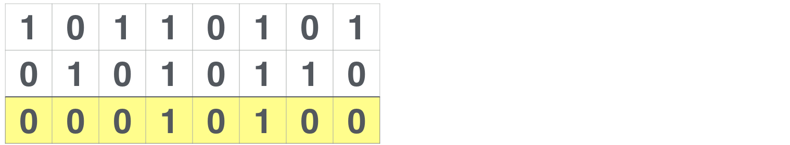
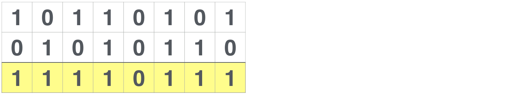
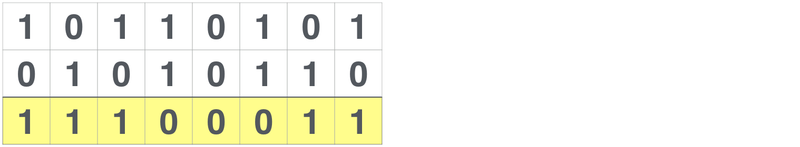
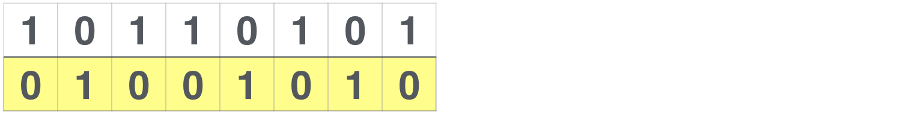
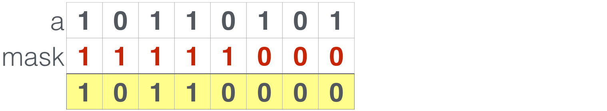
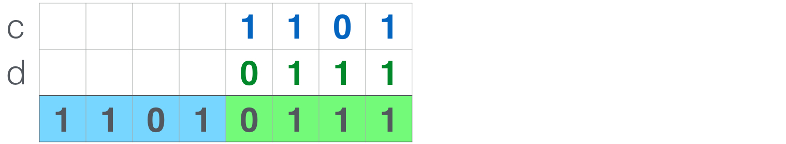

# 运算符

使用**16进制**表示的值来初始化这两个变量：

```solidity
bytes1 a = 0xb5; //  [10110101]  
bytes1 b = 0x56; //  [01010110]
```

### 1. 与运算 `&`

两个变量中**都是1**的位，其`与运算`结果位**才是1**，否则都是0



在Solidity中，与操作符是`&`：

```solidity
a & b; // 结果: 0x14  [00010100]  
```

### 2. 或运算 `|`

在计算或操作结果的某一位时，只要**任何一个**输入变量的对应位是1， 那么结果**都是1**



在Solidity中，或操作符是`|`：

```solidity
a | b; // 结果: 0xf7  [11110111]  
```

### 3. 异或运算 `^`

在计算异或运算结果的某一位时，只有当两个输入变量的**对应位不一致** 时，结果**才是1**



在Solidity中，异或操作符时`^`：

```solidity
a ^ b; // 结果: 0xe3  [11100011]  
```

异或运算有趣的一点是，你把结果和任意一个输入变量再做异或运算， 就可以得到另一个输入变量：

```solidity
0xe3 ^ a; // 结果: 0x56 == b  [01010110]  
```

### 4. 非运算

只需输入一个变量，就会**取反**，原来是1结果就是0，原来是0结果就是1



Solidity本身并不支持非运算，不过可以将变量与\*\*全1值 \*\*`异或`，就得到同样的结果：

```solidity
a ^ 0xff; // Result: 0x4a  [01001010]  
```

### 5. 移位运算

* 以**十进制**来举例

```solidity
00001230 向左位移三位 得到0123000
```

所以，向**左移三位**实际上就是原来的数**乘以10的3次方**

```solidity
00001230 向右位移四位 得到00000123
```

所以，向**右移四位**实际上就是原来的数**除以10的4次方**

* **二进制**同样适用

```plain
000  001  010  011  100  101  110
 0    1    2    3    4    5    6

 001  010  100 //左右移动n位 乘除2的n次方 
  1    2    4
```

由于Solidity目前不支持移位运算，因此我们需要借助于算数运算,来实现同样的效果

#### (1)左移位


示例代码：

```solidity
var n = 3;   
var aInt = uint8(a); // Converting bytes1 into 8 bit integer  
var shifted = aInt * 2 ** n;  
bytes1(shifted);     // Back to bytes. Result: 0xa8  [10101000]  
```

#### (2)右移位


示例代码 :

```solidity
var n = 2;   
var aInt = uint8(a); // Converting bytes1 into 8 bit integer  
var shifted = aInt / 2 ** n;  
bytes1(shifted);     // Back to bytes. Result: 0x2d  [00101101]  
```

### 6. 提取前N位

可以使用**与**操作来提取变量的前N位，方法就是创建一个掩码变量， 其**前N位都是1**：



示例代码：

```solidity
var n = 5;  
var nOnes = bytes1(2 ** n - 1); // Creates 5 1s  
var mask = shiftLeft(nOnes, 8 - n); // Shift left by 3 positions  
a & mask; // Result: 0xb0  [10110000]  
```

### 7. 提取后N位

利用**对2取模计算**就可以提取变量的后N位

示例代码：

```solidity
var n = 5;  
var lastBits = uint8(a) % 2 ** n;  
bytes1(lastBits); // Result: 0x15  [00010101]  
```

### 8. 数据压缩

有了上面的基础，我们就可以**使用更少的存储空间**来减少交易成本。 例如，假设有两个变量其实都是只利用了4位，那么我们可以将其 压缩到一个变量里：



示例代码如下：

```solidity
bytes1 c = 0x0d;  
bytes1 d = 0x07;  
var result = shiftLeft(c, 4) | d; // 0xd7 [11010111]  
```

##


> 更新: 2025-07-11 10:27:33  
> 原文: <https://www.yuque.com/xiaoyuhushenfu/yzin4n/snq72r89wuayxxsn>