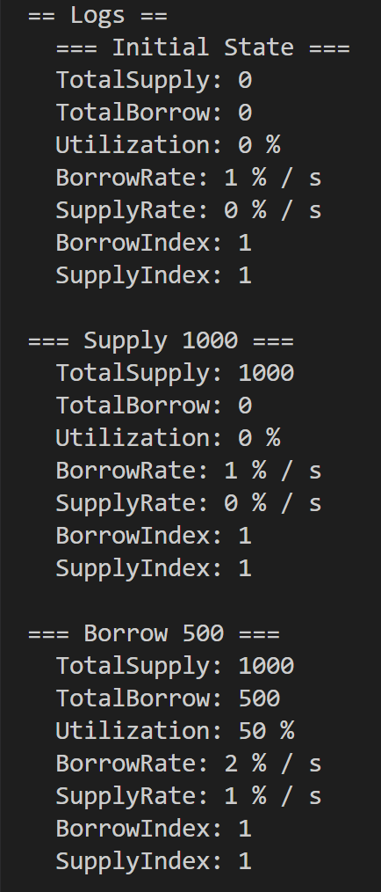
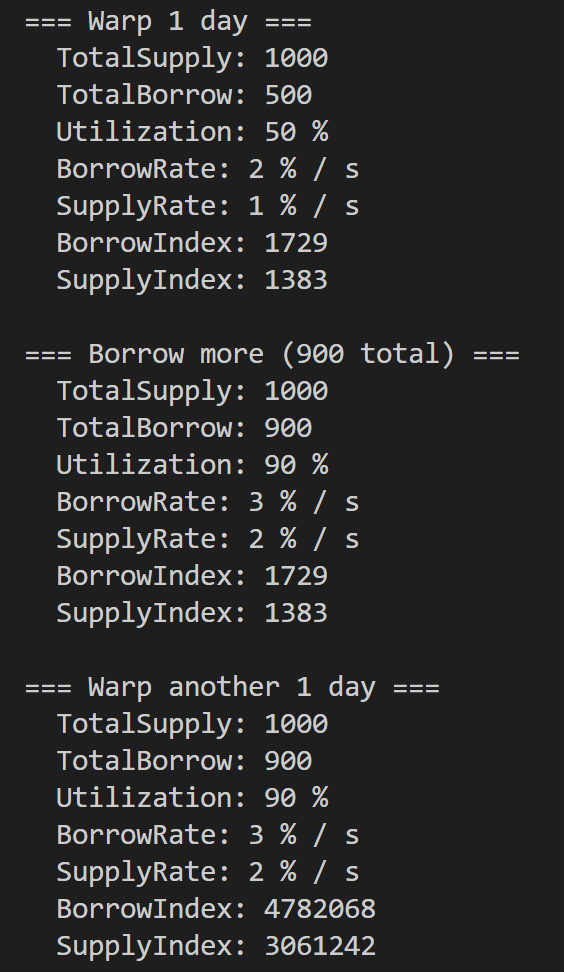

# Compound V3 的利率模型以及简单实现演示

**Compound 本质只做三件事：**

1️⃣ 存款人把钱存进协议  
2️⃣ 借款人从协议借走钱  
3️⃣ 借款人付的利息 → 分给存款人

**协议关心的核心问题只有一个：**

「现在钱够不够用？」

这就引出了 **Utilization（利用率）.**

# V2和V3的区别
V2：采取了cToken机制，每一种资产都有一个自己的借贷池。  
每个池子都有：

+ 自己的 cToken
+ 自己的 totalSupply / totalBorrow
+ 自己的一条利率曲线

V3：一个市场 = 一个借贷资产(base asset)，对于V2中最大的改变就是，每个市场都是独立的，就比如在ETH的抵押额在DAI市场中是不生效的。

 抵押品是跨资产的，但借贷是单资产的。  

# 利率模型
## 利用率
```solidity
    function getUtilization() override public view returns (uint) {
        uint totalSupply_ = presentValueSupply(baseSupplyIndex, totalSupplyBase);
        uint totalBorrow_ = presentValueBorrow(baseBorrowIndex, totalBorrowBase);
        if (totalSupply_ == 0) {
            return 0;
        } else {
            return totalBorrow_ * FACTOR_SCALE / totalSupply_;
        }
    }


    function presentValueSupply(uint64 baseSupplyIndex_, uint104 principalValue_) internal pure returns (uint256) {
        return uint256(principalValue_) * baseSupplyIndex_ / BASE_INDEX_SCALE;
    }

    /**
     * @dev The principal amount projected forward by the borrow index
     */
    function presentValueBorrow(uint64 baseBorrowIndex_, uint104 principalValue_) internal pure returns (uint256) {
        return uint256(principalValue_) * baseBorrowIndex_ / BASE_INDEX_SCALE;
    }

```

其中利用率的计算在V3中更加先进，引用了<font style="background-color:#FBDFEF;">BorrowIndex</font>

不同于V2的复杂，V3**直接用函数来计算当前当前用户有多少借款或者存款**

这些指数的跟V2中的borrowIndex的数学逻辑意义是相同的，都是用来计算新的存款额，或者新的借款额。

### 存款总额的计算
 presentValueSupply（真实供应量） =  principalSupply（存储的用户本金,不包含利息）*    baseSupplyIndex  （累积供应指数） /  BASE_INDEX_SCALE  (1e15) 

### 借款总额的计算
 borrowBalance  （总的借款额） =  principalBorrow  （用户的借款本金） * baseBorrowIndex/  BASE_INDEX_SCALE  

其中都是内部函数，用户们是无法主动更改的。

### 利用率的计算
Utilization = totalborrowBalance (协议总的借款额)/  totalSupplyBase(协议总的供应本金)  

## 借款利率
```solidity
    function getBorrowRate(uint utilization) override public view returns (uint64) {
        if (utilization <= borrowKink) {
            // interestRateBase + interestRateSlopeLow * utilization
            return safe64(borrowPerSecondInterestRateBase + mulFactor(borrowPerSecondInterestRateSlopeLow, utilization));
        } else {
            // interestRateBase + interestRateSlopeLow * kink + interestRateSlopeHigh * (utilization - kink)
            return safe64(borrowPerSecondInterestRateBase + mulFactor(borrowPerSecondInterestRateSlopeLow, borrowKink) + mulFactor(borrowPerSecondInterestRateSlopeHigh, (utilization - borrowKink)));
        }
    }
```

### 借款利率的计算
V3的一个基础利率模型是二段式的

小于K的时候：

borrowRate=base+slopeLow⋅util

大于K的时候:

borrowRate=base+slopeLow⋅kink+slopeHigh⋅(util−kink)

## 存款利率
```solidity
    function getSupplyRate(uint utilization) override public view returns (uint64) {
        if (utilization <= supplyKink) {
            // interestRateBase + interestRateSlopeLow * utilization
            return safe64(supplyPerSecondInterestRateBase + mulFactor(supplyPerSecondInterestRateSlopeLow, utilization));
        } else {
            // interestRateBase + interestRateSlopeLow * kink + interestRateSlopeHigh * (utilization - kink)
            return safe64(supplyPerSecondInterestRateBase + mulFactor(supplyPerSecondInterestRateSlopeLow, supplyKink) + mulFactor(supplyPerSecondInterestRateSlopeHigh, (utilization - supplyKink)));
        }
    }
```

### 存款利率的计算
其中存款利率也分为俩种情况

当利用率小于K值的时候

SupplyRate = supplyPerSecondInterestRateBase(基础利率) + SlopeLow(低利率参数) * U(当前的利用率）

当利用率大于K的时候

SupplyRate = supplyPerSecondInterestRateBase(基础利率) + Mlow *Kink + Mhight*(U - K)

# supplyIndex / borrowIndex 的增长逻辑（利息体系）  
每次用户交互（supply、borrow、withdraw、repay）时，会执行：

```plain
accrueInternal();
```

它做三件事：

### 1. 获取最新利率（随利用率变化）
```plain
borrowRate = interestRateModel.getBorrowRate()
supplyRate = interestRateModel.getSupplyRate()
```

Compound V3 采用函数式利率模型：

```plain
utilization = totalBorrowBase / totalSupplyBase
```

利用率越高 → 借款利率越高 → 存款利率也更高。

### 2. 更新指数
核心公式：

```plain
borrowIndex += borrowIndex * borrowRate * Δt
supplyIndex += supplyIndex * supplyRate * Δt
```

其中 Δt 是经过的时间（秒级）。

也就是说：

+ borrowIndex 增长快（借款人利息更多）
+ supplyIndex 增长稍慢（存款收益来自借款利息的一部分）

### 3. 更新全局的 totalBorrowBase，totalSupplyBase
根据指数变化更新上面这两个全局总额。


 borrowIndex 涨得永远比 supplyIndex 快，借款利率大于存款利率 

# 简单实现演示
存款、借款

```solidity
// SPDX-License-Identifier: MIT
pragma solidity ^0.8.20;

//0x8464135c8F25Da09e49BC8782676a84730C318bC
contract MiniCompoundV3 {
    // =========================
    // 基础状态
    // =========================
    uint256 public totalSupply; // 当前真实存款
    uint256 public totalBorrow; // 当前真实借款

    uint256 public supplyIndex = 1e18;
    uint256 public borrowIndex = 1e18;

    uint256 public lastAccrualTime;

    // =========================
    // 利率参数（人为设定，方便 demo）
    // =========================
    uint256 public constant BASE_RATE = 1e16;      // 1% / s（夸张一点，方便看）
    uint256 public constant SLOPE_LOW = 2e16;      // 2%
    uint256 public constant SLOPE_HIGH = 6e16;     // 6%
    uint256 public constant KINK = 8e17;            // 80%

    constructor() {
        lastAccrualTime = block.timestamp;
    }

    // =========================
    // 利用率
    // =========================
    function utilization() public view returns (uint256) {
        if (totalSupply == 0) return 0;
        return totalBorrow * 1e18 / totalSupply;
    }

    // =========================
    // 借款利率（per second）
    // =========================
    function getBorrowRate() public view returns (uint256) {
        uint256 u = utilization();
        if (u <= KINK) {
            return BASE_RATE + (SLOPE_LOW * u) / 1e18;
        } else {
            return
                BASE_RATE +
                (SLOPE_LOW * KINK) / 1e18 +
                (SLOPE_HIGH * (u - KINK)) / 1e18;
        }
    }

    // =========================
    // 存款利率（简化：取 borrowRate 的 80%）
    // =========================
    function getSupplyRate() public view returns (uint256) {
        return (getBorrowRate() * 80) / 100;
    }

    // =========================
    // 利息累积（核心）
    // =========================
    function accrue() public {
        uint256 dt = block.timestamp - lastAccrualTime;
        if (dt == 0) return;

        uint256 borrowRate = getBorrowRate();
        uint256 supplyRate = getSupplyRate();

        borrowIndex += (borrowIndex * borrowRate * dt) / 1e18;
        supplyIndex += (supplyIndex * supplyRate * dt) / 1e18;

        lastAccrualTime = block.timestamp;
    }

    // =========================
    // 行为函数（只改总量）
    // =========================
    function supply(uint256 amount) external {
        accrue();
        totalSupply += amount;
    }

    function borrow(uint256 amount) external {
        accrue();
        totalBorrow += amount;
    }
}

```

```solidity
// SPDX-License-Identifier: MIT
pragma solidity ^0.8.20;

import "forge-std/Script.sol";
import "../src/1.sol";

contract DemoScript is Script {
    function run() external {
        vm.startBroadcast();

        MiniCompoundV3 demo = new MiniCompoundV3();

        console.log("=== Initial State ===");
        logState(demo);

        console.log("\n=== Supply 1000 ===");
        demo.supply(1000 ether);
        logState(demo);

        console.log("\n=== Borrow 500 ===");
        demo.borrow(500 ether);
        logState(demo);

        console.log("\n=== Warp 1 day ===");
        vm.warp(block.timestamp + 1 days);
        demo.accrue();
        logState(demo);

        console.log("\n=== Borrow more (900 total) ===");
        demo.borrow(400 ether);
        logState(demo);

        console.log("\n=== Warp another 1 day ===");
        vm.warp(block.timestamp + 1 days);
        demo.accrue();
        logState(demo);

        vm.stopBroadcast();
    }

    function logState(MiniCompoundV3 d) internal view {
        console.log("TotalSupply:", d.totalSupply() / 1e18);
        console.log("TotalBorrow:", d.totalBorrow() / 1e18);
        console.log("Utilization:", d.utilization() / 1e16, "%");
        console.log("BorrowRate:", d.getBorrowRate() / 1e16, "% / s");
        console.log("SupplyRate:", d.getSupplyRate() / 1e16, "% / s");
        console.log("BorrowIndex:", d.borrowIndex() / 1e18);
        console.log("SupplyIndex:", d.supplyIndex() / 1e18);
    }
}

```

先anvil，不分叉到主网，因为只是展示 “利率随利用率变化 + 时间复利”  过程，并不是还原主网的实际参数

```solidity
forge create MiniCompoundV3   --rpc-url http://127.0.0.1:8545   --private-key 0x59c6995e998f97a5a0044966f0945389dc9e86dae88c7a8412f4603b6b78690d --broadcast
```

```solidity
forge script script/1.sol --rpc-url http://127.0.0.1:8545 --private-key 0x59c6995e998f97a5a0044966f0945389dc9e86dae88c7a8412f4603b6b78690d
```




> 更新: 2026-02-06 22:15:10  
> 原文: <https://www.yuque.com/xiaoyuhushenfu/yzin4n/pzvpn4ahzsgvv0an>