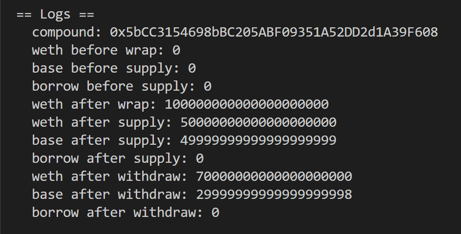
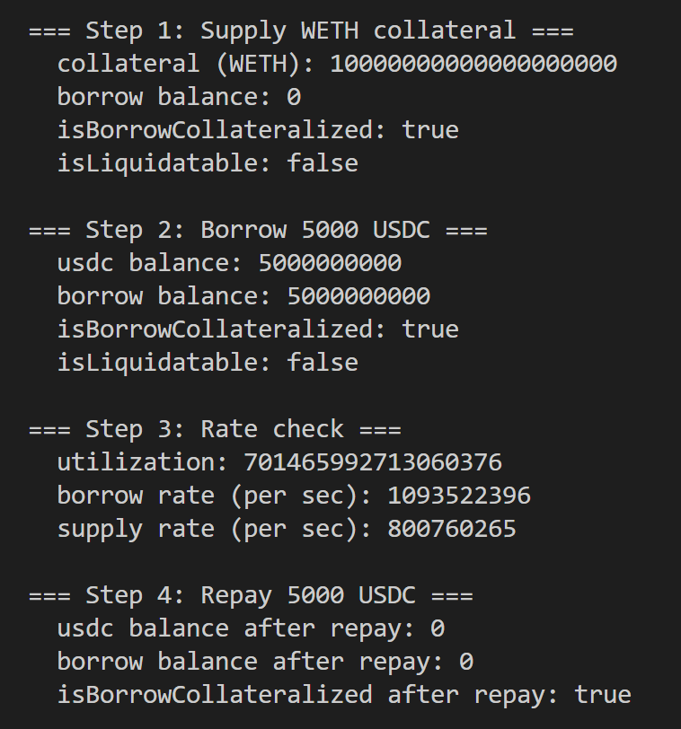

# Compound V3简单逻辑及实现

# 一、V2 的设计思路

V2 的核心模型是"**对称多市场**"。每一种资产都有自己独立的市场，比如 ETH 市场、USDC 市场、DAI 市场。

用户存入资产，就会得到对应的 **cToken**（比如存 ETH 得到 cETH），cToken 本身会随时间增值来体现利息。想借钱的时候，先存一些资产作抵押，然后从另一个市场借出你想要的资产。

这个模型的问题在于：

* **资金分散**：每个市场的流动性是割裂的，互相不共享
* **风险传导**：任何一种抵押资产出问题（比如被预言机攻击），都可能波及整个协议，因为所有资产都可以被借出
* **复杂度高**：Comptroller 合约要管理所有市场之间的风险关系，逻辑很重

***

# 二、V3：单一 Base Token

V3 做了一个根本性的设计转变，引入了 **Comet** 合约的概念。

每一个 Comet 合约就是一个独立的市场，但这个市场围绕**一种 base token** 来运转。目前主网上有两个主要市场：

* USDC Comet：base = USDC
* WETH Comet：base = WETH

**最关键的规则是：**

只有 base token 才能被借出，也只有 base token 的存款才能赚取利息。其他所有资产，只能作为抵押品存进来，不产生任何收益。

这个设计直接解决了 V2 的风险传导问题。抵押品出了问题，最多影响抵押品本身的清算，借不出去的资产不会被攻击者直接提走。协议的核心资金池（base token）是安全的。

***

# 三、接口设计：supply 和 withdraw 的统一语义

这里是最容易让人困惑、也是最值得讲的地方。

V3 没有像 V2 那样显式的 `mint` / `redeem` / `borrow` / `repayBorrow` 这套函数。它只有两个核心函数：

```solidity
comet.supply(asset, amount)
comet.withdraw(asset, amount)
```

看起来很简单，但行为会根据你传入的 asset 不同而完全不同。

**当 asset 是 base token 时：**

`supply` 是存款，你的 principal 变正，开始生息。 `withdraw` 是借款，你的 principal 变负，开始计息。

**当 asset 是 collateral token 时：**

`supply` 是存抵押品，进入你的抵押品账户。 `withdraw` 是取抵押品，前提是取完之后仓位还是健康的。

所以整个协议的状态核心在于一个叫 **principal** 的值：

* `principal > 0`：你是存款人，协议欠你钱，你赚利息
* `principal < 0`：你是借款人，你欠协议钱，你付利息
* `principal = 0`：你只有抵押品，没有任何 base 仓位

协议通过这一个数的正负，同时表达了两种截然相反的角色，不需要用户显式声明自己是"存款"还是"借款"，接口非常干净。

***

# 四、风控：也内置在 Comet 里

V2 的风控逻辑在 Comptroller 这个独立合约里，管理着跨市场的抵押因子、清算逻辑等。

V3 把风控直接内置进了 Comet，主要是两个函数：

```solidity
comet.isBorrowCollateralized(account)  // 当前仓位是否足额抵押
comet.isLiquidatable(account)          // 当前仓位是否可被清算
```

两者的区别在于用的抵押因子不同：

* `isBorrowCollateralized` 用的是 **borrowCollateralFactor**，这是你借款时的安全线，比较宽松
* `isLiquidatable` 用的是 **liquidateCollateralFactor**，这是触发清算的红线，比借款安全线更严格

正常情况下，你借款后 `isBorrowCollateralized = true`，`isLiquidatable = false`。当抵押品价格下跌，先是 `isBorrowCollateralized` 变 false（你不能再借更多了），再跌就是 `isLiquidatable` 变 true，这时候清算人就可以进来了。

# 本地实现演示

```solidity
anvil --fork-url https://eth-mainnet.g.alchemy.com/v2/ItlSfQQLVNsDqjGck4BJbLQGy0n7GlXv
```

## base仅在右边

```solidity
// SPDX-License-Identifier: SEE LICENSE IN LICENSE
pragma solidity ^0.8.0;

import {IERC20} from "./interfaces/IERC20.sol";
import {IWETH} from "./interfaces/IWETH.sol";
import {IComet} from "./interfaces/IComet.sol";

contract Compound {
    IComet public immutable comet;
    IWETH public immutable weth;

    // WETH 市场：base = WETH
    address constant COMET_WETH = 0xA17581A9E3356d9A858b789D68B4d866e593aE94;
    address constant WETH = 0xC02aaA39b223FE8D0A0e5C4F27eAD9083C756Cc2;

    constructor() {
        comet = IComet(COMET_WETH);
        weth = IWETH(WETH);
    }

    function wrapETH() external payable {
        weth.deposit{value: msg.value}();
    }

    function supply(uint256 _amount) external {
        weth.approve(address(comet), type(uint256).max);
        comet.supply(WETH, _amount);
    }

    function withdraw(uint256 _amount) external {
        comet.withdraw(WETH, _amount);
    }

    function wethBalance() external view returns (uint256) {
        return weth.balanceOf(address(this));
    }

    function baseBalance() external view returns (uint256) {
        return comet.balanceOf(address(this));
    }

    function borrowBalance() external view returns (uint256) {
        return comet.borrowBalanceOf(address(this));
    }

    receive() external payable {}
}

```

```solidity
// SPDX-License-Identifier: SEE LICENSE IN LICENSE
pragma solidity ^0.8.0;

import "forge-std/Script.sol";
import "../src/1.sol";

contract SupplyWithdraw is Script {
    Compound public compound;

    constructor() {
        compound = new Compound();
    }

    function run() external {
        vm.startBroadcast();
        console.log("compound:", address(compound));
        console.log("weth before wrap:", compound.wethBalance());
        console.log("base before supply:", compound.baseBalance());
        console.log("borrow before supply:", compound.borrowBalance());

        compound.wrapETH{value: 100 ether}();

        console.log("weth after wrap:", compound.wethBalance());

        compound.supply(50 ether);

        console.log("weth after supply:", compound.wethBalance());
        console.log("base after supply:", compound.baseBalance());
        console.log("borrow after supply:", compound.borrowBalance());

        compound.withdraw(20 ether);

        console.log("weth after withdraw:", compound.wethBalance());
        console.log("base after withdraw:", compound.baseBalance());
        console.log("borrow after withdraw:", compound.borrowBalance());
        vm.stopBroadcast();
    }
}

```



## base从右变左

1. 存入 WETH 作为抵押品（supply collateral）
2. 借出 USDC（withdraw base → 进入负 principal 状态）
3. 检查 isBorrowCollateralized / isLiquidatable

```solidity
// SPDX-License-Identifier: MIT
pragma solidity ^0.8.0;

import {IERC20} from "./interfaces/IERC20.sol";
import {IWETH} from "./interfaces/IWETH.sol";
import {IComet} from "./interfaces/IComet.sol";

/**
 * 场景：
 * 1. 存入 WETH 作为抵押品（supply collateral）
 * 2. 借出 USDC（withdraw base → 进入负 principal 状态）
 * 3. 检查 isBorrowCollateralized / isLiquidatable
 */
contract CompoundBorrow {
    IComet public immutable comet;
    IWETH public immutable weth;
    IERC20 public immutable usdc;

    // USDC 市场：base = USDC，可抵押 WETH
    address constant COMET_USDC = 0xc3d688B66703497DAA19211EEdff47f25384cdc3;
    address constant WETH = 0xC02aaA39b223FE8D0A0e5C4F27eAD9083C756Cc2;
    address constant USDC = 0xA0b86991c6218b36c1d19D4a2e9Eb0cE3606eB48;

    constructor() {
        comet = IComet(COMET_USDC);
        weth = IWETH(WETH);
        usdc = IERC20(USDC);
    }

    // ── 存入 WETH 作为抵押品 ──────────────────────────────
    function wrapAndSupplyCollateral(uint256 _amount) external payable {
        weth.deposit{value: _amount}();
        weth.approve(address(comet), type(uint256).max);
        comet.supply(WETH, _amount); // 抵押品路径 → supplyCollateral
    }

    // ── 借出 USDC（base token） ───────────────────────────
    // withdraw base → principal 变负 → 进入借款状态
    function borrowUSDC(uint256 _usdcAmount) external {
        comet.withdraw(USDC, _usdcAmount);
    }

    // ── 还款：把 USDC 还回协议 ────────────────────────────
    function repayUSDC(uint256 _usdcAmount) external {
        usdc.approve(address(comet), _usdcAmount);
        comet.supply(USDC, _usdcAmount); // supply base → repay 路径
    }

    // ── 风控查询 ──────────────────────────────────────────
    function isBorrowCollateralized() external view returns (bool) {
        return comet.isBorrowCollateralized(address(this));
    }

    function isLiquidatable() external view returns (bool) {
        return comet.isLiquidatable(address(this));
    }

    // ── 余额查询 ──────────────────────────────────────────
    function wethBalance() external view returns (uint256) {
        return weth.balanceOf(address(this));
    }

    function usdcBalance() external view returns (uint256) {
        return usdc.balanceOf(address(this));
    }

    // 抵押品余额（collateral，不计利息）
    function collateralBalance() external view returns (uint128) {
        return comet.collateralBalanceOf(address(this), WETH);
    }

    // base 存款余额（principal > 0 时有值）
    function baseBalance() external view returns (uint256) {
        return comet.balanceOf(address(this));
    }

    // 借款余额（principal < 0 时有值）
    function borrowBalance() external view returns (uint256) {
        return comet.borrowBalanceOf(address(this));
    }

    // ── 利率查询 ──────────────────────────────────────────
    function currentUtilization() external view returns (uint256) {
        return comet.getUtilization();
    }

    function currentBorrowRate() external view returns (uint64) {
        return comet.getBorrowRate(comet.getUtilization());
    }

    function currentSupplyRate() external view returns (uint64) {
        return comet.getSupplyRate(comet.getUtilization());
    }

    receive() external payable {}
}

```

```solidity
// SPDX-License-Identifier: MIT
pragma solidity ^0.8.0;

import "forge-std/Script.sol";
import "../src/2.sol";

contract BorrowScript is Script {
    CompoundBorrow public comp;

    function run() external {
        vm.startBroadcast();

        comp = new CompoundBorrow();
        console.log("contract:", address(comp));

        // ── Step 1: 存入 10 ETH 作为抵押品 ─────────────────
        console.log("\n=== Step 1: Supply WETH collateral ===");

        comp.wrapAndSupplyCollateral{value: 10 ether}(10 ether);

        console.log("collateral (WETH):", comp.collateralBalance());
        console.log("borrow balance:", comp.borrowBalance());
        console.log("isBorrowCollateralized:", comp.isBorrowCollateralized());
        console.log("isLiquidatable:", comp.isLiquidatable());

        // ── Step 2: 借出 USDC → principal 变负 ──────────────
        // 10 ETH ≈ $30000，borrowCollateralFactor ≈ 0.9，最多借 ~27000 USDC
        // 这里借 5000 USDC，安全范围内
        console.log("\n=== Step 2: Borrow 5000 USDC ===");

        comp.borrowUSDC(5000e6); // USDC 6位精度

        console.log("usdc balance:", comp.usdcBalance());
        console.log("borrow balance:", comp.borrowBalance());
        console.log("isBorrowCollateralized:", comp.isBorrowCollateralized());
        console.log("isLiquidatable:", comp.isLiquidatable());

        // ── Step 3: 查看利率 ─────────────────────────────────
        console.log("\n=== Step 3: Rate check ===");
        console.log("utilization:", comp.currentUtilization());
        console.log("borrow rate (per sec):", comp.currentBorrowRate());
        console.log("supply rate (per sec):", comp.currentSupplyRate());

        // ── Step 4: 还款，观察 principal 从负回到 0 ──────────
        console.log("\n=== Step 4: Repay 5000 USDC ===");

        comp.repayUSDC(5000e6);

        console.log("usdc balance after repay:", comp.usdcBalance());
        console.log("borrow balance after repay:", comp.borrowBalance());
        console.log("isBorrowCollateralized after repay:", comp.isBorrowCollateralized());

        vm.stopBroadcast();
    }
}

```




> 更新: 2026-04-19 18:06:08  
> 原文: <https://www.yuque.com/xiaoyuhushenfu/yzin4n/hol3rcxwxgkb7zv8>