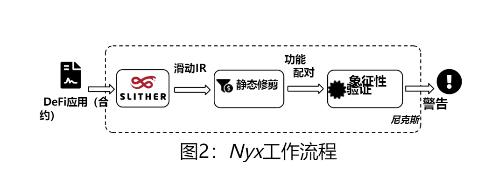
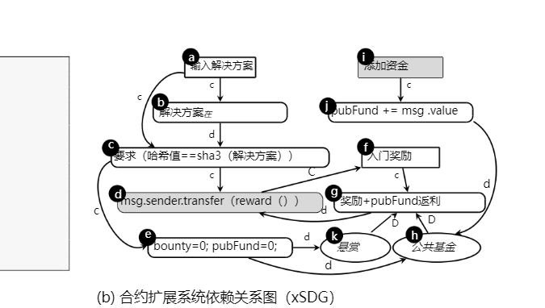
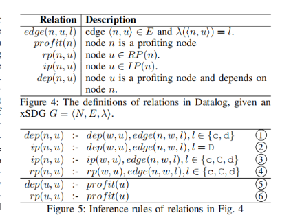

# 抢跑论文

论文地址：

（观看前提：了解三明治攻击（抢跑交易），mempool， callee ）

抢跑交易的定义：\
此论文将抢跑交易作为了一个可以被形式化的定义的检测漏洞。

（只有当建议顺序的改变能让攻击者赚钱，受害者亏钱的时候，才算被构成的真正的漏洞）

其中，区块链的状态可以看作一个状态转换系统，

比如每一个状态我们都用 σ 来进行一个表示，表示当前存储的（变量，余额，映射）

* 其中当一笔 T = \<a, f(x)>
* a是交易的发起方
* f 是智能合约中的函数
* x是我们在调用函数的时候的参数

所以如果我们执行交易后就会发生状态变化即

σ →(执行 T)→ σ'

同时我们用T1,T2来表示，并且T2是在T1之后执行的。执行T1,T2的状态转换我们记为*<font style="color:rgb(0, 0, 0);"> σ T1T2资产</font>*

{资产（代表攻击者瞄定的利益，可以是代币，ether，nft等等）

即<code><font style="background-color:rgba(0, 0, 0, 0.06);">Aσ(a)</font></code> 表示账户 <code><font style="background-color:rgba(0, 0, 0, 0.06);">a</font></code> 在状态 <code><font style="background-color:rgba(0, 0, 0, 0.06);">σ</font></code> 下拥有的可衡量资产（ETH、ERC20、NFT 等）。 }。

同时，通过最一开始的定义我们也可以形象的描绘出抢跑交易的漏洞

### 抢跑漏洞成立条件（Definition 1）：

存在两笔交易：

* 攻击者交易 <code><font style="background-color:rgba(0, 0, 0, 0.06);">T₁ = <a₁, f₁(x₁)></font></code>
* 受害者交易 <code><font style="background-color:rgba(0, 0, 0, 0.06);">T₂ = <a₂, f₂(x₂)></font></code>

如果满足以下条件：

```plain
Aσ(T₁T₂)(a₁) > Aσ(T₂T₁)(a₁)   // 攻击者因为抢先而赚更多
Aσ(T₁T₂)(a₂) < Aσ(T₂T₁)(a₂)   // 受害者因为被抢先而亏损
a₁ ≠ a₂                        // 双方不是同一人
```

那么这对函数调用 <code><font style="background-color:rgba(0, 0, 0, 0.06);"><f₁, f₂></font></code> 存在可利用的抢跑漏洞。

用一句大白话说，只要改变交易顺序可以让攻击者赚钱，让受害者亏钱，就是一个漏洞

专业术语：有利可图的交易顺序依赖

合约中存在交易顺序依赖本身没有问题，但是如果有让攻击者通过控制执行赚到钱，就构成漏洞

因此，Nyx工具会防止这种漏洞的发生

设两笔交易：

* <code><font style="background-color:rgba(0, 0, 0, 0.06);">T1 = ⟨attacker, changeToken(newToken)⟩</font></code>
* <code><font style="background-color:rgba(0, 0, 0, 0.06);">T2 = ⟨victim, changeToken(newToken)⟩</font></code>

如果执行顺序为 <code><font style="background-color:rgba(0, 0, 0, 0.06);">T1 T2</font></code>（攻击者先）且在执行序列下满足：

* <code><font style="background-color:rgba(0, 0, 0, 0.06);">A_{σ_{T1T2}}(attacker) > A_{σ_{T2T1}}(attacker)</font></code> （攻击者在先能比后获更多资产）
* <code><font style="background-color:rgba(0, 0, 0, 0.06);">A_{σ_{T1T2}}(victim) < A_{σ_{T2T1}}(victim)</font></code> （受害者在先能比后少资产）\
  且 <code><font style="background-color:rgba(0, 0, 0, 0.06);">attacker ≠ victim</font></code>，那么根据 Nyx 的 Definition 1，这是一个**可利用的抢先执行漏洞**。

因此在论文中给的一个例子

```solidity
contract CrowdFund {
    Controller controller;
    mapping(address => uint) projects;
    mapping(uint => ERC20) tokens;
    mapping(uint => uint) donations;

    function donate(uint project, uint donation) public {
        tokens[project].transferFrom(msg.sender, this, donation);
        donations[project] += donation;
    }

    function withdraw() public {
        uint project = projects[msg.sender];
        uint donation = donations[project];
        tokens[project].transfer(msg.sender, donation);
        donations[project] = 0;
    }

    function _changeToken(address projOwner, ERC20 newToken) public {
        require(msg.sender == controller);
        require(newToken.owner() == address(this));
        require(noProject(newToken));
        uint project = projects[projOwner];
        ERC20 oldToken = tokens[project];
        tokens[project] = newToken;
        oldToken.transferOwnership(projOwner);
    }
}

contract Controller {
    CrowdFund crowdFund;

    function changeToken(ERC20 newToken) public {
        require(notBlackList(msg.sender));
        ERC20 oldToken = crowdFund._changeToken(msg.sender, newToken);
    }
}

contract ERC20 {
    address public owner;

    function transferOwnership(address newOwner) public onlyOwner {
        owner = newOwner;
    }
}
```

（论文片段展示的合约源码不完成，并不能直接运行）

* <code><font style="background-color:rgba(0, 0, 0, 0.06);">CrowdFund</font></code>（片段见论文，Lines ~1–24）：
* <code><font style="background-color:rgba(0, 0, 0, 0.06);">tokens</font></code>：<code><font style="background-color:rgba(0, 0, 0, 0.06);">mapping(uint => ERC20)</font></code>，把 project id 关联到某个 ERC20 合约（Line 4）。
* <code><font style="background-color:rgba(0, 0, 0, 0.06);">donate(project, donation)</font></code>：把捐款 token 从用户转入合约并累加（Lines 6–8）。
* <code><font style="background-color:rgba(0, 0, 0, 0.06);">withdraw()</font></code>：项目 owner 提取 <code><font style="background-color:rgba(0, 0, 0, 0.06);">donations[project]</font></code>（Lines 10–14）。
* <code><font style="background-color:rgba(0, 0, 0, 0.06);">_changeToken(address projOwner, ERC20 newToken)</font></code>：只有 <code><font style="background-color:rgba(0, 0, 0, 0.06);">controller</font></code> 能调用（Line 17），函数要求 <code><font style="background-color:rgba(0, 0, 0, 0.06);">newToken.owner() == address(this)</font></code>（Line 18）并且 <code><font style="background-color:rgba(0, 0, 0, 0.06);">noProject(newToken)</font></code>（Line 19），然后把 <code><font style="background-color:rgba(0, 0, 0, 0.06);">tokens[project]</font></code> 换成 <code><font style="background-color:rgba(0, 0, 0, 0.06);">newToken</font></code> 并把旧 token 的 <code><font style="background-color:rgba(0, 0, 0, 0.06);">transferOwnership</font></code> 给 <code><font style="background-color:rgba(0, 0, 0, 0.06);">projOwner</font></code>（Lines 21–23）。[qingkaishi.github.io](https://qingkaishi.github.io/public_pdfs/SP2024.pdf)
* <code><font style="background-color:rgba(0, 0, 0, 0.06);">Controller</font></code>（Lines 25–31）：
* <code><font style="background-color:rgba(0, 0, 0, 0.06);">changeToken(ERC20 newToken)</font></code>：调用 <code><font style="background-color:rgba(0, 0, 0, 0.06);">crowdFund._changeToken(msg.sender, newToken)</font></code>，但本身只做了 <code><font style="background-color:rgba(0, 0, 0, 0.06);">notBlackList(msg.sender)</font></code> 的简单检查（Line 28）。也就是说 <code><font style="background-color:rgba(0, 0, 0, 0.06);">Controller</font></code> 并**未**校验 <code><font style="background-color:rgba(0, 0, 0, 0.06);">msg.sender</font></code> 是否确实是项目所有者（该逻辑委托给 CrowdFund 的 <code><font style="background-color:rgba(0, 0, 0, 0.06);">projects</font></code> 映射）。[qingkaishi.github.io](https://qingkaishi.github.io/public_pdfs/SP2024.pdf)
* 简化的 <code><font style="background-color:rgba(0, 0, 0, 0.06);">ERC20</font></code>（Lines 31–36）：
* 只有 <code><font style="background-color:rgba(0, 0, 0, 0.06);">owner</font></code> 地址和 <code><font style="background-color:rgba(0, 0, 0, 0.06);">transferOwnership</font></code>（受 <code><font style="background-color:rgba(0, 0, 0, 0.06);">onlyOwner</font></code> 限制）。这里重点是 <code><font style="background-color:rgba(0, 0, 0, 0.06);">newToken.owner()</font></code> 能被任意转移（如果当前 owner 执行 <code><font style="background-color:rgba(0, 0, 0, 0.06);">transferOwnership</font></code>）。

这是由三个合约构成的,其中漏洞在Controller.changeToken 依旧CrowdFund.\_changeToken 的函数对上：攻击者在受害者调用changeToken之前发送一个自己的changeToken(前置交易）,将新的token绑定到了攻击者的项目上，从而让受害者随后发起的changeToken 因为前置条件导致失败，攻击者因此抢先将token的控制权控制，导致受害者损失。

### 攻击步骤

其中想要完成攻击必须是由当前owner调用，论文中假设业务第一步，项目者将token所有权转给了CrowdFund再调用changeToken

* **受害者的目的**

把 <code><font style="background-color:rgba(0, 0, 0, 0.06);">transferOwnership(newToken -> CrowdFund)</font></code> 做完后，发起 <code><font style="background-color:rgba(0, 0, 0, 0.06);">Controller.changeToken(newToken)</font></code>（T2）。按预期，这会通过 <code><font style="background-color:rgba(0, 0, 0, 0.06);">Controller</font></code> → <code><font style="background-color:rgba(0, 0, 0, 0.06);">CrowdFund._changeToken</font></code>，将 <code><font style="background-color:rgba(0, 0, 0, 0.06);">newToken</font></code> 绑定到该受害者的 project，然后把旧 token 所有权转回受害者。

* **攻击者的前置以及目的**

攻击者发现受害者要做changeToken，通常是可以在mempool可以预测到的，

攻击者将会抢先发送自己的Controll.changeToken(newToken)，（或者其他的能够触发<code><font style="background-color:rgba(0, 0, 0, 0.06);">CrowdFund._changeToken</font></code> 路径的调用 ），并且会设置更高的gas或者MEV-bot，确保自己的交易抢先包含在区块中。

同时保证一开始的前提，<code><font style="background-color:rgba(0, 0, 0, 0.06);">newToken.owner() == address(CrowdFund)</font></code>（前提），<code><font style="background-color:rgba(0, 0, 0, 0.06);">noProject(newToken)</font></code>（假设最初为 true）也成立，所以攻击者的 <code><font style="background-color:rgba(0, 0, 0, 0.06);">changeToken</font></code> 会成功，把 <code><font style="background-color:rgba(0, 0, 0, 0.06);">newToken</font></code> 关联到了攻击者控制的 project（论文中说明函数对 ⟨changeToken, changeToken⟩ 是 vulnerable）。

攻击成功

* **受害者T2失败或逻辑的影响**

当受害者的交易被后执行，不会满足合约代码中的require条件，属于受害者的token关联权被偷走了。

* **漏洞修复**

合约可以添加额外的身份验证，只有将newToken的所有权转给CrowedFound的调用者才能调用changeToken

## 3.2现有技术的局限性

目前的工具会有典型的限制，

* 跨合约分析

目前很多工具只能对单个合约进行分析无法对跨合约逻辑进行综合检测（比如 Slither ），因此无法发示例合约中的漏洞。并且大部分工具只能发现基础漏洞，可能无法发现类似于抢跑的逻辑漏洞

* 漏洞的可利用性

现有的技术的检测预言机在捕捉漏洞的同时存在局限性，很容易发生误报。比如，现有有的技术通过合约的俩事务间可能存在的数据竞争来检测漏洞。但是这些数据竞争是良性的，因此是无法被利用的。

## 3.3 Nyx工具需要攻克的难题以及方案

1. 必须判断“可利用性”而不仅仅是找数据竞争

许多工具会产生误报只是发现了“俩交易顺序会导致状态不同”但是这种状态差异并不会导致攻击者获利。同时要把“状态差异”提升为“漏洞”，需要建模受害者/攻击者在不同顺序下的资产变化。

1. 跨合约的交互

真正抢跑交易往往会涉及很多个合约，如果想要把所有的合约和函数对组合起来，候选函数对数和路径组合会指数超级增长。

1. 静态分析中callee不确定性和动态外部状态

静态语境下，外部合约的真实地址和运行状态（或oracl值）通常是不知道的，做跨合约分析做“过-近似的分析”，即把所有函数签名的函数都视为潜在的callee)

* **Nyx的应对方案**

分为俩阶段

1.静态purning （快速，过- 近似地排掉大多数的绝对无害的函数，比如先用slither）, 基于一种图表示的xSDG和另一组Datalog规则来判定必要条件

2.剩下的函数用SMT验证，Nyx做了工程化（路径合并，只对每对函数调用一次SMT等）减少开销。

## 详细解释

静态剪枝：xSDG（扩展系统依赖图） + 必要条件（Datalog）

* **xSDG**

是对经典系统依赖图的扩展，专门为智能合约设计，用来表示跨合约的控制依赖和数据依赖（transaction内和跨交易之间的影响链）。

### 必要条件（Necessary Condition）——核心想法

* 若函数对 ⟨f1, f2⟩ 是可被 front-run 利用的，**f1 必须影响在 f2 中会改变调用者资产的那些节点（profiting nodes）**，且**f2 也必须影响 f1 的 profiting nodes**。换言之，两者互相影响彼此可能得到的“profit”。这是一种对“可利用性”的弱化（必要但不充分）约束，用来高效地剪去大多数不可能成为漏洞的函数对。[qingkaishi.github.io](https://qingkaishi.github.io/public_pdfs/SP2024.pdf)

### 用 Datalog 表达规则

* Nyx 把“哪些节点是 profiting node”“哪些写/读会传递影响”等关系用 Datalog 规则写出，基于 xSDG 的连通/依赖信息运行这些规则，快速判断哪些函数对满足“互相影响”的必要条件。因为 Datalog 是基于 fixpoint 的高效推理，适合在大量函数对上做大规模筛查。[qingkaishi.github.io](https://qingkaishi.github.io/public_pdfs/SP2024.pdf)

### 工程效果（剪枝比）

* 论文给出的实测结果：在包含漏洞的那些 contract groups 中，整个原始函数对数为 29,960；静态剪枝之后只剩 3,375（约 **减少 88.73%** 的搜索空间），极大降低后续符号验证的负担。[qingkaishi.github.io](https://qingkaishi.github.io/public_pdfs/SP2024.pdf)

***

## 四、符号验证（Symbolic Validation）与工程优化

静态剪枝得到一批候选后，Nyx 对这些候选做精确验证（即尝试满足论文中形式化的漏洞定义，比较两种交易序列下攻击者/受害者的资产变化）。关键实现点和优化如下：

### 1) 路径枚举 + 路径条件收集（但不逐路径调用 SMT）

* 直接对每一对路径都调用 SMT 会导致巨量求解（慢且会超时）。Nyx 改进的做法是**沿函数内的分支先枚举并合并变量值表达式**（把同一变量在不同分支下的表达用 if-then-else / 条件表达式合并），把路径条件与变量值合并成更紧凑的约束表达式，然后**只对每个函数对调用一次 SMT 求解**以判定可满足性。这样把 SMT 调用次数从“每条路径”降到“每个函数对一次”，显著节省求解器开销。[qingkaishi.github.io](https://qingkaishi.github.io/public_pdfs/SP2024.pdf)

### 2) 资产（asset）建模

* 为了判断“是否可获利”，Nyx 在符号执行时对“资产”做了建模（例如 ETH 余额、token 余额、合约中可被提取的金额等），构造公式 <code><font style="background-color:rgba(0, 0, 0, 0.06);">Asset(after T1T2, attacker) - Asset(after T2T1, attacker) > 0</font></code> 与相应的受害者损失公式，交给 SMT 求解器验证是否存在满足的参数与路径。这个语义层的建模是 Nyx 与传统“只看状态差异”工具的关键差别。[qingkaishi.github.io](https://qingkaishi.github.io/public_pdfs/SP2024.pdf)

### 3) callee 不确定性的处理（跨合约调用）

* 当静态分析遇到外部调用时，真实 callee 地址在 compile-time 未必已知。Nyx 采用**在 contract group C 内把同签名的所有函数都作为潜在 callee 的过-近似策略**（即如果函数签名匹配且在同一组内，就当作可能被调用）。这会增加候选数，但 xSDG + Datalog pruning 已能把多数无关对剔除，达到可控性

# 4.方法



首先先先试用slither进行静态分析。然后基于slither框架执行静态剪枝操作，剔除不符合抢先漏洞必要条件的功能对。在这个阶段大部分功能都会被过略掉，然后Nyx通过符号执行和SMT求解技术，验证每个可疑的功能对是否存在抢先执行漏洞。

## 4.1 基于必要条件的静态剪枝

必要条件：

Nyx定义的前置攻击存在的必要条件是双向的：

只有当：\
f1的执行可以影响f2的收益

f2的执行也可以影响f1的收益

两者成立的时候，就会构成前置交易风险

这两条分别对应攻击的两个条件：

* 攻击者能从执行顺序差异中获利；
* 受害者因执行顺序被改变而损失。

```solidity
pragma solidity ^0.4.24;

contract FindThisHash {
    bytes32 public hash = 0xb5b...e0a;   // 预设目标哈希
    uint bounty = 1 ether;               // 悬赏奖励
    uint pubFund = 0;                    // 公共基金池

    function solve(string solution) public {
        require(hash == sha3(solution)); // 验证是否为正确解
        msg.sender.transfer(reward());   // 将奖励发给找到正确解的用户
        bounty = 0;
        pubFund = 0;
    }

    function reward() public view returns (uint) {
        return bounty + pubFund;
    }

    function addFund() public payable {
        pubFund += msg.value;            // 允许他人向奖励池添加资金
    }
}
```



### 4.1.1扩展系统依赖关系图

定义：

G = ⟨N, E, λ⟩

* N：节点集合
* E：边集合
* λ：标签函数，标记边的类型

**详解：**

1. **节点：**

分为两类：

* 1语句节点NS:合约语句或函数入口，比如：

msg.sender.transfer(reward());

* 2. 变量节点NV:区块链上的存储变量，如pubFound等

所以图的节点覆盖了：函数入口，重要语句，所有的持久化状态变量

1. **边（E）**

表示程序中一个节点如何影响另一边节点的关系；

| 边类型 | 含义 | 标签 |
| :--- | --- | :--- |
| **控制依赖边 Ec** | 节点 <code><font style="background-color:rgba(0, 0, 0, 0.06);">u</font></code> 的执行是否受节点 <code><font style="background-color:rgba(0, 0, 0, 0.06);">n</font></code> 的控制条件影响（例如 <code><font style="background-color:rgba(0, 0, 0, 0.06);">if</font></code>、循环、require）。  | <code><font style="background-color:rgba(0, 0, 0, 0.06);">c</font></code> |
| **调用依赖边** | + 函数 A 在某处调用了函数 B（控制从 A 的调用点传递到 B 的入口）。<br/>+ 例子：<code><font style="background-color:rgba(0, 0, 0, 0.06);">A.foo()</font></code> 中 <code><font style="background-color:rgba(0, 0, 0, 0.06);">B.bar()</font></code> 被调用，则 <code><font style="background-color:rgba(0, 0, 0, 0.06);">entry_bar</font></code> ←（<code><font style="background-color:rgba(0, 0, 0, 0.06);">C</font></code>）← 调用点。 | <code><font style="background-color:rgba(0, 0, 0, 0.06);">C</font></code> |
| **数据依赖边 Ed** | + 同一次交易执行中，某节点写入/赋值一个局部/临时变量或内存位置，另一个节点读该值。<br/>+ 例子：<code><font style="background-color:rgba(0, 0, 0, 0.06);">uint x = compute(); ... use(x);</font></code> 写 <code><font style="background-color:rgba(0, 0, 0, 0.06);">x</font></code> 的节点 →（<code><font style="background-color:rgba(0, 0, 0, 0.06);">d</font></code>）→ 读 <code><font style="background-color:rgba(0, 0, 0, 0.06);">x</font></code> 的节点 | <code><font style="background-color:rgba(0, 0, 0, 0.06);">d</font></code> |
| **事务间数据依赖** | + 合约存储槽（SSTORE）在一次交易中被写入，随后在另一次交易中被读取（SLOAD），读写间跨交易传递的影响用 <code><font style="background-color:rgba(0, 0, 0, 0.06);">D</font></code> 表示。<br/>+ 例子：<code><font style="background-color:rgba(0, 0, 0, 0.06);">solve()</font></code> 写 <code><font style="background-color:rgba(0, 0, 0, 0.06);">bounty=0</font></code>（T1），后续 T2 中 <code><font style="background-color:rgba(0, 0, 0, 0.06);">reward()</font></code> 读取 <code><font style="background-color:rgba(0, 0, 0, 0.06);">bounty</font></code>，则写节点 →（<code><font style="background-color:rgba(0, 0, 0, 0.06);">D</font></code>）→ 读节点。 | <code><font style="background-color:rgba(0, 0, 0, 0.06);">D</font></code>（大写） |

相对与传统的SDG,Nyx加上了事务间依赖，

前一笔交易修改的状态变量影响后续交易逻辑。

这一点很关键，前置攻击的核心是交易之间的影响，并不是单次执行。

在区块链领域，抢先攻击本质上就是交易间的数据竞争，如上图的简易合约，合约存储变量是交易间共享的数据，我们将合约存储间的交易数据流边称为**交易数据依赖**，<font style="color:rgb(0, 0, 0);">即</font>*<font style="color:rgb(0, 0, 0);">λ</font>*<font style="color:rgb(0, 0, 0);">（</font>*<font style="color:rgb(0, 0, 0);">e</font>*<font style="color:rgb(0, 0, 0);">）=</font>*<font style="color:rgb(0, 0, 0);">D，</font>*<font style="color:rgb(0, 0, 0);">这些交易数据流在不同的交易间传递，其他数据流则称为交易内部数据依赖。</font>

**<font style="color:rgb(0, 0, 0);">跨合约分析。xSDG</font>**<font style="color:rgb(0, 0, 0);">通过捕捉合约组c内的控制权与数据依赖关系实现跨合约分析</font>

根据以上总结，同时结合上面简单的例子可以推出

### 存在漏洞的函数对 ⟨solve, solve⟩

* 合约逻辑：第一个提交正确哈希的用户获得奖励。
* 攻击过程：
  * 受害者 a₂ 提交 solve(s₂)，交易在 mempool 中；
  * 攻击者 a₁ 看到后抢先提交 solve(s₂)；
  * 先执行 a₁ 的交易：重置 <code><font style="background-color:rgba(0, 0, 0, 0.06);">bounty</font></code>、<code><font style="background-color:rgba(0, 0, 0, 0.06);">pubFund</font></code>；
  * 后执行 a₂ 的交易：奖励已为 0，a₂ 收不到奖励。

对应到 xSDG 上：

* 节点：<code><font style="background-color:rgba(0, 0, 0, 0.06);">bounty</font></code>, <code><font style="background-color:rgba(0, 0, 0, 0.06);">pubFund</font></code>, <code><font style="background-color:rgba(0, 0, 0, 0.06);">transfer(msg.sender, reward)</font></code>
* 边：<code><font style="background-color:rgba(0, 0, 0, 0.06);">solve</font></code> 写入 <code><font style="background-color:rgba(0, 0, 0, 0.06);">bounty/pubFund</font></code> → 影响下一次调用的 reward 计算；
* 满足：
  * f₁ 影响 f₂ 的收益（a₂ 收不到钱）
  * f₂ 的执行若先进行，会影响 f₁（a₁ 就拿不到奖励）
* ✅ 满足双向必要条件 → 进入符号执行阶段。

***

### 2️⃣ 无漏洞的函数对 ⟨solve, addFund⟩

* addFund：用户往奖池充值，收益固定为 <code><font style="background-color:rgba(0, 0, 0, 0.06);">−msg.value</font></code>
* solve：用户提交解答获得奖励

这里，虽然 <code><font style="background-color:rgba(0, 0, 0, 0.06);">addFund</font></code> 会影响 <code><font style="background-color:rgba(0, 0, 0, 0.06);">solve</font></code>（因为奖池金额变了），\
但反过来 <code><font style="background-color:rgba(0, 0, 0, 0.06);">solve</font></code> 不影响 <code><font style="background-color:rgba(0, 0, 0, 0.06);">addFund</font></code> 的收益：\
无论执行顺序如何，addFund 的支付都是固定的。

对应逻辑：

* 满足单向依赖：addFund → solve ✅
* 不满足反向依赖：solve ↛ addFund ❌
* ❌ 不满足“双向影响” → 不构成风险 → 静态阶段直接剔除。

### 4.1.2Defi脆弱性的必要

**关键定义解释：**

**定义2：** 获利节点是 xSDG 中一个节点，使得交易提交者的资产 <code><font style="background-color:rgba(0, 0, 0, 0.06);">Aσ(a)</font></code> 发生正向变化。

即，获利节点是能让用户资产增加或者减少的操作节点。

包括：

* <code><font style="background-color:rgba(0, 0, 0, 0.06);">msg.sender.transfer(...)</font></code>
* <code><font style="background-color:rgba(0, 0, 0, 0.06);">token.transferFrom(...)</font></code>
* 触发 <code><font style="background-color:rgba(0, 0, 0, 0.06);">ERC20 Transfer</font></code> 事件的语句
* 或者 **隐式支付节点**（调用带 <code><font style="background-color:rgba(0, 0, 0, 0.06);">payable</font></code> 修饰的函数）

Nyx认为，只要节点中执行了资产流动，这个节点就是获利节点（不管是ETH还是ERC20），对与攻击检测来说正收益表示攻击获利，负收益表示受害损失

**定义三：可达赢利点**

给定一个函数 f，它的可达盈利节点 RP(f) 是从 f 的入口节点出发，沿着边集合 {c, C, d} 可到达的所有盈利节点。

形式化：

RP(f) = { n ∈ N | entry\_f →\* n 且 λ(e) ∈ {c, C, d} }

* 我们只考虑交易内的边(控制流 + 调用 +事务内数据流）
* 函数自己执行的时候可以直接影响资产变动节点
* 比如函数 <code><font style="background-color:rgba(0, 0, 0, 0.06);">solve()</font></code> 里包含一个 <code><font style="background-color:rgba(0, 0, 0, 0.06);">transfer()</font></code>，那这个转账语句就是 <code><font style="background-color:rgba(0, 0, 0, 0.06);">solve</font></code> 的可达盈利节点。

**定义4：受影响的盈利节点**

给定函数f，它的受影响盈利节点AP(f)是：

所有从 f 的入口节点出发，经由事务内边 {c, d} 能到达的存储节点，再从这些存储节点出发，经由 {c, d, D} 能到达的盈利节点集合

形式化：

AP(f) = { n ∈ N | ∃ nᵥ ∈ N\_V, entry\_f →\* nᵥ (λ∈{c,d}) 且 nᵥ →\* n (λ∈{c,d,D}) }

💡 意义解释：

* 第一步：找出函数 <code><font style="background-color:rgba(0, 0, 0, 0.06);">f</font></code>**写入或影响的存储变量**；
* 第二步：看这些变量是否能影响到某些资产流动（即盈利节点）；
* 如果能，就说明函数 <code><font style="background-color:rgba(0, 0, 0, 0.06);">f</font></code> 的执行可能影响到后续函数的收益；
* 这种影响是通过 **存储状态在交易间的共享** 来实现的。

若无法完全理边的定义直接看结论

RP(f) 表示 “函数 f 内部可以让调用者获利”。

IP(f) 表示 “函数 f 的收益能被其他函数间接影响”。

AP(f₁, f₂) 表示 “f₂ 能影响 f₁ 的收益，从而可能触发前置攻击”。

若存在函数对 ⟨f₁, f₂⟩，满足\
**RP(f₁) ∩ IP(f₂) ≠ ∅**， 则这一对函数会产生抢先交易漏洞

```solidity
function solve() public {
    require(hash == sha3(solution));
    msg.sender.transfer(reward());
    bounty = 0;
    pubFund = 0;
}
reward() 内部使用了 bounty + pubFund；

solve() 执行后，写入 bounty=0、pubFund=0；
```

下一次调用 solve() 或 reward() 时，转账结果不同；

因此 solve() 的写操作会影响下次 solve() 的 reward()（即影响后续交易的盈利节点）；

所以 AP(solve) ≠ ∅，意味着该函数可能引发前置风险。

### 4.1.3Datalog快速修剪



我们为什么要使用Datalog？

1. Nyx在静态阶段构造了xSDG
2. 任务是对大量的函数进行一个可达性/影响传播的判断
3. 用Datalog可以把大量复杂的可达/影响关系以规则的形式写出来，快速把大量无关函数筛选出来并且裁剪掉，把昂贵的符号验证留给少数候选

### 输入事实

把xSDG的基础信息以事实写入Datalog数据库，常见事实包括

* <code><font style="background-color:rgba(0, 0, 0, 0.06);">edge(n, u, L)</font></code>：xSDG 中存在从节点 <code><font style="background-color:rgba(0, 0, 0, 0.06);">n</font></code> 到节点 <code><font style="background-color:rgba(0, 0, 0, 0.06);">u</font></code> 的边，标签 <code><font style="background-color:rgba(0, 0, 0, 0.06);">L ∈ {c, C, d, D}</font></code>。
* <code><font style="background-color:rgba(0, 0, 0, 0.06);">profit(u)</font></code>：节点 <code><font style="background-color:rgba(0, 0, 0, 0.06);">u</font></code> 是一个盈利节点（转账、Transfer 事件、payable 调用等）。
* <code><font style="background-color:rgba(0, 0, 0, 0.06);">entry(f, n)</font></code>：函数 <code><font style="background-color:rgba(0, 0, 0, 0.06);">f</font></code> 的入口节点为 <code><font style="background-color:rgba(0, 0, 0, 0.06);">n</font></code>（或 <code><font style="background-color:rgba(0, 0, 0, 0.06);">entry_f</font></code>）。
* <code><font style="background-color:rgba(0, 0, 0, 0.06);">store_node(s)</font></code> / <code><font style="background-color:rgba(0, 0, 0, 0.06);">write(n, s)</font></code> / <code><font style="background-color:rgba(0, 0, 0, 0.06);">read(n, s)</font></code>：存储变量节点或写/读关系（这些可以中间化为 <code><font style="background-color:rgba(0, 0, 0, 0.06);">edge</font></code> 与 storage nodes 的连接）

### 目标关系（即要推导的关系）

* <code><font style="background-color:rgba(0, 0, 0, 0.06);">rp(f, u)</font></code>：盈利节点 <code><font style="background-color:rgba(0, 0, 0, 0.06);">u</font></code> 属于 <code><font style="background-color:rgba(0, 0, 0, 0.06);">RP(f)</font></code>（从 <code><font style="background-color:rgba(0, 0, 0, 0.06);">f</font></code> 的入口在 G\* 上可达 <code><font style="background-color:rgba(0, 0, 0, 0.06);">u</font></code>）。G\* 使用边标签集合 <code><font style="background-color:rgba(0, 0, 0, 0.06);">{c, C, d}</font></code>。
* <code><font style="background-color:rgba(0, 0, 0, 0.06);">ip(f, u)</font></code>：盈利节点 <code><font style="background-color:rgba(0, 0, 0, 0.06);">u</font></code> 属于 <code><font style="background-color:rgba(0, 0, 0, 0.06);">IP(f)</font></code>（<code><font style="background-color:rgba(0, 0, 0, 0.06);">f</font></code> 写到的存储通过 <code><font style="background-color:rgba(0, 0, 0, 0.06);">D</font></code> 能到达 <code><font style="background-color:rgba(0, 0, 0, 0.06);">u</font></code>，换言之，<code><font style="background-color:rgba(0, 0, 0, 0.06);">f</font></code> 的写会影响未来能触及的盈利节点 <code><font style="background-color:rgba(0, 0, 0, 0.06);">u</font></code>）。
* 论文也引入中间关系（例如 <code><font style="background-color:rgba(0, 0, 0, 0.06);">dep(n,u)</font></code>、<code><font style="background-color:rgba(0, 0, 0, 0.06);">influences</font></code> 等），用于分步推理。

### 推理规则

论文给出了一组Datalog规则定义关系

* **事实/基本规则（简历直接关系）和传递/闭包规则（计算可达性）**

```solidity
edge(n, u, L).       # L ∈ {c, C, d, D}
profit(u).           # u 为盈利节点
entry(f, n).         # n 是函数 f 的入口
```

**B.计算G\*的可达性（计算RP）**

G\* 允许走的边标签为 <code><font style="background-color:rgba(0, 0, 0, 0.06);">{c, C, d}</font></code>。用 Datalog 写闭包（伪 Soufflé 规则）：

```plain
# 直接邻接（G* 中的边）
gstar_edge(X,Y) :- edge(X,Y,L), L = "c".
gstar_edge(X,Y) :- edge(X,Y,L), L = "C".
gstar_edge(X,Y) :- edge(X,Y,L), L = "d".

# 可达性（传递闭包）
gstar_reach(X,Y) :- gstar_edge(X,Y).
gstar_reach(X,Y) :- gstar_edge(X,Z), gstar_reach(Z,Y).

# RP: 从函数入口出发可达的 profit 节点
rp(F, U) :- entry(F, N), gstar_reach(N, U), profit(U).
```

**这段规则把 RP(f) 的计算完全覆盖：从 **<code>**<font style="background-color:rgba(0, 0, 0, 0.06);">entry(F)</font>**</code>** 沿 **<code>**<font style="background-color:rgba(0, 0, 0, 0.06);">{c,C,d}</font>**</code>** 搜到的所有 **<code>**<font style="background-color:rgba(0, 0, 0, 0.06);">profit</font>**</code>** 节点就是 **<code>**<font style="background-color:rgba(0, 0, 0, 0.06);">RP(F)</font>**</code>**。**

**C.计算IP**

定义 G′ 的边集合为 <code><font style="background-color:rgba(0, 0, 0, 0.06);">{c, d, D}</font></code>，先求从 <code><font style="background-color:rgba(0, 0, 0, 0.06);">entry(f)</font></code> 到**存储变量节点**的可达集合（在 G\* 上，因为写发生在同一交易）：

```plain
# 先定义在 G* 上可达的存储节点（写到的 storage）
# 假设 storage nodes 被标记为 store(node)
gstar_store_reach(F, S) :- entry(F, N), gstar_reach(N, S), store_node(S).
```

然后从这些存储节点出发，在 G′ （允许 c, d, D）上找到可达的 profit 节点：

```plain
# G' 边集定义
gprime_edge(X,Y) :- edge(X,Y,L), L = "c".
gprime_edge(X,Y) :- edge(X,Y,L), L = "d".
gprime_edge(X,Y) :- edge(X,Y,L), L = "D".

# G' 可达性闭包
gprime_reach(X,Y) :- gprime_edge(X,Y).
gprime_reach(X,Y) :- gprime_edge(X,Z), gprime_reach(Z,Y).

# IP: 从 f 写到的 storage 出发可达的 profit 节点
ip(F, U) :- gstar_store_reach(F, S), gprime_reach(S, U), profit(U).
```

解释：<code><font style="background-color:rgba(0, 0, 0, 0.06);">gstar_store_reach</font></code> 找出 <code><font style="background-color:rgba(0, 0, 0, 0.06);">f</font></code> 在同一次交易内可影响（写到）的存储节点 S；再从 S 出发用 <code><font style="background-color:rgba(0, 0, 0, 0.06);">{c,d,D}</font></code> 的可达性去找 profit 节点 U — 这些就是 <code><font style="background-color:rgba(0, 0, 0, 0.06);">IP(f)</font></code>。

\*\*D.筛选最终的 candidate pairs \*\*

最终我们只关心满足必要条件的函数对 ⟨f1, f2⟩：

```plain
candidate_pair(F1, F2) :- rp(F1, U), ip(F2, U).
# （若需双向）
vulnerable_pair(F1, F2) :- rp(F1, U), ip(F2, U), rp(F2, V), ip(F1, V).
```

**论文的引理指的是要满足双向影响（双方的交集非空）才进入符号执行；有时为了更保守可能只检查单向影响做初筛，然后再进一步验证。**

**总的来说**

\*\*§4.1.3 的要点是把 xSDG 的“可达性/影响传播”问题交给 Datalog 规则来做高效的闭包推理，从而在符号验证前用语义化的必要条件（RP/IP）大幅剪掉无关函数对。这一步既能保全覆盖（不漏掉可能的攻击通路），又能把昂贵 SMT 验证限制在少数候选上，提高整体可行性。 \*\*

## 4.2 符号验证

1. **目标：**

在静态阶段筛选出来候选函数对之后，函数验证阶段的目标是精确判断，是否存在一组交易输入与初始链上状态，让两笔交易按照顺序按照T1→T2 与按顺序 T2 ⁣→ ⁣T1顺序执行，会导致攻击者的资产在两种顺序下差异为正，且受害者资产差异为负。如果SMT能能找到满足这些条件的解，就能产生一个可利用性证据。

1. **形式化问题：**

初始链状态为 σ 。对于同一对函数f1,f2，函数符号验证需要答案，是否存在T1的参数x1,T2的参数x2，以及可能的符合初始状态

Asset(attacker, after σT1,T2)−Asset(attacker, after σT2,T1)>0

将这种存在性问题用符号执行在合约语义上构造出路径条件和后态表达式，然后生成SMT约束求解。

1. **如何把俩种顺序的执行编码成SMT公式（步骤）**

* 1) 函数候选对（f1,f2）（通过Datalog输出）
* 2.为两笔交易创建符号化输入变量
* 3. 符合执行合约代码俩次：一次先T1后T2,一次按照先T2后T1,但是Nyx的关键优化并不是枚举每一条路径，而是对每一个函数内部进行路径合并
* 4. 从两次符号执行得到后态表达式 （余额、storage 構造、事件、转账等）和每条路径的路径条件
* 5. 资产函数把后态映射到数值， （assets attacker/victim），构造不等式 <code><font style="background-color:rgba(0, 0, 0, 0.06);">Asset_attacker(T1T2) - Asset_attacker(T2T1) > 0</font></code>（并可能加入 <code><font style="background-color:rgba(0, 0, 0, 0.06);">Asset_victim(T1T2) - Asset_victim(T2T1) < 0</font></code>）。
* 6. 把所有路径条件与不等式合并成SMT公式求解

1. **难点以及解决方式**

* 1.路径爆炸：每个函数可能有许多分支；两笔交易组合会有指数级的组合路径数
* 2. 跨合约调用/callee不确定性：静态阶段采用过- 近似后，符号阶段在合理范围内建模多种callee实现
* 3. 资产建模需语义化：不仅仅考虑原生ETH还需要考虑ERC20,NFT等
* 4. 条件可行性：路径合并还需要保留条件信息，保证SMT求解的时候考虑真实可达路径并非虚构路径组合

**解决方式**

**A.路径合并**

**问题**：对每条路径都发一次 SMT 求解会导致大量 SMT 调用。\
**Nyx 的解法**：对单个函数内的分支（多个路径）**不暴力枚举**，而是用 <code><font style="background-color:rgba(0, 0, 0, 0.06);">ite(cond, expr1, expr2)</font></code>（SMT 的 if-then-else）把同一变量在不同路径下的结果表达为一个合并表达式，从而**把多条内部分支合并为一个符号表达式**。这样可以把对某个函数对的检查降为**一次** SMT 调用（而不是每个路径组合一次）。

举例（伪表达）：

* 原来两条路径：
  * if (c) x := a; else x := b; y := x+1;
* 合并用： <code><font style="background-color:rgba(0, 0, 0, 0.06);">x = ite(c, a, b); y = x + 1;</font></code>
* 路径条件 <code><font style="background-color:rgba(0, 0, 0, 0.06);">c</font></code> 被嵌入进 ITE，SMT 在解时会考虑 <code><font style="background-color:rgba(0, 0, 0, 0.06);">c</font></code> 的可满足性。

**好处**：减少 SMT 调用次数；保留分支语义（通过 ITE）。\
**代价**：单个 SMT 公式更大、更复杂，可能增加单次求解时间或复杂算术导致难解。

## B — 单次 SMT 检查 per function-pair（合并后的一次求解）

* Nyx 对每个 candidate ⟨f1,f2⟩ 构造单个精简化后的 SMT 公式（包含函数内合并表达式），然后交给 SMT 求解器（Z3 等）一次性判断存在性。
* 还会引入**约束上下界**（例如 token 余额非负、uint 溢出模型、gas 有界），帮助 SMT 更快收敛。


> 更新: 2025-11-03 20:20:24  
> 原文: <https://www.yuque.com/xiaoyuhushenfu/yzin4n/zu937agerusg58rz>