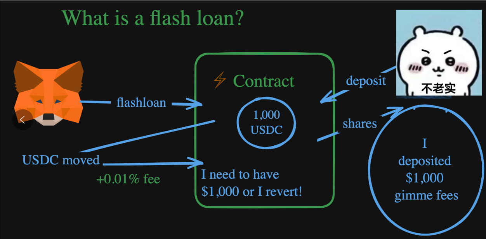
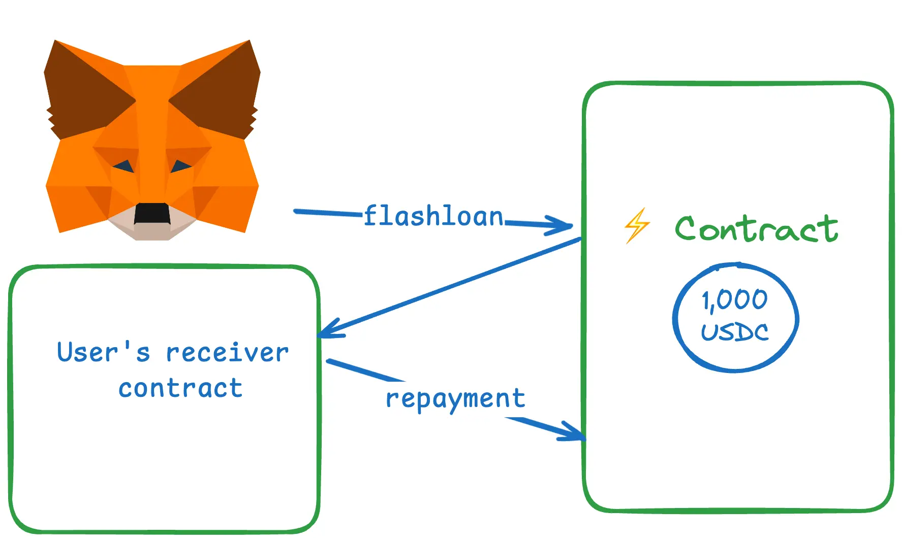

# 闪电贷

# 定义

<font style="color:rgb(51, 51, 51);">闪电贷是一种独特的金融工具，出现在 DeFi 生态系统中，尤其是在借贷平台上。它是一种无抵押贷款，由于其独特特性以及为套利、市场操纵和其他金融策略提供的机会而变得流行</font>

<font style="color:rgb(51, 51, 51);">像 </font>[<font style="color:rgb(2, 105, 200);">Aave</font>](https://aave.com/)<font style="color:rgb(51, 51, 51);"> 和</font>[<font style="color:rgb(2, 105, 200);">DyDx</font>](https://dydx.exchange/)<font style="color:rgb(51, 51, 51);">这样的 DeFi 协议支持闪电贷。人们认为像 MakerDAO 和 Uniswap 这样的协议也支持闪电贷，但从技术上讲，它们是“闪电铸造”，非常相似。</font>

# <font style="color:rgb(51, 51, 51);">举个栗子(馒头)</font>



1. <font style="color:rgb(51, 51, 51);">一个贷方（吉伊老板）决定想要借出$1,000 USDC。</font>
   1. <font style="color:rgb(51, 51, 51);">吉伊将$1,000 存入一个具有闪电贷代码的智能合约中。</font>
   2. <font style="color:rgb(51, 51, 51);">吉伊听说每次有人使用他们的钱进行闪电贷时，吉伊都会得到报酬，吉伊想要得到报酬。</font>
2. <font style="color:rgb(51, 51, 51);">一个用户（上图中的 MetaMask）决定他们想要进行闪电贷（见下文了解原因）。</font>
3. <font style="color:rgb(51, 51, 51);">在单笔交易中，用户（MetaMask）调用智能合约上的</font><code>**flashloan**</code>**<font style="color:rgb(51, 51, 51);">函数</font>**<font style="color:rgb(51, 51, 51);">，该函数执行以下操作，要么“全部执行”，要么“完全不执行”：</font>
   1. <font style="color:rgb(51, 51, 51);">用户（Metamask）获得$1,000 USDC</font>
   2. <font style="color:rgb(51, 51, 51);">他们用它做任何他们想做的事情（再次强调，仍在同一笔交易中）</font>
   3. <font style="color:rgb(51, 51, 51);">然后，他们偿还$1,000 加上一小笔费用</font>

# <font style="color:rgb(51, 51, 51);">主要特点</font>

1. **<font style="color:rgb(51, 51, 51);">无抵押贷款</font>**<font style="color:rgb(51, 51, 51);">：无需抵押，与传统和加密货币借贷不同。</font>
2. **<font style="color:rgb(51, 51, 51);">即时处理</font>**<font style="color:rgb(51, 51, 51);">：借款、使用和还款在几秒钟内通过一个区块链交易完成。</font>
3. **<font style="color:rgb(51, 51, 51);">智能合约执行</font>**<font style="color:rgb(51, 51, 51);">：条款被编码到自执行的合约中。</font>
4. **<font style="color:rgb(51, 51, 51);">原子交易</font>**<font style="color:rgb(51, 51, 51);">：如果未及时还款，交易将被撤销，从而确保贷方安全。</font>

<font style="color:rgb(51, 51, 51);">闪电贷用于各种策略，如套利、流动性提供和抵押物交换。流程包括在 DeFi 平台发起贷款请求，指定贷款金额，使用贷款（例如用于套利），并立即还款。如果还款失败，交易将回滚，不留痕迹</font>

## 原子交易

<font style="color:rgb(51, 51, 51);">所有区块链交易都是</font>`原子`<font style="color:rgb(51, 51, 51);">的，所谓原子是因为要么全部发生，要么完全不发生。这一特性也适用于</font><code><font style="color:#262626;background-color:rgb(255, 245, 245);">flashloans</font></code><font style="color:rgb(51, 51, 51);">，所有闪电贷都是原子的。意味着交易要么完全完成，要么根本不发生，从而防止贷方的损失。借款人可以在没有抵押的情况下获取大量资金，但必须在同一个交易区块中偿还</font>

```solidity
function flashLoan(uint256 amount) external {
        uint256 balanceBefore = token.balanceOf(address(this));

        token.transfer(msg.sender, amount);
        // Ignore IFlashLoanReceiver for this pseudo-code
        IFlashLoanReceiver(msg.sender).execute();

        if (token.balanceOf(address(this)) < balanceBefore) {
            revert RepayFailed();
        }
    }
```

<font style="color:rgb(51, 51, 51);">调用</font><code><font style="color:rgb(255, 80, 44);background-color:rgb(255, 245, 245);">flashloan</font></code><font style="color:rgb(51, 51, 51);">函数的用户实际上会调用一个在智能合约中看起来像这样的函数.如果代码触及</font><code><font style="color:rgb(255, 80, 44);background-color:rgb(255, 245, 245);">revert</font></code><font style="color:rgb(51, 51, 51);">行，整个交易将不会成功或完成，这意味着用户根本没有借到钱！</font>

<font style="color:rgb(51, 51, 51);">智能合约的工作原理是：每当触及</font><code><font style="color:rgb(255, 80, 44);background-color:rgb(255, 245, 245);">revert</font></code><font style="color:rgb(51, 51, 51);">语句时，区块链会自动将所有状态更改从交易直接恢复到其原始状态。</font>

**<font style="color:rgb(51, 51, 51);">这种原子链接对闪电贷至关重要的原因有两个：</font>**

* <font style="color:rgb(51, 51, 51);">首先，原子性消除了贷方的违约风险。如果在交易结束时未归还借入的资产，贷款实际上并未发生，因为中间步骤会被撤销。因此，贷方可以无抵押地提供闪电贷——不存在资本未得到归还的风险场景。</font>
* <font style="color:rgb(51, 51, 51);">其次，借款人可以在交易和套利机会中执行操作，同时确保如果成功偿还贷款，所获利润将会保留。如果交易在任何时刻失败，则将回滚且不会产生影响。这种“无风险尝试”的环境进一步促进了通过闪电贷的创新。</font>

<font style="color:rgb(51, 51, 51);">闪电贷在传统金融（TradFi）中当前并不存在，主要是由于缺乏交易的原子性。</font>

# <font style="color:rgb(51, 51, 51);">使用步骤</font>

**<font style="color:rgb(51, 51, 51);">步骤 1：发起闪电贷请求</font>**

1. **<font style="color:rgb(51, 51, 51);">用户互动</font>**<font style="color:rgb(51, 51, 51);">：用户（借款人）通过与提供闪电贷服务的 DeFi 平台（如 Aave、dYdX 或 Uniswap）互动来发起闪电贷。</font>
2. **<font style="color:rgb(51, 51, 51);">智能合约调用</font>**<font style="color:rgb(51, 51, 51);">：用户创建一个调用 DeFi 平台上智能合约的交易。该合约被编程以处理闪电贷请求。</font>

**<font style="color:rgb(51, 51, 51);">步骤 2：发放贷款</font>**

1. **<font style="color:rgb(51, 51, 51);">贷款金额指定</font>**<font style="color:rgb(51, 51, 51);">：在交易中，借款人指定他们希望借入的加密货币（如以太坊的 ETH）金额。</font>
2. **<font style="color:rgb(51, 51, 51);">无抵押要求</font>**<font style="color:rgb(51, 51, 51);">：与传统贷款不同，闪电贷不要求借款人提供任何抵押。这是将闪电贷与其他贷款类型区分开来的重要特性。</font>

**<font style="color:rgb(51, 51, 51);">步骤 3：利用贷款</font>**

1. **<font style="color:rgb(51, 51, 51);">执行操作</font>**<font style="color:rgb(51, 51, 51);">：一旦贷款发放，借来的资金将</font>**<font style="color:rgb(51, 51, 51);">在同一交易中</font>**<font style="color:rgb(51, 51, 51);">为借款人提供使用。借款人可以利用这些资金进行各种用途，如套利、流动性提供或债务再融资。</font>
   * **<font style="color:rgb(51, 51, 51);">套利示例</font>**<font style="color:rgb(51, 51, 51);">：借款人可能利用贷款低价购买某种加密货币，并在另一交易所高价出售。</font>
   * **<font style="color:rgb(51, 51, 51);">其他用途</font>**<font style="color:rgb(51, 51, 51);">：同样，贷款可以用于在借贷头寸中交换抵押物，或者利用去中心化交易所的价格差异。</font>

**<font style="color:rgb(51, 51, 51);">步骤 4：偿还贷款</font>**

1. **<font style="color:rgb(51, 51, 51);">立即偿还要求</font>**<font style="color:rgb(51, 51, 51);">：必须在发放交易块结束时全额偿还贷款以及任何相关费用。</font>
2. **<font style="color:rgb(51, 51, 51);">交易完成</font>**<font style="color:rgb(51, 51, 51);">：偿还是交易序列中的最后一步。如果借款人能够在同一交易中成功偿还贷款，交易将完成并在区块链上得到确认。</font>

**<font style="color:rgb(51, 51, 51);">步骤 5：自动交易回滚（如有必要）</font>**

1. **<font style="color:rgb(51, 51, 51);">原子性原则</font>**<font style="color:rgb(51, 51, 51);">：如果借款人在交易区块结束前未能全额偿还贷款，区块链交易的</font>**<font style="color:rgb(51, 51, 51);">原子性</font>**<font style="color:rgb(51, 51, 51);">质确保整个操作会自动回滚。</font>
2. **<font style="color:rgb(51, 51, 51);">没有留下痕迹</font>**<font style="color:rgb(51, 51, 51);">：在还款失败的情况下，区块链的状态被恢复到闪电贷发放之前的状态，仿佛该交易从未发生。这保护了贷方不会遭受损失。</font>

<font style="color:rgb(51, 51, 51);">如果借款人在这个非常短的时间框架内未能偿还贷款，智能合约会自动撤销整个交易，就像它从未发生一样。这一特性被称为</font>**<font style="color:rgb(51, 51, 51);">原子性</font>**<font style="color:rgb(51, 51, 51);">，确保贷款是全有或全无的：要么整个过程成功完成，要么就像交易从未发生一样。</font>

## <font style="color:rgb(51, 51, 51);">闪电贷 EIP-3156 - 技术细节</font>

<font style="color:rgb(51, 51, 51);">多数 EVM 社区遵循 </font>[<font style="color:rgb(2, 105, 200);">EIP-3156 标准</font>](https://eips.ethereum.org/EIPS/eip-3156)<font style="color:rgb(51, 51, 51);">来支持闪电贷功能。在闪电贷兼容合约中，最重要的函数看起来像这样：</font>

```solidity
/**
   * @dev Initiate a flash loan.
   * @param receiver The receiver of the tokens in the loan, and the receiver of the callback.
   * @param token The loan currency.
   * @param amount The amount of tokens lent.
   * @param data Arbitrary data structure, intended to contain user-defined parameters.
   */
function flashLoan(
    IERC3156FlashBorrower receiver,
    address token,
    uint256 amount,
    bytes calldata data
) external returns (bool);

```



# 应用

<font style="color:rgb(51, 51, 51);">在实践中，闪电贷通常用于类似于常规贷款的原因。最常见的是“获得杠杆”或资本用于以下机会：</font>

1. <font style="color:rgb(51, 51, 51);">套利</font>
2. [<font style="color:rgb(2, 105, 200);">清算</font>](https://updraft.cyfrin.io/courses/advanced-foundry/develop-defi-protocol/defi-liquidation-refactor)
3. <font style="color:rgb(51, 51, 51);">抵押品交换</font>
4. <font style="color:rgb(51, 51, 51);">其他</font>[<font style="color:rgb(2, 105, 200);">MEV</font>](https://updraft.cyfrin.io/courses/security/mev-and-governance/mev-introduction)

## 一、套利

套利是一种金融策略,利用不同市场中同一资产的价格差异.<font style="color:rgb(51, 51, 51);">使用闪电贷进行套利是一种复杂的金融策略，利用不同加密货币交易所或交易平台之间的价格差异。闪电贷因其独特特性，已经成为进行套利操作的强大工具。</font>

<font style="color:rgb(51, 51, 51);">以下是我们可以更深入理解的方式：</font>

<font style="color:rgb(51, 51, 51);">套利涉及在不同市场上同时买入和卖出资产，以从价格差异中获利。在一个完全有效的市场中，此类机会是稀少而迅速解决的，但在快速变化的加密货币世界中，价格差异更为常见。通常，套利需要大量资本和迅速的执行。交易者需要足够的资金在一个市场以较低的价格购买资产并在另一个市场以较高的价格出售。</font>

1. **<font style="color:rgb(51, 51, 51);">即时资本访问</font>**<font style="color:rgb(51, 51, 51);">：闪电贷允许个人瞬时借入大量加密货币，无需抵押。这一能力对于套利至关重要，因为它提供了必要的资本，可在被低估的市场上购买资产。</font>
2. **<font style="color:rgb(51, 51, 51);">无抵押操作</font>**<font style="color:rgb(51, 51, 51);">：与传统贷款不同，闪电贷无需抵押，这对于可能没有足够资产作为抵押的个人或小型交易者来说是一个重大优势。</font>

<font style="color:rgb(51, 51, 51);">在 DeFi 中,这种机会存在于像 </font>[<font style="color:rgb(2, 105, 200);">Uniswap</font>](https://updraft.cyfrin.io/courses/uniswap-v2)<font style="color:rgb(51, 51, 51);"> 这样的去中心化交易所</font>

<font style="color:rgb(51, 51, 51);">所以闪电贷的用途就是让我们能拥有更多的本金,薄利多销赚更多的利润</font>

### <font style="color:rgb(51, 51, 51);">闪电贷套利</font>

1. <font style="color:rgb(51, 51, 51);">我们从一个闪电贷合约中借了 $1,000 并开始交易。</font>
   1. <font style="color:rgb(51, 51, 51);">记住，我们</font>**<font style="color:rgb(51, 51, 51);">必须在同一笔交易中偿还</font>**<font style="color:rgb(51, 51, 51);">！</font>
   2. <font style="color:rgb(51, 51, 51);">因此，在同一笔交易中，我们用 $1,000 从阿里巴巴购买了 1,000 个苹果。</font>
   3. <font style="color:rgb(51, 51, 51);">然后我们立即以 $5,000 的价格在亚马逊和 eBay 上卖掉这 1,000 个苹果，赚了$5,000！</font>
   4. <font style="color:rgb(51, 51, 51);">然后，我们偿还了最初从闪电贷中借的 $1,000。由于贷款已偿还，交易不会回滚！（通常，你还需要支付一小笔费用，可能是$1。）</font>
2. <font style="color:rgb(51, 51, 51);">最后，交易结束，我们净赚 $4,000（减去小额费用），而不是$400！</font>

* <font style="color:rgb(51, 51, 51);">$5,000 的销售额 - $1,000 偿还给闪电贷合约</font>

3. <font style="color:rgb(51, 51, 51);">而我们做到这一切都不需要自己的资金！</font>

<font style="color:rgb(51, 51, 51);">这就是闪电贷的力量。任何人，无需抵押品，都可以利用套利机会。</font>

### <font style="color:rgb(51, 51, 51);">好处</font>

1. **<font style="color:rgb(51, 51, 51);">利用大资本</font>**<font style="color:rgb(51, 51, 51);">：闪电贷民主化了获取大量资本的途径，使个人交易者能够执行大规模套利交易。</font>
2. **<font style="color:rgb(51, 51, 51);">速度与效率</font>**<font style="color:rgb(51, 51, 51);">：由于区块链交易可以迅速执行，闪电贷套利可以利用这些短暂的套利机会，这些机会对于传统融资方法而言要么无法到达，要么风险太大。</font>
3. **<font style="color:rgb(51, 51, 51);">无前期资本要求</font>**<font style="color:rgb(51, 51, 51);">：交易者能够在不拥有其资本的情况下参与套利，降低进入门槛。</font>

### 风险考虑

1. **<font style="color:rgb(51, 51, 51);">市场波动性</font>**<font style="color:rgb(51, 51, 51);">：加密货币价格可能高度波动。在交易期间，即便是稍微的延迟或价格变动，都能把潜在的利润转变为亏损。</font>
2. **<font style="color:rgb(51, 51, 51);">智能合约风险</font>**<font style="color:rgb(51, 51, 51);">：此过程涉及与复杂的智能合约互动。任何这些合约中的缺陷或漏洞都可能导致财务损失。</font>
3. **<font style="color:rgb(51, 51, 51);">交易费用</font>**<font style="color:rgb(51, 51, 51);">：为在像以太坊这样的网络上执行这些交易而产生的成本（包括Gas费用和闪电贷费用）可能对盈利能力产生显著影响。</font>

## 二、流动性提供

<font style="color:rgb(51, 51, 51);">利用闪电贷提供流动性是 DeFi 中一种复杂且具有战略性的应用。这一过程利用闪电贷的独特特性，在各种 DeFi 协议中增强流动性。</font>

<font style="color:rgb(51, 51, 51);">流动性是指市场或协议中可用流动资产（如加密货币）的可用性。高流动性确保了平稳和高效的交易，因为它减少了买卖价格之间的差距，并允许大型交易而不会产生显著的价格影响。许多 DeFi 平台以流动性池模型运作，用户（流动性提供者）将他们的资产汇集以促进交易、借贷和其他金融活动。这些池为流动性提供者赚取交易费用</font>

### <font style="color:rgb(51, 51, 51);">闪电贷与流动性提供</font>

<font style="color:rgb(51, 51, 51);">闪电贷提供即时访问显著的资本，无需前期抵押。这一特性可以被利用，以临时为市场或协议提供流动性。通过向 DeFi 协议注入流动性，闪电贷可以帮助稳定价格，尤其是在极端波动或大额交易可能会显著影响市场的时刻。在多资产池中，不同资产之间的平衡可能变得不均衡。闪电贷使用户能够快速调整池的组合，维持必要的平衡，确保池的平稳运行</font>

### <font style="color:rgb(51, 51, 51);">利润动机与市场影响</font>

1. **<font style="color:rgb(51, 51, 51);">赚取费用</font>**<font style="color:rgb(51, 51, 51);">：通过提供流动性，即使是临时的，用户也可以赚取在这种 pool 中执行的交易费用。这类策略的盈利能力依赖于费用超过闪电贷的成本。</font>
2. **<font style="color:rgb(51, 51, 51);">提高市场效率</font>**<font style="color:rgb(51, 51, 51);">：这些活动为 DeFi 生态系统的整体健康和效率贡献力量。通过确保充足的流动性，闪电贷帮助维持更紧的买卖价差，减少滑点并提高市场稳定性。</font>
3. **<font style="color:rgb(51, 51, 51);">抓住机会交易</font>**<font style="color:rgb(51, 51, 51);">：用户可以利用临时市场条件，例如高流动性需求，而无需长期承诺自己的资本。</font>

### 流程

1. **<font style="color:rgb(51, 51, 51);">获取闪电贷</font>**<font style="color:rgb(51, 51, 51);">：用户申请闪电贷，借入大量资产（如 ETH 或稳定币）。</font>
2. **<font style="color:rgb(51, 51, 51);">贡献到流动性池</font>**<font style="color:rgb(51, 51, 51);">：借来的资金随后被加入到 DeFi 平台上的流动性池。这一举动可以出于多种目的，例如为了平衡池子、利用高交易费用或便于大型交易。</font>
3. **<font style="color:rgb(51, 51, 51);">执行交易</font>**<font style="color:rgb(51, 51, 51);">：当资金处于流动性池时，这些资金可能会被用于交易或其他金融操作，在此过程中赚取交易费用。</font>
4. **<font style="color:rgb(51, 51, 51);">偿还闪电贷</font>**<font style="color:rgb(51, 51, 51);">：在交易块结束之前，用户从流动性池中提取资金并偿还闪电贷，包括任何相关费用。</font>

### <font style="color:rgb(51, 51, 51);">风险考虑</font>

1. **<font style="color:rgb(51, 51, 51);">市场动态</font>**<font style="color:rgb(51, 51, 51);">：流动性提供策略需要理解市场条件。误判这些可能导致损失，尤其是在闪电贷费用高于交易费用的盈利时。</font>
2. **<font style="color:rgb(51, 51, 51);">智能合约风险</font>**<font style="color:rgb(51, 51, 51);">：闪电贷和流动性提供过程中涉及与智能合约的互动，这可能存在漏洞或不可预见的行为。</font>
3. **<font style="color:rgb(51, 51, 51);">交易成本</font>**<font style="color:rgb(51, 51, 51);">：在像以太坊这样的区块链上执行这些交易的Gas费用可能非常大，特别是在网络拥挤的时期</font>

### <font style="color:rgb(51, 51, 51);">应用</font>

1. **<font style="color:rgb(51, 51, 51);">套利</font>**<font style="color:rgb(51, 51, 51);">：用户可以利用不同交易所上某项资产的价格差异。借用资金，在价格更低的地方购买该资产，卖出时在价格更高的地方，囊括中间利润。</font>
2. **<font style="color:rgb(51, 51, 51);">抵押物交换</font>**<font style="color:rgb(51, 51, 51);">：闪电贷可以用于在不需关闭和重新开启借贷位置的情况下交换抵押物。</font>
3. **<font style="color:rgb(51, 51, 51);">自我清算</font>**<font style="color:rgb(51, 51, 51);">：在用户的抵押品即将被清算的情景下，他们可以利用闪电贷偿还部分债务并调整自己的头寸。</font>
4. **<font style="color:rgb(51, 51, 51);">债务再融资</font>**<font style="color:rgb(51, 51, 51);">：用户可以通过借用一个协议以偿还另一个协议的债务，可能以更好的利率实现再融资。</font>

### 风险与争议

1. <font style="color:rgb(51, 51, 51);">智能合约的复杂性可能导致漏洞。有实例表明攻击者通过利用这些漏洞从 DeFi 平台提取资金。</font>
2. <font style="color:rgb(51, 51, 51);">闪电贷可能被用于人为操纵市场价格，管理不当可导致不公平的交易优势，甚至使某些代币不稳定。</font>
3. <font style="color:rgb(51, 51, 51);">闪电贷的无监管特性引发了有关合法性和合规性的问题，尤其是关于市场操纵和洗钱</font>

## <font style="color:rgb(51, 51, 51);">三、抵押物交换</font>

<font style="color:rgb(51, 51, 51);">使用闪电贷进行抵押物交换是一种高级金融策略，在 DeFi 中，提供了独特的好处和机会供交易者和投资者使用</font>

<font style="color:rgb(51, 51, 51);">在 DeFi 中，抵押物通常用于确保贷项。用户锁定资产（如加密货币）作为抵押物，以借取其他资产或稳定币。考虑到许多 crypto 资产的高度波动，抵押物的价值可能会大幅波动，影响借款者的头寸。</font>

<font style="color:rgb(51, 51, 51);">抵押物交换涉及将当前用于担保贷款的抵押物交换为另一种资产。这样做通常是为了管理风险或利用有利市场条件。主要目标包括</font>

* <font style="color:rgb(51, 51, 51);">维持贷款头寸的健康（避免清算），</font>
* <font style="color:rgb(51, 51, 51);">利用有利的市场条件，或</font>
* <font style="color:rgb(51, 51, 51);">切换至更稳定或升值的资产</font>

### <font style="color:rgb(51, 51, 51);">与闪电贷的整合</font>

1. **<font style="color:rgb(51, 51, 51);">即时流动性</font>**<font style="color:rgb(51, 51, 51);">：闪电贷提供进行抵押物交换所必需的流动性，无需额外资本或复杂的多步骤交易。</font>
2. **<font style="color:rgb(51, 51, 51);">工作原理</font>**<font style="color:rgb(51, 51, 51);">：用户从需要偿还现有贷款的货币中提取闪电贷。随后使用该金额偿还原贷款，释放出他们的抵押物。随后，他们使用释放出的抵押物获得新的贷款，由其他更有价值的抵押物担保，最后使用新贷款的一部分偿还闪电贷。</font>

### <font style="color:rgb(51, 51, 51);">工作原理</font>

1. **<font style="color:rgb(51, 51, 51);">获取闪电贷</font>**<font style="color:rgb(51, 51, 51);">：借款人以与其现有债务相同的货币进行闪电贷。</font>
2. **<font style="color:rgb(51, 51, 51);">偿还原贷款</font>**<font style="color:rgb(51, 51, 51);">：闪电贷用于立即偿还现有的贷款。</font>
3. **<font style="color:rgb(51, 51, 51);">释放原抵押物</font>**<font style="color:rgb(51, 51, 51);">：原抵押物将归还给借款人。</font>
4. **<font style="color:rgb(51, 51, 51);">使用新抵押物启动新贷款</font>**<font style="color:rgb(51, 51, 51);">：借款人然后使用释放的抵押物开设新的贷款，这次放置不同的资产作为抵押物。</font>
5. **<font style="color:rgb(51, 51, 51);">偿还闪电贷</font>**<font style="color:rgb(51, 51, 51);">：最终，借款人在同一交易中偿还闪电贷，包括任何相关费用</font>

### <font style="color:rgb(51, 51, 51);">风险与考虑</font>

1. **<font style="color:rgb(51, 51, 51);">市场波动性</font>**<font style="color:rgb(51, 51, 51);">：突发市场变化可能影响交换的效率和安全性。</font>
2. **<font style="color:rgb(51, 51, 51);">交易成本</font>**<font style="color:rgb(51, 51, 51);">：Gas费用和闪电贷费用必须考虑，因为它们可能影响交换的盈利能力或可行性。</font>
3. **<font style="color:rgb(51, 51, 51);">技术复杂性</font>**<font style="color:rgb(51, 51, 51);">：要求了解智能合约和 DeFi 协议</font>

# <font style="color:rgb(51, 51, 51);">闪电贷攻击</font>

1. **<font style="color:rgb(51, 51, 51);">Themis Protocol 攻击</font>**<font style="color:rgb(51, 51, 51);">：利用一个缺陷预言机来抬高代币价格，根据虚高的抵押物价值借取额外资产。</font>
2. **<font style="color:rgb(51, 51, 51);">Conic Finance 漏洞</font>**<font style="color:rgb(51, 51, 51);">：结合闪电贷、重入性和抢跑来操纵代币价格并提取大量 ETH。</font>
3. **<font style="color:rgb(51, 51, 51);">JPEG'd 和 Alchemix 漏洞</font>**<font style="color:rgb(51, 51, 51);">：通过操纵流动性头寸和 DeFi 协议之间的价格差异进行套利，带来了可观的 ETH 利润。</font>

## 1.**<font style="color:rgb(51, 51, 51);">Themis Protocol</font>**

<font style="color:rgb(51, 51, 51);">由于利用了一个缺陷的预言机来抬高 Balancer LP 代币价格。闪电贷攻击 Themis Protocol 展示了闪电贷和缺陷预言机系统的复杂利用</font>

**<font style="color:rgb(51, 51, 51);">步骤 1：发起闪电贷</font>**

* **<font style="color:rgb(51, 51, 51);">借入资金</font>**<font style="color:rgb(51, 51, 51);">：黑客通过从 Aave V3 和两个 Uniswap V3 池发起闪电贷开始攻击。他们借入大量 WETH（40,000 单位），无需提供任何抵押，这正是闪电贷的一个关键特性。</font>

**<font style="color:rgb(51, 51, 51);">步骤 2：从 Themis Protocol 借款</font>**

* **<font style="color:rgb(51, 51, 51);">将 WETH 作为抵押</font>**<font style="color:rgb(51, 51, 51);">：黑客使用借来的 WETH（220 单位）作为抵押，从 Themis Protocol 借入其他多种加密货币，包括 DAI、USDC、USDT、ARB 和 WBTC。</font>

**<font style="color:rgb(51, 51, 51);">步骤 3：操控预言机</font>**

* **<font style="color:rgb(51, 51, 51);">创建新合约</font>**<font style="color:rgb(51, 51, 51);">：黑客设置新的合约并在其中执行多个操作：</font>
  * <font style="color:rgb(51, 51, 51);">他们向 Balancer 池提供 55 WETH，并获得 54.665 LP（流动性提供者）代币。</font>
  * <font style="color:rgb(51, 51, 51);">这些 BLP 代币随后存入 Themis Protocol。</font>
  * <font style="color:rgb(51, 51, 51);">由于 Themis Protocol 的预言机存在缺陷，它依赖 Uniswap 提供的 ETH/USDT 的虚高价格，导致 BLP 代币被高估。</font>
* **<font style="color:rgb(51, 51, 51);">抬高代币价值</font>**<font style="color:rgb(51, 51, 51);">：黑客通过以 39,725 WETH 交换 2,423 wstETH 进一步操控市场。这一交换影响了 Balancer 池中 BLP 代币的价格，由于预言机的错误定价抬高其视在价值。</font>
* **<font style="color:rgb(51, 51, 51);">利用 Themis Protocol</font>**<font style="color:rgb(51, 51, 51);">：利用这一抬高价值，黑客从 Themis Protocol 借入额外的 317.62 WETH，利用 BLP 代币的真实价值与报告值之间的差距。</font>

**<font style="color:rgb(51, 51, 51);">步骤 4：撤销交换</font>**

* **<font style="color:rgb(51, 51, 51);">恢复原始价格</font>**<font style="color:rgb(51, 51, 51);">：为掩盖其痕迹，黑客随后将 2,423 wstETH 返回，换回大约 39,724.94 WETH。这一行为有效逆转了早期交换对 Balancer 池中 BLP 代币价格的影响，将价格恢复至原值。</font>

**<font style="color:rgb(51, 51, 51);">步骤 5：偿还贷款与确保利润</font>**

* **<font style="color:rgb(51, 51, 51);">偿还闪电贷</font>**<font style="color:rgb(51, 51, 51);">：在继续进行的交易块中，黑客偿还了原始闪电贷的 40,000 WETH。</font>
* **<font style="color:rgb(51, 51, 51);">带着利润离开</font>**<font style="color:rgb(51, 51, 51);">：剩余的 WETH 以及利用被高估的 BLP 代币和其他代币作为抵押物所借的资金，就是黑客从此次攻击中获利的部分。</font>

<font style="color:rgb(51, 51, 51);">这起闪电贷攻击展示了 DeFi 协议中可靠的预言机系统的重要性。黑客利用缺陷的预言机进行价格操控，并结合闪电贷提供的资本访问权，得以实现复杂且盈利的攻击，这凸显了 DeFi 生态系统中的脆弱性，尤其是针对预言机的可靠性以及闪电贷与其他 DeFi 组件相结合时所导致的系统性风险。被攻击的绝大部分代币流向了 Tornado Cash。</font>

## 2.**<font style="color:rgb(51, 51, 51);">Conic Finance</font>**

<font style="color:rgb(51, 51, 51);">Conic Finance 漏洞是一个多方面的攻击，结合了闪电贷、重入性和抢跑，操控代币价格并从协议中提取大量 ETH。</font>

**<font style="color:rgb(51, 51, 51);">步骤 1：获取闪电贷</font>**

* **<font style="color:rgb(51, 51, 51);">借入资金</font>**<font style="color:rgb(51, 51, 51);">：攻击者从 AAVE 处借出了 20,000 美元的 ETH 闪电贷，无需抵押。</font>

**<font style="color:rgb(51, 51, 51);">步骤 2：代币合约交互</font>**

* **<font style="color:rgb(51, 51, 51);">代币授权</font>**<font style="color:rgb(51, 51, 51);">：通过 Etherscan，攻击者与 rETH-f 和 WETH 代币合约交互，调用</font><font style="color:rgb(51, 51, 51);"> </font>**<font style="color:rgb(51, 51, 51);">approve</font>**<font style="color:rgb(51, 51, 51);"> </font><font style="color:rgb(51, 51, 51);">函数。此操作使 OmnipoolRouterV2 合约获得在攻击者的名义下支出代币的权限，并将获批额度设置为最大（</font>**<font style="color:rgb(51, 51, 51);">2^256 - 1</font>**<font style="color:rgb(51, 51, 51);">）。</font>

**<font style="color:rgb(51, 51, 51);">步骤 3：溢出漏洞利用</font>**

* **<font style="color:rgb(51, 51, 51);">触发溢出</font>**<font style="color:rgb(51, 51, 51);">：由于获得了一笔极其高的授权额度，攻击者能够在 OmnipoolRouterV2 合约执行计算时触发整数溢出。</font>

**<font style="color:rgb(51, 51, 51);">步骤 4：通过预言机操控价格</font>**

* **<font style="color:rgb(51, 51, 51);">抬高 rETH-f 价格</font>**<font style="color:rgb(51, 51, 51);">：攻击者通过与 GenericOracleV2 合约交互，其中以 ETH 和 rETH 存入 Uniswap v2，改变流动性池中的代币比例，从而抬高价格。</font>

**<font style="color:rgb(51, 51, 51);">步骤 5：抢跑技术</font>**

* **<font style="color:rgb(51, 51, 51);">执行抢跑</font>**<font style="color:rgb(51, 51, 51);">：攻击者使用抢跑技术，以更高的Gas费用提交交易，以确保它在同一块中的其他交易之前被包括，从而根据操控后的价格获利。</font>

**<font style="color:rgb(51, 51, 51);">步骤 6：作为流动性存入</font>**

* **<font style="color:rgb(51, 51, 51);">抬高流动性价值</font>**<font style="color:rgb(51, 51, 51);">：他们向 OmnipoolRouterV2 合约存入 ETH 和 rETH-f 代币作为流动性，进一步抬高 rETH-f 的价格。</font>

**<font style="color:rgb(51, 51, 51);">步骤 7：执行交换</font>**

* **<font style="color:rgb(51, 51, 51);">交换代币</font>**<font style="color:rgb(51, 51, 51);">：攻击者根据抬高后的 rETH-f 价格，利用 ETH 交换为 rETH-f，然后再用抬高的 rETH-f 价格交换回 WETH，结果显示他们获得的 WETH 超出预定的数量。</font>

**<font style="color:rgb(51, 51, 51);">步骤 8：重复价格检查</font>**

* **<font style="color:rgb(51, 51, 51);">只读重入</font>**<font style="color:rgb(51, 51, 51);">：通过反复调用</font><font style="color:rgb(51, 51, 51);"> </font>**<font style="color:rgb(51, 51, 51);">getUSDPrice</font>**<font style="color:rgb(51, 51, 51);"> </font><font style="color:rgb(51, 51, 51);">函数，攻击者利用只读重入技术重复一次又一次性获得 inflate 价格，得以优势利用的 rETH-f 代币价格。</font>

**<font style="color:rgb(51, 51, 51);">步骤 9：攻击最终化</font>**

* **<font style="color:rgb(51, 51, 51);">抽离协议</font>**<font style="color:rgb(51, 51, 51);">：攻击者交换回 WETH，使用更高价格以获得更多 WETH。</font>
* **<font style="color:rgb(51, 51, 51);">获利</font>**<font style="color:rgb(51, 51, 51);">：随后攻击者偿还闪电贷，保留所获的多余 WETH 作为利润，总量为 1,701 WETH，当时价值超过 3.3M 美元。</font>

<font style="color:rgb(51, 51, 51);">Conic Finance 漏洞是一项复杂的攻击，结合了多种 DeFi 攻击向量。攻击者利用闪电贷来获取资本，利用代币合约的溢出漏洞，利用抢跑精心操控 DeFi 协议的价格预言机，并利用重入技术反复确保价格的涌入。这导致代币的价值被错误计算，使攻击者能够提取可观的利润</font>

## <font style="color:rgb(51, 51, 51);">3.</font>**<font style="color:rgb(51, 51, 51);">JPEG’d</font>**

<font style="color:rgb(51, 51, 51);">在2023年7月30日，JPEG’d 被利用，损失超过 1100 万美元。一场经典的闪电贷 + 套利攻击。</font>

<font style="color:rgb(51, 51, 51);">这次利用是利用闪电贷进行套利的一种复杂示例，专门针对 DeFi 协议中存在的代币价格低效的情况</font>

**<font style="color:rgb(51, 51, 51);">步骤 1：获取闪电贷</font>**

* <font style="color:rgb(51, 51, 51);">攻击者首先从 Balancer 平台借入大量闪电贷，金额为 80,000 WETH。</font>

**<font style="color:rgb(51, 51, 51);">步骤 2：提供流动性</font>**

* <font style="color:rgb(51, 51, 51);">攻击者随后以32,431 WETH作为流动性提供给 Curve 财务池，换取 pETH-ETH LP（流动性提供者）代币。</font>
* <font style="color:rgb(51, 51, 51);">他们进一步为 Curve 提供更多 WETH，创建额外的 82,182 LP 代币。</font>

**<font style="color:rgb(51, 51, 51);">步骤 3：提现与燃烧 LP 代币</font>**

* <font style="color:rgb(51, 51, 51);">攻击者从 Curve 中撤回部分流动性，提现 3,740 pETH。</font>
* <font style="color:rgb(51, 51, 51);">随后他们烧掉最初的 32,431 Curve LP 代币，实际是在清除这部分流动性。</font>
* <font style="color:rgb(51, 51, 51);">通过烧掉更多的 Curve LP 代币，攻击者再提取 1,184 pETH。</font>

**<font style="color:rgb(51, 51, 51);">步骤 4：利用价格差异</font>**

* **<font style="color:rgb(51, 51, 51);">JPEG'd 协议中的套利</font>**<font style="color:rgb(51, 51, 51);">：利用 pETH 和 WETH 在 JPEG'd 协议中的价格差进行一次交换。</font>
* **<font style="color:rgb(51, 51, 51);">执行兑换</font>**<font style="color:rgb(51, 51, 51);">：他们用 4,924 pETH 在 JPEG'd 的兑换机制中兑换 4,285 WETH。</font>

**<font style="color:rgb(51, 51, 51);">步骤 5：偿还贷款及获利</font>**

* <font style="color:rgb(51, 51, 51);">攻击者向 Balancer 偿还 80,000 WETH 的闪电贷，完成了闪电贷的义务。</font>
* <font style="color:rgb(51, 51, 51);">还完闪电贷后，攻击者保留 6,106 WETH，约为 1100 万美元的盈利成果。</font>

<font style="color:rgb(51, 51, 51);">这这一流利的多步骤过程展示了攻击者如何利用闪电贷进行套利，通过操控流动性头寸以及跨不同 DeFi 协议之间的价格差异，成功实现利润。每一步都经过谨慎设计，最大化闪电贷的回报，确保攻击者能够保留一定数量的 ETH 作为利润。</font>

<font style="color:rgb(51, 51, 51);">这种利用展示了涉及价格机制和流动性提供的 DeFi 协议得到精细监控的重要性，以避免可能的漏洞被利用</font>

## <font style="color:rgb(51, 51, 51);">4.</font>**<font style="color:rgb(51, 51, 51);">Alchemix</font>**

<font style="color:rgb(51, 51, 51);">在 JPEG’d 攻击发生的同一天，Alchemix 同样遭受了类似的攻击。但这次攻击更具深度，造成约 1300 万美元的损失。</font>

<font style="color:rgb(51, 51, 51);">Alchemix 漏洞是一场复杂的攻击，使用闪电贷结合套利来利用不受保护的协议机制</font>

**<font style="color:rgb(51, 51, 51);">步骤 1：发起闪电贷</font>**

* <font style="color:rgb(51, 51, 51);">攻击者最初通过 Balancer 平台借取 40,000 WETH 的闪电贷。闪电贷允许无抵押借款，只要在同一交易中还清贷款。</font>

**<font style="color:rgb(51, 51, 51);">步骤 2：流动性提供与代币铸造</font>**

* <font style="color:rgb(51, 51, 51);">攻击者将部分借来的 WETH 作为流动性提供给 alETH/ETH Curve 池，从而铸造出 19,895 alETH-ETH LP 代币。</font>
* <font style="color:rgb(51, 51, 51);">随后，他们向 Curve 池提供更多 WETH，铸造出额外的 34,277 alETH-ETH LP 代币。</font>

**<font style="color:rgb(51, 51, 51);">步骤 3：提取流动性与烧掉 LP 代币</font>**

* <font style="color:rgb(51, 51, 51);">攻击者从池中提取了一部分流动性，提取过程中获得 4,821 alETH。</font>
* <font style="color:rgb(51, 51, 51);">最初的 19,895 alETH-ETH LP 代币随后被燃烧，产生这部分流动性。</font>
* <font style="color:rgb(51, 51, 51);">额外的 15,910 alETH-ETH LP 代币被燃烧以再次撤回所有流动性。</font>

**<font style="color:rgb(51, 51, 51);">步骤 4：操纵价格差异</font>**

* **<font style="color:rgb(51, 51, 51);">操控兑换率</font>**<font style="color:rgb(51, 51, 51);">：通过提供和撤回流动性，攻击者操纵了 Curve 池内的兑换率。这造成了资产之间的价格差异。</font>
* **<font style="color:rgb(51, 51, 51);">套利</font>**<font style="color:rgb(51, 51, 51);">：利用操控后的汇率，攻击者进行套利交易，使他们能够以有利价交换资产，获得超出其应得的更多资产。</font>

**<font style="color:rgb(51, 51, 51);">步骤 5：偿还闪电贷</font>**

* <font style="color:rgb(51, 51, 51);">完成套利后，攻击者偿还了最初的闪电贷 40,000 WETH。</font>

**<font style="color:rgb(51, 51, 51);">步骤 6：从攻击中获利</font>**

* <font style="color:rgb(51, 51, 51);">这些操作的结果是 7,258 WETH 的利润，预计价值约为 1360 万美元，然后转账给攻击者的钱包。</font>

**<font style="color:rgb(51, 51, 51);">利用的漏洞</font>**

* **<font style="color:rgb(51, 51, 51);">缺乏滑点保护</font>**<font style="color:rgb(51, 51, 51);">：Alchemix 合约没有机制确保用于交换的汇率反映合理的市场价格。无法验证所交换的数量，或防止过多的滑点影响。</font>
* **<font style="color:rgb(51, 51, 51);">可操控交换函数</font>**<font style="color:rgb(51, 51, 51);">：合约的资产交换功能未能阻止在价格被操控或不公平的价格下进行交换。攻击者利用这一漏洞，在不当的汇率下交换代币。</font>
* **<font style="color:rgb(51, 51, 51);">直接与 WETH 合约交互</font>**<font style="color:rgb(51, 51, 51);">：合约直接与 WETH 合约进行交互，使攻击者能够以 WETH 进行闪电贷并执行攻击。这篇关于 Alchemix 漏洞的详细报告展示了攻击者如何巧妙地利用闪电贷来操纵流动性和汇率，跨 DeFi 协议进行套利，并在单笔交易中提取显著利润</font>

# summary

<font style="color:rgb(51, 51, 51);">闪电贷代表了一种真正新颖的借贷工具，这种变革性的原子构造仅通过去中心化区块链架构得以实现。通过将借款和偿还基本上连接成一个不可分割的交易，它们允许无担保的大规模贷款，而不会使贷方面临违约风险。</font>

<font style="color:rgb(51, 51, 51);">闪电贷在套利、流动性提供和担保交换中的日益普及，展示了参与者如何以低成本执行复杂的金融策略，这些策略在早期承载着过高的资本要求或协调开销。随着闪电贷的广泛可获取性，更多有前景的应用可以通过自动化、透明的资金流动来实现平等接入和产生效率。</font>

<font style="color:rgb(51, 51, 51);">然而，像大多数技术飞跃一样，闪电贷也引入了新风险——迄今为止，攻击的利用是其中最明显的。通过有意操纵定价预言机、流动性参数或经济设计，闪电借用的资本可以被武器化而没有任何补救措施。可组合性和无许可性虽然刺激了创新，却暴露了因闪电贷而加剧的脆弱性。</font>

<font style="color:rgb(51, 51, 51);">随着这一领域的发展，围绕集中流动性的最佳实践、交易熔断机制、智能合约代码的形式验证以及有序监控都是必要的对策。然而，我们对闪电贷的理解以及应对风险的措施将随着新漏洞的发现而成熟也势在必行。这就是为什么这一领域必须致力于透明性、知识共享以及开发复杂的风险模型——就像传统金融随着衍生品演化一样。</font>

<font style="color:rgb(51, 51, 51);">通过坚定地关注它们所承诺的潜力，同时谨慎地解决下行风险，DeFi 的惊人创造力仍然能得以维持。而今天的闪电贷正是突显 DeFi 中这种二元性的有力实例。基础似乎不稳定，但前景令人兴奋。将这一承诺转化为负责任的现实，技术素养将与经济视野同等重要。</font>

<font style="color:rgb(51, 51, 51);"></font>

**<font style="color:rgb(51, 51, 51);"></font>**


> 更新: 2025-08-08 10:38:06  
> 原文: <https://www.yuque.com/xiaoyuhushenfu/yzin4n/xghl1y5kp2ngqpz8>